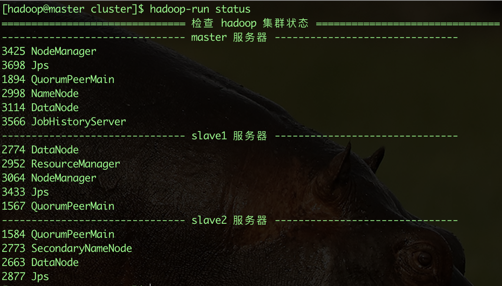
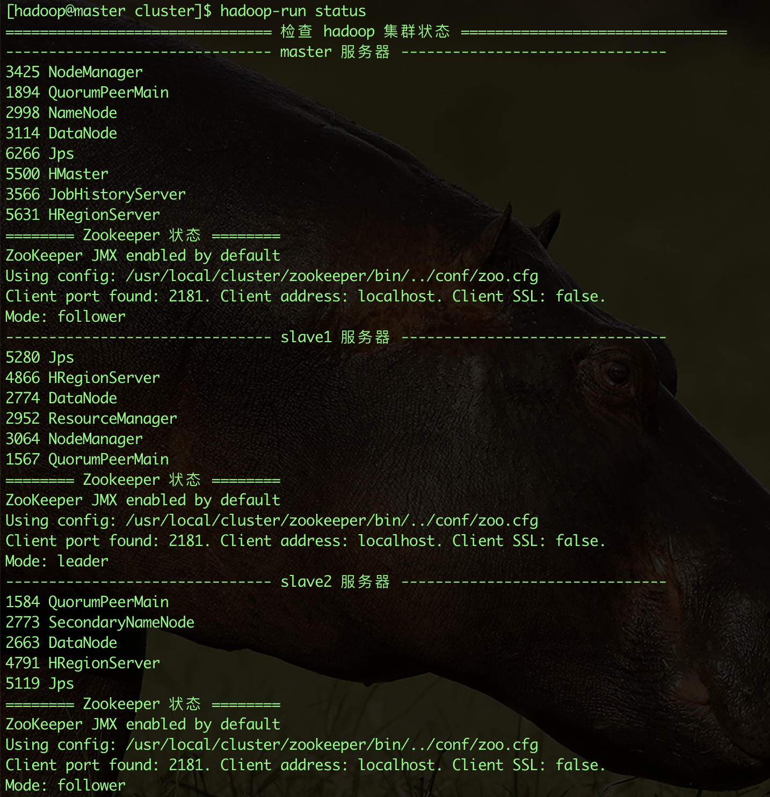

## Hadoop集群安装

### 一. 环境准备

- 操作系统：centos7.9（最小安装，虚拟机2C、4G、50G）

  | 服务器  | 主机名        | 操作系统                 | IP             |
  | ------- | ------------- | ------------------------ | -------------- |
  | hadoop1 | hadoop.master | centos7.9（2C、4G、50G） | 172.16.125.171 |
  | hadoop2 | hadoop.slave1 | centos7.9（2C、4G、50G） | 172.16.125.172 |
  | hadoop3 | hadoop.slave2 | centos7.9（2C、4G、50G） | 172.16.125.173 |

- JDK：jdk-8u371-linux-x64.tar.gz

- Zookeeper：apache-zookeeper-3.8.2-bin.tar.gz

- Hadoop：hadoop-3.3.6.tar.gz

- HBase：hbase-2.5.5-bin.tar.gz

### 二. 操作系统

#### 1. 网卡配置

```shell
cd /etc/sysconfig/network-scripts
## 找到当前网卡，配置静态IP
vi ifcfg-ens33

## 修改内容，IPADDR 修改为 172.16.125.171、172.16.125.172、172.16.125.173
BOOTPROTO=static
ONBOOT=yes
IPADDR=172.16.125.171
NETMASK=255.255.255.0
GATEWAY=172.16.125.2
DNS1=8.8.8.8

## 重启网络服务
systemctl restart network

## 测试
ping baidu.com
## 查看IP
ip a
```

#### 2. 配置主机名、Hosts

```shell
## 171
hostnamectl set-hostname hadoop.master
systemctl restart network
## 172
hostnamectl set-hostname hadoop.slave1
systemctl restart network
## 173
hostnamectl set-hostname hadoop.slave2
systemctl restart network

## 三台服务器上操作
vi /etc/hosts
## 添加内容
172.16.125.171 hadoop.master
172.16.125.172 hadoop.slave1
172.16.125.173 hadoop.slave2
```

#### 3. 配置用户、用户组

```shell
## 三台服务器上操作
## 新建用户
sudo adduser hadoop
## 设置密码，hadoop@123
passwd hadoop
## 创建了hadoop用户组，把hadoop用户加入到hadoop用户组
sudo usermod -a -G hadoop hadoop 
## 把hadoop用户赋予root权限，可以使用sudo命令
sudo vi /etc/sudoers
## 修改内容
root    ALL=(ALL)       ALL
hadoop  ALL=(ALL)       ALL  # 添加这一行配置
```

#### 4. 配置三台服务器的免密登录

（切换到 hadoop 用户）

```shell
## 主机间免密登录才能实现主机间的顺畅通信，因此该环节非常重要
## 三台上执行
su hadoop
ssh-keygen -t rsa -P ''
cat ~/.ssh/id_rsa.pub >> ~/.ssh/authorized_keys
chmod 600 ~/.ssh/authorized_keys

## 设置主机->从机的无密码登录 
## master 服务器
cat ~/.ssh/id_rsa.pub | ssh hadoop@hadoop.slave1 'cat - >> ~/.ssh/authorized_keys'
cat ~/.ssh/id_rsa.pub | ssh hadoop@hadoop.slave2 'cat - >> ~/.ssh/authorized_keys'

## 设置从机->主机的无密码登录
## slave1 服务器
cat ~/.ssh/id_rsa.pub | ssh hadoop@hadoop.master 'cat - >> ~/.ssh/authorized_keys'
cat ~/.ssh/id_rsa.pub | ssh hadoop@hadoop.slave2 'cat - >> ~/.ssh/authorized_keys'
## slave2 服务器
cat ~/.ssh/id_rsa.pub | ssh hadoop@hadoop.master 'cat - >> ~/.ssh/authorized_keys'
cat ~/.ssh/id_rsa.pub | ssh hadoop@hadoop.slave1 'cat - >> ~/.ssh/authorized_keys'
```

#### 5. 关闭防火墙

集群需要开放很多端口，开发环境可以简单的关闭服务器进行处理

```shell
## 停止
sudo systemctl stop firewalld
## 禁用（不会开机启动）
sudo systemctl mask firewalld

## 重新启用 
sudo systemctl unmask firewalld
sudo systemctl start firewalld
```

#### 6. NTP时钟同步

```shell
## 切换到root用户
su root
yum install ntp ntpdate -y
systemctl start ntpd
systemctl enable ntpd

## master
ntpq -p
## slave1、slave2
vi /etc/ntp.conf

## 添加配置
server hadoop.master

## 手动与 master 节点进行时钟同步
ntpdate hadoop.master
```

安装rsync、pdsh

```shell
## 三台服务器
yum install rsync -y
## pdsh（Parallel Distributed Shell）是一个用于在多个远程节点上并行执行命令的工具。
## 无 yum 源时，参考：https://www.cnblogs.com/mingyue5826/p/14706490.html
yum install pdsh -y 
```

### 三. 安装JDK

```bash
sudo mkdir /usr/local/cluster
sudo chown -R hadoop:hadoop /usr/local/cluster
tar -zxvf ~/jdk-8u371-linux-x64.tar.gz -C /usr/local/cluster/
cd /usr/local/cluster/
ln -s jdk1.8.0_371 java
vi ~/.bashrc

## 加入内容
export JAVA_HOME=/usr/local/cluster/java
export JRE_HOME=${JAVA_HOME}/jre
export CLASSPATH=.:${JAVA_HOME}/lib:${JRE_HOME}/lib
export PATH=${JAVA_HOME}/bin:$PATH

## 配置生效
source ~/.bashrc
```

### 四. 安装Zookeeper

```bash
## master 服务器
tar -zxvf ~/apache-zookeeper-3.8.2-bin.tar.gz -C /usr/local/cluster/
cd /usr/local/cluster/
ln -s apache-zookeeper-3.8.2-bin zookeeper
vi ~/.bashrc

## 加入内容
export ZOOKEEPER=/usr/local/cluster/zookeeper
export PATH=$PATH:$ZOOKEEPER/bin

## 配置生效
source ~/.bashrc

## 建立数据和日志文件
mkdir /usr/local/cluster/zookeeper/data
mkdir /usr/local/cluster/zookeeper/logs

## 创建myid文件
## master，内容是 0
touch /usr/local/cluster/zookeeper/data/myid && echo 0 > /usr/local/cluster/zookeeper/data/myid

## 创建配置文件并修改配置
cd /usr/local/cluster/zookeeper/conf
cp zoo_sample.cfg zoo.cfg
vi zoo.cfg
```

- zoo.cfg 内容

```ini
## 主要以下部分
dataDir=/usr/local/cluster/zookeeper/data
dataLogDir=/usr/local/cluster/zookeeper/logs

server.0=172.16.125.171:2888:3888
server.1=172.16.125.172:2888:3888
server.2=172.16.125.173:2888:3888
```

```bash
## 将master节点上的 zookeeper 复制到 slave1、slave2 服务器
## 修改 slave1-myid = 1，slave2-myid = 2
scp -r /usr/local/cluster/zookeeper/ hadoop@hadoop.slave1:/usr/local/cluster/
scp -r /usr/local/cluster/zookeeper/ hadoop@hadoop.slave2:/usr/local/cluster/

## slave1
echo 1 > zookeeper/data/myid
## slave2
echo 2 > zookeeper/data/myid

## 配置环境变量
export ZOOKEEPER=/usr/local/cluster/zookeeper
export PATH=$PATH:$ZOOKEEPER/bin
```

- 启动zookeeper

```bash
## 三台服务器
zkServer.sh start 

## jps 验证
jps

## 查看各个主机的状态
zkServer.sh status
```

### 五. 安装Hadoop

#### 1. 安装

```bash
## master 服务器

tar -zxvf ~/hadoop-3.3.6.tar.gz -C /usr/local/cluster
ln -s hadoop-3.3.6 hadoop

## 设置环境变量
vi ~/.bashrc

## 加入内容
## Hadoop
export HADOOP_HOME=/usr/local/cluster/hadoop
export PATH=$PATH:$HADOOP_HOME/bin:$HADOOP_HOME/sbin

## 配置生效
source ~/.bashrc

## 验证
hadoop version

## 下载 junit 包（hadoop jar运行时需要junit.jar，不然会报错：java.lang.NoClassDefFoundError: junit/framework/TestCase）
cp junit-4.13.2.jar $HADOOP_HOME/share/hadoop/common/lib/
```

#### 2. 配置Hadoop

```bash
## 创建文件夹
cd /usr/local/cluster/hadoop

mkdir tmp
mkdir hdfs
mkdir hdfs/name
mkdir hdfs/data

cd /usr/local/cluster/hadoop/etc/hadoop
```

- 配置 hadoop-env.sh

```bash
vi hadoop-env.sh
## 在最后添加配置
export JAVA_HOME=/usr/local/cluster/java
export HDFS_NAMENODE_USER=hadoop
export HDFS_DATANODE_USER=hadoop
export HDFS_SECONDARYNAMENODE_USER=hadoop
export YARN_RESOURCEMANAGER_USER=hadoop
export YARN_NODEMANAGER_USER=hadoop
```

- 配置 core-site.xml（核心配置文件）

```xml
vi core-site.xml

<configuration>
    <!-- 指定NameNode的地址 -->
    <property>
        <name>fs.defaultFS</name>
        <value>hdfs://hadoop.master:8020</value>
    </property>
    <!-- 指定hadoop数据的存储目录 -->
    <property>
        <name>hadoop.tmp.dir</name>
        <value>/usr/local/cluster/hadoop/tmp</value>
    </property>
  	<!-- 文件读写缓冲区大小为 4KB -->
  	<property>
  			<name>io.file.buffer.size</name>
      	<value>4096</value>
  	</property>
    <!-- 指定 hdfs 网页登入的静态用户 -->
    <property>
        <name>hadoop.http.staticuser.user</name>
        <value>hadoop</value>
    </property>
    <!-- 文件垃圾桶保存时间 -->
    <property>
        <name>fs.trash.interval</name>
        <value>1440</value>
    </property>
</configuration>
```

- #### 配置hdfs-site.xml（hdfs配置文件）

  HDFS相关配置，如文件副本的个数、块大小及是否使用强制权限

```xml
vi hdfs-site.xml

<configuration>
    <!-- 文件的副本数量，配置2个副本 -->
    <property>
        <name>dfs.replication</name>
        <value>2</value>
    </property>
    <!-- NameNode 存储文件系统的命名空间和元数据的数据目录 -->
  	<property>
        <name>dfs.datanode.name.dir</name>
        <value>/usr/local/cluster/hadoop/hdfs/name</value>
  	</property>
  	<!-- 配置 DataNode 存储数据块的数据目录 -->
  	<property>
        <name>dfs.datanode.data.dir</name>
        <value>/usr/local/cluster/hadoop/hdfs/data</value>
  	</property>
    <!-- namenode web端访问地址-->
    <property>
        <name>dfs.namenode.http-address</name>
        <value>hadoop.master:9870</value>
    </property>
    <!-- second namenode web端访问地址-->
    <property>
        <name>dfs.namenode.secondary.http-address</name>
        <value>hadoop.slave2:9868</value>
    </property>
</configuration>
```

- 配置yarn-site.xml

```xml
vi yarn-site.xml

<configuration>
    
  	<!-- 指定 ResourceManger 的地址，占用端口: 8032、8030、8031、8033、8088 -->
    <property>
    	<name>yarn.resourcemanager.hostname</name>
        <value>hadoop.slave1</value>
    </property>
    <!-- 指定 MR 走的 shuffle -->
    <property>
    	<name>yarn.nodemanager.aux-services</name>
    	<value>mapreduce_shuffle</value>
    </property>  
    <!-- 是否对容器实施物理内存限制 -->
    <property>
        <name>yarn.nodemanager.pmem-check-enabled</name>
        <value>false</value>
    </property>
    <!-- 是否对容器实施虚拟内存限制 -->
    <property>
        <name>yarn.nodemanager.vmem-check-enabled</name>
        <value>false</value>
    </property>
  	<!-- 开启日志聚集功能 -->
    <property>
    	<name>yarn.log-aggregation-enable</name>
        <value>true</value>
    </property>
    <!-- 设置 yarn 历史日志聚集服务器地址 -->
    <property>
        <name>yarn.log.server.url</name>
        <value>http://hadoop.slave1:19888/jobhistory/logs</value>
    </property>
    <!-- 日志的保留天数（7天）（单位秒） -->
    <property>
    	<name>yarn.log-aggregation-seconds</name>
        <value>604800</value>
    </property>
      
</configuration>

```

- #### 配置mapred-site.xml

```xml
vi mapred-site.xml

<configuration>
  
    <!-- 设置 MR 程序默认运行模式：yarn 集群模式，local 本地模式-->
    <property>
        <name>mapreduce.framework.name</name>
        <value>yarn</value>
    </property>
    <!-- MR 程序历史服务地址 -->
    <property>
        <name>mapreduce.jobhistory.address</name>
        <value>hadoop.master:10020</value>
    </property>
    <!-- MR 程序历史服务器 web 端地址 -->
    <property>
        <name>mapreduce.jobhistory.webapp.address</name>
        <value>hadoop.master:19888</value>
    </property>
    <property>
        <name>yarn.app.mapreduce.am.env</name>
        <value>HADOOP_MAPRED_HOME=${HADOOP_HOME}</value>
    </property>
    <property>
        <name>mapreduce.map.env</name>
        <value>HADOOP_MAPRED_HOME=${HADOOP_HOME}</value>
    </property>
    <property>
        <name>mapreduce.reduce.env</name>
        <value>HADOOP_MAPRED_HOME=${HADOOP_HOME}</value>
    </property>
  
</configuration>
```

- #### 配置workers文件

```properties
vi workers

hadoop.master
hadoop.slave1
hadoop.slave2
```

**NameNode、YARN、2NN、JobHistory 四个组件**

| 服务器        | 服务1                   | 服务2            | 服务3    | 服务4       |
| ------------- | ----------------------- | ---------------- | -------- | ----------- |
| hadoop.master | NameNode                | JobHistoryServer | DataNode | NodeManager |
| hadoop.slave1 | ResourceManager（YARN） |                  | DataNode | NodeManager |
| hadoop.slave2 | SecondaryNameNode       |                  | DataNode | NodeManager |

- 配置同步

```bash
scp -r /usr/local/cluster/hadoop hadoop@hadoop.slave1:/usr/local/cluster
scp -r /usr/local/cluster/hadoop hadoop@hadoop.slave2:/usr/local/cluster

## slave1 和 slave2 上设置环境变量
vi ~/.bashrc

## 加入内容
## Hadoop
export HADOOP_HOME=/usr/local/cluster/hadoop
export PATH=$PATH:$HADOOP_HOME/bin:$HADOOP_HOME/sbin

## 配置生效
source ~/.bashrc
```

#### 3. 启动Hadoop

- 集群格式化

```bash
## master 服务器（NameNode节点）
## 初始化，只需要执行一次
hdfs namenode -format
```

- 集群启动

​	通过脚本启动，位于`${HADOOP_HOME}/sbin`下

```bash
## master 服务器（NameNode节点）
## 启动 hdfs 集群，start-dfs.sh、stop-dfs.sh
start-dfs.sh

## slave1 服务器（ResourceManager节点）
## 启动 yarn 集群，start-yarn.sh、stop-yarn.sh
start-yarn.sh

## master 服务器（JobHistoryServer节点）
## 启动历史服务器，mapred --daemon start historyserver、mapred --daemon stop historyserver
mapred --daemon start historyserver
```

​	编写启动脚本（通过官方脚本，不管启动还是关闭每次都需要输入三个命令，不是很方便）

```bash
## master 服务器（NameNode节点）
mkdir ~/bin
vi hadoop-run
sudo chmod +x hadoop-run
```

```bash
#!/bin/bash

if [ $# -lt 1 ]
then
	echo "Please input args, start、stop or status"
	exit;
fi

case $1 in
"start")
	echo "=============================== 启动 hadoop 集群 ==============================="
	
	echo "------------------------------- 启动 hdfs -------------------------------"
	ssh hadoop.master "start-dfs.sh"
	
	echo "------------------------------- 启动 yarn -------------------------------"
	ssh hadoop.slave1 "start-yarn.sh"
	
	echo "------------------------------- 启动 historyserver -------------------------------"
	ssh hadoop.master "mapred --daemon start historyserver"
;;
"stop")
	echo "=============================== 关闭 hadoop 集群 ==============================="

	echo "------------------------------- 关闭 historyserver -------------------------------"
	ssh hadoop.master "mapred --daemon stop historyserver"
	
	echo "------------------------------- 关闭 yarn -------------------------------"
	ssh hadoop.slave1 "stop-yarn.sh"
	
	echo "------------------------------- 关闭 hdfs -------------------------------"
	ssh hadoop.master "stop-dfs.sh"
;;
"status")
	echo "=============================== 检查 hadoop 集群状态 ==============================="
	for host in hadoop.master hadoop.slave1 hadoop.slave2
  do
      echo "------------------------------- $host 服务器 -------------------------------"
      ssh $host jps
      echo "======== Zookeeper 状态 ========"
      ssh $host "zkServer.sh status"
  done
;;
*)
	echo "Input Args Error, Please input args, start、stop or status"
;;
esac
```

- 最终执行

```bash
## 启动集群
hadoop-run start

## 停止集群
hadoop-run stop

## 集群状态
hadoop-run status
```



#### 4. 访问页面

​	宿主机配置 `/etc/hosts`

```properties
## Hadoop 集群（虚拟机）
172.16.125.171  hadoop.master
172.16.125.172  hadoop.slave1
172.16.125.173  hadoop.slave2
```

- 访问 NameNode UI

  地址在 `hdfs-site.xml` 中查询，浏览器上访问

  NameNode UI:                    http://hadoop.master:9870

  SecondaryNameNode UI:   http://hadoop.slave2:9868

- 访问 ResourceManager UI

  地址在 `yarn-site.xml` 中查询，浏览器上访问：http://hadoop.slave1:8088

- 访问 JobHistory

  地址在 `mapred-site.xml` 中查询，浏览器上访问：http://hadoop.master:19888

### 六. 安装Hbase

#### 1. 修改limits.conf

```bash
## 修改 /etc/security/limits.conf，原因: https://hbase.apache.org/book.html#basic.prerequisites
sudo vi /etc/security/limits.conf

hadoop  -       nofile  32768
hadoop  -       nproc   32000

## /etc/pam.d/common-session
sudo vi /etc/pam.d/common-session

session required  pam_limits.so
```

#### 2. 解压文件

```bash
## master 服务器上

tar -zxvf ~/hbase-2.5.5-bin.tar.gz -C /usr/local/cluster
cd /usr/local/cluster
ln -s hbase-2.5.5 hbase

## 配置环境变量
vi ~/.bashrc

## 添加内容
## HBase
export HBASE_HOME=/usr/local/cluster/hbase
export PATH=$PATH:$HBASE_HOME/bin

## 配置生效
source ~/.bashrc

## 验证
hbase version
```

#### 3. 修改配置

主要修改conf目录下的三个文件：`hbase-env.sh`、`hbase-site.xml`、`regionservers`

- hbase-env.sh

```bash
cd /usr/local/cluster/hbase/conf
mkdir /usr/local/cluster/hbase/data
mkdir /usr/local/cluster/hbase/logs

vi hbase-env.sh

## 在最后加入内容
export JAVA_HOME=/usr/local/cluster/java
export HBASE_CLASSPATH=/usr/local/cluster/hbase/lib
export HBASE_PID_DIR=/usr/local/cluster/hbase/data
export HBASE_LOG_DIR=/usr/local/cluster/hbase/logs
export HBASE_MANAGES_ZK=false
export HBASE_DISABLE_HADOOP_CLASSPATH_LOOKUP="true"
```

- hbase-site.xml

```xml
vi hbase-site.xml

<!-- 按如下配置进行修改, 参考：https://hbase.apache.org/book.html#zookeeper -->
<configuration>
  <property>
    <name>hbase.cluster.distributed</name>
    <value>true</value>
  </property>
  <property>
    <name>hbase.rootdir</name>
    <value>hdfs://hadoop.master:8020/hbase</value>
  </property>
  <property>
    <name>hbase.tmp.dir</name>
    <value>/usr/local/cluster/hbase/data</value>
  </property>
  <property>
    <name>hbase.zookeeper.quorum</name>
    <value>hadoop.master,hadoop.slave1,hadoop.slave2</value>
  </property>
  <property>
    <name>hbase.zookeeper.property.dataDir</name>
    <value>/usr/local/cluster/zookeeper/data</value>
  </property>
  <property>
  	<name>hbase.zookeeper.property.clientPort</name>
    <value>2181</value>
  </property>
  <!--
  <property>
    <name>hbase.unsafe.stream.capability.enforce</name>
    <value>false</value>
  </property>
  -->
</configuration>
```

- regionservers

```properties
vi regionservers

hadoop.master
hadoop.slave1
hadoop.slave2
```

#### 4. 分发Hbase

```bash
## master 服务器
scp -r /usr/local/cluster/hbase hadoop.slave1:/usr/local/cluster
scp -r /usr/local/cluster/hbase hadoop.slave2:/usr/local/cluster

## slave1、slave2 服务器
## 配置环境变量
vi ~/.bashrc

## 添加内容
## HBase
export HBASE_HOME=/usr/local/cluster/hbase
export PATH=$PATH:$HBASE_HOME/bin

## 配置生效
source ~/.bashrc

## 验证
hbase version
```

#### 5. 启动Hbase

Hbase的运行脚本都在`${HBASE_HOME}/bin`下

```bash
## Master 服务器
start-hbase.sh

## 检查 1
hadoop-run status

## 检查 2
hbase shell
```




浏览器访问：http://hadoop.master:16010/master-status

### 八. 参考资料

- https://www.51cto.com/article/747440.html
- https://blog.51cto.com/u_15444/6801983
- https://blog.csdn.net/qq_34304427/article/details/126760502
- https://www.jianshu.com/p/dc2913a07770
- https://zhuanlan.zhihu.com/p/30492593
- https://hadoop.apache.org/docs/current/hadoop-project-dist/hadoop-common/ClusterSetup.html
- https://cwiki.apache.org/confluence/display/HADOOP/Hadoop+Java+Versions
- https://hbase.apache.org/book.html#distributed