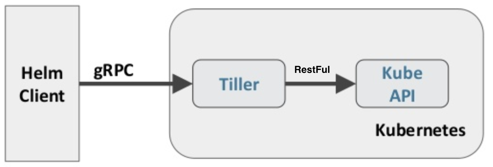
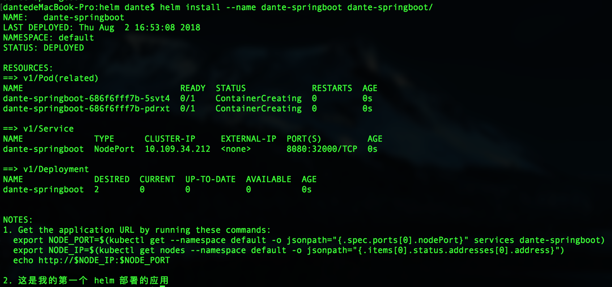
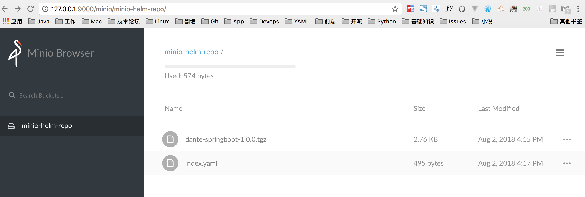

## Helm 指南

### 一. 概念

​	Helm是 k8s 中云应用管理工具，相当于 yum、brew等。可以更加便捷的将应用部署到 k8s 集群。Helm 有三个组成部分 Chart、Repository、Release。安装时需要安装 **Helm Client** 和 **Tiller**（服务端）。

- **Chart**

  ​	k8s 的应用部署包（redis-3.4.1.tgz），包括各种 k8s 对象的配置模板、参数定义、依赖关系、文档说明等。等同于 yum 的 rpm软件包。例如: **stable/redis** 。

- **Repository**

  ​	Chart 包的仓库，相当于 Docker Hub、Maven Repo。

- **Release**

  ​	一个 Chart 应用包部署在 k8s 集群中的 instance，可以指定 instance 的名称。

  ```shell
  helm install stable/redis --name dante-helm-redis
  
  dantedeMacBook-Pro:repository dante$ helm list --all
  NAME            	REVISION	UPDATED                 	STATUS  	CHART      	NAMESPACE
  dante-helm-redis	1       	Wed Aug  1 13:52:04 2018	DEPLOYED	redis-3.4.1	default  
  filled-bison    	1       	Wed Aug  1 10:40:03 2018	DELETED 	redis-3.4.1	default 
  ```

  ```sequence
  Repository->Chart: 从 Repository 搜索 Chart \nhelm search redis
  Chart->Release: Helm 安装 Chart，每个 Chart 运行一个 Release \nhelm install stable/redis
  ```

- **使用目的**

在原来项目中都是基于yaml文件来进行部署发布的，而目前项目大部分微服务化或者模块化，会分成很多个组件来部署，每个组件可能对应一个deployment.yaml、一个service.yaml、一个Ingress.yaml还可能存在各种依赖关系，这样一个项目如果有5个组件，很可能就有15个不同的yaml文件，这些yaml分散存放，如果某天进行项目恢复的话，很难知道部署顺序，依赖关系等，而所有这些包括都可以通过helm来进行解决。

- 基于yaml配置的集中存放
- 基于项目的打包
- 组件间的依赖

### 二. 安装

下载 https://github.com/helm/helm/releases

#### 1. Linux

```sh
tar -zxvf helm-{version}-linux-amd64.tgz
mv linux-amd64/helm /usr/local/bin/helm
```

#### 2. MacOS

```bash
brew install kubernetes-helm
```

#### 3. 安装 Tiller

- 未开启 RBAC

```shell
## 安装
helm init

## 检查 helm version，结果如下
Client: &version.Version{SemVer:"v2.9.1", GitCommit:"20adb27c7c5868466912eebdf6664e7390ebe710", GitTreeState:"clean"}
Server: &version.Version{SemVer:"v2.9.1", GitCommit:"20adb27c7c5868466912eebdf6664e7390ebe710", GitTreeState:"clean"}

## 检查 tiller deployment，结果如下
kubectl get deployment -n kube-system
NAME                   DESIRED   CURRENT   UP-TO-DATE   AVAILABLE   AGE
tiller-deploy          1         1         1            1           47d
```

- 开启 RBAC

```sh
## 创建 sa
kubectl create serviceaccount tiller -n kube-system

## 给 sa 绑定 cluster-admin 规则
kubectl create clusterrolebinding tiller-cluster-rule --clusterrole=cluster-admin --serviceaccount=kube-system:tiller

## 编辑 kube-system 中的 tiller-deploy
kubectl edit deploy tiller-deploy -n kube-system

...
spec:
  serviceAccount: tiller	## 在此行添加 serviceAccount: tiller
  containers:
  - env:
    - name: TILLER_NAMESPACE
      value: kube-system
    - name: TILLER_HISTORY_MAX
      value: "0"
...
```

#### 4. 卸载

```shell
kubectl delete deployment tiller-deploy --namespace kube-system
## 或者
helm reset
```

### 三. 架构及原理



​	Helm Client通过 gRPC API 向 **Tiller 发出请求，Tiller 通过调用 **k8s 的 **Restful API** 来管理对应的 k8s 资源。

#### 1. Helm Client

主要作用有

- 在本地开发 chart
- 管理 chart 仓库
- 与 Tiller 服务器交互
- 在远程 Kubernetes 集群上安装 chart
- 查看 release 信息
- 升级或卸载已有的 release

#### 2. Tiller

​	对外暴露 gRPC API（`kubectl port-forward --namespace default $POD_NAME 6379:6379`  通过 Kubectl port-forward将tiller的端口映射到本地），供 Helm Client 调用。管理 Release Instance 的生命周期。

### 四. 操作实践

#### 1. 实战详解

​	Chart 是 Helm 的包格式，按照规定好的目录结构，每个文件分别描述在 k8s 中的资源集合。Chart 所在目录的名称和 Chart 的名字一致。

```markdown
1. Chart可以是目录，也可以是tgz格式的压缩包。
2. charts目录和requirements.yaml文件到区别就和lib和pom.xml的区别类似，一个用于存放，一个用于描述
```

- **创建Chart**：`helm create dante-springboot`

  dante-springboot 

  ├── Chart.yaml			Chart 的名字、版本、描述、Maintainer 等Metadata。

  ├── README.md 			

  ├── charts				Chart 依赖的子 Chart。

  ├── templates				模版目录，模板也就是将k8s的yml文件参数化，最终还是会被helm处理成k8s的正常yml文件，然后用来部署对应的资源。和 values.yaml 协同工作。

  │   ├── NOTES.txt			使用说明文本。可选。

  │   ├── _helpers.tpl	        _ 开头的文件不会本部署到k8s上，可以用于定义通用信息

  │   ├── deployment.yaml	k8s 的 deployment。

  │   ├── ingress.yaml		k8s 的 ingress。

  │   └── service.yaml		k8s 的 service。

  └── values.yaml			参数定义文件，这里定义的参数最终会应用到模版中。

- **编写 Chart 各个组件**

  - Chart.yaml

  ```yaml
  apiVersion: v1
  appVersion: "1.0.0"
  description: Springboot app run in docker, deploy into k8s by Helm 
  name: dante-springboot
  keywords:
  - springboot
  - docker
  - k8s
  - helm
  maintainers:
  - name: dante
    email: ch.sun@haihangyun.com
  version: 1.0.0
  ```

  - values.yaml

  ```yaml
  replicaCount: 2
  
  image:
    repository: dante2012/springboot-docker
    tag: latest
    pullPolicy: Never
  
  service:
    type: NodePort
    port: 8080
    nodePort: 32000
  
  ingress:
    enabled: false
    annotations: {}
      # kubernetes.io/ingress.class: nginx
      # kubernetes.io/tls-acme: "true"
    path: /
    hosts:
      - dante.springboot.org
    tls: []
    #  - secretName: chart-example-tls
    #    hosts:
    #      - chart-example.local
  
  resources: 
    limits:
     cpu: 300m
     memory: 1Gi
    requests:
     cpu: 300m
     memory: 512Mi
  
  nodeSelector: {}
  
  tolerations: []
  
  affinity: {}
  ```

  - templates/deployment.yaml

  ```yaml
  apiVersion: apps/v1
  kind: Deployment
  metadata:
    name: {{ template "dante-springboot.fullname" . }}
    labels:
      app: {{ template "dante-springboot.name" . }}
      chart: {{ template "dante-springboot.chart" . }}
      release: {{ .Release.Name }}
      heritage: {{ .Release.Service }}
  spec:
    replicas: {{ .Values.replicaCount }}
    selector:
      matchLabels:
        app: {{ template "dante-springboot.name" . }}
        release: {{ .Release.Name }}
    template:
      metadata:
        labels:
          app: {{ template "dante-springboot.name" . }}
          release: {{ .Release.Name }}
      spec:
        containers:
          - name: {{ .Chart.Name }}
            image: "{{ .Values.image.repository }}:{{ .Values.image.tag }}"
            imagePullPolicy: {{ .Values.image.pullPolicy }}
            ports:
              - name: http
                containerPort: 8080
                protocol: TCP
            livenessProbe:
              httpGet:
                path: /docker
                port: http
              initialDelaySeconds: 90
              timeoutSeconds: 3
            # readinessProbe:
            #   httpGet:
            #     path: /docker
            #     port: http
            resources:
  {{ toYaml .Values.resources | indent 12 }}
  #     {{- with .Values.nodeSelector }}
  #       nodeSelector:
  # {{ toYaml . | indent 8 }}
  #     {{- end }}
  #     {{- with .Values.affinity }}
  #       affinity:
  # {{ toYaml . | indent 8 }}
  #     {{- end }}
  #     {{- with .Values.tolerations }}
  #       tolerations:
  # {{ toYaml . | indent 8 }}
      {{- end }}
  ```

  - templates/service.yaml

  ```yaml
  apiVersion: v1
  kind: Service
  metadata:
    name: {{ template "dante-springboot.fullname" . }}
    labels:
      app: {{ template "dante-springboot.name" . }}
      chart: {{ template "dante-springboot.chart" . }}
      release: {{ .Release.Name }}
      heritage: {{ .Release.Service }}
  spec:
    type: {{ .Values.service.type }}
    ports:
      - port: {{ .Values.service.port }}
        targetPort: {{ .Values.service.port }}
      {{if eq .Values.service.type "NodePort"}}
        nodePort: {{ .Values.service.nodePort}}
      {{end}}
        protocol: TCP
        name: http
    selector:
      app: {{ template "dante-springboot.name" . }}
      release: {{ .Release.Name }}
  ```

- **运行实例 Release**

  - **方式一**

  ```shell
  helm install --name dante-springboot dante-springboot/
  ```

  

  - **方式二**

  ```shell
  helm package dante-springboot/
  helm install --name dante-springboot dante-springboot-1.0.0.tgz 
  ```

  - **方式三**（依赖方式二）

  ```shell
  ## 开启本地 chart repository server，$HELM_HOME/repository/local
  helm serve
  
  ## 搜索 charts
  helm search dante-springboot
  # NAME                  	CHART VERSION	APP VERSION	DESCRIPTION                                       
  # local/dante-springboot	1.0.0        	1.0.0      	Springboot app run in doc...
  
  ## 运行实例
  helm install --name dante-springboot local/dante-springboot
  ```

#### 2. 搭建私服Repository

使用 [Minio](https://www.minio.io) 进行 Chart 私服的搭建。Minio 分为服务端 minio 和 客户端 mc。

- 安装和卸载

```shell
## 安装
## Minio Server
brew install minio/stable/minio
## Minio Client
brew install minio/stable/mc

## 卸载
brew uninstall minio
```

- 运行

```shell
## 启动 Minio Server
minio server /Users/dante/Documents/Technique/k8s/minio

## 配置客户端
mc config host add myminio http://127.0.0.1:9000 M01UJFFGLTM28KH5FLL2 hsaBRqFvq1MrFpou/aN5q80BpYbW4Xp8NuZFTm6m

## 创建 bucket，即在 /Users/dante/Documents/Technique/k8s/minio 下创建目录 minio-helm-repo
mc mb myminio/minio-helm-repo
## 设置 bucket 的权限
mc policy download myminio/minio-helm-repo

## 上传 Chart package
cd /Users/dante/.helm/repository/local
mc cp index.yaml myminio/minio-helm-repo
mc cp dante-springboot-1.0.0.tgz myminio/minio-helm-repo

## 编辑 myminio/minio-helm-repo/index.yaml，修改 urls
urls:
  - http://127.0.0.1:9000/minio-helm-repo/dante-springboot-1.0.0.tgz
```
运行 minio server 输出如下，访问 http://127.0.0.1:9000

```powershell
Created minio configuration file successfully at /Users/dante/.minio

Endpoint:  http://192.168.43.162:9000  http://127.0.0.1:9000
AccessKey: M01UJFFGLTM28KH5FLL2 
SecretKey: hsaBRqFvq1MrFpou/aN5q80BpYbW4Xp8NuZFTm6m 

Browser Access:
   http://192.168.43.162:9000  http://127.0.0.1:9000

Command-line Access: https://docs.minio.io/docs/minio-client-quickstart-guide
   $ mc config host add myminio http://192.168.43.162:9000 M01UJFFGLTM28KH5FLL2 hsaBRqFvq1MrFpou/aN5q80BpYbW4Xp8NuZFTm6m

Object API (Amazon S3 compatible):
   Go:         https://docs.minio.io/docs/golang-client-quickstart-guide
   Java:       https://docs.minio.io/docs/java-client-quickstart-guide
   Python:     https://docs.minio.io/docs/python-client-quickstart-guide
   JavaScript: https://docs.minio.io/docs/javascript-client-quickstart-guide
   .NET:       https://docs.minio.io/docs/dotnet-client-quickstart-guide
```



- 设置 Helm

```shell
## 添加 Helm repo
helm repo add miniorepo http://127.0.0.1:9000/minio-helm-repo
## 更新 Helm repo
helm repo update
## 检查
helm repo list
helm search dante-springboot

## helm search 输出如下
# bogon:minio-helm-repo dante$ helm search dante-springboot
# NAME                      	CHART VERSION	APP VERSION	DESCRIPTION                                       
# local/dante-springboot    	1.0.0        	1.0.0      	Springboot app run in ...
# miniorepo/dante-springboot	1.0.0        	1.0.0      	Springboot app run in ...

## 运行 Chart release
helm install --name dante-springboot miniorepo/dante-springboot
```

#### 3. 最佳实践

- **Chart**

1. Chart 命名必须只能是小写、中横杆，例如：redis、dante-helm-redis。Chart 所在目录的名字必须和Chart的名字保持一致。

2. Yaml 用2个空格分隔，不能用 tab。

3. 使用新特性时，要明确的指明 Tiller 的版本（**tillerVersion**）

   ```yaml
   name: mychart
   version: 0.2.0
   tillerVersion: ">=2.4.0"
   ```

4. 测试 `helm install --dry-run --debug dante-springboot/`

### 五. 参考资料

- https://docs.helm.sh/
- https://hub.kubeapps.com/
- https://www.kubernetes.org.cn/4009.html
- https://blog.csdn.net/chenleiking/article/details/79539012
- https://daemonza.github.io/2017/02/20/using-helm-to-deploy-to-kubernetes/
- https://www.minio.io/