## SpringCloud 和 Kubernetes

### 一. 微服务

#### 1. 解决问题

- 提升迭代效率

  每个微服务是一个能够独立发布的应用服务，可作为独立组件进行编译和部署；升级代价小，服务与服务之间耦合度降低，一个服务升级不需要其他服务做变更。

- 提升容错能力

  每个微服务是自治的，单个服务的异常一般不会导致整个系统的故障。

- 提升扩展性

  根据微服务的业务特性，可以按需进行伸缩。例：计算密集型的，就添加更多的 CPU；内存需求大，就加大内存；IO密集型，采用高速硬盘。

- 丰富的技术栈

  不同的微服务可以依赖不同的编程语言、开发框架以及数据存储技术，针对不同的服务，采用不同的技术栈。

#### 2. 系统流程

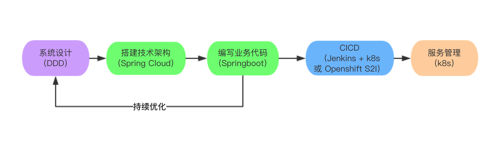

#### 3. 微服务技术栈

- 服务发现
- 统一配置中心
- 服务安全
- API 网关
- 负载均衡
- 服务自治
- 容错
- 扩/缩容
- 日志中心
- 监控中心
- 服务链路跟踪
- 自动化部署
- 服务调度
- 资源管理
- 进程隔离

### 二. SpringCloud 结合 Kubernetes

​	Spring Cloud是一系列基于Spring Boot并整合其他第三方的框架的集合，主要是去服务 Java 微服务开发。

​	Kubernetes 是**自动化**容器操作的平台，主要为容器化的应用提供部署运行、资源调度、服务发现和动态伸缩等一系列完整功能，提高了大规模容器集群管理的便捷性。	

​	SpringCloud提供应用的开发和打包，Kubernetes提供部署和调度。Spring通过Hystrix线程池提供应用内的隔离，而Kubernetes通过资源，进程和命名空间来提供隔离。Spring为每个微服务提供HealthCheck Endpoint，而Kubernetes执行健康检查，且把流量导到健康服务。

|  微服务应用功能  |           Spring Cloud           |         Kubernetes          |
| :--------------: | :------------------------------: | :-------------------------: |
|     服务发现     |       Eureka（或 Consul）        |                             |
|     配置中心     |    Config Server（或 Consul）    |     ConfigMap + Secrets     |
|     服务安全     |      Spring Cloud Security       |                             |
|     负载均衡     |              Ribbon              |                             |
|     服务网关     | Spring Cloud Gateway （或 Zuul） |                             |
| 容错（线程隔离） |             Hystrix              |                             |
|     日志中心     |                                  |             EFK             |
|     监控中心     |                                  |     Prometheus、Grafana     |
|   服务链路跟踪   |        Sleuth （Zipkin）         |                             |
|    自动化部署    |                                  | Jenkins（或 Openshift s2i） |
|     服务调度     |                                  |        Schduler Job         |
|     资源管理     |                                  |       Resource Quotas       |
|     进程隔离     |                                  |         Docker、Pod         |
|     服务自治     |      Health Check Endpoint       |         HealthCheck         |

### 三. 实战

**系统架构图**

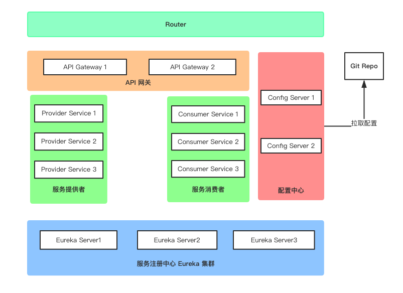

**代码结构图**

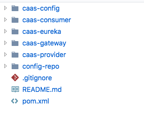

#### 1. Eureka 集群

- **创建Dockerfile构建**

**点击代码构建菜单，进入页面后创建 Docker file 构建**

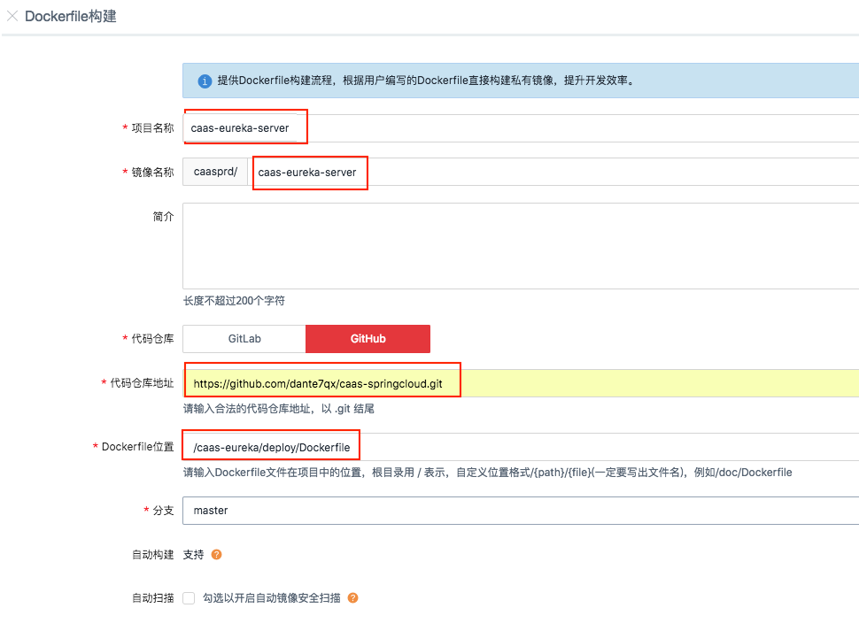

**构建成功后，可在镜像仓库中看到镜像 caas-eureka-server**

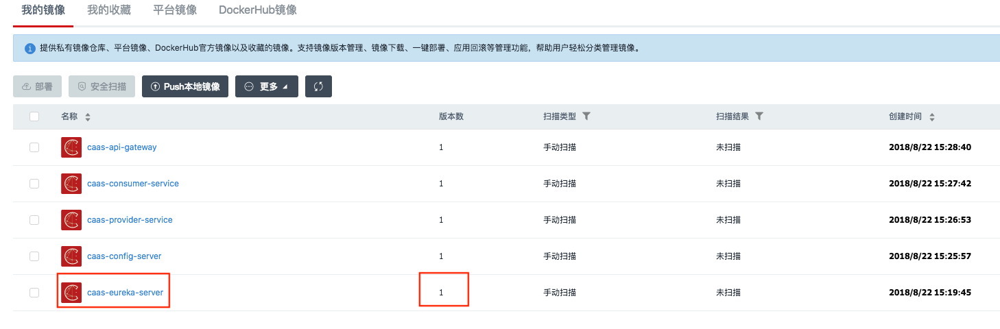

- **创建服务**

**点击容器管理菜单，进入页面后进行创建**

1）Eureka 集群节点1


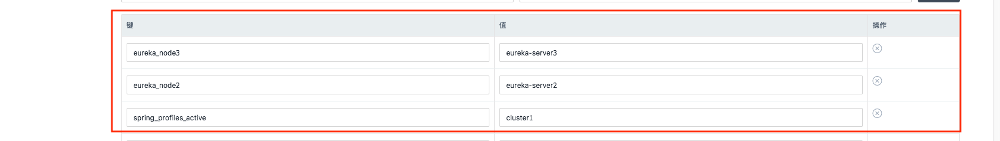

需要添加的环境变量如下

|           键           |       值       |
| :--------------------: | :------------: |
| spring_profiles_active |    cluster1    |
|      eureka_node2      | eureka-server2 |
|      eureka_node3      | eureka-server3 |

2）Eureka 集群节点2

同 Eureka 集群节点1，将服务名称修改为 ==eureka-server2==，需要添加的环境变量如下

|           键           |       值       |
| :--------------------: | :------------: |
| spring_profiles_active |    cluster2    |
|      eureka_node1      | eureka-server1 |
|      eureka_node3      | eureka-server3 |

3）Eureka 集群节点3

同 Eureka 集群节点1，将服务名称修改为 ==eureka-server3==，需要添加的环境变量如下

|           键           |       值       |
| :--------------------: | :------------: |
| spring_profiles_active |    cluster3    |
|      eureka_node1      | eureka-server1 |
|      eureka_node2      | eureka-server2 |

**服务创建成功后，效果如下**

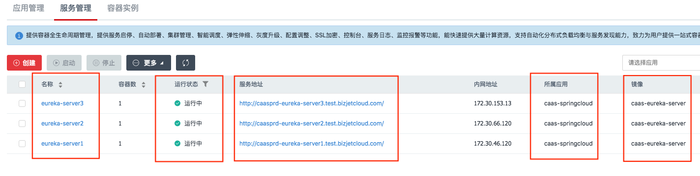

**访问服务地址，效果如下**

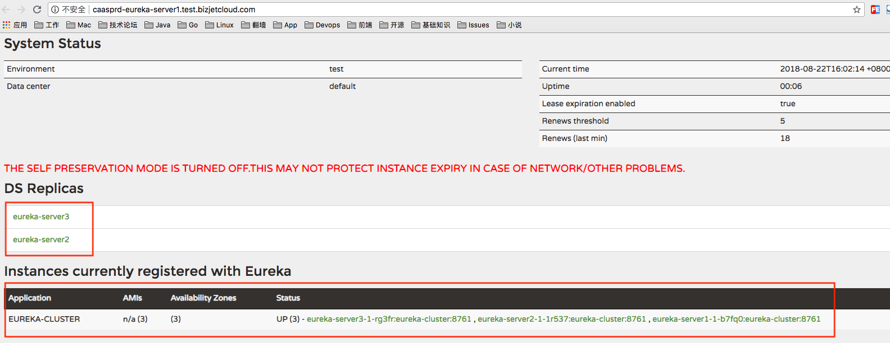

#### 2. 配置中心 HA

- **创建Dockerfile构建**

**点击代码构建菜单，进入页面后创建 Dockerfile 构建**


**构建成功后，可在镜像仓库中看到镜像 caas-config-server**

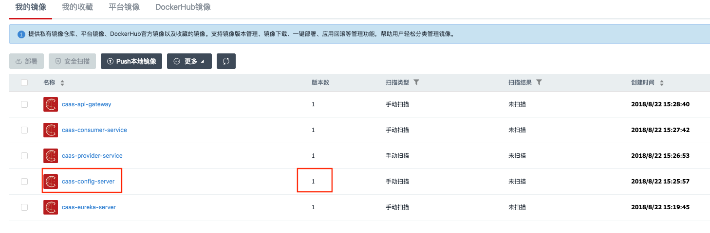

- **创建服务**

**点击容器管理菜单，进入页面后进行创建**

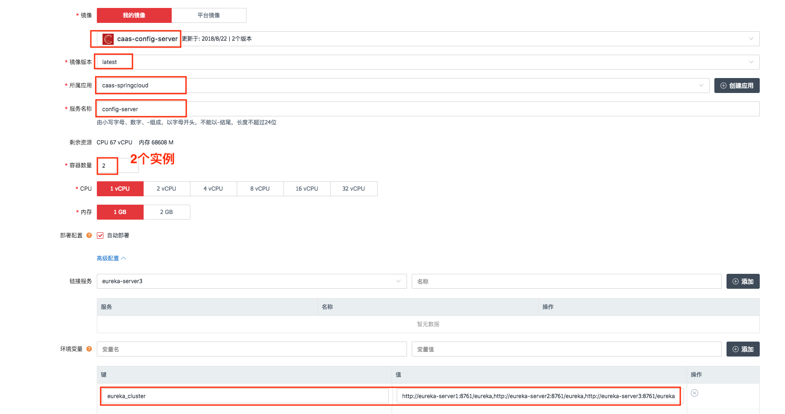

其中要添加的环境变量如下

```properties
eureka_cluster = http://eureka-server1:8761/eureka,http://eureka-server2:8761/eureka,http://eureka-server3:8761/eureka
```

#### 3. 服务提供者 HA

- **创建Dockerfile构建**

**点击代码构建菜单，进入页面后创建 Dockerfile 构建**

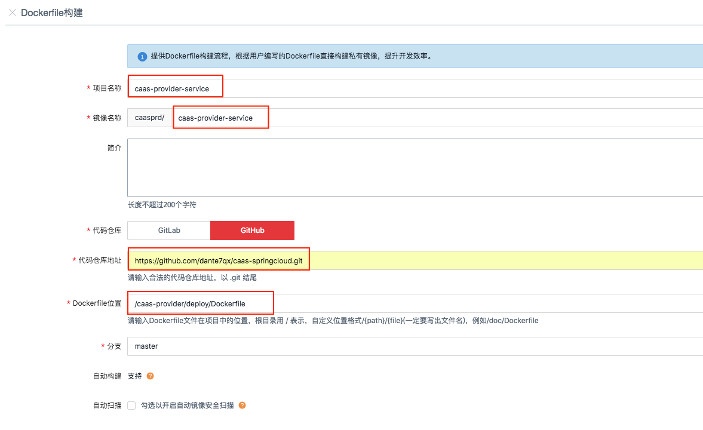

**构建成功后，可在镜像仓库中看到镜像 caas-provider-service**

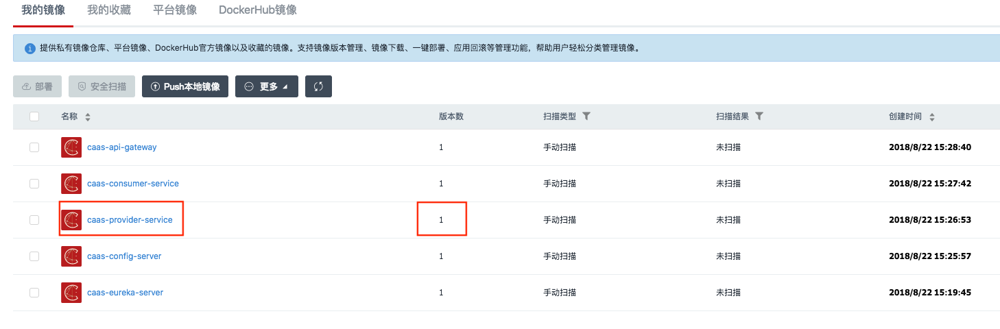

- **创建服务**

**点击容器管理菜单，进入页面后进行创建**


其中要添加的环境变量如下

```properties
eureka_cluster = http://eureka-server1:8761/eureka,http://eureka-server2:8761/eureka,http://eureka-server3:8761/eureka
```

#### 4. 服务消费者 HA

- **创建Dockerfile构建**

**点击代码构建菜单，进入页面后创建 Dockerfile 构建**

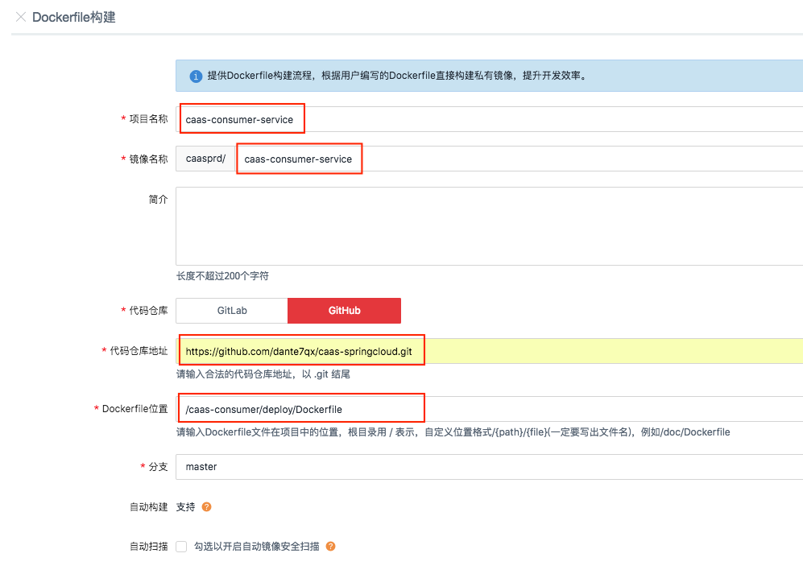

**构建成功后，可在镜像仓库中看到镜像 caas-consumer-service**

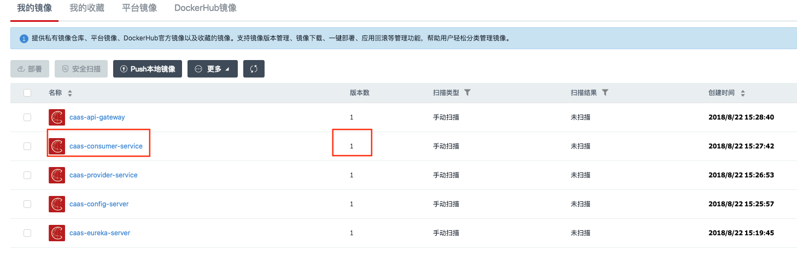

- **创建服务**

**点击容器管理菜单，进入页面后进行创建**


其中要添加的环境变量如下

```properties
eureka_cluster = http://eureka-server1:8761/eureka,http://eureka-server2:8761/eureka,http://eureka-server3:8761/eureka
```

#### 5. API 网关 HA

- **创建Dockerfile构建**

**点击代码构建菜单，进入页面后创建 Dockerfile 构建**

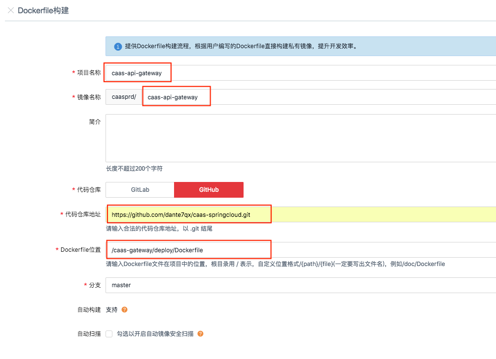

**构建成功后，可在镜像仓库中看到镜像 caas-gateway-service**

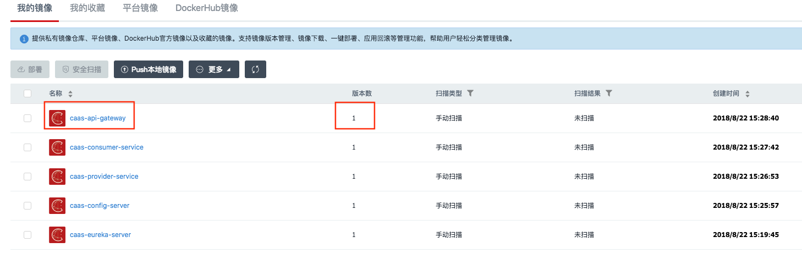

- **创建服务**

**点击容器管理菜单，进入页面后进行创建**


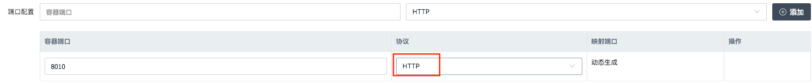

其中要添加的环境变量如下

```properties
eureka_cluster = http://eureka-server1:8761/eureka,http://eureka-server2:8761/eureka,http://eureka-server3:8761/eureka
```

#### 6. 功能验收

- 查看 Eureka dashboard

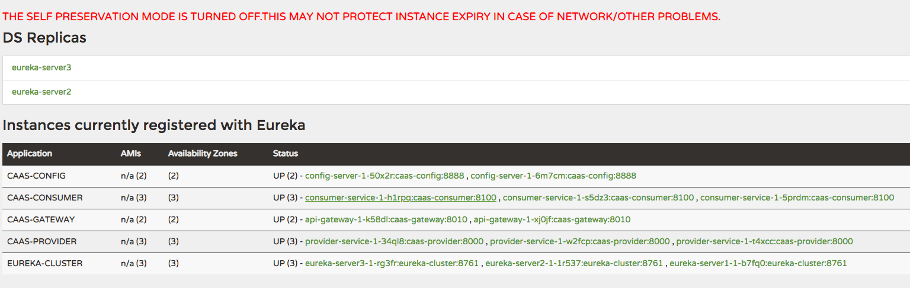

- 访问 API Gateway

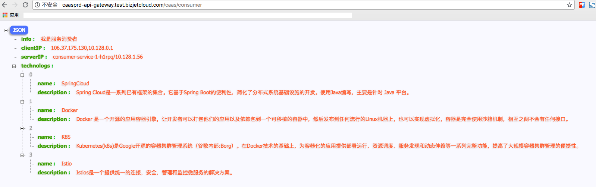

#### 7. 源码地址

https://github.com/dante7qx/caas-springcloud.git


### 四. Istio

​	SpringCloud + Kubernetes 虽然可以完全的满足一个微服务应用的开发+部署+运维的整个生命周期，但这个组合仍然存在明显的不足。

​	开发人员应该将精力都集中在业务逻辑的开发，不应该花精力去考虑服务发现、服务路由、负载均衡、熔断降级、配置中心这些微服务相关的技术点。

​	SpringCloud 是一个大的Java类库，使用它导致我们业务代码和微服务框架紧密的耦合在一起，开发人员本地调试时最少也需要维护一个服务发现 Server才能进行下去。微服务的一大特性是能够使用最合适的技术去满足特定的业务，而SpringCloud主要是针对Java的，虽然它提供了 SideCar的模式去支持这一特性，但这种方式并不优雅，使用有很多的限制。SpringCloud 的版本迭代非常快，系统框架升级也会面临很大的风险。

​	Kubernetes 虽然在平台层面微服务架构进行了抽象，使开发人员可以编写业务相关的代码，但它对服务路由、熔断降级、配置中心这些功能的支持并不完善，不能够完全满足生产环境的需要。另外，Kubernetes 学习曲线比较陡峭，要想很好的掌握并使用它，需要一定的学习成本。

​	那么，为了解决微服务框架库和业务逻辑的耦合关系，需要将这部分为微服务提供通信的逻辑从应用程序中抽离出来，作为**一个单独的==进程==进行部署**，并将这个代理作为服务间的通信代理。

​	介绍 Istio

​	。。。。。。


​	