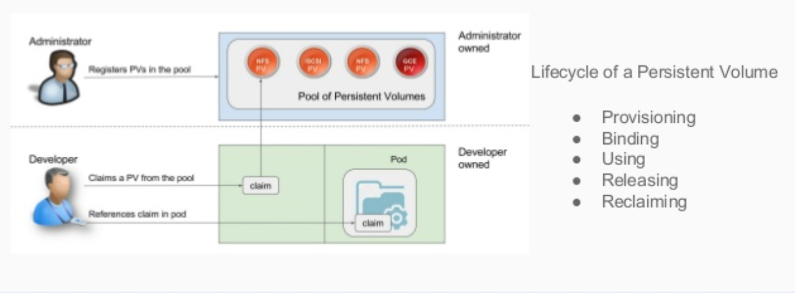
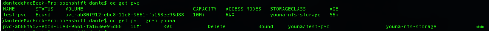
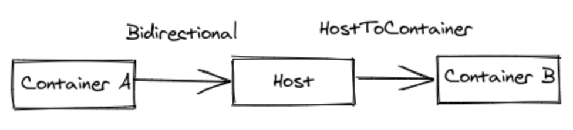
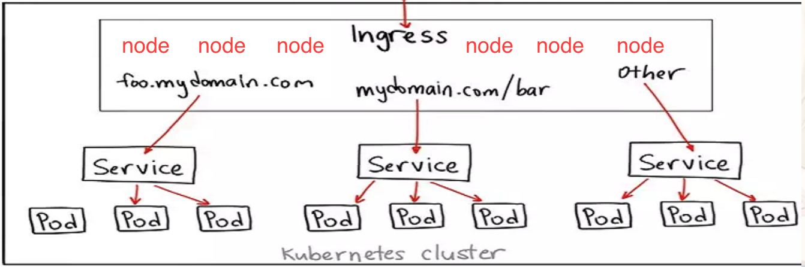
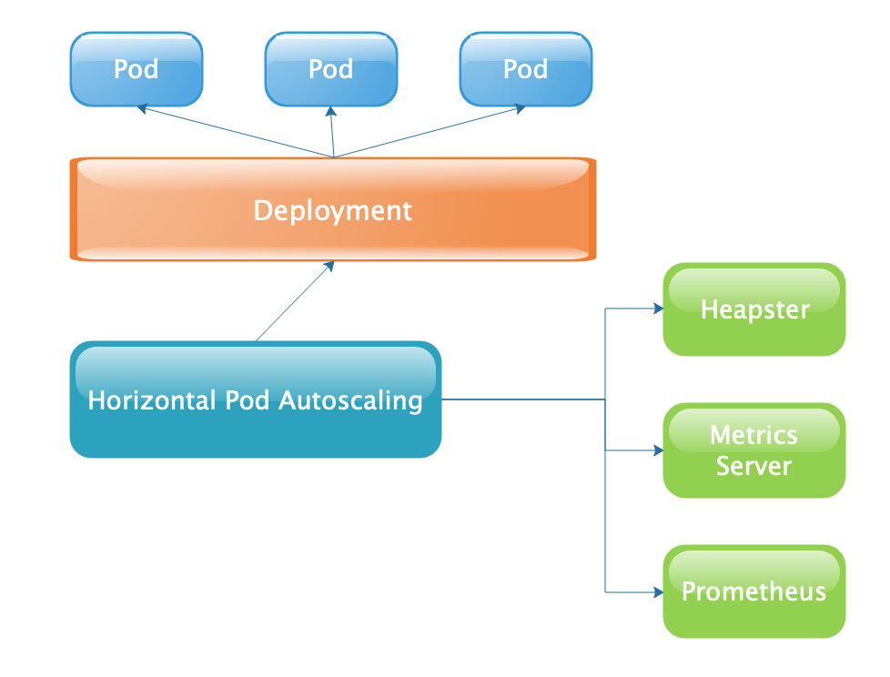

## k8s 技术积累

### 一. Secrets

​	k8s Secret 用来存储少量敏感的数据，例如数据库、Gitlab的用户、密码。这样可以不在 Image 中去保留敏感信息，并且可以在多个 Pod 中共享这些 Secret。因为 k8s 使用 JWT 的方式进行加密，所以需要加密的数据必须先进行 base64 编码。参考 https://kubernetes.io/docs/concepts/configuration/secret。

​        Secret 有三种类型。

#### 1. Opaque（不透明）

```shell
## 编码
echo -n "root" | base64			# => cm9vdA==
echo -n "123456" | base64		# => MTIzNDU2
## 解码
echo "cm9vdA==" | base64 -D
echo "MTIzNDU2" | base64 -D
```
- ***kubectl create secret.yaml***
```yaml
## secret.yaml
apiVersion: v1
kind: Secret
metadata:
  name: gitlabsecret
  namespace: dante
type: Opaque
data:
  username: cm9vdA==
  password: MTIzNDU2

## data 是 map
## key 字母、数字或 _ - .
## value 必须用 base64 编码
```

- **在 Pod 中使用**
  - 环境变量

```yaml
apiVersion: v1
kind: Pod
metadata:
  name: dante-healthcheck
  namespace: dante
spec:
  containers:
  - name: dante-boot-docker
    image: dante/springboot-docker
    imagePullPolicy: Never
    ports:
    - containerPort: 8080
    livenessProbe:
      httpGet:
        path: /docker
        port: 8080
      initialDelaySeconds: 30
      timeoutSeconds: 4
    env:
      - name: hello_msg
        valueFrom:
          secretKeyRef:
            name: gitlabsecret
            key: username
      - name: hello_x_info
        valueFrom:
          secretKeyRef:
            name: gitlabsecret
            key: password
```

#### 2. Service Account

用来访问Kubernetes API，由Kubernetes自动创建，并且会自动挂载到Pod的 **/run/secrets/kubernetes.io/serviceaccount** 目录中；

```bash
$ kubectl run nginx --image nginx
deployment "nginx" created
$ kubectl get pods
NAME                     READY     STATUS    RESTARTS   AGE
nginx-3137573019-md1u2   1/1       Running   0          13s
$ kubectl exec nginx-3137573019-md1u2 ls /run/secrets/kubernetes.io/serviceaccount
ca.crt
namespace
token
```

#### 3. dockerconfigjson

**kubernetes.io/dockerconfigjson**：用来存储私有docker registry的认证信息。

### 二. PV / PVC

对于有状态的服务，k8s 提供了 Volume 和 Persistent Volume 来实现服务状态的保存。存储的状态主要有

- 服务的基本配置文件读取、密钥管理；
- 服务的存储状态、数据；
- 不同服务或应用间的共享数据；



#### 1. PV 

​	由管理员设置的存储，它是群集的一部分。就像节点是集群中的资源一样，PV 也是集群中的资源。 PV 是 Volume 之类的卷插件，但具有独立于使用 PV 的 Pod 的生命周期。此 API 对象包含存储实现的细节，即 NFS、iSCSI 或特定于云供应商的存储系统。假如有一个独立的存储后端，底层实现可以是NFS、GlusterFS、Cinder、HostPath等等，可以使用PV从中划拨一部分资源用于kubernetes的存储需求，其生命周期不依赖于Pod，是一个独立存在的虚拟存储空间，但是不能直接被Pod的Volume挂载，此时需要用到PVC。

PV 的回收策略有三种

- **Retain**	—	**保留现场**，Kubernetes什么也不做。**（仅支持 nfs 和 hostPath）**
- **Delete**    —    K8s 会自动删除该PV及里面的数据。默认值。
- **Recycle**  —    K8s 会将PV里的数据删除，然后把PV的状态变成Available，又可以被新的PVC绑定使用。

#### 2. PVC

​	Pod使用PV资源是通过PVC来实现的，PVC可以理解为资源使用请求，一个Pod需要先明确使用的资源大小、访问方式，创建PVC申请提交到kubernetes中的PersistentVolume Controller，由其调度合适的PV来与PVC绑定，然后Pod中的Volume就可以通过PVC来使用PV的资源。

#### 3. StorageClass

- **静态 Provision**

  是管理员手动创建一堆PV，组成一个PV池，供PVC来绑定。一个PV创建完后状态会变成Available，等待被PVC绑定。一旦被PVC邦定，PV的状态会变成Bound，就可以被相应的Pod使用。Pod使用完后会释放PV，PV的状态变成Released。

```yaml
---
## pv - spiritdev4xvolume
apiVersion: v1
kind: PersistentVolume
metadata:
  name: spiritdev4xvolume
spec:
  accessModes:
  - ReadWriteMany
  capacity:
    storage: "100"
  claimRef:
    apiVersion: v1
    kind: PersistentVolumeClaim
    name: spiritdev4xvolume
    namespace: spiritdev
  mountOptions:
  - vers=3
  - proto=udp
  - nolock
  - noacl
  nfs:
    path: /nfs/spiritdev4xvolume
    server: 10.70.39.214
  persistentVolumeReclaimPolicy: Retain
  
--- 
## pvc - spiritdev4xvolume
apiVersion: v1
kind: PersistentVolumeClaim
metadata:
  annotations:
    pv.kubernetes.io/bind-completed: "yes"
  name: spiritdev4xvolume
  namespace: spiritdev
spec:
  accessModes:
  - ReadWriteMany
  resources:
    requests:
      storage: "100"
  volumeName: spiritdev4xvolume
```

- **动态 Provision**

​	通过 **StoraClass** 定义动态PV资源调度，动态 PV 不需要预先创建 PV，而是通过PersistentVolume Controller动态调度，根据PVC的资源请求，寻找 StorageClass 定义的符合要求的底层存储来分配资源。

#### 4. Demo

1) 创建 serviceaccount 和 rbac

```yaml
---
## serviceaccount.yaml
apiVersion: v1
kind: ServiceAccount
namespace: youna
metadata:
  name: nfs-client-provisioner
```

```yaml
---
## rbac.yaml
kind: ClusterRole
apiVersion: rbac.authorization.k8s.io/v1
metadata:
  name: nfs-client-provisioner-runner
rules:
  - apiGroups: [""]
    resources: ["persistentvolumes"]
    verbs: ["get", "list", "watch", "create", "delete"]
  - apiGroups: [""]
    resources: ["persistentvolumeclaims"]
    verbs: ["get", "list", "watch", "update"]
  - apiGroups: ["storage.k8s.io"]
    resources: ["storageclasses"]
    verbs: ["get", "list", "watch"]
  - apiGroups: [""]
    resources: ["events"]
    verbs: ["create", "update", "patch"]
--- 
kind: ClusterRoleBinding
apiVersion: rbac.authorization.k8s.io/v1
metadata:
  name: run-nfs-client-provisioner
subjects:
  - kind: ServiceAccount
    name: nfs-client-provisioner
    namespace: youna
roleRef:
  kind: ClusterRole
  name: nfs-client-provisioner-runner
  apiGroup: rbac.authorization.k8s.io
---
kind: Role
apiVersion: rbac.authorization.k8s.io/v1
metadata:
  name: leader-locking-nfs-client-provisioner
rules:
  - apiGroups: [""]
    resources: ["endpoints"]
    verbs: ["get", "list", "watch", "create", "update", "patch"]
---
kind: RoleBinding
apiVersion: rbac.authorization.k8s.io/v1
metadata:
  name: leader-locking-nfs-client-provisioner
subjects:
  - kind: ServiceAccount
    name: nfs-client-provisioner
    # replace with namespace where provisioner is deployed
    namespace: youna
roleRef:
  kind: Role
  name: leader-locking-nfs-client-provisioner
  apiGroup: rbac.authorization.k8s.io
```

- 将 host mount-anyuid 赋予 sa nfs-client-provisioner

```shell
oc adm policy add-scc-to-user hostmount-anyuid system:serviceaccount:youna:nfs-client-provisioner
```

2) 配置 **NFS-Client provisioner**

前提：NFS 目录已经创建好了

```yaml
kind: Deployment
apiVersion: extensions/v1beta1
metadata:
  name: nfs-client-provisioner
spec:
  replicas: 1
  strategy:
    type: Recreate
  template:
    metadata:
      labels:
        app: nfs-client-provisioner
    spec:
      serviceAccountName: nfs-client-provisioner
      containers:
        - name: nfs-client-provisioner
          image: harbor.poc.com/spirit/nfs-client-provisioner:v1
          volumeMounts:
            - name: nfs-client-root
              mountPath: /persistentvolumes		## 镜像中已被写死，不能修改
          env:
            - name: PROVISIONER_NAME
              value: youna-nfs
            - name: NFS_SERVER
              value: 192.168.0.18
            - name: NFS_PATH
              value: /nfs/youna
      volumes:
        - name: nfs-client-root
          nfs:
            server: 192.168.0.18
            path: /nfs/youna
```

3) 创建 StorageClass

```yaml
apiVersion: storage.k8s.io/v1
kind: StorageClass
metadata:
  name: youna-nfs-storage
provisioner: youna-nfs # 匹配 deployment's env PROVISIONER_NAME'
parameters:
  archiveOnDelete: "false" # When set to "false" your PVs will not be archived
                           # by the provisioner upon deletion of the PVC.
```

4) 测试

```yaml
---
kind: PersistentVolumeClaim
apiVersion: v1
metadata:
  name: test-pvc
spec:
  accessModes:
    - ReadWriteMany
  resources:
    requests:
      storage: 10Mi
  storageClassName: youna-nfs-storage

---
kind: Pod
apiVersion: v1
metadata:
  name: test-pod
spec:
  containers:
  - name: test-pod
    image: busybox:latest
    command:
      - "/bin/sh"
    args:
      - "-c"
      - "touch /mnt/SUCCESS && exit 0 || exit 1"
    volumeMounts:
      - name: nfs-pvc
        mountPath: "/mnt"
  restartPolicy: "Never"
  volumes:
    - name: nfs-pvc
      persistentVolumeClaim:
        claimName: test-pvc
```

**结果：**



#### 5. Local PV

Local PV 在 k8s 1.14版本已经提升为GA。Local PV 代表一个可以直接连接到的计算节点本地盘 ，性能比远程存储高。Local PV 与 HostPath 的区别：

- HostPath

  HostPath Volume 将文件或目录从计算节点的文件系统挂载到Pod中。k8s 调度时，可能会将引用 HostPath Volume 的pod移动到其他节点，从而导致数据丢失。

- Local PV

  k8s 调度时，可确保始终将使用Local PV 的Pod 调度到同一个计算节点。并且 Local PV 只能通过 PVC 引用，阻止Pod能够访问主机上的任何路径，更加安全。**（Local PV 不支持动态的 Provision）**

- 使用

  参考： https://github.com/kubernetes-sigs/sig-storage-local-static-provisioner#user-guide

```yaml
apiVersion: storage.k8s.io/v1
kind: StorageClass
metadata:
  name: local-storage
provisioner: kubernetes.io/no-provisioner
volumeBindingMode: WaitForFirstConsumer
```

**参考：**

- http://blog.51cto.com/forall/2135152
- https://www.kubernetes.org.cn/3462.html
- https://www.jianshu.com/p/7cc54c0626da
- https://cloud.tencent.com/info/a69596dd6dcc4be3488006b100b7dd91.html
- https://jimmysong.io/posts/kubernetes-persistent-volume/
- https://github.com/kubernetes-incubator/external-storage

#### 6. 挂载传播

卷的挂载传播由 Container.volumeMounts 的 mountPropagation 字段控制。它的值有

- **None：** 这种卷挂载将不会收到任何后续由 host 创建的在这个卷上或其子目录上的挂载。同样的，由容器创建的挂载在 host 上也是不可见的。这是默认的模式。这个其实很好理解，就是容器内和 host 的后续挂载完全隔离。

- **HostToContainer：**这种卷挂载将会收到之后所有的由 host 创建在该卷上或其子目录上的挂载。换句话说，如果 host 在卷挂载内挂载的任何内容，在容器中都是可见的。

  

- **Bidirectional：** 这种挂载机制和 `HostToContainer` 类似。此外，任何在容器中创建的挂载都会传播到 host，然后传播到使用相同卷的所有 Pod 的所有容器。注意：Bidirectional 挂载传播是很危险的。可能会危害到 host 的操作系统。因此只有特权容器在允许使用它。

```yaml
apiVersion: v1
kind: Pod
metadata:
    name: mount-a
    namespace: default
    label:
      app: mount
spec:
    containers:
    - name: main
      image: nginx:latest
      volumeMounts:
      - name: testmount
        mountPath: /home
        mountPropagation: None ## None、HostToContainer、Bidirectional
    volumes:
    - name: testmount
      hostPath:
        path: /mnt/
```

**参考：**

- [https://www.myway5.com/index.php/2020/04/05/kubernetes-%E7%9A%84%E6%8C%82%E8%BD%BD%E4%BC%A0%E6%92%ADmount-propagation%E6%9C%BA%E5%88%B6/](https://www.myway5.com/index.php/2020/04/05/kubernetes-的挂载传播mount-propagation机制/)

### 三. PDB

​	PodDisruptionBudget，对于应用来说，有两种情况会导致业务的中断。即，不可预知的中断（Involuntary Disruption）和可预知的中断（Voluntary Disruption）。

- 不可预知的中断
  - 服务器的硬件故障或系统内核崩溃，导致节点宕机。（设置 replicas大于1）
  - 如果容器部署在VM，VM被误删了或者Hyperwisor出问题了。（考虑物理设备的 HA）
  - 集群出现了网络[脑裂](https://blog.csdn.net/varyall/article/details/80427606)。
  - 由于超配因子设置不当，导致计算资源不足。（设置应用容器的 request 值）

- 可预知的中断
  - 删除那些管理Pods的控制器，比如Deployment，RS，RC，StatefulSet。
  - 触发应用的滚动更新。
  - 直接批量删除Pods。
  - kubectl drain一个节点（节点下线、集群缩容）。

PDB 是用来解决 Voluntary Disruption 的情况的，对部署在 k8s 上的应用都可以创建一个 PDB，用来限制Voluntary Disruptions时最大可以down的副本数或者最少应该保持Available的副本数，以此来保证应用的高可用。对于 Deployment、RC、ReplicaSet 和 StatefulSet，PDB 要设置相同的 Selector。要注意同一个namespace下不同的PDB Object不要使用有重叠的Selectors。

```yaml
apiVersion: policy/v1beta1
kind: PodDisruptionBudget
metadata:
  name: zk-pdb
spec:
  minAvailable: 2
  selector:
    matchLabels:
      app: zookeeper
```

**参考**

- https://cloud.tencent.com/developer/article/1096947

### 四. StatefulSets

​	k8s >= 1.9开启。RC、Deployment、DaemonSet都是面向无状态的服务，它们所管理的Pod的IP、名字，启停顺序等都是随机的。StatefulSet 用来管理所有有状态的集群服务，比如MySQL、MongoDB、Redis、Zookeeper集群等。

**StatefulSet 的特点**：

- 稳定的，唯一的网络标识 Headless Service，可以用来发现集群内部的其他成员。比如StatefulSet的名字叫 zk，那么第一个起来的 Pod 叫 zk-0，第二个叫 zk-1，依次类推。

- 启动或关闭时保证有序。Pod 启动顺序从 0 —> N-1，关闭顺序从 N-1 —> 0。Pod 死掉后，重新启动的 Pod 的名字不会改变。 

  ```sh
  $(podname).(headless server name).namespace.svc.cluster.local
  ```

- 每个Pod一个持久化存储，必须由PersistentVolume Provisioner根据请求的存储类**StorageClass**进行配置。

- 删除一个 StatefulSet，先将 StatefulSet 缩小到 0。

**Headless Service**

没有Cluster IP，用于为一个集群内部的每个成员提供一个唯一的DNS名字（通过 Service 定义的 selectors），用于集群内部成员之间通信 。

因为没有ClusterIP，kube-proxy 并不处理此类服务，因为没有load balancing或 proxy 代理设置，在访问服务的时候回返回后端的全部的Pods IP地址，主要用于开发者自己根据pods进行负载均衡器的开发(设置了selector)。

```yaml
apiVersion: v1
kind: Service
metadata:
  name: zk-hs
  labels:
    app: zk
spec:
  ports:
  - port: 2888
    name: server
  - port: 3888
    name: leader-election
  clusterIP: None
  selector:
    app: zk
```

**Pod管理策略：**

对于某些分布式应用来说，StatefulSet 的顺序性保证是不应该的，可以通过设置 podManagementPolicy 来设置Pod的管理策略。

- podManagementPolicy: "OrderedReady"

  默认配置。Pod按顺序启动（从小到大）和停止（从大到小），当前Pod要等待上一次Pod完全ok。

- podManagementPolicy: "Parallel"

  并行的启动或终止Pod，不必等待上一个Pod完成。

**分段更新：**

可以通过 statefulset.spec.updateStrategy.rollingUpdate.partition 来设置 StatefulSet 的分区。默认是0。 每次只更新Pod序号大于等于分区的Pod，小于分区的Pod使用原来的配置。例如：

创建一个 StatefulSet

```yaml
apiVersion: apps/v1beta1
kind: StatefulSet
metadata:
  name: sts-pod-ip
  namespace: dante
spec:
  podManagementPolicy: OrderedReady
  serviceName: sts-pod-ip-service
  replicas: 5
  template:
    metadata:
      labels:
        app: sts-pod-ip
    spec:
      terminationGracePeriodSeconds: 20
      containers:
      - name: sts-pod-ip
        image: dante2012/centos:7.5.1804
        command: ["/bin/sh", "-c", "touch /tmp/healthy; sleep 20m"]     
        readinessProbe:
          exec:
            command:
            - cat
            - /tmp/healthy
          initialDelaySeconds: 5
          periodSeconds: 5          
        resources:                          
          requests:                         
            cpu: "100m"                    
            memory: "100Mi"                
```

```bash
$ kubectl -n dante get po                                                                                  
NAME           READY   STATUS    RESTARTS   AGE
sts-pod-ip-0   1/1     Running   0          6s
sts-pod-ip-1   1/1     Running   0          11m
sts-pod-ip-2   1/1     Running   0          11m
sts-pod-ip-3   1/1     Running   0          4m5s
sts-pod-ip-4   1/1     Running   0          4m37s
```

设置partition=3

```bash
kubectl -n dante patch statefulset sts-pod-ip -p '{"spec":{"updateStrategy":{"type":"RollingUpdate","rollingUpdate":{"partition":3}}}}'
```

更新 StatefulSet

```yaml
kubectl -n dante patch statefulset sts-pod-ip --type='json' -p='[{"op": "replace", "path": "/spec/template/spec/containers/0/image", "value":"dante2012/oraclelinux:7.4"}]'
```

查看效果，只有sts-pod-ip-3、sts-pod-ip-4更新了镜像，0、1、2未更新

```bash
$ kubectl -n dante get po sts-pod-ip-0 --template '{{range $i, $c := .spec.containers}}{{$c.image}}{{end}}'
dante2012/centos:7.5.1804%  

$ kubectl -n dante get po sts-pod-ip-3 --template '{{range $i, $c := .spec.containers}}{{$c.image}}{{end}}'  
dante2012/oraclelinux:7.4% 
```

**场景：可用于灰度扩容**

**参考：**

- https://kubernetes.io/docs/concepts/workloads/controllers/statefulset/
- http://blog.51cto.com/newfly/2140004

#### 1. Zookeeper

**前提条件**：先创建好 StorageClass，必须使用 PV 确保数据不丢失。

**不足：**在ZooKeeper 3.4.10 中，无法以安全的方式更新集合的成员资格。StatefulSet 本身支持 Scale。

```yaml
---
### headless service
apiVersion: v1
kind: Service
metadata:
  name: zk-svc
  labels:
    app: zk-svc
spec:
  ports:
  - port: 2181                  ## 仅用于同 namespace 下访问, zk-svc:2181
    name: client            
  - port: 2888
    name: server
  - port: 3888
    name: leader-election
  clusterIP: None
  selector:
    app: zk

---
### 配置信息，使用 ConfigMap
apiVersion: v1
kind: ConfigMap
metadata:
  name: zk-cm
data:
  jvm.heap: "512M"
  tick: "2000"
  init: "10"
  sync: "5"
  client.cnxns: "60"
  snap.retain: "3"
  purge.interval: "0"
  
---
### 使用 PDB，确保应用最少的可用实例
apiVersion: policy/v1beta1
kind: PodDisruptionBudget
metadata:
  name: zk-pdb
spec:
  selector:
    matchLabels:
      app: zk
  minAvailable: 2
  
---
apiVersion: apps/v1
kind: StatefulSet
metadata:
  labels:
    app: zk
  name: zk
spec:
  replicas: 3
  selector:
    matchLabels:
      app: zk
  serviceName: zk-svc
  template:
    metadata:
      labels:
        app: zk
    spec:
      affinity:
        podAntiAffinity:
          # requiredDuringSchedulingIgnoredDuringExecution:
          preferredDuringSchedulingIgnoredDuringExecution:
            - weight: 80
              podAffinityTerm: 
                labelSelector:
                  matchExpressions:
                    - key: app
                      operator: In
                      values:
                        - zk
                topologyKey: kubernetes.io/hostname
      containers:
        - name: spiritzk
          image: 'dante2012/k8s-zookeeper:v3'
          imagePullPolicy: Always
          ports:
            - containerPort: 2181
              name: client
              protocol: TCP
            - containerPort: 2888
              name: server
              protocol: TCP
            - containerPort: 3888
              name: leader-election
              protocol: TCP
          command:
            - sh
            - '-c'
            - zkGenConfig.sh && zkServer.sh start-foreground
          env:
            - name: ZK_REPLICAS
              value: '3'
            - name: ZK_HEAP_SIZE
              valueFrom:
                configMapKeyRef:
                  key: jvm.heap
                  name: zk-cm
            - name: ZK_TICK_TIME
              valueFrom:
                configMapKeyRef:
                  key: tick
                  name: zk-cm
            - name: ZK_INIT_LIMIT
              valueFrom:
                configMapKeyRef:
                  key: init
                  name: zk-cm
            - name: ZK_SYNC_LIMIT
              valueFrom:
                configMapKeyRef:
                  key: tick
                  name: zk-cm
            - name: ZK_MAX_CLIENT_CNXNS
              valueFrom:
                configMapKeyRef:
                  key: client.cnxns
                  name: zk-cm
            - name: ZK_SNAP_RETAIN_COUNT
              valueFrom:
                configMapKeyRef:
                  key: snap.retain
                  name: zk-cm
            - name: ZK_PURGE_INTERVAL
              valueFrom:
                configMapKeyRef:
                  key: purge.interval
                  name: zk-cm
            - name: ZK_CLIENT_PORT
              value: '2181'
            - name: ZK_SERVER_PORT
              value: '2888'
            - name: ZK_ELECTION_PORT
              value: '3888'
          readinessProbe:
            exec:
              command:
                - zkOk.sh
            initialDelaySeconds: 10
            timeoutSeconds: 5
          livenessProbe:
            exec:
              command:
                - zkOk.sh
            initialDelaySeconds: 10
            timeoutSeconds: 5
          resources:
            requests:
              cpu: 500m
              memory: 1Gi
          volumeMounts:
            - mountPath: /var/lib/zookeeper
              name: datadir
      restartPolicy: Always
      securityContext:
        fsGroup: 1000
        runAsUser: 1000
  volumeClaimTemplates:
    - metadata:
        name: datadir
      spec:
        accessModes:
          - ReadWriteOnce
        resources:
          requests:
            storage: 2Gi
        storageClassName: youna-nfs-storage		## 先创建好 SotrageClass
        
---
## Headless Service 没有Cluster Ip，因此不能用于外界访问。
## 所以，我们还需要创建一个Service，专用于为 Zookeeper 集群提供访问和负载均：
apiVersion: v1
kind: Service
metadata:
  labels:
    name: zk-access-svc
  name: zk-access-svc
spec:
  ports:
    - nodePort: 30082
      port: 2181
      protocol: TCP
      targetPort: 2181
  selector:
    app: zk
  type: NodePort
```

```shell
### zkOK.sh
#!/usr/bin/env bash

ZK_CLIENT_PORT=${ZK_CLIENT_PORT:-2181}
OK=$(echo ruok | nc 127.0.0.1 $ZK_CLIENT_PORT)
if [ "$OK" == "imok" ]; then
	exit 0
else
	exit 1
fi

### zkGenConfig.sh
#!/usr/bin/env bash
ZK_USER=${ZK_USER:-"zookeeper"}
ZK_LOG_LEVEL=${ZK_LOG_LEVEL:-"INFO"}
ZK_DATA_DIR=${ZK_DATA_DIR:-"/var/lib/zookeeper/data"}
ZK_DATA_LOG_DIR=${ZK_DATA_LOG_DIR:-"/var/lib/zookeeper/log"}
ZK_LOG_DIR=${ZK_LOG_DIR:-"var/log/zookeeper"}
ZK_CONF_DIR=${ZK_CONF_DIR:-"/opt/zookeeper/conf"}
ZK_CLIENT_PORT=${ZK_CLIENT_PORT:-2181}
ZK_SERVER_PORT=${ZK_SERVER_PORT:-2888}
ZK_ELECTION_PORT=${ZK_ELECTION_PORT:-3888}
ZK_TICK_TIME=${ZK_TICK_TIME:-2000}
ZK_INIT_LIMIT=${ZK_INIT_LIMIT:-10}
ZK_SYNC_LIMIT=${ZK_SYNC_LIMIT:-5}
ZK_HEAP_SIZE=${ZK_HEAP_SIZE:-2G}
ZK_MAX_CLIENT_CNXNS=${ZK_MAX_CLIENT_CNXNS:-60}
ZK_MIN_SESSION_TIMEOUT=${ZK_MIN_SESSION_TIMEOUT:- $((ZK_TICK_TIME*2))}
ZK_MAX_SESSION_TIMEOUT=${ZK_MAX_SESSION_TIMEOUT:- $((ZK_TICK_TIME*20))}
ZK_SNAP_RETAIN_COUNT=${ZK_SNAP_RETAIN_COUNT:-3}
ZK_PURGE_INTERVAL=${ZK_PURGE_INTERVAL:-0}
ID_FILE="$ZK_DATA_DIR/myid"
ZK_CONFIG_FILE="$ZK_CONF_DIR/zoo.cfg"
LOGGER_PROPS_FILE="$ZK_CONF_DIR/log4j.properties"
JAVA_ENV_FILE="$ZK_CONF_DIR/java.env"
HOST=`hostname -s`
DOMAIN=`hostname -d`

function print_servers() {
    for (( i=1; i<=$ZK_REPLICAS; i++ ))
    do
        echo "server.$i=$NAME-$((i-1)).$DOMAIN:$ZK_SERVER_PORT:$ZK_ELECTION_PORT"
    done
}

function validate_env() {
    echo "Validating environment"

    if [ -z $ZK_REPLICAS ]; then
        echo "ZK_REPLICAS is a mandatory environment variable"
        exit 1
    fi

    if [[ $HOST =~ (.*)-([0-9]+)$ ]]; then
        NAME=${BASH_REMATCH[1]}
        ORD=${BASH_REMATCH[2]}
    else
        echo "Failed to extract ordinal from hostname $HOST"
        exit 1
    fi

    MY_ID=$((ORD+1))
    echo "ZK_REPLICAS=$ZK_REPLICAS"
    echo "MY_ID=$MY_ID"
    echo "ZK_LOG_LEVEL=$ZK_LOG_LEVEL"
    echo "ZK_DATA_DIR=$ZK_DATA_DIR"
    echo "ZK_DATA_LOG_DIR=$ZK_DATA_LOG_DIR"
    echo "ZK_LOG_DIR=$ZK_LOG_DIR"
    echo "ZK_CLIENT_PORT=$ZK_CLIENT_PORT"
    echo "ZK_SERVER_PORT=$ZK_SERVER_PORT"
    echo "ZK_ELECTION_PORT=$ZK_ELECTION_PORT"
    echo "ZK_TICK_TIME=$ZK_TICK_TIME"
    echo "ZK_INIT_LIMIT=$ZK_INIT_LIMIT"
    echo "ZK_SYNC_LIMIT=$ZK_SYNC_LIMIT"
    echo "ZK_MAX_CLIENT_CNXNS=$ZK_MAX_CLIENT_CNXNS"
    echo "ZK_MIN_SESSION_TIMEOUT=$ZK_MIN_SESSION_TIMEOUT"
    echo "ZK_MAX_SESSION_TIMEOUT=$ZK_MAX_SESSION_TIMEOUT"
    echo "ZK_HEAP_SIZE=$ZK_HEAP_SIZE"
    echo "ZK_SNAP_RETAIN_COUNT=$ZK_SNAP_RETAIN_COUNT"
    echo "ZK_PURGE_INTERVAL=$ZK_PURGE_INTERVAL"
    echo "ENSEMBLE"
    print_servers
    echo "Environment validation successful"
}

function create_config() {
    rm -f $ZK_CONFIG_FILE
    echo "Creating ZooKeeper configuration"
    echo "#This file was autogenerated by k8szk DO NOT EDIT" >> $ZK_CONFIG_FILE
    echo "clientPort=$ZK_CLIENT_PORT" >> $ZK_CONFIG_FILE
    echo "dataDir=$ZK_DATA_DIR" >> $ZK_CONFIG_FILE
    echo "dataLogDir=$ZK_DATA_LOG_DIR" >> $ZK_CONFIG_FILE
    echo "tickTime=$ZK_TICK_TIME" >> $ZK_CONFIG_FILE
    echo "initLimit=$ZK_INIT_LIMIT" >> $ZK_CONFIG_FILE
    echo "syncLimit=$ZK_SYNC_LIMIT" >> $ZK_CONFIG_FILE
    echo "maxClientCnxns=$ZK_MAX_CLIENT_CNXNS" >> $ZK_CONFIG_FILE
    echo "minSessionTimeout=$ZK_MIN_SESSION_TIMEOUT" >> $ZK_CONFIG_FILE
    echo "maxSessionTimeout=$ZK_MAX_SESSION_TIMEOUT" >> $ZK_CONFIG_FILE
    echo "autopurge.snapRetainCount=$ZK_SNAP_RETAIN_COUNT" >> $ZK_CONFIG_FILE
    echo "autopurge.purgeInterval=$ZK_PURGE_INTERVAL" >> $ZK_CONFIG_FILE

    if [ $ZK_REPLICAS -gt 1 ]; then
        print_servers >> $ZK_CONFIG_FILE
    fi

    echo "Wrote ZooKeeper configuration file to $ZK_CONFIG_FILE"
}

function create_data_dirs() {
    echo "Creating ZooKeeper data directories and setting permissions"

    if [ ! -d $ZK_DATA_DIR  ]; then
        mkdir -p $ZK_DATA_DIR
        chown -R $ZK_USER:$ZK_USER $ZK_DATA_DIR
    fi

    if [ ! -d $ZK_DATA_LOG_DIR  ]; then
        mkdir -p $ZK_DATA_LOG_DIR
        chown -R $ZK_USER:$ZK_USER $ZK_DATA_LOG_DIR
    fi

    if [ ! -d $ZK_LOG_DIR  ]; then
        mkdir -p $ZK_LOG_DIR
        chown -R $ZK_USER:$ZK_USER $ZK_LOG_DIR
    fi

    if [ ! -f $ID_FILE ]; then
        echo $MY_ID >> $ID_FILE
    fi

    echo "Created ZooKeeper data directories and set permissions in $ZK_DATA_DIR"
}

function create_log_props () {
    rm -f $LOGGER_PROPS_FILE
    echo "Creating ZooKeeper log4j configuration"
    echo "zookeeper.root.logger=CONSOLE" >> $LOGGER_PROPS_FILE
    echo "zookeeper.console.threshold="$ZK_LOG_LEVEL >> $LOGGER_PROPS_FILE
    echo "log4j.rootLogger=\${zookeeper.root.logger}" >> $LOGGER_PROPS_FILE
    echo "log4j.appender.CONSOLE=org.apache.log4j.ConsoleAppender" >> $LOGGER_PROPS_FILE
    echo "log4j.appender.CONSOLE.Threshold=\${zookeeper.console.threshold}" >> $LOGGER_PROPS_FILE
    echo "log4j.appender.CONSOLE.layout=org.apache.log4j.PatternLayout" >> $LOGGER_PROPS_FILE
    echo "log4j.appender.CONSOLE.layout.ConversionPattern=%d{ISO8601} [myid:%X{myid}] - %-5p [%t:%C{1}@%L] - %m%n" >> $LOGGER_PROPS_FILE
    echo "Wrote log4j configuration to $LOGGER_PROPS_FILE"
}

function create_java_env() {
    rm -f $JAVA_ENV_FILE
    echo "Creating JVM configuration file"
    echo "ZOO_LOG_DIR=$ZK_LOG_DIR" >> $JAVA_ENV_FILE
    echo "JVMFLAGS=\"-Xmx$ZK_HEAP_SIZE -Xms$ZK_HEAP_SIZE\"" >> $JAVA_ENV_FILE
    echo "Wrote JVM configuration to $JAVA_ENV_FILE"
}

validate_env && create_config && create_log_props && create_data_dirs && create_java_env
```

**参考**

- https://github.com/kubernetes/contrib/blob/master/statefulsets/zookeeper/README.md
- https://blog.csdn.net/xiaolang85/article/details/13021339
- https://www.kubernetes.org.cn/1130.html

#### 2. Eureka

针对 Spring Cloud框架中的服务发现组件 Eureka，使用 k8s 部署高可用。k8s pod 要在部署的时候就知道其他 pod ip 或者域名，保证在启动pod的时候可以互相寻址。

- **Java**

```yaml
server:
  port: 8761
spring:
  security:
    user:
      name: ${REGISTER_USER:dante}
      password: ${REGISTER_PWD:123456}
  application:
    name: ${EUREKA_APPLICATION_NAME:eureka-server}
  cloud:
    config:
      enabled: false
eureka: 
  server:
    enable-self-preservation: false # 关闭自我保护模式
    peer-node-read-timeout-ms: 1000 # 节点之间读取超时时间（毫秒）
  instance:
    hostname: ${EUREKA_HOST_NAME:localhost} # 服务主机名
    prefer-ip-address: false # 猜测主机名时，优先选择ip。默认为false，使用hostname作为主机名
  client:
    register-with-eureka: ${BOOL_REGISTER:false} # 是否把服务中心本身当做eureka client 注册。默认为true
    fetch-registry: ${BOOL_FETCH:false} # 是否拉取 eureka server 的注册信息。 默认为true
    service-url:
      defaultZone: ${EUREKA_URL_LIST:http://${spring.security.user.name}:${spring.security.user.password}@${eureka.instance.hostname}:${server.port}/eureka/}
  environment: ${RUN_ENV:spirit-dev}
  datacenter: ${RUN_DATA:spirit-cloud}
```

- **Docker**

```dockerfile
FROM java:8

LABEL author="dante"
LABEL email="sunchao.0129@163.com"

ENV JAVA_OPTS="-Xms1g -Xmx1g"
ENV TZ=Asia/Shanghai
ENV APPS_HOME=/AppServer

RUN ln -snf /usr/share/zoneinfo/$TZ /etc/localtime && echo $TZ > /etc/timezone \
	&& mkdir -p $APPS_HOME/ \
	&& rm /bin/sh && ln -s /bin/bash /bin/sh 

WORKDIR $APPS_HOME/	 
	 
ADD micro-eureka-k8s-0.0.1-SNAPSHOT.jar app.jar	 
ADD init.sh init.sh

RUN sh -c 'touch app.jar'

EXPOSE 8761

ENTRYPOINT ["/bin/bash","-c","source init.sh"] 
```

- **init.sh**

```bash
#!/usr/bin/env bash

POSTFIX="svc.cluster.local"
EUREKA_HOST_NAME="$MY_POD_NAME.$MY_INNER_SERVICE.$MY_POD_NAMESPACE.$POSTFIX"
export EUREKA_HOST_NAME=$EUREKA_HOST_NAME
REGISTER_USER="$EUREKA_USER"
REGISTER_PWD="$EUREKA_PWD"
BOOL_REGISTER="false"
BOOL_FETCH="false"

if [ $EUREKA_REPLICAS == 1 ]; then
	EUREKA_URL_LIST="http://$EUREKA_HOST_NAME:8761/eureka/,"
else 
	BOOL_REGISTER="true"
	BOOL_FETCH="true"
	for ((i=0; i<$EUREKA_REPLICAS; i ++))
    do
    	if [ $MY_POD_NAME != "$EUREKA_APPLICATION_NAME-$i" ]; then
	        temp="http://$REGISTER_USER:$REGISTER_PWD@$EUREKA_APPLICATION_NAME-$i.$MY_INNER_SERVICE.$MY_POD_NAMESPACE.$POSTFIX:8761/eureka/,"
	        EUREKA_URL_LIST="$EUREKA_URL_LIST$temp"
        fi
    done
fi

## 设置 eureka 的注册 url
EUREKA_URL_LIST=${EUREKA_URL_LIST%?}
echo "EUREKA_URL_LIST is $EUREKA_URL_LIST"
export EUREKA_URL_LIST=$EUREKA_URL_LIST
export BOOL_FETCH=$BOOL_FETCH
export BOOL_REGISTER=$BOOL_REGISTER
export REGISTER_USER=$REGISTER_USER
export REGISTER_PWD=$REGISTER_PWD

java $JAVA_OPTS -Djava.security.egd=file:/dev/./urandom -jar app.jar
```

- **k8s**

```yaml
apiVersion: v1
kind: Service
metadata:
  name: eureka-svc-internal
  labels:
    app: eureka-svc-internal
  namespace: spiritdev
spec:
  clusterIP: None
  ports:
  - port: 8761
    name: server
  selector:
    app: eureka
      
---
apiVersion: policy/v1beta1
kind: PodDisruptionBudget
metadata:
  name: eureka-pdb
  namespace: spiritdev
spec:
  selector:
    matchLabels:
      app: eureka
  minAvailable: 1

---
apiVersion: apps/v1
kind: StatefulSet
metadata: 
  name: eureka
  namespace: spiritdev
spec: 
  selector: 
    matchLabels:
      app: eureka
  serviceName: eureka-svc-internal
  replicas: "3"
  template:
    metadata:
      labels:
        app: eureka
    spec:
      terminationGracePeriodSeconds: 10
      affinity:
        podAntiAffinity:
          preferredDuringSchedulingIgnoredDuringExecution:
            - weight: 80
              podAffinityTerm: 
                labelSelector:
                  matchExpressions:
                    - key: app
                      operator: In
                      values:
                        - eureka
                topologyKey: kubernetes.io/hostname
      containers:
        - name: eureka-cluster
          image: harbor.xiaohehe.com/spiritdev/eureka-cluster:v1
          imagePullPolicy: IfNotPresent
          ports: 
            - containerPort: 8761
              name: server
              protocol: TCP
          resources:
            requests:
              cpu: 500m
              memory: 1Gi
            limits:
              cpu: 500m
              memory: 1Gi
          env: 
            - name: MY_NODE_NAME
              valueFrom:
                fieldRef:
                  fieldPath: spec.nodeName
            - name: MY_POD_NAME
              valueFrom:
                fieldRef:
                  fieldPath: metadata.name
            - name: MY_POD_NAMESPACE
              valueFrom:
                fieldRef:
                  fieldPath: metadata.namespace
            - name: MY_POD_IP
              valueFrom:
                fieldRef:
                  fieldPath: status.podIP
            - name: MY_INNER_SERVICE
              value: eureka-svc-internal
            - name: EUREKA_APPLICATION_NAME
              value: eureka
            - name: EUREKA_REPLICAS
              value: "3"
            - name: EUREKA_USER
              value: dante
            - name: EUREKA_PWD
              value: "123456"
          livenessProbe:
            httpGet:
              path: /actuator/health
              port: 8761
            initialDelaySeconds: 10
            periodSeconds: 5
          readinessProbe:
            httpGet:
              path: /actuator/health
              port: 8761
            initialDelaySeconds: 10
            periodSeconds: 5
      imagePullSecrets:
        - name: spiritdev-pushsecret-harbor-xiaohehe-com    ## 设置推送权限（可选）或者 oc secrets link default spiritdev-pushsecret-harbor-xiaohehe-com --for=pull
---
apiVersion: v1
kind: Service
metadata:
  labels:
    name: eureka-external-svc
  name: eureka-external-svc
spec:
  ports:
    - name: http-8761
      port: 8761
      protocol: TCP
      targetPort: 8761
  selector:
    app: eureka
  type: ClusterIP  
```

**参考**

- https://blog.csdn.net/gujian2517/article/details/82491101

#### 3. Redis

##### 集群模式

- Redis 集群模式，每个 Master 都有一个或多个 Slave，Master 掉线后，Cluster 会从多个 Slave 中选举一个作为 Master，旧的 Master 重新上线后会变成新 Master 的一个 Slave。

- Redis 的集群要所有的 redis 实例都启动后，才能进行配置，每个实例节点通过启动后自动生成的 ID（nodes.conf 中）来记录其他的节点。因为在 k8s 中，IP 不是固定不变的，而节点ID在整个生命周期中一直保持不变。

  每个节点都要绑定不同的存储数据，也就是说，Pod A第一次读取到的数据,和隔了十分钟之后再次读取到的数据,应该是同一份。

- 用 Statefulset 搭建

  (1) 使用 Configmap 存放 redis 配置

```bash
### redis.conf
appendonly yes                      # 开启Redis的AOF持久化
cluster-enabled yes                 # 打开集群模式
cluster-config-file /var/lib/redis/nodes.conf  #各节点使用ID进行互知
cluster-node-timeout 5000           # 节点超时时间
dir /var/lib/redis                  # AOF持久化文件存在的位置
port 6379
```

```bash
kubectl create configmap redis-conf --from-file redis.conf -n dante
```

​	(2) 创建PV、PVC（本例使用 Local PV）

```yaml
---
apiVersion: storage.k8s.io/v1
kind: StorageClass
metadata:
  name: local-storage
provisioner: kubernetes.io/no-provisioner
volumeBindingMode: WaitForFirstConsumer

---
apiVersion: v1
kind: PersistentVolume
metadata:
  name: redis-pv0
spec:
  capacity:
    storage: 300M
  volumeMode: Filesystem
  accessModes:
  - ReadWriteOnce
  persistentVolumeReclaimPolicy: Delete
  storageClassName: local-storage
  local:
    path: /Users/dante/Documents/Technique/k8s/project/openshift/statefulset/redis/cluster/data/pv0
  nodeAffinity:
    required:
      nodeSelectorTerms:
      - matchExpressions:
        - key: kubernetes.io/hostname
          operator: In
          values:
          - docker-desktop

---
apiVersion: v1
kind: PersistentVolume
metadata:
  name: redis-pv1
spec:
  capacity:
    storage: 300M
  volumeMode: Filesystem
  accessModes:
  - ReadWriteOnce
  persistentVolumeReclaimPolicy: Delete
  storageClassName: local-storage
  local:
    path: /Users/dante/Documents/Technique/k8s/project/openshift/statefulset/redis/cluster/data/pv1
  nodeAffinity:
    required:
      nodeSelectorTerms:
      - matchExpressions:
        - key: kubernetes.io/hostname
          operator: In
          values:
          - docker-desktop

---
apiVersion: v1
kind: PersistentVolume
metadata:
  name: redis-pv2
spec:
  capacity:
    storage: 300M
  volumeMode: Filesystem
  accessModes:
  - ReadWriteOnce
  persistentVolumeReclaimPolicy: Delete
  storageClassName: local-storage
  local:
    path: /Users/dante/Documents/Technique/k8s/project/openshift/statefulset/redis/cluster/data/pv2
  nodeAffinity:
    required:
      nodeSelectorTerms:
      - matchExpressions:
        - key: kubernetes.io/hostname
          operator: In
          values:
          - docker-desktop

---
apiVersion: v1
kind: PersistentVolume
metadata:
  name: redis-pv3
spec:
  capacity:
    storage: 300M
  volumeMode: Filesystem
  accessModes:
  - ReadWriteOnce
  persistentVolumeReclaimPolicy: Delete
  storageClassName: local-storage
  local:
    path: /Users/dante/Documents/Technique/k8s/project/openshift/statefulset/redis/cluster/data/pv3
  nodeAffinity:
    required:
      nodeSelectorTerms:
      - matchExpressions:
        - key: kubernetes.io/hostname
          operator: In
          values:
          - docker-desktop
  
---
apiVersion: v1
kind: PersistentVolume
metadata:
  name: redis-pv4
spec:
  capacity:
    storage: 300M
  volumeMode: Filesystem
  accessModes:
  - ReadWriteOnce
  persistentVolumeReclaimPolicy: Delete
  storageClassName: local-storage
  local:
    path: /Users/dante/Documents/Technique/k8s/project/openshift/statefulset/redis/cluster/data/pv4
  nodeAffinity:
    required:
      nodeSelectorTerms:
      - matchExpressions:
        - key: kubernetes.io/hostname
          operator: In
          values:
          - docker-desktop

---
apiVersion: v1
kind: PersistentVolume
metadata:
  name: redis-pv5
spec:
  capacity:
    storage: 300M
  volumeMode: Filesystem
  accessModes:
  - ReadWriteOnce
  persistentVolumeReclaimPolicy: Delete
  storageClassName: local-storage
  local:
    path: /Users/dante/Documents/Technique/k8s/project/openshift/statefulset/redis/cluster/data/pv5
  nodeAffinity:
    required:
      nodeSelectorTerms:
      - matchExpressions:
        - key: kubernetes.io/hostname
          operator: In
          values:
          - docker-desktop
```

​	(3) 创建 Headless Service，每个 Pod 会获得一个域名，每个Pod的名称也是按顺序启动的，不同Pod间通过这个不变的域名进行通信。其中域名的格式

```bash
<podname>.<headless-service-name>.<namespace>.svc.cluster.local
```

```yaml
### headless service
apiVersion: v1
kind: Service
metadata:
  name: redis-service
  namespace: dante
  labels:
    app: redis
spec:
  ports:
  - name: redis-port
    port: 6379
  clusterIP: None
  selector:
    app: redis
    appCluster: redis-cluster
```

（4）创建 statefulset

```yaml
apiVersion: apps/v1beta1
kind: StatefulSet
metadata:
  name: redis-app
  namespace: dante
spec:
  serviceName: redis-service
  replicas: 6
  template:
    metadata:
      labels:
        app: redis
        appCluster: redis-cluster
    spec:
      terminationGracePeriodSeconds: 20
      affinity:
        podAntiAffinity:
          preferredDuringSchedulingIgnoredDuringExecution:
          - weight: 100
            podAffinityTerm:
              labelSelector:
                matchExpressions:
                - key: app
                  operator: In
                  values:
                  - redis
              topologyKey: kubernetes.io/hostname
      containers:
      - name: redis
        image: redis:4.0.14
        command:
          - "redis-server"                  #redis启动命令
        args:
          - "/etc/redis/redis.conf"         #redis-server后面跟的参数,换行代表空格
          - "--protected-mode"              #允许外网访问
          - "no"
        resources:                          #资源
          requests:                         #请求的资源
            cpu: "100m"                     #m代表千分之,相当于0.1 个cpu资源
            memory: "100Mi"                 #内存100m大小
        ports:
            - name: redis
              containerPort: 6379
              protocol: "TCP"
            - name: cluster
              containerPort: 16379
              protocol: "TCP"
        volumeMounts:
          - name: redis-conf            #挂载configmap生成的文件
            mountPath: /etc/redis        #挂载到哪个路径下
          - name: redis-data             #挂载持久卷的路径
            mountPath: /var/lib/redis
      volumes:
      - name: redis-conf                    #引用configMap卷
        configMap:
          name: redis-conf
          items:
            - key: redis.conf             #创建configMap指定的名称
              path: redis.conf            #里面的那个文件--from-file参数后面的文件
  volumeClaimTemplates:                     #进行pvc持久卷声明,
  - metadata:
      name: redis-data
    spec:
      accessModes:
      - ReadWriteOnce
      storageClassName: local-storage
      resources:
        requests:
          storage: 300M
```

（5）配置集群

​	常用的 redis-tribe 工具进行集群的初始化，可使用我自己制作的镜像。

```yaml
apiVersion: v1
kind: Pod
metadata:
  name: redis-trib
  namespace: dante
  labels:
    app: redis-trib
spec:
  containers:
  - name: redis-trib
    image: dante2012/redis:redis-trib
  restartPolicy: Never
```

​	进入容器，进行集群创建

```bash
kubectl exec -it redis-trib bash -n dante

## --replicas 1: 创建的集群中每个主节点分配一个从节点,达到3主3从
## dig +short redis-app-0.redis-service.default.svc.cluster.local用于将Pod的域名转化为IP，这是因为redis-trib不支持域名来创建集群
redis-trib create --replicas 1 \
`dig +short redis-app-0.redis-service.dante.svc.cluster.local`:6379 \
`dig +short redis-app-1.redis-service.dante.svc.cluster.local`:6379 \
`dig +short redis-app-2.redis-service.dante.svc.cluster.local`:6379 \
`dig +short redis-app-3.redis-service.dante.svc.cluster.local`:6379 \
`dig +short redis-app-4.redis-service.dante.svc.cluster.local`:6379 \
`dig +short redis-app-5.redis-service.dante.svc.cluster.local`:6379
```

​	测试，进入一个 redis pod 实例

```bash
kubectl exec -it redis-app-2 /bin/bash -n dante

redis-cli -c
127.0.0.1:6379> cluster info
...
127.0.0.1:6379> cluster nodes
```

（6）创建用于访问的 Service

```yaml
apiVersion: v1
kind: Service
metadata:
  name: redis-access-service
  namespace: dante
  labels:
    app: redis
spec:
  ports:
  - name: redis-port
    protocol: TCP
    port: 6379
    targetPort: 6379
#   nodePort: 31000
  selector:
    app: redis
    appCluster: redis-cluster
# type: NodePort
```

（7）测试主从

```bash
## 1. 先查看一个实例的状态（redis-3为例）
kubectl exec -it redis-app-3 /bin/bash -n dante
redis-cli
127.0.0.1:6379> role
。。。查看输出

## 2. 删除pod，redis-app-3
kubectl delete po redis-app-3 -n dante

## 3. redis-app-3 自动启动后，再按步骤1的方式进行查看实力状态
```

（8）动态扩容（4主4从）

- 添加2个PV（add_pv.yaml）

```yaml
apiVersion: v1
kind: PersistentVolume
metadata:
  name: redis-pv6
spec:
  capacity:
    storage: 300M
  volumeMode: Filesystem
  accessModes:
  - ReadWriteOnce
  persistentVolumeReclaimPolicy: Delete
  storageClassName: local-storage
  local:
    path: /Users/dante/Documents/Technique/k8s/project/openshift/statefulset/redis/cluster/data/pv6
  nodeAffinity:
    required:
      nodeSelectorTerms:
      - matchExpressions:
        - key: kubernetes.io/hostname
          operator: In
          values:
          - docker-desktop

---
apiVersion: v1
kind: PersistentVolume
metadata:
  name: redis-pv7
spec:
  capacity:
    storage: 300M
  volumeMode: Filesystem
  accessModes:
  - ReadWriteOnce
  persistentVolumeReclaimPolicy: Delete
  storageClassName: local-storage
  local:
    path: /Users/dante/Documents/Technique/k8s/project/openshift/statefulset/redis/cluster/data/pv7
  nodeAffinity:
    required:
      nodeSelectorTerms:
      - matchExpressions:
        - key: kubernetes.io/hostname
          operator: In
          values:
          - docker-desktop
```

- 添加 redis 节点

```bash
### 方式1. 命令行
kubectl scale --replicas=8 statefulset/redis-app -n dante
kubectl scale --current-replicas=6 --replicas=8 statefulset/redis-app -n dante

### 方式2. 修改yaml，将 replicas 改成 8
kubectl apply -f redis-cluster.yaml
```

- 添加集群节点，在 redis-tribe pod中，执行命令

```bash
## add-node后面跟的是新节点的信息,后面是以前集群中的任意一个节点
redis-trib add-node \
`dig +short redis-app-6.redis-service.default.svc.cluster.local`:6379 \
`dig +short redis-app-0.redis-service.default.svc.cluster.local`:6379

redis-trib add-node \
`dig +short redis-app-7.redis-service.default.svc.cluster.local`:6379 \
`dig +short redis-app-0.redis-service.default.svc.cluster.local`:6379
```

-  重新分配哈希槽

```bash
redis-trib reshard `dig +short redis-app-0.redis-service.default.svc.cluster.local`:6379
```


##### 哨兵模式


**参考**

- https://cloud.tencent.com/developer/article/1392872
- https://www.jianshu.com/p/65c4baadf5d9

### 五. 探针

Kubernetes提供了两种探针（Probe，支持exec、tcp和httpGet方式）来探测容器的状态。

#### 1. liveness

用来确定是否重启容器，当程序处于运行状态但无法执行进一步操作时，需要有一个状态去通知 k8s 重启应用。

```yaml
spec:
  containers:
  - name: liveness
    livenessProbe:
      httpGet:
        path: /healthz
        port: 8080
        httpHeaders:
          - name: X-Custom-Header
            value: x-dante
      initialDelaySeconds: 3
      periodSeconds: 3
```

#### 2. readiness

用来确定 Pod 是否已经就绪，可以接受流量。只有当Pod中的容器都处于就绪状态时kubelet才会认定该Pod处于就绪状态。只有就绪状态的 Pod 才会做为 Service 后端负载的一部分。

```yaml
readinessProbe:
  exec:
    command:
    - cat
    - /tmp/healthy
  initialDelaySeconds: 5
  periodSeconds: 5
```

| 配置项              |                                                              |
| ------------------- | ------------------------------------------------------------ |
| initialDelaySeconds | 容器启动后第一次执行探测是需要等待多少秒（应用启动时间）     |
| periodSeconds       | 执行探测的频率。默认是10秒，最小1秒。                        |
| timeoutSeconds      | 探测超时时间。默认1秒，最小1秒。                             |
| successThreshold    | 探测失败后，最少连续探测成功多少次才被认定为成功。默认是1。对于liveness必须是1。最小值是1。 |
| failureThreshold    | 探测成功后，最少连续探测失败多少次才被认定为失败。默认是3。最小值是1。 |
| **针对 httpGet**    |                                                              |
| host                | 连接的主机名。默认是 pod 的 IP。                             |
| scheme              | 连接的schema，默认HTTP。                                     |
| path                | 访问的 HTTP server的path。                                   |
| port                | 访问的容器的端口名字或者端口号。端口号必须介于1和65525之间。 |
| httpHeaders         | 自定义请求的header。HTTP运行重复的header。                   |

### 六. Ingress

k8s 默认通过 service 暴露服务，其中 NodePort 类型可以将http 服务暴露在宿主机的端口上，以便外部可以访问。这种模式虽然简单，但是有几个缺点：

- 一个服务对应的app就要占用一个宿主机的端口，并且端口缺乏管理。
- L4 转发，无法根据 http header 和 path 进行路由转发。

通过 Ingress（https://kubernetes.io/docs/concepts/services-networking/ingress-controllers/），ingress -> service -> label selector -> pod，可以增加 L7 的能力。Ingress 由两部分组成

- Ingress Controller

  是流量的入口，是一个实体软件， 一般是Nginx 和 Haproxy 。用来实时的去实现规则。将所有的  ingress  controller 安装在一个 namespace 中，方便管理，推荐使用 **DaemonSet** 方式部署。

- Ingress

  描述具体的路由规则。



#### 1. nginx ingress

- 安装 ingress  controller


```shell
cd /Users/dante/Documents/Technique/k8s/project/dante/ingress/nginx
## 1. 为 ingress controller 创建 namespace 和 service account
kubectl apply -f ns-and-sa.yaml
kubectl apply -f rbac.yaml
## 2. 创建一个 secret（tls 证书和私钥），为 nginx default server
kubectl apply -f default-server-secret.yaml
## 3. 加载ingress-nginx/nginx-configuration这个configmap配置文件，从而允许我们修改nginx的http段的各种配置项覆盖nginx的默认值
kubectl apply -f nginx-config.yaml
## 4. 创建 controller（deployment 或 daemonSet（推荐））
kubectl apply -f deployment-controller.yaml
kubectl apply -f service.yaml (hostNetwork)
```

- 为各个应用服务创建 ingress

```yaml
apiVersion: extensions/v1beta1
kind: Ingress
metadata:
  name: ccb-ingress
  namespace: dante
  annotations:
    nginx.org/rewrites: "serviceName=ccb-ui rewrite=/; serviceName=ccb-svc1 rewrite=/; serviceName=ccb-svc2 rewrite=/"
spec:
  tls:
  - hosts:
    - x.dante.com
    secretName: nginx-server-secret
  rules:
  - host: x.dante.com
    http:
      paths:
      - path: /
        backend:
          serviceName: ccb-ui
          servicePort: 8080
      - path: /svc1
        backend:
          serviceName: ccb-svc1
          servicePort: 8080
      - path: /svc2
        backend:
          serviceName: ccb-svc2
          servicePort: 8080
```

参考：

- https://github.com/nginxinc/kubernetes-ingress
- https://www.cnblogs.com/justmine/p/8991379.html
- https://blog.csdn.net/shida_csdn/article/details/84032019
- https://blog.hlyue.com/2018/05/12/deploy-nginx-ingress-controller-on-kubernetes
- https://www.nginx.com/

#### 2. Envoy ingress


#### 3. kong ingress


#### 4. Traefik ingress


参考：

- https://github.com/containous/traefik
- https://www.jianshu.com/p/1afe374f4333
- https://docs.traefik.io/configuration/backends/kubernetes **（配置）**

#### 5. HaProxy ingress


参考：

- https://www.jianshu.com/p/189fab1845c5
- https://kubernetes.github.io/ingress-nginx/


### 七. kustomize

Kustomize 允许用户以一个应用描述文件 （[YAML](https://www.colabug.com/tag/yaml/) 文件）为基础（Base YAML），然后通过 Overlay 的方式生成最终部署应用所需的描述文件，而不是像 Helm 那样只提供应用描述文件模板，然后通过字符替换（Templating）的方式来进行定制化。

#### 1. 安装

- 下载最新包 https://github.com/kubernetes-sigs/kustomize/releases

- 解压，把 kustomize 放到 /usr/local/bin/ 下，输入 kustomize version 进行测试。

- kubectl v1.14 版本后已经将 kustomize 作为子命令，通过 kubectl apply -k 来使用，集成的 kustomize 的版本如下。（按照 v2.0.3 来编写 kustomize yaml）

  | kubectl version | kustomize version                                            |
  | --------------- | ------------------------------------------------------------ |
  | v1.15.x         | [v2.0.3](https://github.com/kubernetes-sigs/kustomize/tree/v2.0.3) |
  | v1.14.x         | [v2.0.3](https://github.com/kubernetes-sigs/kustomize/tree/v2.0.3) |

#### 2. 使用

​		主要参考  

参考：

- https://kustomize.io
- https://aisensiy.github.io/2018/11/27/helm-and-kustomize
- https://blog.maoxianplay.com/posts/kustomize-1
- https://www.colabug.com/5993752.html


### 八. Pod自动扩缩容

kubernetes 推荐使用 deployment 来管理无状态的应用，通过 --replicas 或者产品页面来扩缩容。这一过程都是需要手工的，纯手工去做是不现实的。

k8s 通过 HPA 的设定，实现容器的弹性伸缩，当前的弹性伸缩的指标包括：**CPU，内存，并发数，包传输大小**。HPA控制器默认每隔30秒就会运行一次，一旦创建的HPA，我们就可以通过命令查看获取到的当前指标信息。资源指标基于第三方指标应用程序（如Metrics Server、Prometheus、Datadog等）提供的自定义指标，自动调整副本控制器、部署或者副本集合的pods数量（定义最小和最大pods数）。



HPA 是k8s 中弹性伸缩API组的一个API资源，当前稳定版本是 autoscaling/v1，它只提供了对CPU自动缩放的支持。如果想额外获得对内存和自定义指标的支持，可以使用Beta版本autoscaling/v2beta1。通过 kubectl 创建的 HPA只支持 CPU。

- 资源指标

  **Metrics Server**

  1. 下载 metrics-server

  ```shell
  git clone https://github.com/kubernetes-incubator/metrics-server.git
  ```

  2. 修改 metrics-server-deployment.yaml

  ```yaml
  ## 添加命令和相关参数
  ## 1. 从 kubelet 采集数据的周期 30s
  ## 2. 优先使用 InternalIP 来访问 kubelet，这样可以避免节点名称没有 DNS 解析记录时，通过节点名称调用节点 kubelet API 失败的情况（未配置时默认的情况）
  ## 3. 不验证客户端证书
  ...
  containers:
  - name: metrics-server
    image: k8s.gcr.io/metrics-server-amd64:v0.3.3
    command: 
      - /metrics-server 
      - --metric-resolution=30s 
      - --kubelet-preferred-address-types=InternalIP,Hostname,InternalDNS,ExternalDNS,ExternalIP 
      - --kubelet-insecure-tls
    imagePullPolicy: Always
  ...
  ```

  3. 部署 metrics-server

  ```bash
  ## 安装
  kubectl apply -f metrics-server/deply/1.8+/
  ## 测试
  kubectl -n kube-system get po -l k8s-app=metrics-server
  kubectl -n kube-system get svc
  ```

- **HPA**

  1. 创建 Deployment

  ```yaml
  ---
  apiVersion: apps/v1beta1
  kind: Deployment
  metadata:  
    name: hpa-nginx-deploy  
    namespace: dante
    labels:    
      app: nginx-demo
  spec: 
    template:   
      metadata:      
        labels:        
          app: nginx    
      spec:      
        containers:      
        - name: nginx        
          image: nginx:1.17        
          resources: 
            requests: 
              cpu: 100m 
              memory: 80Mi
            limits: 
              cpu: 100m 
              memory: 150Mi
          ports:        
          - containerPort: 80
   
  ## kubectl apply -f nginx-deployment.yaml
  ```

  2. 创建 HPA

  - autoscaling/v1

  ```shell
  kubectl autoscale deployment hpa-nginx-deploy --cpu-percent=5 --min=1 --max=5 -n dante
  ```

  - autoscaling/v2beta1

  ```yaml
  ## vi auto-hpa-v2.yaml
  apiVersion: autoscaling/v2beta1
  kind: HorizontalPodAutoscaler
  metadata:
    name: auto-hpa-v2
    namespace: dante
  spec:
    scaleTargetRef:
      apiVersion: extensions/v1beta1
      kind: Deployment
      name: hpa-nginx-deploy
    minReplicas: 1
    maxReplicas: 5
    metrics:
    - type: Resource
      resource:
        name: cpu
        targetAverageUtilization: 50
    - type: Resource
      resource:
        name: memory
        targetAverageValue: 100Mi
  ```

  - 对 Deployment 加压

  ```bash
  kubectl run -i --tty load-generator --image=busybox --restart=Never /bin/sh -n dante 
  while true; do wget -q -O- http://<pod-ip>; done;
  ```

  - 查看效果

  ```shell
  kubectl get hpa -n dante
  kubectl get po -n dante
  ```

参考：

- https://blog.51cto.com/12462495/2162304
- https://cloud.tencent.com/developer/article/1492864
- https://github.com/kubernetes-incubator/metrics-server
- https://kubernetes.io/docs/tasks/debug-application-cluster/resource-metrics-pipeline

### 九. kubeval

Kubeval用于验证一个或多个Kubernetes配置文件，并且通常在本地用作开发工作流程以及CI管道的一部分。

1. 安装

- mac

```bash
## 使用 Homebrew
brew tap instrumenta/instrumenta
brew install kubeval

## 下载二进制包 https://github.com/instrumenta/kubeval/releases
tar xf kubeval-darwin-amd64.tar.gz
sudo cp kubeval /usr/local/bin
```

- linux

```bash
wget https://github.com/instrumenta/kubeval/releases/download/0.9.2/kubeval-linux-amd64.tar.gz
tar xf kubeval-linux-amd64.tar.gz
sudo cp kubeval /usr/local/bin
```

2. 使用

```bash
kubeval *.yaml
```

参考：

- [https://kubeval.instrumenta.dev](https://kubeval.instrumenta.dev/)

### 十. ImagePullSecrets

如果公司的docker仓库(harbor)，需要用户认证之后，才能拉取镜像。那如何在k8s里生成这个secret呢？在k8s的yaml文件里如何实现呢？

- 生成docker-registry的secret

```shell
kubectl create secret docker-registry harborsecret --docker-server=harbor.demo.com.cn --docker-username='docker-admin' --docker-password='==pwd==' --docker-email='admin@demo.com'
```

- 查看secret

```bash
kubectl get secrets harborsecret --output="jsonpath={.data.\.dockerconfigjson}" | base64 -d
```

- 在demployment yaml文件中的使用

```yaml
... 
spec:
  imagePullSecrets:
  - name:harborsecret
  containers:
  - name: eureka
  image: harbor.demo.com.cn/eurekaserver:v1
...
```

- 删除此secret

```bash
kubectl delete secrets harborsecret
```

### 十一. 容器资源限制

Pod中运行容器有两个限制

- 需求限制（软限制 Requests）：即运行Pod的节点必须满足运行Pod的最基本需求才能运行Pod。例如：Pod运行至少需要2G内存，1核CPU。
- 资源限制（硬限制 Limits）：即运行Pod期间，可能内存使用量会增加，那最多能使用多少内存。

Limits >= Requests，并且requests 和 limits 通常要一起配置，若只配置了requests，而不配置limits，则很可能导致Pod会吃掉所有资源。

CPU：1物理核 —> 2逻辑核  —> 1000millicore

**QoS类型：**

Guranteed:
　　每个容器的CPU，RAM资源都设置了相同值的requests 和 limits属性。
　　简单说： cpu.limits = cpu.requests
　　　　　　memory.limits = memory.requests
　　这类Pod的运行优先级最高，但凡这样配置了cpu和内存的limits和requests，它会自动被归为此类。
Burstable:
　　每个容器至少定义了CPU，RAM的requests属性，这里说每个容器是指：一个Pod中可以运行多个容器。
　　那么这类容器就会被自动归为burstable，而此类就属于中等优先级。
BestEffort:
　　没有一个容器设置了requests 或 limits，则会归为此类，而此类别是最低优先级。

**QoS类型的作用：**

当Node资源紧张时，K8s就会根据QoS类别来选择Kill掉一部分Pod，删除的优先级是

BestEffort > Burstable > Guranteed

**BestEffort**: 谁占用的资源最多，就先删除谁。

**Burstable**:

​      PodA: 启动时设置了memory.request=512M , memory.limits=1G
​      PodB: 设置为: memory.requests=1G, memory.limits=2G

​      PodA: 运行了一段时间后，占用了500M了，它可能还有继续申请内存。
​      PodB: 它则占用了512M内存了，但它可能也还需要申请内存。

​	  优先kill PodA，因为它启动时，说自己需要512M内存就够了，但你现在这么积极的申请内存，都快把你需求的内存吃完了，只能说明你太激进了，因此会先kill。而PodB，启动时需要1G，但目前才用了一半，说明它比较温和，因此不会先kill它。

参考：

- https://www.cnblogs.com/wn1m/p/11291235.html


