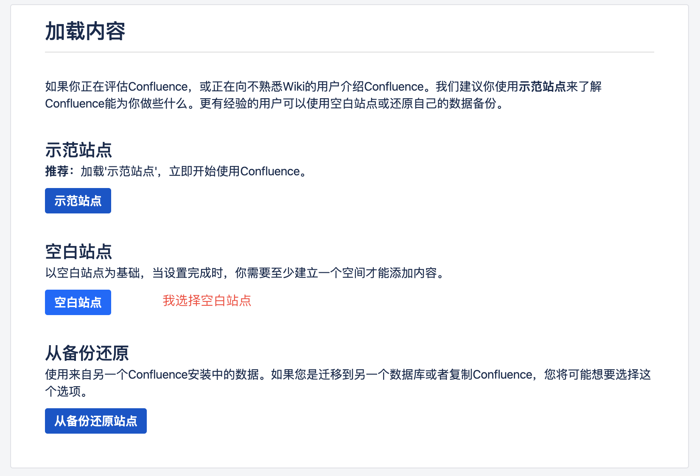

## Confluence 说明

### 一. 概述

Confluence是一个专业的企业知识管理与协同软件，也可以用于构建企业wiki。使用简单，但它强大的编辑和站点管理特征能够帮助团队成员之间共享信息、文档协作、集体讨论，信息推送。

### 二. 安装

1. 下载 confluence 镜像

```bash
docker pull cptactionhank/atlassian-confluence:7.3.2
```

2. 启动

```bash
docker run -d --name dante-wiki -p 8090:8090 -e CATALINA_OPTS="-Xms2048m -Xmx2048m" -v /Users/dante/Documents/Technique/Docker/volume/confluence:/var/atlassian/confluence cptactionhank/atlassian-confluence:7.3.2
```

3. 创建数据库

- 配置文件 my.cnf

```mysql
[client]
default-character-set = utf8mb4

[mysqld]
character-set-server = utf8mb4
collation-server = utf8mb4_general_ci
transaction-isolation = READ-COMMITTED
max_allowed_packet = 256M
innodb_log_file_size = 2G
```

- 创建数据库

```mysql
CREATE DATABASE wiki CHARACTER SET utf8mb4 COLLATE utf8mb4_bin;
```

4. 破解

访问 localhost:8090，进行设置


下载破解软件 https://pan.baidu.com/s/1i3qJlCGpelNsx6KRIcUniA 提取码: kpax

- 从容器中获取 atlassian-extras-decoder-v2-3.4.1.jar，并重命名为 atlassian-extras-2.4.jar

  ```bash
  docker cp dante-wiki:/opt/atlassian/confluence/confluence/WEB-INF/lib/atlassian-extras-decoder-v2-3.4.1.jar ./atlassian-extras-2.4.jar
  ```

- 运行破解程序 confluence_keygen.jar

  

  - Name、Email、Org 随便写
  - Server ID 填入之前记录的

- 点解".patch"，选择从docker container中复制出的 atlassian-extras-2.4.jar，会生成一个新jar，原来的会被备份atlassian-extras-2.4.jar.bak

- 输入Server ID，点解".gen"，生成注册码

- 复制atlassian-extras-2.4.jar到docker container中，然后重启容器

  ```bash
  $ docker cp ./atlassian-extras-2.4.jar dante-wiki:/opt/atlassian/confluence/confluence/WEB-INF/lib/atlassian-extras-decoder-v2-3.4.1.jar
  
  $ docker restart dante-wiki
  ```

- 填入注册码

- 设置数据库

  

  其中，因为mysql也是docker运行，confluence 可以通过 docker.for.mac.host.internal 来连接数据库。

  

  

  

   

  

### 三. 使用教程