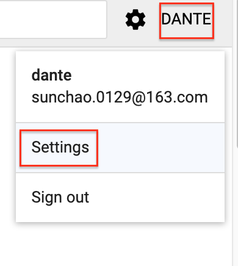
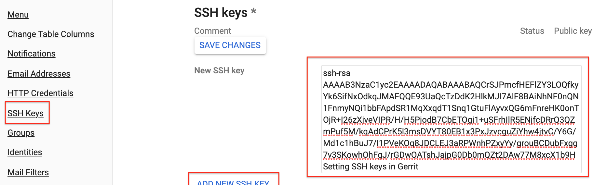
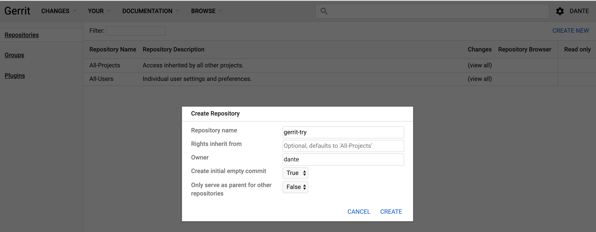
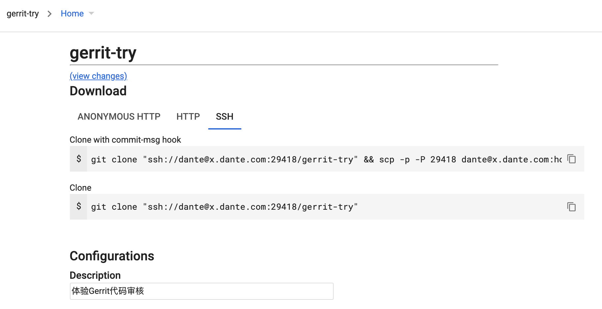

## Gerrit 指南

### 一. 概念

Gerrit实际上一个Git服务器，它为在其服务器上托管的Git仓库提供一系列权限控制，以及一个用来做Code Review是Web前台页面。当然，其主要功能就是用来做Code Review。

### 二. 安装

- 下载：https://gerrit-releases.storage.googleapis.com/index.html
- 初始化并启动

```bash
cd /Users/dante/Documents/Technique/Gerrit
java -jar gerrit-3.0.1.war init -d ./
```
执行过程
```bash
Using secure store: com.google.gerrit.server.securestore.DefaultSecureStore
[2019-08-18 14:17:45,132] [main] INFO  com.google.gerrit.server.config.GerritServerConfigProvider : No /Users/dante/Documents/Technique/Gerrit/etc/gerrit.config; assuming defaults

*** Gerrit Code Review 3.0.1
*** 


*** Git Repositories
*** 

Location of Git repositories   [git]: git-repo

*** Index
*** 

Type                           [lucene/?]: 

*** User Authentication
*** 

Authentication method          [openid/?]: http
Get username from custom HTTP header [y/N]? n
SSO logout URL                 : 
Enable signed push support     [y/N]? y

*** Review Labels
*** 

Install Verified label         [y/N]? 

*** Email Delivery
*** 

SMTP server hostname           [localhost]: 
SMTP server port               [(default)]: 
SMTP encryption                [none/?]: 
SMTP username                  : 

*** Container Process
*** 

Run as                         [dante]: 
Java runtime                   [/Library/Java/JavaVirtualMachines/jdk1.8.0_171.jdk/Contents/Home/jre]: 
Copy gerrit-3.0.1.war to bin/gerrit.war [Y/n]? 
Copying gerrit-3.0.1.war to bin/gerrit.war

*** SSH Daemon
*** 

Listen on address              [*]: x.dante.com
Listen on port                 [29418]: 
Generating SSH host key ... rsa... ed25519... ecdsa 256... ecdsa 384... ecdsa 521... done

*** HTTP Daemon
*** 

Behind reverse proxy           [y/N]? y
Proxy uses SSL (https://)      [y/N]? n
Subdirectory on proxy server   [/]: 
Listen on address              [*]: x.dante.com
Listen on port                 [8081]: 9000
Canonical URL                  [http://x.dante.com:9001/]: 

*** Cache
*** 


*** Plugins
*** 

Installing plugins.
Install plugin codemirror-editor version v3.0.1 [y/N]? y
Installed codemirror-editor v3.0.1
Install plugin commit-message-length-validator version v3.0.1 [y/N]? y
Installed commit-message-length-validator v3.0.1
Install plugin delete-project version v3.0.1 [y/N]? y
Installed delete-project v3.0.1
Install plugin download-commands version v3.0.1 [y/N]? y
Installed download-commands v3.0.1
Install plugin gitiles version v3.0.1 [y/N]? y
Installed gitiles v3.0.1
Install plugin hooks version v3.0.1 [y/N]? y
Installed hooks v3.0.1
Install plugin plugin-manager version v3.0.1 [y/N]? y
Installed plugin-manager v3.0.1
Install plugin replication version v3.0.1 [y/N]? y
Installed replication v3.0.1
Install plugin reviewnotes version v3.0.1 [y/N]? y
Installed reviewnotes v3.0.1
Install plugin singleusergroup version v3.0.1 [y/N]? y
Installed singleusergroup v3.0.1
Install plugin webhooks version v3.0.1 [y/N]? y
Installed webhooks v3.0.1
Initializing plugins.

Initialized /Users/dante/Documents/Technique/Gerrit
Reindexing projects:    100% (2/2) with: reindex --site-path  --threads 1 --index projects
Reindexed 2 documents in projects index in 0.2s (10.2/s)
```

启动：`./bin/gerrit.sh start`

- 配置，修改 /Users/dante/Documents/Technique/Gerrit/etc/gerrit.config

```ini
[gerrit]
	basePath = git-repo
	canonicalWebUrl = http://x.dante.com:9001/
	serverId = a307766b-07b9-46d9-97c9-d2348657fed4
[container]
	javaOptions = "-Dflogger.backend_factory=com.google.common.flogger.backend.log4j.Log4jBackendFactory#getInstance"
	javaOptions = "-Dflogger.logging_context=com.google.gerrit.server.logging.LoggingContext#getInstance"
	user = dante
	javaHome = /Library/Java/JavaVirtualMachines/jdk1.8.0_171.jdk/Contents/Home/jre
[index]
	type = LUCENE
[auth]
	type = HTTP
[receive]
	enableSignedPush = true
[sendemail]
	smtpServer = localhost
[sshd]
	listenAddress = x.dante.com:29418
[httpd]
	listenUrl = proxy-http://x.dante.com:9000/
[cache]
	directory = cache
```

- 配置 nginx 方向代理

  - 设置登录的用户名和密码

  ```bash
  ## 可以添加多个用户
  htpasswd -c /Users/dante/Documents/Technique/Gerrit/etc/gerrit.password dante
  ```
```
  
- 配置nginx反向代理
  
  ```nginx
  server {
       listen 9001;
       server_name x.dante.com;
       allow   all;
       deny    all;
  
       auth_basic "Welcomme to Gerrit Code Review Site!";
       auth_basic_user_file /Users/dante/Documents/Technique/Gerrit/etc/gerrit.password;
  
       location / {
          proxy_pass  http://x.dante.com:9000;
          proxy_set_header X-Forwarded-For $remote_addr;
          proxy_set_header Host $host;
       }
  }
```

- 设置Gerrit 755 权限
  
  ```bash
  chmod -R 755 /Users/dante/Documents/Technique/Gerrit
  ```

- 启动

  ```bash
  ## 启动 gerrit
  ./bin/gerrit.sh start
  ## 启动nginx
  nginx
  ```

### 三. 使用说明

#### 1. 访问登录

​	访问：http://x.dante.com:9001

#### 2. 添加SSH密钥到Gerrit账户

```bash
## 生成 ssh 密钥
ssh-keygen -t rsa -f ~/.ssh/gerrit_rsa -P '' -C "Setting SSH keys in Gerrit" 
ssh-add ~/.ssh/gerrit_rsa 
```

将公钥 gerrit_rsa.pub 添加到 Gerrit 服务器







#### 3. 创建 Git Repositories

- 创建Repositories



**仓库详情**



- git clone

```sh
git clone "ssh://dante@x.dante.com:29418/gerrit-try" && scp -p -P 29418 dante@x.dante.com:hooks/commit-msg "gerrit-try/.git/hooks/"
```

- 推送到 Geerit服务器

```sh
git add .
git commit -m "添加README.md"
## 推送前先更新主分支
git pull origin master
## 推送到 Gerrit 服务器
git push origin HEAD:refs/for/master
```

### 六. 参考资料

- https://www.gerritcodereview.com
- https://www.cnblogs.com/yinzhengjie/p/11007383.html
- https://blog.csdn.net/wild46cat/article/details/97838838

