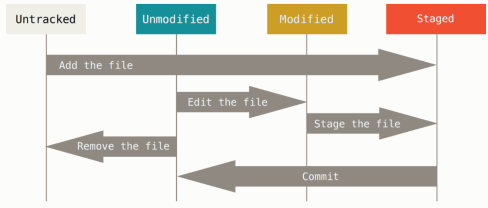

# Git

## 一、 简介

## 二、 安装

## 三、本地仓库

###1.创建本地仓库
```` shell
mkdir learngit  
cd learngit  
git init  
````

###2. 把文件添加到版本库
```` shell
touch readme.md  
git add .  
git commit -m "添加readme.md" 
````

###3. 基本操作

####生命周期



#### ***`git status`***  查看状态

工作目录下的每一个文件都不外乎这两种状态：已跟踪或未跟踪。

- **已跟踪**：被纳入了版本控制的文件，在上一次快照中有它们的记录，在工作一段时间后，它们的状态可能处于未修改，已修改或已放入暂存区。
- **未跟踪**：新增的文件。

```shell
bogon:git-world dante$ git status
On branch master
Your branch is up-to-date with 'origin/master'.
Changes not staged for commit:
  (use "git add <file>..." to update what will be committed)
  (use "git checkout -- <file>..." to discard changes in working directory)

	modified:   Hello.java

no changes added to commit (use "git add" and/or "git commit -a")
```

#### ***`git diff [fileName]`***  查看区别

```shell
bogon:git-world dante$ git diff Hello.java 
diff --git a/Hello.java b/Hello.java
index 5038cd6..d89a15e 100644
--- a/Hello.java
+++ b/Hello.java
@@ -1,5 +1,6 @@
 public class Hello {
        public static void main(String[] args) {
                System.out.println("Hello World!");
+               System.out.println("ni hao!");
        }
 }
```

#### ***`git log`***  提交记录

- ***git log -p -2***  显示每次提交的内容差异，-2 表示显示条数。

- ***git log --stat*** 显示提交的简略的统计信息。

- ***git log --pretty*** 指定使用不同于默认格式的方式展示提交历史。

```shell
  bogon:git-world dante$ git log --pretty=oneline -3
  3ba31c5cae9b1d42accdf467b3c1e74413209461 修改Hello.java
  cef96c291e39111220bbcca48aa87cfa65681caf del file_to
  6cd6e5f4fec258e11ea7da8009c8e79ba89ca1be mv file_from file_to

  bogon:git-world dante$ git log --pretty=format:"%h - %an, %ar : %s" -3
  3ba31c5 - dante, 14 hours ago : 修改Hello.java
  cef96c2 - dante, 14 hours ago : del file_to
  6cd6e5f - dante, 14 hours ago : mv file_from file_to
```

| 选项                    | 说明                                       |
| --------------------- | ---------------------------------------- |
| `-p`                  | 按补丁格式显示每个更新之间的差异。                        |
| `--stat`              | 显示每次更新的文件修改统计信息。                         |
| `--shortstat`         | 只显示 --stat 中最后的行数修改添加移除统计。               |
| `--name-only`         | 仅在提交信息后显示已修改的文件清单。                       |
| `--name-status`       | 显示新增、修改、删除的文件清单。                         |
| `--abbrev-commit`     | 仅显示 SHA-1 的前几个字符，而非所有的 40 个字符。           |
| `--relative-date`     | 使用较短的相对时间显示（比如，“2 weeks ago”）。           |
| `--graph`             | 显示 ASCII 图形表示的分支合并历史。                    |
| `--pretty`            | 使用其他格式显示历史提交信息。选项包括oneline，short，full，fuller 和 format |
| `-(n)`                | 仅显示最近的 n 条提交                             |
| `--since`, `--after`  | 仅显示指定时间之后的提交                             |
| `--until`, `--before` | 仅显示指定时间之前的提交                             |
| `--author`            | 仅显示指定作者相关的提交                             |
| `--committer`         | 仅显示指定提交者相关的提交                            |
| `--grep`              | 仅显示含指定关键字的提交                             |
| `-S`                  | 仅显示添加或移除了某个关键字的提交                        |
|                       |                                          |


#### **忽略文件** `.gitignore`

 一般我们总会有些文件无需纳入 Git 的管理，也不希望它们总出现在未跟踪文件列表。 通常都是些自动生成的文件，比如日志文件，或者编译过程中创建的临时文件等。 在这种情况下，我们可以创建一个名为 `.gitignore` 的文件，列出要忽略的文件模式。

文件 `.gitignore` 的格式规范如下

- 所有空行或者以 `＃` 开头的行都会被 Git 忽略。
- 可以使用标准的 glob 模式匹配。
- 匹配模式可以以（`/`）开头防止递归。
- 匹配模式可以以（`/`）结尾指定目录。
- 要忽略指定模式以外的文件或目录，可以在模式前加上惊叹号（`!`）取反。

```shell
# target目录
/target
# 所有的class文件
*.class
# ignore doc/notes.txt, but not doc/server/arch.txt
doc/*.txt
# ignore all .pdf files in the doc/ directory
doc/**/*.pdf
```

#### 重命名（移动文件）

````shell
git mv file_from file_to

等同于

mv file_from file_to
git rm file_from
git add file_to
````

#### 移除文件

要从 Git 中移除某个文件，就必须要从已跟踪文件清单中移除（确切地说，是从暂存区域移除），然后提交。

```shell
bogon:git-world dante$ touch del
bogon:git-world dante$ git add del 
bogon:git-world dante$ git status
On branch brt
Your branch is up-to-date with 'origin/brt'.
Changes to be committed:
  (use "git reset HEAD <file>..." to unstage)

	new file:   del

bogon:git-world dante$ rm del 
bogon:git-world dante$ git status
On branch brt
Your branch is up-to-date with 'origin/brt'.
Changes to be committed:
  (use "git reset HEAD <file>..." to unstage)

	new file:   del

Changes not staged for commit:
  (use "git add/rm <file>..." to update what will be committed)
  (use "git checkout -- <file>..." to discard changes in working directory)

	deleted:    del

bogon:git-world dante$ git rm del
rm 'del'
bogon:git-world dante$ git status
On branch brt
Your branch is up-to-date with 'origin/brt'.
nothing to commit, working tree clean
```

如果删除之前修改过并且已经放到暂存区域的话，则必须要用强制删除选项 `-f`（译注：即 force 的首字母）。

```shell
bogon:git-world dante$ touch del
bogon:git-world dante$ git add del 
bogon:git-world dante$ echo "hello" > del
bogon:git-world dante$ git rm del 
error: the following file has staged content different from both the
file and the HEAD:
    del
(use -f to force removal)
bogon:git-world dante$ git rm -f del 
```

文件从 Git 仓库中删除（亦即从暂存区域移除），但仍然希望保留在当前工作目录中。 换句话说，你想让文件保留在磁盘，但是并不想让 Git 继续跟踪。

```
$ git rm --cached README
```
#### 撤销提交

提交后发现忘记了暂存某些需要的修改，可以像下面这样操作：

```
$ git commit -m 'initial commit'
$ git add forgotten_file
$ git commit --amend
```

取消暂存

`*git reset HEAD <file>…*`

撤销对文件的提交

`*git checkout -- <file>…*`

- git reset

  `git reset --hard ` 把回退点之前的所有信息都删掉

  `git reset --soft` 指针指向回退的提交，修改信息还在

  `git reset --mixed `  指针指向回退的提交，修改的信息变成 untracking


#### 中文乱码处理

`git config --global core.quotepath false`

## 四、远程仓库

## 五、分支

	Git 的分支，其实本质上仅仅是指向提交对象的可变指针。 Git 的默认分支名字是 `master`。 在多次提交操作之后，你其实已经有一个指向最后那个提交对象的 `master` 分支。 它会在每次的提交操作中自动向前移动。
	
	Git 的分支实质上仅是包含所指对象校验和（长度为 40 的 SHA-1 值字符串）的文件，所以它的创建和销毁都异常高效。 创建一个新分支就相当于往一个文件中写入 41 个字节（40 个字符和 1 个换行符）

`master`分支是一条线，Git用`master`指向最新的提交，再用`HEAD`指向`master`，就能确定当前分支，以及当前分支的提交点

```shell
查看分支：git branch

创建分支：git branch <name>

切换分支：git checkout <name>

创建+切换分支：git checkout -b <name>

合并某分支到当前分支：
git checkout <curBranch>
git merge <name>

删除分支：git branch -d <name>
```

#### BUG分支

	**master合并merge解决好的bug后，不要先把dev解印，先合并master，获取里面的bug方案后，在解印。解印时会有提示冲突，需手动改一次文件。**

1：在  dev 下正常开发中，说有1个bug要解决，首先我需要把dev分支封存stash

2：在master下新建一个issue-101分支，解决bug，成功后

3：在master下合并issue-101

4：在 dev  下合并master，  这样才同步了里面的bug解决方案

5：解开dev封印stash pop，系统自动合并 & 提示有冲突，因为封存前dev写了东西，此时去文件里手动改冲突

6：继续开发dev，最后add，commit

7：在master下合并最后完成的dev

```shell
1： $ git stash

2： $ git checkout master
   $ git checkout -b issue-101
    //去文件里修bug
    $ git add README.md
    $ git commit -m "fix-issue-101"

3： $ git checkout master
   $ git merge --no-ff -m "m-merge-issue-101" issue-101
   $ git branch -d issue-101

4： $ git checkout dev
    $ git merge --no-ff -m "dev-merge-m" master

5： $ git stash pop
            //提示冲突，去文件手动改正
            Auto-merging README.md
            CONFLICT (content): Merge conflict in README.md

6： //继续开发 ... ... ，完成后一并提交
    $ git add README.md
    $ git commit -m "fixconflict & append something"

7： $ git checkout master
    $ git merge --no-ff -m "m-merge-dev" dev
    $ git branch -d dev
```

#### Feature分支

每添加一个新功能，最好新建一个feature分支，在上面开发，完成后，合并，最后，删除该feature分支。

```shell
1. 创建apt分支
git checkout -b feature-apt

2. 完成分支修改
git add apt.java
git commit -m "添加机场功能"

3. 合并功能到dev分支
git checkout dev
git merge feature-apt

4. 删除apt分支
git branch -d feature-apt
```

#### 跟踪分支

从一个远程跟踪分支检出一个本地分支会自动创建一个叫做 “跟踪分支”。

创建本地跟踪分支：

`git checkout -b [localbranch] [remotename]/[branch]`

#### 同步远程仓库

1、抓取远程仓库数据、合并本地

	`git fetch`  从服务器上抓取本地没有的数据时，它并不会修改工作目录中的内容。
	
	`git merge`  合并远程分支的内容

2、使用`git pull` 

#### 删除远程分支

`git push origin --delete brt2`

#### 变基和合并（rebase、merge）

待续？？？

#### 本地仓库和远程仓库建立连接

```shell
git remote add origin <你的远程仓库>
git push -u origin master

## 已有的本地分支，推送到远程仓库
git checkout <本地分支>
git push origin <本地分支>
```

#### 多人开发
```
工作模式：
1. 首先，可以试图用git push origin branch-name推送自己的修改；
2. 如果推送失败，则因为远程分支比你的本地更新，需要先用git pull试图合并；
3. 如果合并有冲突，则解决冲突，并在本地提交；
4. 没有冲突或者解决掉冲突后，再用git push origin branch-name推送就能成功！

如果git pull提示“no tracking information”，则说明本地分支和远程分支的链接关系没有创建，用命令git branch --set-upstream branch-name origin/branch-name。
```

#### 已经提交的commit, 从一个分支放到另一个分支

```shell
git cherry-pick <commit_id>

git checkout uat
git cherry-pick 8d85d4bc

有冲突 -> 解决冲突

git add .
git commit 
git push

```

#### 常用操作

```powershell
error: Your local changes to 'c/environ.c' would be overwritten by merge.  Aborting.
Please, commit your changes or stash them before you can merge.
更新下来的内容和本地修改的内容有冲突，先提交你的改变或者先将本地修改暂时存储起来

## 先将本地修改存储起来，用git stash list可以看到保存的信息
git stash
## 更新
git pull
## 还原暂存的内容 git stash pop stash@{0}, 通过 git stash list 查看
git stash pop
## 系统自动合并修改的内容，但是其中有冲突，需要解决其中的冲突。
git diff -w 冲突文件

++<<<<<<< Updated upstream
++=======
+               and tag_code = '1'
++>>>>>>> Stashed changes

1. Updated upstream 和=====之间的内容就是pull下来的内容
2. ====和stashed changes 本地修改的内容
```

## 六. git rebase

git rebase 和 git merge 都是用来合并分支。

- git merge：提交历史也被合并
- git rebase：提交历史不被合并，此命令会把分支 v1 中的commit都取消掉，并且把它们临时保存为补丁(patch)(这些补丁放到".git/rebase"目录中)，将分支更新为最新的 origin，最后把保存的这些补丁应用到 v1 分支上。
- git log --pretty 可以比较两个命令的区别

**解决冲突**

	在rebase的过程中，也许会出现冲突(conflict). 在这种情况，Git会停止rebase并会让你去解决 冲突；在解决完冲突后，用"git-add"命令去更新这些内容的索引(index), 然后，你无需执行 git-commit,只要执行:
	
	`$ git rebase --continue`
	
	这样git会继续应用(apply)余下的补丁。在任何时候，你可以用--abort参数来终止rebase的行动，并且"mywork" 分支会回到rebase开始前的状态。
	
	`$ git rebase --abort`

## 七、错误积累

#### 1. you need to resolve your current index first 解决办法

http://blog.csdn.net/wenwenxiong/article/details/47813277

merge失败，有conflicts没解决，可以：

1、解决conflicts后再次执行merge；

2、回退到merge前，使用  `git reset --merge`。


## 八. 标签

	发布一个版本时，先在版本库中打一个标签，将来无论什么时候，取某个标签的版本，就是把那个打标签的时刻的历史版本取出来。
	
	Git的标签虽然是版本库的快照，但其实它就是指向某个commit的指针。（跟分支很像对不对？但是分支可以移动，标签不能移动）

```shell
1、创建分支
git tag -a [tagName] -m "标签说明"

2、推送远程
git push origin [tagName]
## 推送全部
git push origin --tags

3、删除远程标签
## 删除本地
git tag -d [tagName]
## 推送远程删除
git push origin :refs/tags/[tagName]
```

## 参考资料

- http://gitbook.liuhui998.com/
- http://blog.csdn.net/wh_19910525/article/details/7554489
- http://www.01happy.com/git-resolve-conflicts/
- https://www.cnblogs.com/williamjie/p/9145570.html （Github多帐号）