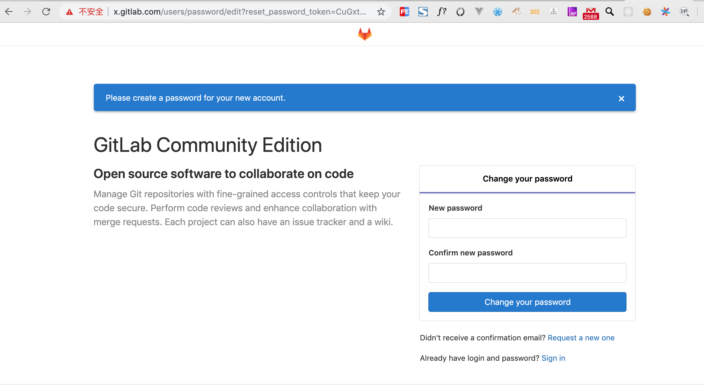
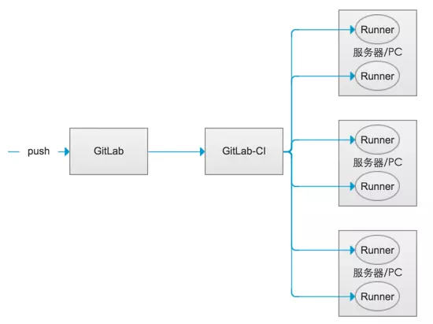

## Gitlab CI

### 一. 安装 Gitlab

- 下载 docker image

```bash
docker pull gitlab/gitlab-ce:nightly
```

- 使用 docker-compose 启动

```yaml
web:
  image: 'gitlab/gitlab-ce:nightly'
  restart: always
  hostname: 'x.gitlab.com'
  environment:
    GITLAB_OMNIBUS_CONFIG: |
      letsencrypt['enable'] = false
      external_url 'https://x.gitlab.com'
  ports:
    - '7480:80'
    - '443:443'
    - '7422:22'
  volumes:
    - '/Users/dante/Documents/Technique/Docker/volume/gitlab/config:/etc/gitlab'
    - '/Users/dante/Documents/Technique/Docker/volume/gitlab/data:/var/opt/gitlab'
    # - '/Users/dante/Documents/Technique/Docker/volume/gitlab/logs:/var/log/gitlab'
```

注意：需要在 /etc/gitlab 下创建 ssl 目录，然后在 ssl 目录下生成 **x.gitlab.com.crt 和 x.gitlab.com.key**。

- 访问方式 

  第一次设置 root 用户的初始密码。



- git clone https

  ```sh
  git config --global http.sslverify "false"
  ```

### 二. GitLab CI

​		GitLab CI 是 GitLab 默认集成的 CI 功能，GitLab CI 通过在项目内 .gitlab-ci.yaml 配置文件读取 CI 任务并进行相应处理；GitLab CI 通过其称为 GitLab Runner 的 Agent 端进行 build 操作；Runner 本身可以使用多种方式安装，比如使用 Docker 镜像启动等；Runner 在进行 build 操作时也可以选择多种 build 环境提供者；比如直接在 Runner 所在宿主机 build、通过新创建虚拟机(vmware、virtualbox)进行 build等；同时 Runner 支持 Docker 作为 build 提供者，即每次 build 新启动容器进行 build；Runner可以分布在不同的主机上，同一个主机上也可以有多个Runner。GitLab CI 其大致架构如下



- 启动 gitlab-runner

```sh
## docker
docker run -d --name dante-gitlab-runner  \
  -v /var/run/docker.sock:/var/run/docker.sock \
  -v /Users/dante/Documents/Technique/Docker/volume/gitlab/runner:/etc/gitlab-runner \
  gitlab/gitlab-runner:bleeding
  
## podman 
docker run -d --name dante-gitlab-runner  \
  -v /run/podman/podman.sock:/var/run/docker.sock \
  -v /Users/dante/Documents/Technique/Docker/volume/gitlab/runner:/etc/gitlab-runner \
  gitlab/gitlab-runner:bleeding
```

- 向 gitlab server 注册 runner

  ```sh
  ## 方式一
  docker exec -it dante-gitlab-runner gitlab-runner register
  
  ## 方式二
  curl --request POST -k "https://x.dante.com/api/v4/runners" \
       --form "token=5WxqSWASMN_MFp17NZxQ" --form "description=Risun-Java-Runner" \
       --form "tag_list=risun"
  ```
  
  注意：在 dante-gitlab-runner 中的 /etc/hosts 下，添加 `本机IP  x.dante.com`