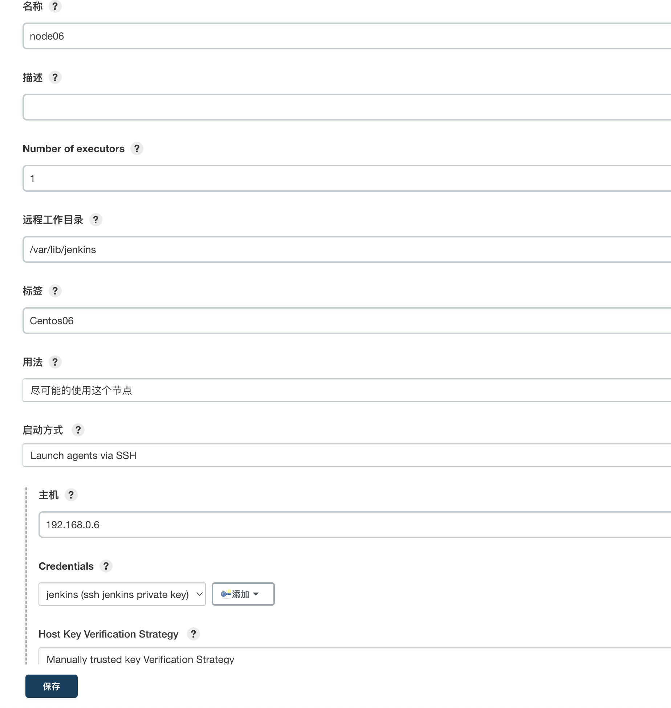
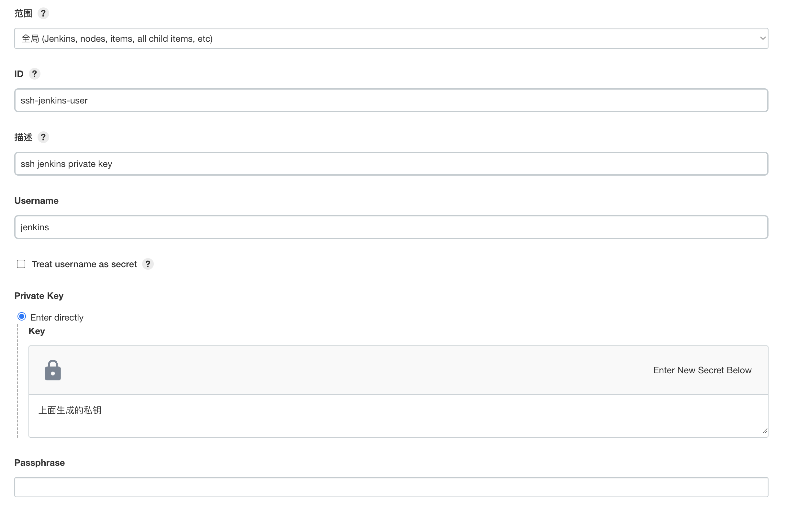
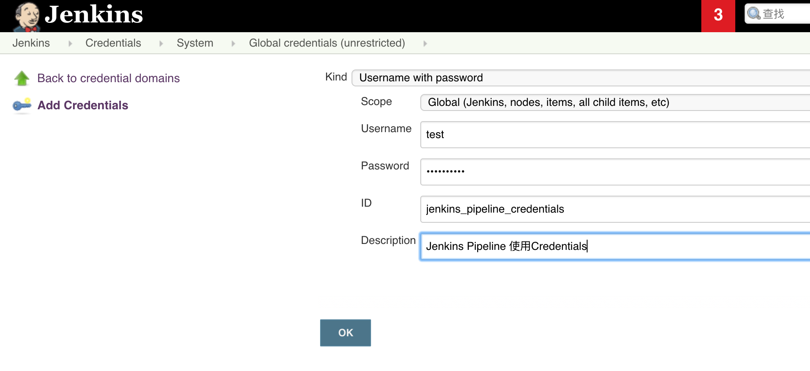
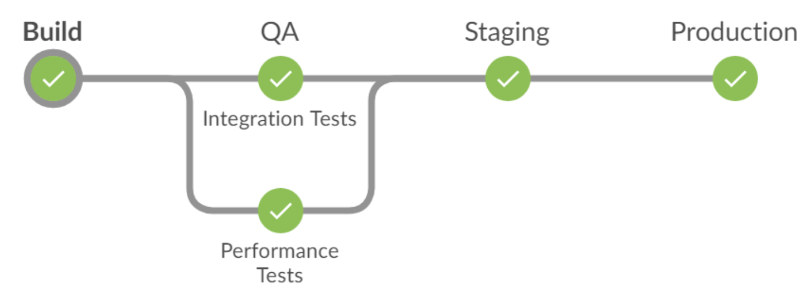
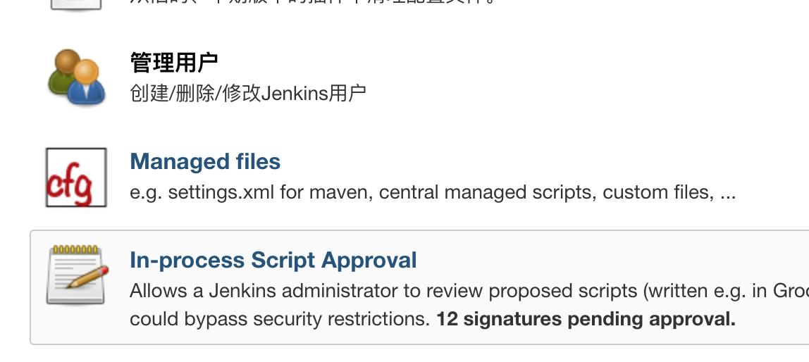
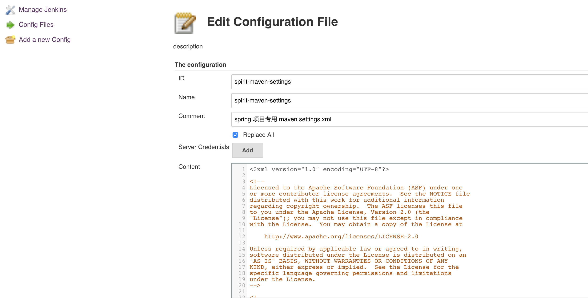

## Jenkins说明

### 一. 启动

**直接启动**

*java  -jar jenkins.war*

**修改端口**

*java -jar jenkins.war --ajp13Port=-1 --httpPort=8089*	

**后台启动**	

*nohup java -jar jenkins.war &*	

### 二. 通知构建

**Jenkins**

构建触发器 -> 触发远程构建，设置Token，例如Token=123456，记住下面的地址

`JENKINS_URL/job/git-test/build?token=123456`

**Github、Gitlab 下**

repository -> Settings -> webhooks -> Add Webhook

```markdown
[Payload URL]

http://<jenkinsuser>:<jenkinsuser-api-token>@JENKINS_URL/job/git-test/build?token=123456
```

**备注**

Jenkins错误：No valid crumb was included in the request

分析：

```
jenkins在http请求头部中放置了一个名为.crumb的token。在使用了反向代理，并且在jenkins设置中勾选了“防止跨站点请求伪造（Prevent Cross Site Request Forgery exploits）”之后此token会被转发服务器apache/nginx认为是不合法头部而去掉。导致跳转失败。
```

处理：

```xml
1.在apache/nginx中设置ignore_invalid_headers。
2.在jenkins全局安全设置中取消勾选“防止跨站点请求伪造（Prevent Cross Site Request Forgery exploits）”。
```

### 三. 问题积累

#### 1. Jenkins中pipeline后台进程起不来的问题

https://blog.csdn.net/catoop/article/details/79637311

```sh
直接使用以前的方法（修改BUILD_ID），对于pipeline来说是没有效果的，现在你可以使用修改 JENKINS_NODE_COOKIE 的值来解决问题，这样后续结束的时候，后面的sh程序就不会被kill掉了。 
如下示例代码，是我的某个pipeline脚本片段：

......
stage('发布') {
    ansiColor('xterm') {
        sh "mkdir -p ${deploy_package_path}"
        sh "\\cp -Rf ${workspace_package_path} ${deploy_package_path}"
        // 停止Tomcat
        sh "${tomcat_home}/${JOB_NAME}/bin/kill.sh"
        // 启动Tomcat
        sh "JENKINS_NODE_COOKIE=dontKillMe ${tomcat_home}/${JOB_NAME}/bin/startup.sh"
        println("发布并重启Tomcat完成");
    }
}
```

#### 2. Groovy 脚本方法被限制

```groovy
import java.util.*;
import java.text.SimpleDateFormat;
def today()
{
    String str = "";
    SimpleDateFormat sdf = new SimpleDateFormat("yyyyMMdHHmmss");
    Calendar lastDate = Calendar.getInstance();
    lastDate.add(Calendar.MINUTE, 2);
    str = sdf.format(lastDate.getTime());
    return str;
}
def  dateNew = today()
node {
    stage('变量') {
        echo "Hello World - $dateNew - $BUILD_ID - $currentBuild.timeInMillis"
        echo "$currentBuild.durationString"
    }
}
```

https://stackoverflow.com/questions/38276341/jenkins-ci-pipeline-scripts-not-permitted-to-use-method-groovy-lang-groovyobject

- 方式一：http://<JENKINS_URL>/scriptApproval/，逐个授权。

- 方式二：去掉 Use Groovy Sandbox 的 Checkbox。（推荐）

- 方式三：

  1.安装插件： Permissive Script Security

  2.启动参数中禁止 script security，-Dpermissive-script-security.enabled=true。

```xml
<!-- jenkins.xml 中的配置如下 -->
<executable>..bin\java</executable>
<arguments>-Dpermissive-script-security.enabled=true -Xrs -Xmx4096m -Dhudson.lifecycle=hudson.lifecycle.WindowsServiceLifecycle -jar "%BASE%\jenkins.war" --httpPort=80 --webroot="%BASE%\war"</arguments>
```

#### 3. 添加Node

##### （1）Linux

​	Jenkins Node 代理服务器

 - 使用root用户，登录代理服务器（node节点）

 - 安装JDK

 - 创建用户

   在代理Node上创建一个用户。 Jenkins master 将以该用户身份登录代理，所有构建作业都将以该用户身份执行。 新用户将被称为 jenkins，并以 /var/lib/jenkins 作为主目录

   ```shell
   # sudo useradd -d /var/lib/jenkins jenkins
   # passwd jenkins
   ```

 - 生成 ssh key

   生成一个 ssh 密钥。 Jenkins 将使用此密钥向代理节点进行身份验证，并以 jenkins 用户身份登录。 该密钥几乎可以在任何 Linux 机器上生成，但您也可以在代理节点本身上生成并将其复制到新的代理节点。

   ```shell
   # su - jenkins
   # ssh-keygen -t rsa -C "Jenkins agent key"
   
   ## 将公共 SSH 密钥 id_rsa.pub 添加到授权密钥文件列表中
   # cat ~/.ssh/id_rsa.pub >> ~/.ssh/authorized_keys
   # chmod 600 ~/.ssh/authorized_keys
   ```

   **注意：私钥 id_rsa 后面要用到**

​	Jenkins Master 服务器

 - 添加node

   

 - 设置 Credentials

   

##### （2）Windows

 - 全局安全配置下，代理-**TCP port for inbound agents**，指定端口要放开
 - Windows 下，在Jenkins工作目录下，创建 slave_node文件夹
   - 将 agent.jar 放到这个目录
   - 编写启动bat

```powershell
@echo off
%1 mshta vbscript:CreateObject("WScript.Shell").Run("%~s0 ::",0,FALSE)(window.close)&&exit
java -jar agent.jar -jnlpUrl http://192.168.0.7:9000/computer/WindowTest/jenkins-agent.jnlp -secret 6fb2f9fbc7ea090f33f5475a7a55eafa62f4437d408597305b70efe93ec1aaad -workDir "C:\jenkins" > ./slave.log 2>&1 &
exit
```

### 四. Pipeline 

#### 1. Credentials

- 创建 Credentials



- Pipeline 中使用Username 和 Password

```groovy
withCredentials([usernamePassword(credentialsId: 'jenkins_pipeline_credentials', passwordVariable: 'usrname', usernameVariable: 'usrpwd')]) {
    sh "docker login xx.harbor.com -u ${usrname} -p ${usrpwd}"
}
```

#### 2. Lock & Milestone

- **流程**

  

  上图是一个典型的构建流水线，Build Stage 包括拉取代码、单元测试、代码扫描；QA Stage 包括集成测试和性能测试；Staging Stage 获取构建产物，在 Staging 环境进行部署；Production Stage 从 Staging 获取构建产物，在 Production 环境进行部署。

- **问题**

  每个 Staging 耗时不同，Build（3分钟）、QA（15分钟），Staging 和 Production （只有一个环境，必须确保同一时刻只能有一个构建进入此Staging）

  因此，10个程序员提交代码，会触发10次并行构建，全部进入Build Staging，到了 QA Staging，由于耗时过长，10个构建开始进入构建队列排队，应该只让最新构建进入QA，丢弃其他排队的构建。同理 Staging 和 Production Stage。

- **解决**

  通过使用 Lock 和 Milestone 进行处理。

  - lock — 通过Lock resource，可以锁定当前 Stage，限制构建并发数。
  - milestone — 通过 milestone，可以自动丢弃被最新构建取代的构建。

  **先安装Jenkins插件 Lockable Resources plugin**

  ```groovy
  stage('Build') {
    node {
      echo '构建开始... [编译、单元测试、代码分析]'
      sleep 5
      echo '构建完成！[为了下一阶段，存储构建产物，例如：war上传nexus]'
    }
  }
  
  // milestone 用于丢弃过时的构建
  // 如果是连续的build通过一个milestone，它将丢弃所有还没有通过milestone的旧版本构建
  milestone label: 'Build', ordinal: 1
  
  stage('QA') {
      // 通过 lock 进行并发限制，若另一个构建到达 lock，它将等待到资源再次可用。
      // inversePrecedence = true，说明 Lock 选择最新的构建进行
      lock(resource: 'qaEnvironment', inversePrecedence: true) {
          // milestone 结合 lock，就可以丢弃所有排队队列中的构建，只保留最新的一个
          milestone label: 'QA', ordinal: 2
          parallel("Integration Tests": {
            node {
              echo 'Running integration tests...'
              sleep 5
              echo 'Running integration tests finished'
            }
          }, "Performance Tests": {
              echo 'Running performance tests...'
              sleep 10
              echo 'Running performance tests finished'
          })
      }
  }
  
  milestone label: 'Begin to Staging', ordinal: 3
  stage('Staging') {
    lock(resource: 'stagingEnvironment', inversePrecedence: true) {
      milestone label: 'Staging', ordinal: 4
      node {
        echo 'Deployment to staging environment...'
        sleep 5
        echo 'Deployment to staging environment finished'
      }
      input message: 'Deploy to production?'
    }
  }
  
  milestone label: 'Begin to Production', ordinal: 5
  stage ('Production') {
    lock(resource: 'productionEnvironment', inversePrecedence: true) {
      node {
        echo 'Deployment to production environment...'
        sleep 5
        echo 'Deployment to production environment finished'
      }
    }
  }
  ```

参考：

https://www.lars-berning.de/implementing-a-devops-pipeline-in-jenkins-with-concurrent-builds/

https://jenkins.io/blog/2016/10/16/stage-lock-milestone/

#### 3. Config File Provider

通过 Jenkins插件 Config File Provider，可以将各类运行时的配置文件管理起来，例如: Maven Settings.xml、Npm config file 等。

- 安装 jenkins 插件 Config File Provider

- 创建配置文件

  1) 进入系统管理 ==> Managed files

  

2)  创建 Config

​	将自己 settings.xml 的内容粘到 Content 中。



3) 在jenkins pipeline中的应用

```groovy
node {
   stage('SourceCode') {
       checkout([$class: 'GitSCM', branches: [[name: '*/master']], doGenerateSubmoduleConfigurations: false, extensions: [], submoduleCfg: [], userRemoteConfigs: [[url: 'https://github.com/dante7qx/caas-tomcat']]])
   }
   stage('mvn-configfile') {
       configFileProvider([configFile(fileId: 'spirit-maven-settings', variable: 'MAVEN_GLOBAL_SETTINGS')]) {
           sh """
           mvn -gs $MAVEN_GLOBAL_SETTINGS clean install -Dmaven.test.skip=true
           """
       }
   }
   stage('cleanWs') {
       cleanWs()
   }
}
```

参考：

https://shekhargulati.com/2019/02/09/using-jenkins-config-file-provider-plugin-to-allow-jenkins-slave-to-access-mavens-global-settings-xml/

### 五. 坑

参考 https://testerhome.com/topics/10328

### 六. 参考资料

- https://www.w3cschool.cn/jenkins/
- https://www.xncoding.com/2017/03/22/fullstack/jenkins02.html
- https://updates.jenkins-ci.org/download/plugins/（插件下载）
- https://www.cnblogs.com/h--d/p/11186529.html（启动设置）
