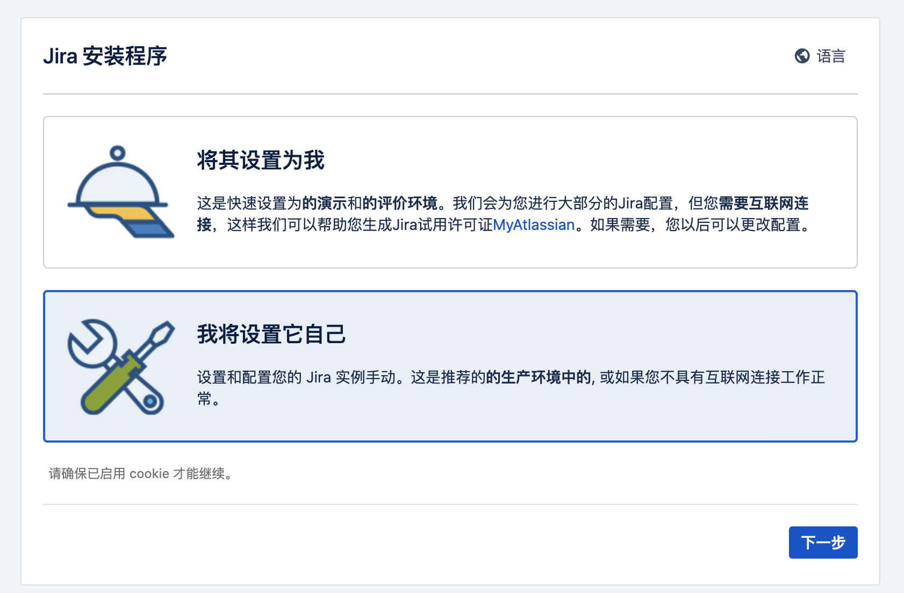
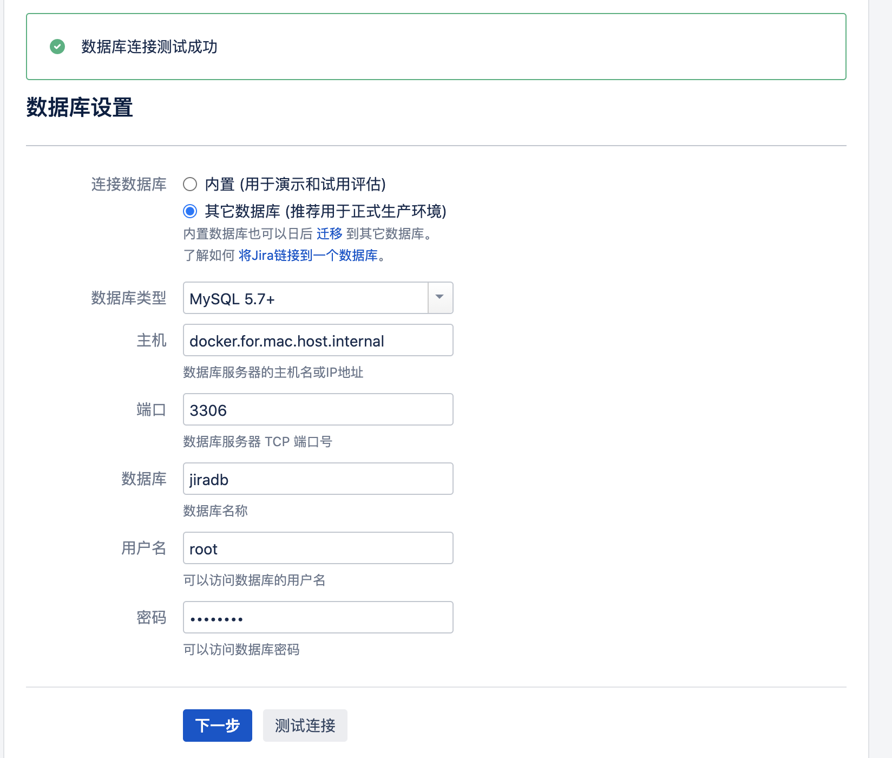
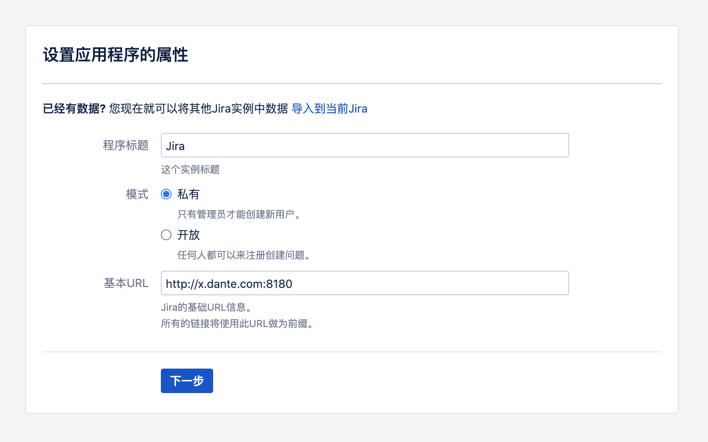
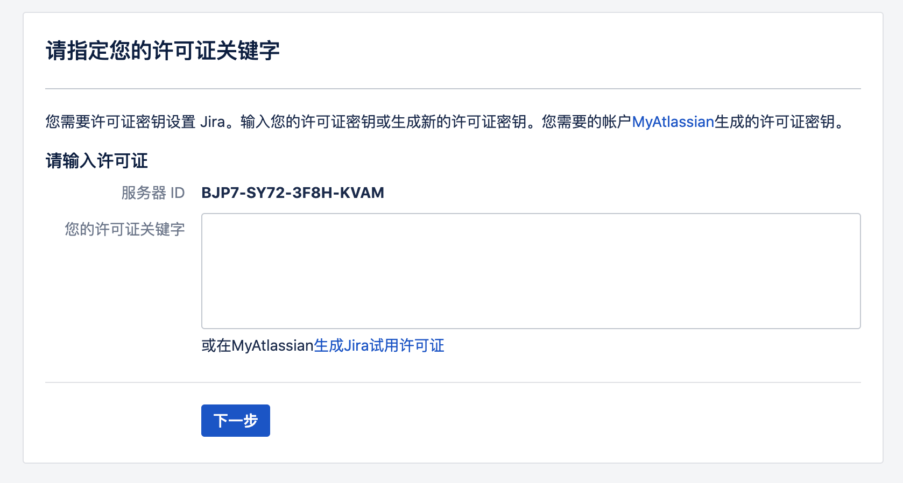
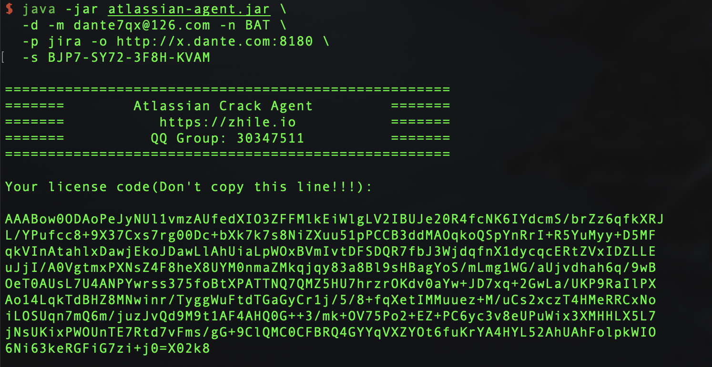
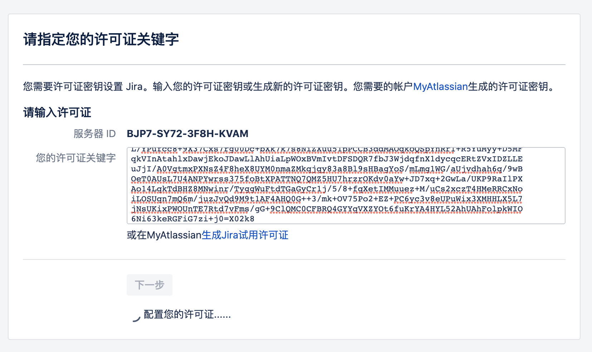
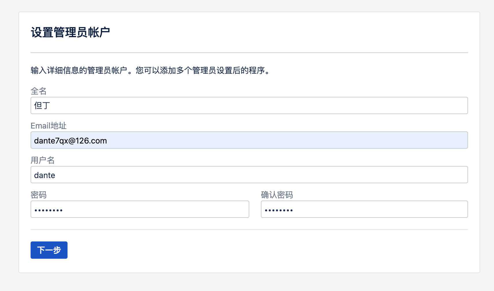
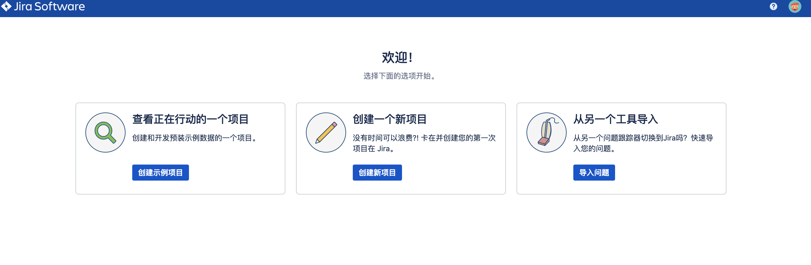

## Jira 使用说明

### 一. 安装

1. 下载

```bash
## 1. 下载 jira 的镜像
docker pull atlassian/jira-software:8.0.0

## 2. 下载破解插件
https://gitee.com/pengzhile/atlassian-agent/releases
```

2. 启动 Jira

```shell
docker run -d --name dante-jira \
 -p 8180:8080 \
 -e CATALINA_OPTS="-javaagent:/opt/atlassian/jira/atlassian-agent.jar ${CATALINA_OPTS}" \
 -e TZ="Asia/Shanghai" \
 -v /Users/dante/Documents/Technique/Docker/volume/jira/crack/atlassian-agent.jar:/opt/atlassian/jira/atlassian-agent.jar \
 -v /Users/dante/Documents/Technique/Docker/volume/jira/crack/mysql-connector-java-5.1.47.jar:/opt/atlassian/jira/lib/mysql-connector-java-5.1.47.jar \
 -v /Users/dante/Documents/Technique/Docker/volume/jira/data:/var/atlassian/jira \
 atlassian/jira-software:8.0.0
```

3. 设置Jira



- 设置数据库

```sql
CREATE DATABASE jiradb CHARACTER SET utf8mb4 COLLATE utf8mb4_bin;
```





- 生成破解密钥



1) 复制服务器ID **BJP7-SY72-3F8H-KVAM**

2) 通过atlassian-agent.jar 生成许可证

```bash
java -jar atlassian-agent.jar \
  -d -m dante7qx@126.com -n BAT \
  -p jira -o http://x.dante.com:8180 \
  -s BJP7-SY72-3F8H-KVAM
```



3) 填入许可证进行验证



- 设置管理员



- 完成



### 二. 使用说明


### 五. 参考资料

- https://blog.51cto.com/wzlinux/2494063
- https://zhangguanzhang.github.io/2019/02/19/jira-confluence/