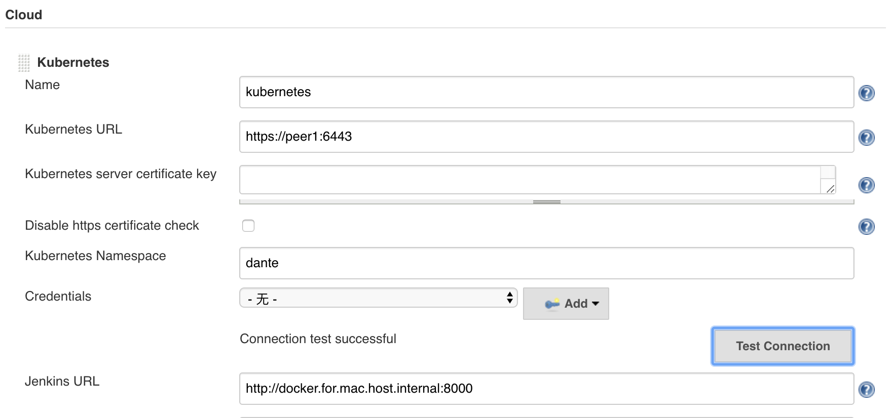

## k8s - Jenkins

### 一. 概述

传统 Jenkins 的 Master、Slave方式存在一定的问题。

1. Master 挂了，整体不可用；
2. 不同的 Slave 中环境各不相同，不易于维护；
3. 资源分配不均，有的 Slave 上 Job 在排队，有的 Slave 处于空闲状态；
4. 资源浪费，因为 Slave 运行在虚拟机上，空闲的 Slave 不会完全释放资源。

所以，需要一种机制，能够动态的创建 Slave，当 Job 运行结束后，Slave 能够及时的被回收。**jenkins-kubernetes-plugin** 为每一 agent 创建一个 Pod，使用 Jnlp 方式启动，自动的和 Jenkins master 建立连接。其中 Jenkins master 不是必须运行在 k8s 集群上的。

### 二. 安装及配置

1. 安装 jenkins master server

   待续

2. 安装 kubernetes 插件


3. 配置

   系统设置 ——> Cloud（Add a new cloud）。



**配置证书**：（https://blog.csdn.net/diantun00/article/details/81180694）

1. 查看 Kubernetes的配置文件 即 /etc/kubernetes/admin.conf

   文件中有三个值 certificate-authority-data 、client-certificate-data 、 client-key-data 

   解码它们获得证书 ，注意将上面的值替换称自己的一大长传字符串

   ```bash
   echo certificate-authority-data | base64 -d > ca.crt
   echo client-certificate-data | base64 -d > client.crt
   echo client-key-data | base64 -d > client.key
   ```

2. 根据这三个文件生成一个PKCS12格式的客户端证书文件，注意生成证书的时候，一定要填写密码，后面会用到。

   ```bash
   openssl pkcs12 -export -out cert.pfx -inkey client.key -in client.crt -certfile ca.crt
   ```

### 三. 实际案例

```yacas
def label = "hello-k8s-plugin"
podTemplate(label: label, cloud: 'kubernetes', containers: [
    containerTemplate(name: 'jnlp', image: 'jenkins/jnlp-slave:alpine', args: '${computer.jnlpmac} ${computer.name}'),
    containerTemplate(name: 'java6', image: 'java:6', ttyEnabled: true, command: 'cat'),
    containerTemplate(name: 'java8', image: 'java:8', ttyEnabled: true, command: 'cat'),
    containerTemplate(name: 'maven', image: 'maven:3.5-jdk-8', ttyEnabled: true, command: 'cat')
]) {
    node(label) {
        stage('Run shell') {
            sh 'echo hello world'
        }
        stage('Java') {
            sh "echo $PATH"
            container('java6') {
                stage('Compile 6') {
                    sh """
                    java -version
                    """
                }
            }
            
            container('java8') {
                stage('Compile 8') {
                    sh """
                    java -version
                    """
                }
            }
        }
        stage("Package") {
            sleep 5
            container('maven') {
                stage('maven') {
                    sh """
                    mvn -v
                    """
                }
            }
        }
    }
}
```

### 四. 使用问题

#### 1. Node 内存不足

k8s jenkins plugin 没有设置Pod资源的默认配置，而 k8s 默认情况下 Pod 会以无限制的 CPU 和 内存运行。即计算节点 Node 上有多少可用 CPU、内存，Node 上的 Pod 就会去占用，导致 Node 资源不足。

**解决：** 为每个容器配置 resourceRequestCpu、resourceLimitCpu、resourceRequestMemory、resourceLimitMemory。

#### 2. Java进程被杀

两个原因，1) node out of memory; 2) cgroup processes exceed their memory limit.

容器使用 cgroups 来让一个进程中的资源（CPU，内存，文件系统，网络等）与另一个进程中的资源完全隔离。

然而，一些应用程序已经在 cgroups 存在之前就被执行了，例如：“top”，“free”，“ps”，甚至 JVM 等工具都**没有针对在容器内执行高度受限的 Linux 进程进行优化。**其中 JVM 最大Heap内存 = 物理内存的1/4，所以

docker宿主机内存：8G，Java 容器的内存：800M，JVM 运行分配内存最大是2G，当JVM 运行分配内存超过800M时，超出了限制（cgroups限制），该进程被杀掉。

**解决：**根据应用程序需求和容器限制设置最大堆大小（-Xmx参数）设置 JVM 的参数，例如

```properties
JAVA_OPTS=-Xms256m -Xmx768m -XX:PermSize=128m -XX:MaxPermSize=256m
MAVEN_OPTS=-Xms256m -Xmx768m -XX:PermSize=128m -XX:MaxPermSize=256m

## Jdk 8，MetaspaceSize 说明 https://www.jianshu.com/p/b448c21d2e71
-XX:PermSize=128m    修改为  -XX:MetaspaceSize=128m
-XX:MaxPermSize=256m 修改为  -XX:MaxMetaspaceSize=256m
```

参考：

- https://blog.csdn.net/qq_19674905/article/details/80927893
- http://www.cnblogs.com/shengulong/p/8318802.html
- https://blogs.oracle.com/java-platform-group/java-se-support-for-docker-cpu-and-memory-limits
- https://www.jianshu.com/p/548a6804cb72

### 五. 参考资料

- <https://github.com/jenkinsci/kubernetes-plugin>
- https://blog.csdn.net/felix_yujing/article/details/78725142