## Nexus 说明

### 一. 介绍

	Maven本身自带一个本地仓库；然后它又为全世界的Java开发者提供了一个免费的“中央仓库”，在其中几乎可以找到任何流行的开源类库；由于中央仓库是在外网中的，如果没有私服（Nexus），本地仓库就会频繁地与中央仓库即互联网打交道，这样效率很低，所以在两者之间衍生出了一个“私服——Nexus”，私服存在于局域网中，这样本地仓库就不用频繁地与外网中的中央仓库交互，所以效率就会大大提高。

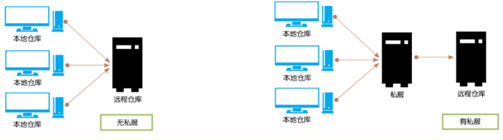

### 二. 安装

1. 下载nexus([http://www.sonatype.com/download-oss-sonatype](http://www.sonatype.com/download-oss-sonatype)) 最新版本nexus-3.3.1-01-mac.tgz

```shell
## 使用Docker, 参考 https://hub.docker.com/r/sonatype/nexus
docker run -d -p 8081:8081 --name dante-nexus -v /Users/dante/Documents/Technique/Docker/volume/nexus:/sonatype-work sonatype/nexus

## 访问 http://localhost:8081/nexus   默认：admin/admin123
```

2. 解压到 /Users/dante/Documents/Technique/Maven/Nexus/nexus-3.3.1-01-mac

3. 配置修改

***nexus-3.3.1-01/bin/nexus***

```sh
设置nexus 安装的根路径设置nexus 安装的根路径
NEXUS_HOME="/Users/dante/Documents/Technique/Maven/Nexus/nexus-3.3.1-01-mac/nexus-3.3.1-01";
```

***nexus-3.3.1-01/bin/nexus.vmoptions***

```properties
修改数据存储路径，文件目录

-Xms1200M
-Xmx1200M
-XX:MaxDirectMemorySize=2G
-XX:+UnlockDiagnosticVMOptions
-XX:+UnsyncloadClass
-XX:+LogVMOutput 
-XX:LogFile=../sonatype-work/nexus3/log/jvm.log
-Djava.net.preferIPv4Stack=true
-Dkaraf.home=.
-Dkaraf.base=.
-Dkaraf.etc=etc/karaf
-Djava.util.logging.config.file=etc/karaf/java.util.logging.properties
-Dkaraf.data=../sonatype-work/nexus3
-Djava.io.tmpdir=../sonatype-work/nexus3/tmp
-Dkaraf.startLocalConsole=false
```

***nexus-3.3.1-01/etc/nexus-default.properties***

```properties
修改IP、端口、访问根目录，文件目录

# Jetty section
application-port=9081
application-host=127.0.0.1
nexus-args=${jetty.etc}/jetty.xml,${jetty.etc}/jetty-http.xml,${jetty.etc}/jetty-requestlog.xml
nexus-context-path=/

# Nexus section
nexus-edition=nexus-pro-edition
nexus-features=nexus-pro-feature
```

### 三. 使用

1. 默认密码（admin / admin123）

   ```sh
   sonatype-work/nexus3/db/security/user.pcl
   ```

2. 概念说明

   - ***Components 名称*** 

   ```properties
   maven-central: maven中央库，默认从 https://repo1.maven.org/maven2/拉取jar 
   maven-releases: 私库发行版jar 
   maven-snapshots: 私库快照（调试版本）jar 
   maven-public: 仓库分组，把上面三个仓库组合在一起对外提供服务，在本地maven基础配置settings.xml中使用。
   ```

   - ***Nexus默认仓库类型***

   ```properties
   group(仓库组类型): 又叫组仓库，用于方便开发人员自己设定的仓库
   hosted(宿主类型): 内部项目的发布仓库（内部开发人员，发布上去存放的仓库）
   proxy(代理类型): 从远程中央仓库中寻找数据的仓库（可以点击对应的仓库的Configuration页签下Remote Storage Location属性的值即被代理的远程仓库的路径）
   virtual(虚拟类型): 虚拟仓库 （一般用不到）
   ```

   - ***Policy(策略)*** ：表示该仓库为发布(Release)版本仓库还是快照(Snapshot)版本仓库
   - ***Public Repositories下的仓库***

    ```properties
   3rd party: 无法从公共仓库获得的第三方发布版本的构件仓库，即第三方依赖的仓库，这个数据通常是由内部人员自行下载之后发布上去
   Apache Snapshots: 用了代理ApacheMaven仓库快照版本的构件仓库 
   Central: 用来代理maven中央仓库中发布版本构件的仓库。Repositories项 -> central仓库 -> Configuration -> Download Remote Indexes=True -> Save，表示下载远程仓库的索引。
   Central M1 shadow: 用于提供中央仓库中M1格式的发布版本的构件镜像仓库 
   Codehaus Snapshots: 用来代理CodehausMaven仓库的快照版本构件的仓库 
   Releases: 内部的模块中release模块的发布仓库，用来部署管理内部的发布版本构件的宿主类型仓库；release是发布版本。
   Snapshots:发布内部的SNAPSHOT模块的仓库，用来部署管理内部的快照版本构件的宿主类型仓库；snapshots是快照版本，也就是不稳定版本
    ```

   	**所以自定义构建的仓库组代理仓库的顺序为：Releases，Snapshots，3rd party，Central。也可以使用oschina放到Central前面，下载包会更快。**

   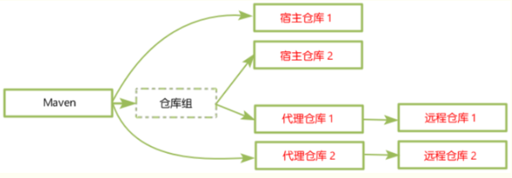

   

### 四. Maven集成

	集成的方式主要分以下种情况：代理中央仓库、Snapshot包的管理、Release包的管理、第三方Jar上传到Nexus上。

1. 在本地 maven 中配置，会从 Nexus 私服下载 Jar 包

```xml
<mirror>  
    <id>nexus</id>  
    <name>internal nexus repository</name>  
    <url>http://127.0.0.1:8081/nexus/content/groups/public/</url>  
    <mirrorOf>*</mirrorOf>  
</mirror>
```

2. 部署 Jar 到私服

   ```markdown
   一些公共模块或者说第三方构件是无法从Maven中央库下载的。我们需要将这些构件部署到私服上，供其他开发人员下载。用户除了通过界面手动上传构件，也可以配置Maven自动部署构件至Nexus的宿主仓库。
   ```

代理中央仓库

在项目pom文件中配置私服的地址，环境配置<distributionManagement>负责管理构件的发布

```xml
<distributionManagement>   
    <repository>   
        <id>releases</id>   
        <name> Nexus Release Repository </name>   
        <url> http://127.0.0.1:8081/nexus/content/repositories/releases/</url>   
    </repository>   
    <snapshotRepository>   
        <id>snapshots</id>   
        <name> Nexus Snapshot Repository </name>   
        <url> http://127.0.0.1:8081/nexus/content/repositories/snapshots/</url>   
    </snapshotRepository>   
</distributionManagement>  

<!--
<distributionManagement>
	<repository>
       <id>haihangyun</id>
       <name>Releases</name>
       <url>http://maven.haihangyun.com/content/repositories/Spirit-Central</url>
	</repository>
  	<snapshotRepository>
       <id>haihangyun</id>
       <name>Snapshot</name>
       <url>http://maven.haihangyun.com/content/repositories/Spirit-Snapshots</url>
  	</snapshotRepository>
</distributionManagement>
-->
```

在maven的 setting.xml 中配置（Nexus的仓库对于匿名用户只是只读的）

```xml
<servers>
    <server>
       <id>releases</id>
       <username>admin</username>
       <password>admin123</password>
    </server>
    <server>
       <id>snapshots</id>
       <username>admin</username>
       <password>admin123</password>
    </server>
    <!--
	<server>
       <id>haihangyun</id>
       <username>sunchao</username>
       <password>*******</password>
    </server>
    -->
</servers>
```

==settings.xml中server元素下id的值必须与POM中repository或snapshotRepository下id的值完全一致。将认证信息放到settings下而非POM中，是因为POM往往是它人可见的，而settings.xml是本地的。==

2. **第三方Jar上传到Nexus**

```sh
mvn deploy:deploy-file -DgroupId=com.hnair.consumer -DartifactId=crs-security-util -Dversion=1.0 -Dpackaging=jar -Dfile=/Users/dante/Desktop/HnaSecurityUtils.jar -Durl=http://52.80.42.108:8090/repository/3rdParty/ -DrepositoryId=nexus-releases

注意事项:
-DrepositoryId=nexus-releases 对应的就是Maven中settings.xml的认证配的名字
```
### 五. Nexus2

admin/admin123

#### 1. npm仓库


### 六. Nexus3

admin/admin@Pwd12345

#### 1. Docker仓库

- 使用 Docker 的方式启动 Nexus3

```bash
## 8083 - web
## 8084 - docker hosted （托管仓库 ，私有仓库，可以push和pull）
## 8085 - docker group（将多个proxy和hosted仓库添加到一个组，只访问一个组地址即可，只能pull）
## 8086 - docker proxy（代理和缓存远程仓库 ，只能pull）
docker run -d -p 8083:8081 \
              -p 8084:8084  \
              -p 8085:8085  \
              -p 8086:8086  \
              --name dante-nexus3 \
              -e TZ=Asia/Shanghai \
              -v /Users/dante/Documents/Technique/Docker/volume/nexus3:/nexus-data \
              sonatype/nexus3:3.17.0 
```

- 登录 Nexus3，http://localhost:8083
- 创建Blob Stores，用来存储镜像

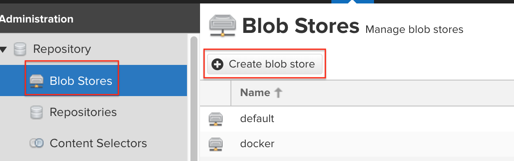

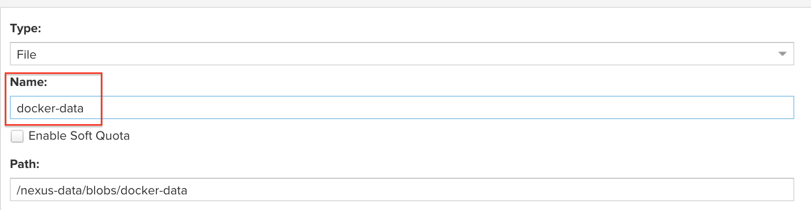

- 创建 docker repositories

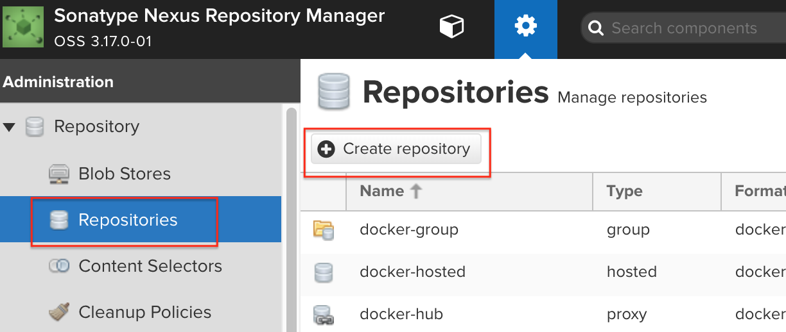

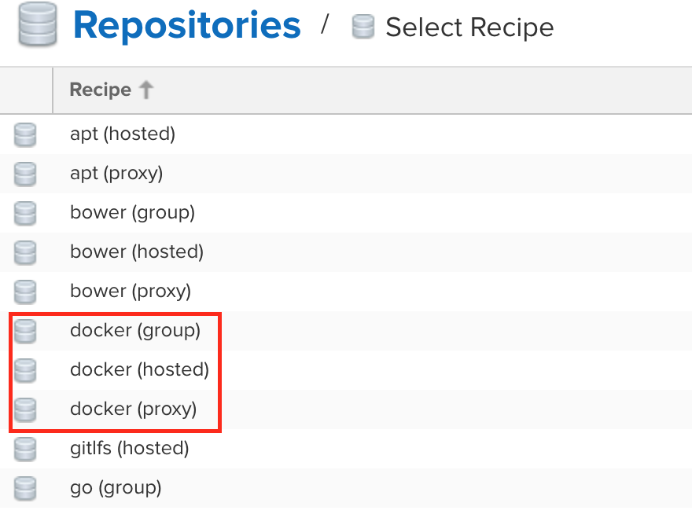

- **docker（proxy）**

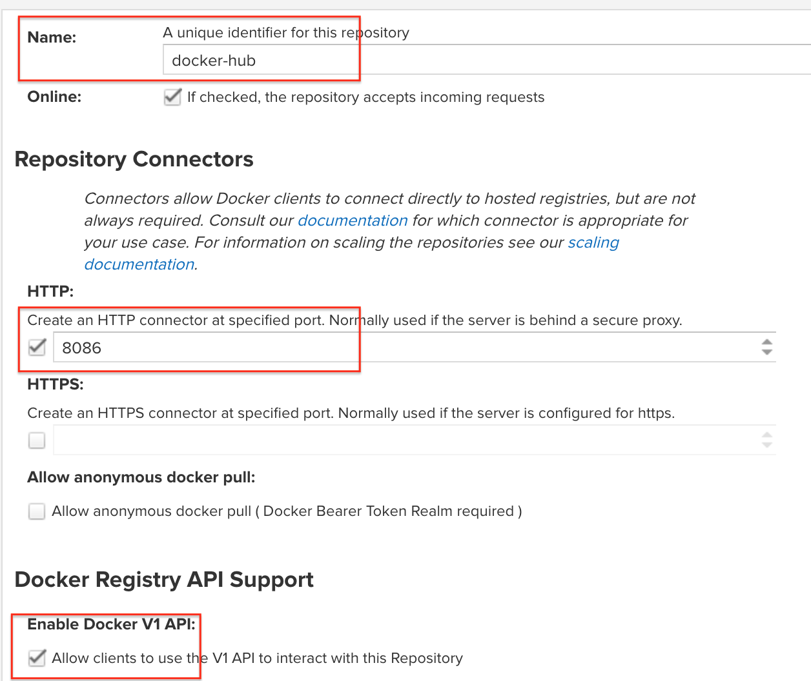

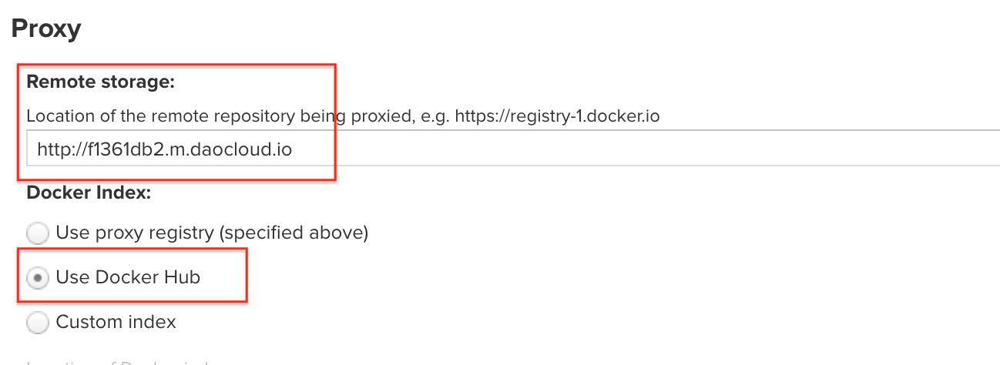

**其中需要注意的是，在添加Proxy的Remote Storage的时候，需要选中`Use certificates Stored in the Nexus truststore to connect to external systems`， 然后点击`View Certificate`, 点击 `Add certificate to truststore**`

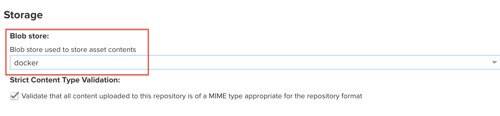

- **docker（hosted）**

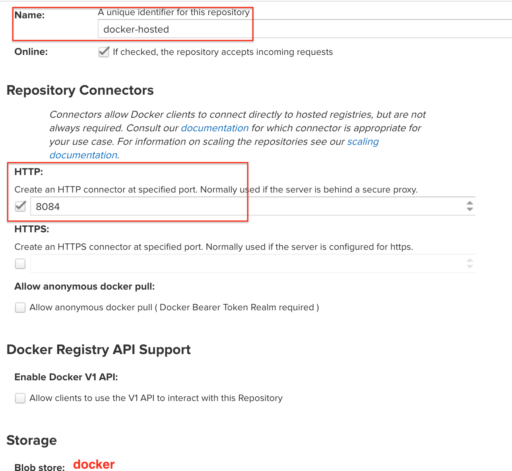

- **docker（group）**

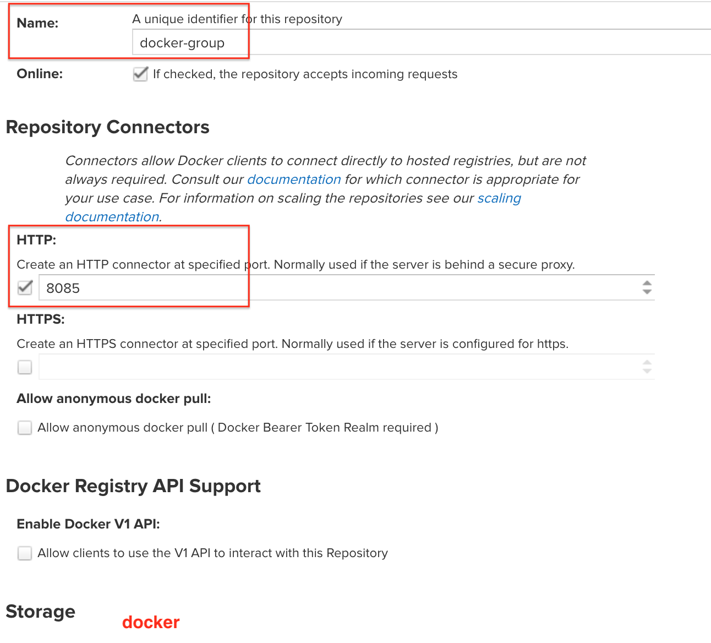

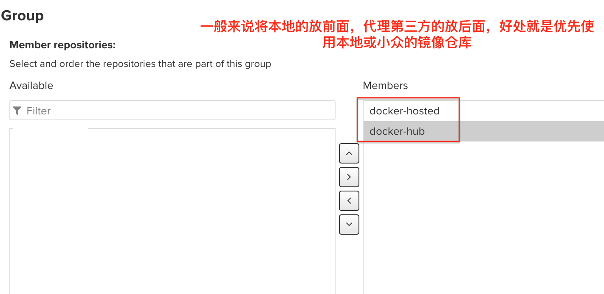

- 推送镜像

  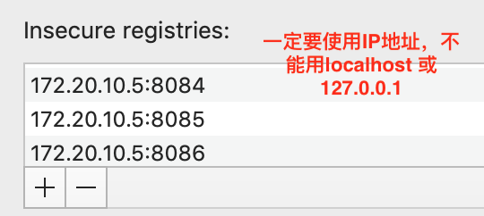

```bash
$ docker tag busybox:1.30.1 172.20.10.5:8084/busybox:1.30.1
## 登录私用仓库
$ docker login 172.20.10.5:8084 -u admin -p *****	
$ docker push 172.20.10.5:8084/busybox:1.30.1
```

- 拉取镜像

```bash
## 登录 docker group
$ docker login 172.20.10.5:8085 -u admin -p *****	
## 先从 hosted 上找，没有就通过 proxy 去官方 docker hub 上下载
$ docker pull 172.20.10.5:8085/nginx
Using default tag: latest
latest: Pulling from nginx
0a4690c5d889: Pull complete 
9719afee3eb7: Pull complete 
44446b456159: Pull complete 
```

- 高级用法

参考：

- https://segmentfault.com/a/1190000015629878
- https://zhang.ge/5139.html
- https://www.hifreud.com/2018/06/05/02-nexus-docker-repository
- https://help.sonatype.com/repomanager3/formats/docker-registry
- https://juejin.im/post/5c70a8156fb9a049f746d0fc
- https://cloud.tencent.com/developer/article/1478476

#### 2. Pip仓库

-  pypi（proxy）

  远程仓库

  - https://mirrors.aliyun.com/pypi
  - https://pypi.python.org

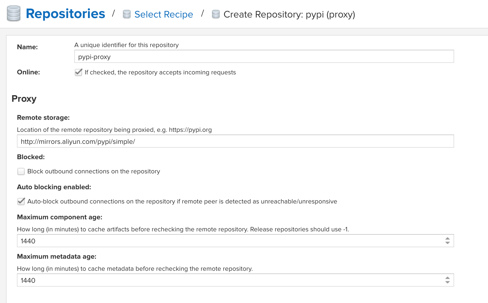

- pypi（hosted）

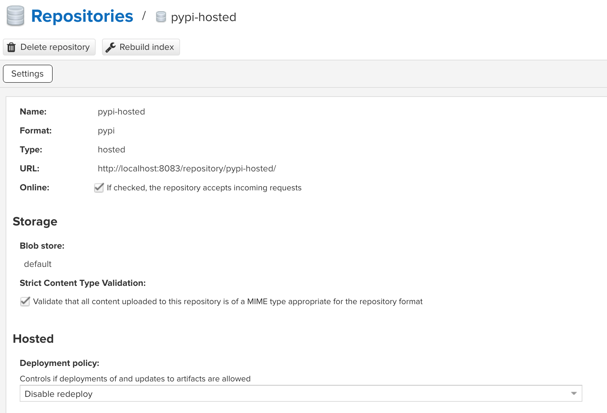

- pypi（group）

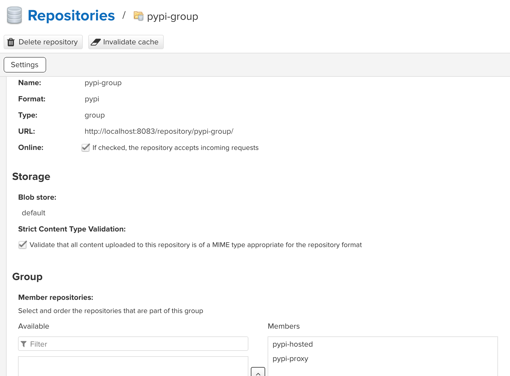

客户端使用

- 配置 pip 私服（**地址后必须要加上 /simple**）

  - 方式一

  ```ini
  ## 只从外部获取依赖
  pip config set global.index-url http://x.dante.com:8083/repository/pypi-proxy/simple
  ## 从外部获取依赖并且可以上传私有python包，使用pypi-group
  pip config set global.index-url http://x.dante.com:8083/repository/pypi-group/simple
  pip config set global.timeout 6000
  pip config set install.trusted-host x.dante.com
  ```

  - 方式二

    创建 $User_home/.config/pip/pip.conf

  ```ini
  [global]
  index-url = http://x.dante.com:8083/repository/pypi-group/simple
  timeout = 6000
  
  [install]
  trusted-host = x.dante.com
  ```

  

- 下载依赖

```ini
pip install PyYAML==5.1.2  
```

参考：

- https://help.sonatype.com/repomanager3/formats/pypi-repositories
- https://blog.csdn.net/m0_37607365/article/details/79998955
- https://blog.csdn.net/DILIGENT203/article/details/85220463

#### 3. npm 仓库

- Blob Store

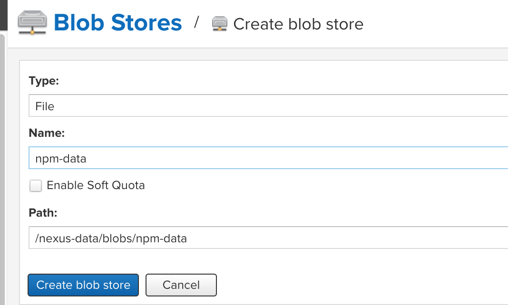

- npm（proxy）

  远程仓库

  - https://registry.npm.taobao.org

  - https://registry.npmjs.org

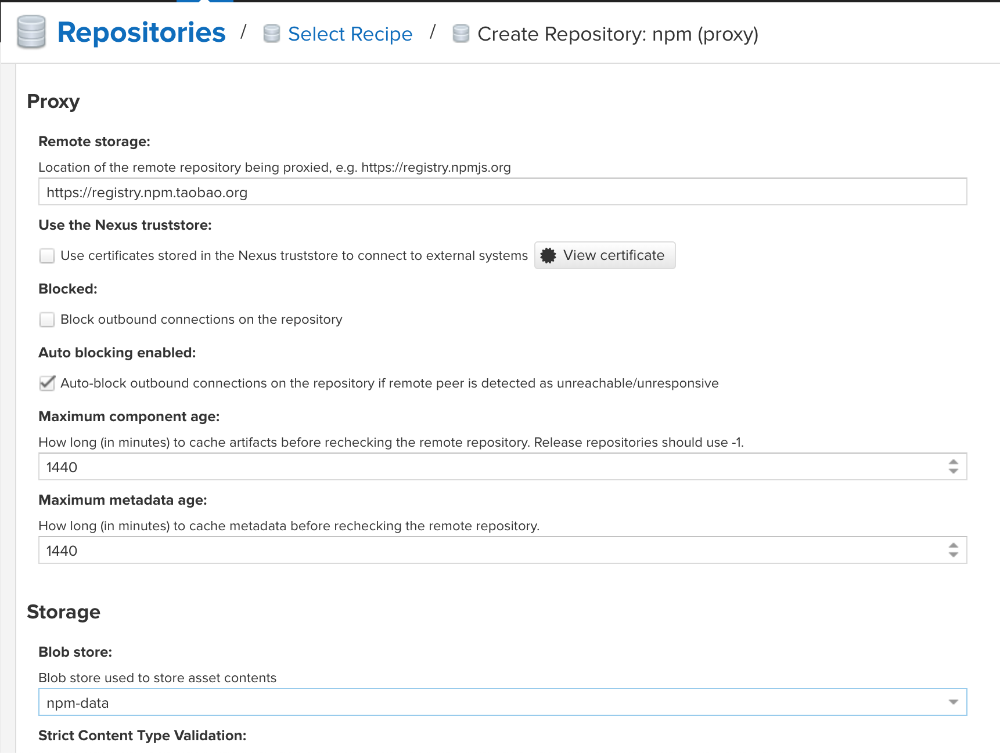

- npm（hosted）

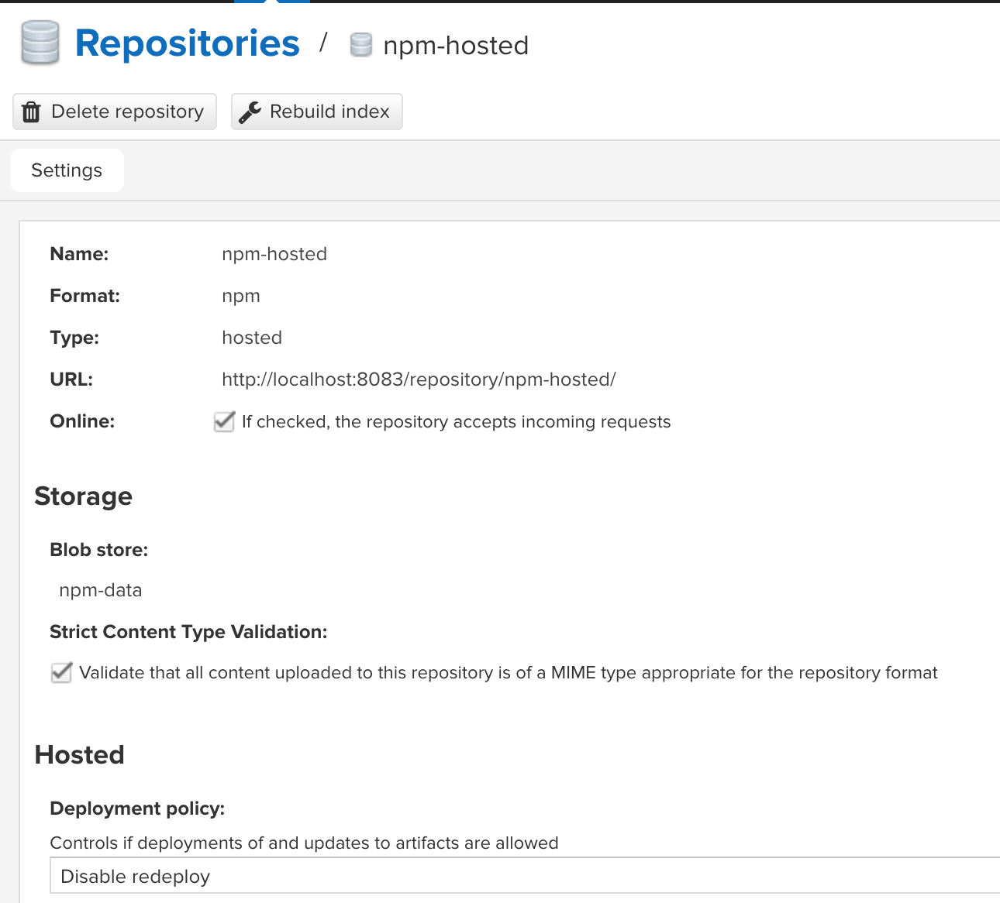

- npm（group）

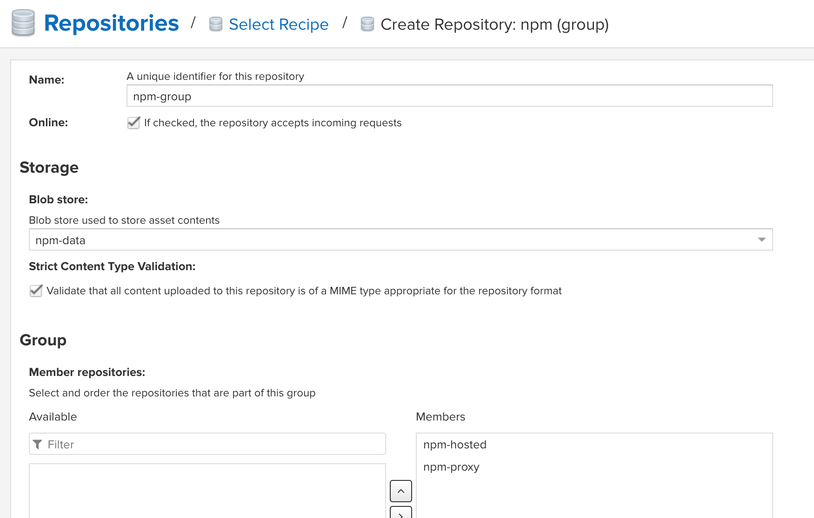


- 客户端使用

  - npm 命令方式

  ```ini
  ## 临时使用
  npm --registry http://x.dante.com:8083/repository/npm-group install express
  ## 永久使用
  ## npm config set registry https://registry.npm.taobao.org
  npm config set registry http://x.dante.com:8083/repository/npm-group
  ```

  - .npmrc（$User_home/.npmrc）

  ```ini
  cd $User_home
  touch .npmrc
  vi .npmrc
  ## 键入内容
  registry=http://x.dante.com:8083/repository/npm-group
  ```

  验证：npm config get registry

- 参考资料

  - https://zhuanlan.zhihu.com/p/35907412
  - https://help.sonatype.com/repomanager3/formats/npm-registry#NpmRegistry-ProxyingnpmRegistries

#### 4. Maven仓库


- 参考资料
  - https://www.cnblogs.com/mengjinluohua/p/8529345.html

### 八. 常见问题

#### 1. was cached in the local repository

```makefile
Non-resolvable import POM: Failure to find .. was cached in the local repository, resolution will not be reattempted until the update interval of io.spring.repo.maven.release has elapsed or updates are forced @ line 29, column 19 ->
```

解决：

1. 删除~/.m2/repository/对应目录或目录下的*.lastUpdated文件，然后再次运行maven命令。删除命令：

   `find ./ -name *.lastUpdated | xargs rm -rf`

2. maven命令后加-U，如`mvn package -U`

3. 在repository的release或者snapshots版本中新增updatePolicy属性，其中updatePolicy可以设置为”always”、”daily” (默认)、”interval:XXX” (分钟)或”never”

```
<repositories>
    <repository>
      <id>io.spring.repo.maven.release</id>
      <url>http://repo.spring.io/release/</url>
      <releases>
        <enabled>true</enabled>
        <updatePolicy>always</updatePolicy>
      </releases>
      <snapshots><enabled>false</enabled></snapshots>
    </repository>
  </repositories>
```

- http://stackoverflow.com/questions/4856307/when-maven-says-resolution-will-not-be-reattempted-until-the-update-interval-of/41391500#41391500
- http://maven.apache.org/ref/3.3.9/maven-settings/settings.html

#### 2. 下载缓慢

- https://imshuai.com/sonatype-nexus-maven-group-downloading-slow