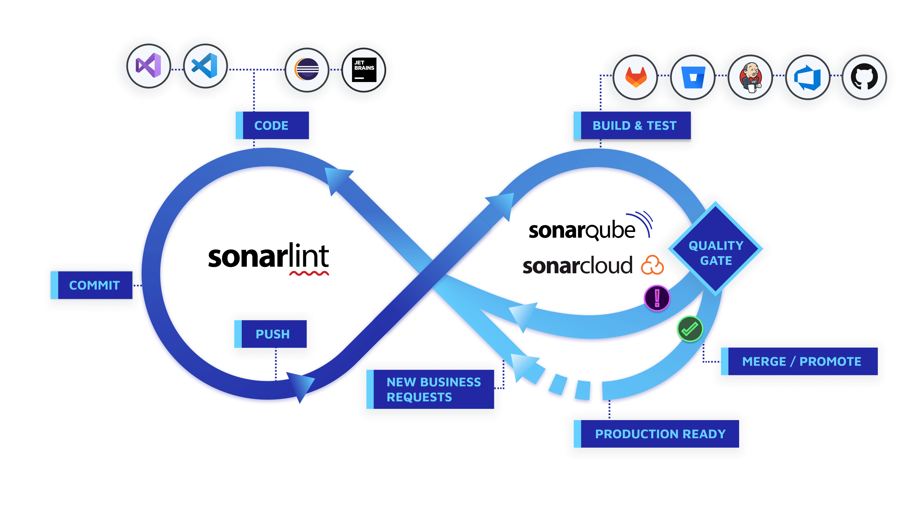
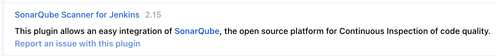
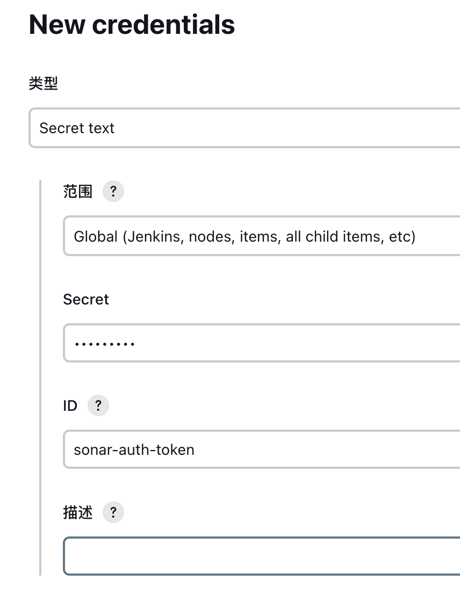
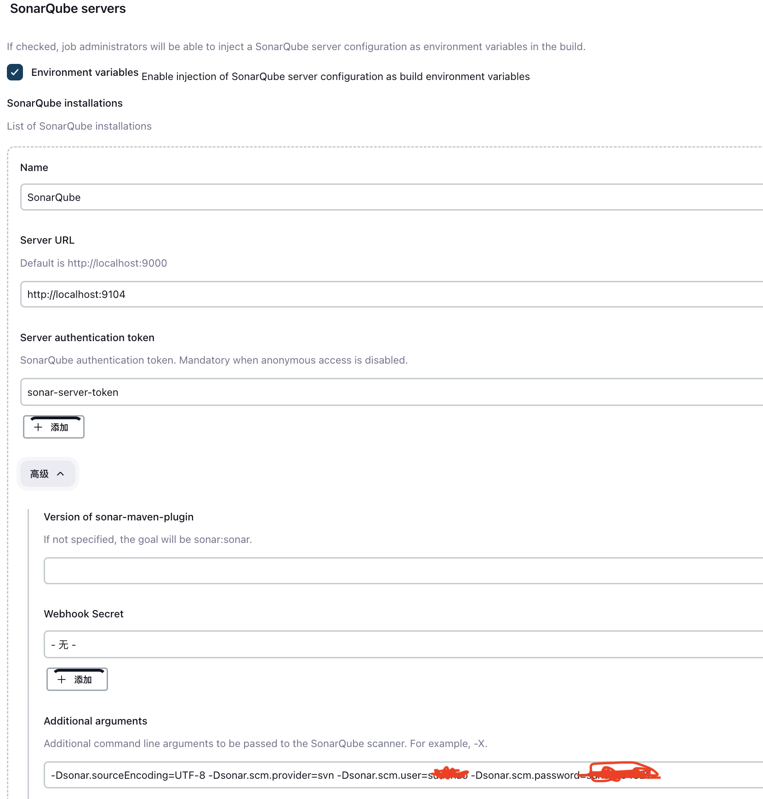
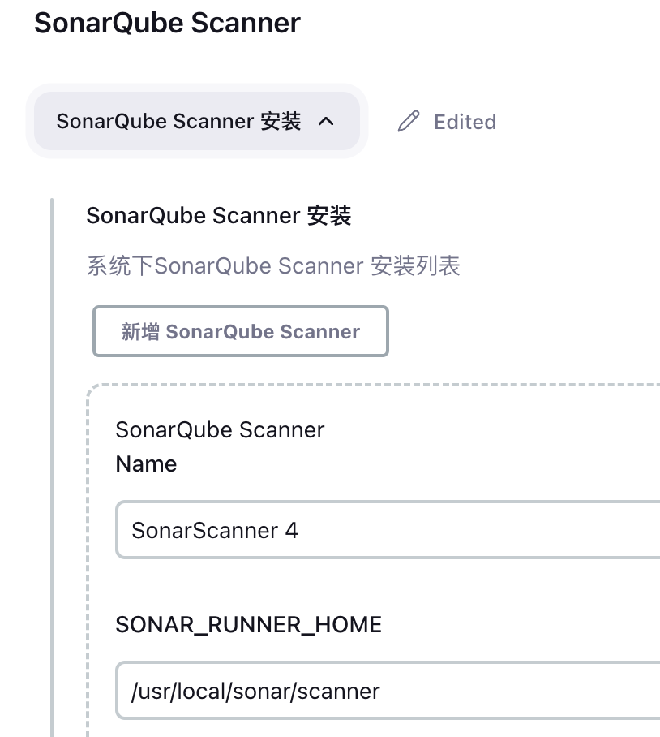

## Sonarqube

### 1.Sonarqube是什么 

​	SonarQube能够提供对代码的一整套检查扫描和分析功能，拥有一套服务器端程序，然后再通过客户端或者以别的软件的插件形式完成对各开发环境和软件的支持。	

- 对编程语言的支持非常广泛，包括C、C++、Java、Objective C、Python、JavaScript、PHP、C#、Swift、Erlang、Groovy等众多语言
- 提供了对HTML、CSS、JSON、XML、CSV、SQL、JSP/JSF等类型的文档的支持
- 提供了以FindBugs、PMD、CheckStyle方式执行代码分析和测试检查的功能
- 登录认证方式支持LDAP、Bitbucket、Azure Active Directory（AAD）、Crowd等方式
- 提供了优美的3D视图方式下查看代码分析和测试结果报告



### 2. 安装

#### SonarQube

​	操作系统： `Centos7.6`、`SonarQube9.9`、`Sonar-Scanner-4.8`

​	JRE：`SonarQube 17、Scanner11+`

​	数据库：`PostgreSQL11+（UTF-8 编码）`

​	系统配置：

```bash
sysctl -w vm.max_map_count=524288
sysctl -w fs.file-max=131072
ulimit -n 131072
ulimit -u 8192

## 修改elasticsearch配置参数
vi /etc/sysctl.conf
vm.max_map_count=262144
## 执行命令
sysctl -p
## 修改最大文件数
vi /etc/security/limits.conf
## 末尾行添加
* soft nofile 65535
* hard nofile 65535
```

(1) 下载并解压

- 下载Sonar，地址：https://www.sonarsource.com/products/sonarqube/downloads/

- 解压，本例中解压到 `/usr/local/sonar/server`

(2) 创建用户

SonarQube 不能以 root 用户启动，所以要先创建用户

``` sh
useradd sonar
passwd sonar
chown -R sonar /usr/local/sonar/server
```

(3) 安装Postgres

从SonarQube 7.9开始，不在支持MySQL（性能无法支撑），支持的数据库变为：Oracle、Microsoft SQL Server和PostgreSQL。

创建数据库 sonar

(4) 修改配置

`sonar.properties`

```properties
sonar.jdbc.username=postgres
sonar.jdbc.password=123456
sonar.jdbc.url=jdbc:postgresql://localhost:5432/sonarqube?currentSchema=public

## 端口修改
sonar.web.host=0.0.0.0
sonar.web.port=9000
```

`sonar.sh`

```sh
## 当JAVA_HOME中不是17+版本
SONAR_JAVA_PATH="/usr/local/java17/bin/java"

# 设置内存
XMS="-Xms8m"
XMX="-Xmx32m"
```

`elasticsearch/jvm.options`

```sh
-Xms2g
-Xmx2g
```

(5) 启动

```sh
## 在/usr/local/sonar/server下
./bin/linux-x86-64/sonar.sh start
tail -f logs/sonar.log
```

启动成功后，访问：http://localhost:9000 ，进行配置

#### Sonar-Scanner

下载，https://docs.sonarqube.org/9.9/analyzing-source-code/scanners/sonarscanner

解压，本例中解压到 `/usr/local/sonar/scanner`

将`bin/sonar-scanner`加入到系统`PATH`中

#### 项目配置

在项目的根目录中创建`sonar-project.properties`，内容如下

```properties
sonar.projectKey=risun-rsp
sonar.projectName=\u777F\u9633RSP\u6846\u67B6
sonar.projectVersion=1.0
sonar.sources=.
sonar.sourceEncoding=UTF-8
sonar.java.binaries=./project-admin/target/classes
```

### 3. 集成Jenkins

(1) 安装SonarQube插件



- 创建密钥

  

- 配置

  

- Scanner（Global Tool Configuration）

  


- 在pipeline中使用（项目中有sonar-project.properties）

  ```groovy
  node {
    stage('SCM') {
      git 'https://github.com/foo/bar.git'
    }
    stage('SonarQube analysis') {
      stage('静态代码扫描') {
        def scannerHome = tool 'SonarScanner 4';
        withSonarQubeEnv('SonarQube') {
            sh """
                ${scannerHome}/bin/sonar-scanner
            """
        }
      }
    }
  }
  ```

- 获取Sonar扫描结果

  - 使用Sonar API  http://localhost:9000/api/webservices/list

    参考：https://docs.sonarqube.org/

    ```shell
    !/bin/bash

    SONAR_KEY="sonar:microservice-spirit"
    STATUS=$(curl -qsSL "http://localhost:9000/api/qualitygates/project_status?projectKey=${SONAR_KEY}" |\
        jq .projectStatus.status | grep -o "\w\+")
    if [ "${STATUS}" = "ERROR" ]; then
        echo "代码质量扫描未通过，请检查 http://localhost:9000/overview?id=${SONAR_KEY} 的扫描报告并修复！"
        exit -1
    fi
    echo "代码质量扫描完成！"
    ```

  - 安装Jq  https://stedolan.github.io/jq/

    ```sh
    brew install https://github.com/stedolan/jq/releases/download/jq-1.5/jq-osx-amd64
    ```

### 4. SonarWeb使用

​	https://blog.csdn.net/LANNY8588/article/details/108428135

### 5. 参考资料

- https://docs.sonarqube.org/9.9
- https://www.devopsschool.com/blog/how-to-execute-sonarqube-scanner-using-jenkins-pipeline
- https://blog.csdn.net/danielchan2518/article/details/72792897
- https://www.jianshu.com/p/81e616f4c625
- https://blog.csdn.net/jiatong151/article/details/111995890