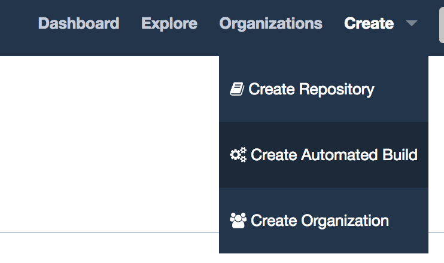
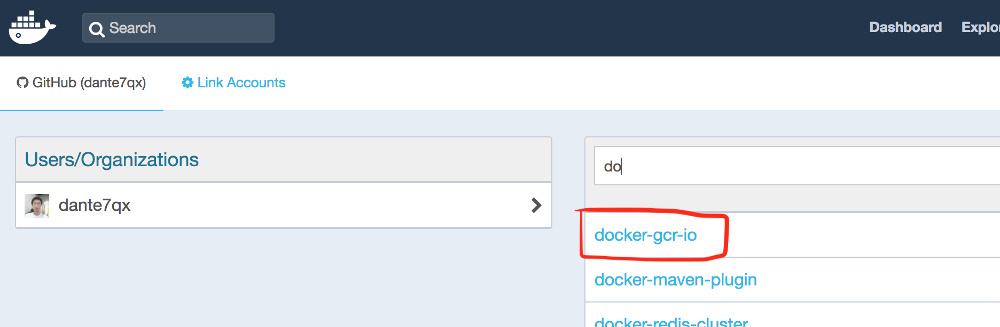
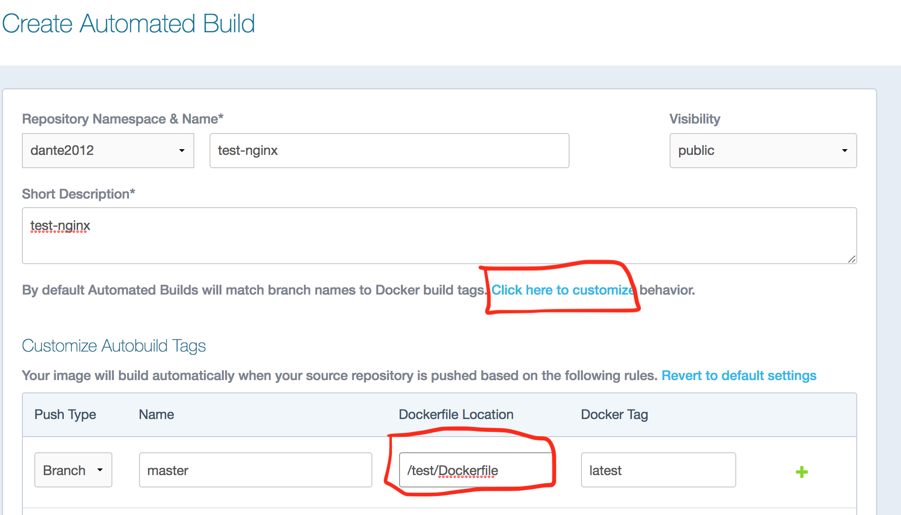
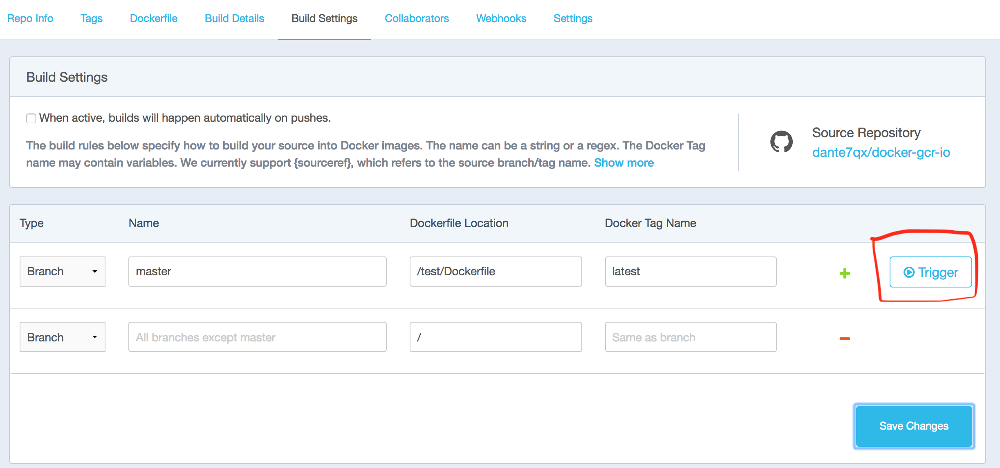

# Dockerfile命令

## FROM

支持三种格式：

- `FROM <image>`
- `FROM <image>:<tag>`
- `FROM <image>@<digest>`

FROM指令必须指定且需要在Dockerfile其他指令的前面，指定的基础image可以是官方远程仓库中的，也可以位于本地仓库。后续的指令都依赖于该指令指定的image。当在同一个Dockerfile中建立多个镜像时，可以使用多个FROM指令。

## MAINTAINER（过时Label替代）

格式为：

- `MAINTAINER <name>`

用于指定维护者的信息。

## RUN

支持两种格式：

- `RUN <command>` 
- 或 `RUN ["executable", "param1", "param2"]`。

`RUN <command>` 在shell终端中运行命令，在Linux中默认是`/bin/sh -c` 在Windows中是 `cmd /s /c``RUN ["executable", "param1", "param2"]` 使用exec执行。指定其他终端可以通过该方式操作，例如：`RUN ["/bin/bash", "-c", "echo hello"]` ，该方式必须使用["]而不能使用[']，因为该方式会被转换成一个JSON 数组。

## CMD

支持三种格式：

`CMD ["executable","param1","param2"]` (推荐使用)

`CMD ["param1","param2"]` (为ENTRYPOINT指令提供预设参数)

`CMD command param1 param2` (在shell中执行)

CMD指令的主要目的是为执行容器提供默认值。每个Dockerfile只有一个CMD命令，**如果指定了多个CMD命令，那么只有最后一条会被执行，如果启动容器的时候指定了运行的命令，则会覆盖掉CMD指定的命令**。

## ENTRYPOINT

格式为：

- `ENTRYPOINT ["executable", "param1", "param2"]`
- `ENTRYPOINT command param1 param2`

指定Docker容器启动时执行的命令，可以多次设置，但是只有最后一个有效。

## LABEL

格式为：

- `LABEL <key>=<value> <key>=<value> <key>=<value> ...`

为镜像添加元数据。使用 "和 \ 转换命令行，示例：

```
LABEL "com.example.vendor"="ACME Incorporated"
LABEL com.example.label-with-value="foo"
LABEL version="1.0"
LABEL description="This text illustrates \
that label-values can span multiple lines."
```

## EXPOSE

格式为：

- `EXPOSE <port> [<port>...]`

为Docker容器设置对外的端口号。在启动时，可以使用-p选项或者-P选项。

示例：

```sh
# 映射一个端口示例
EXPOSE port1
# 相应的运行容器使用的命令
docker run -p port1 image
# 也可以使用-P选项启动
docker run -P image

# 映射多个端口示例
EXPOSE port1 port2 port3
# 相应的运行容器使用的命令
docker run -p port1 -p port2 -p port3 image
# 还可以指定需要映射到宿主机器上的某个端口号  
docker run -p host_port1:port1 -p host_port2:port2 -p host_port3:port3 image
```

## ENV

格式为：

- `ENV <key> <value>`
- `ENV <key>=<value> ...`

指定环境变量，会被后续RUN指令使用，并在容器启动后，可以通过`docker inspect`查看这个环境变量，也可以通过`docker run --env <key>=<value>` 来修改环境变量（或 `docker run -e <key=value> -e <key>=<value>`）

示例：

```
ENV JAVA_HOME /path/to/java # 设置环境变量JAVA_HOME
```

## ADD

格式为：

- `ADD <src>... <dest>`
- `ADD ["<src>",... "<dest>"]`

从src目录复制文件到容器的dest。其中src可以是Dockerfile所在目录的相对路径，也可以是一个URL，还可以是一个压缩包

注意：

1. src必须在构建的上下文内，**不能使用**例如：`ADD ../somethine /something` ，因为`docker build` 命令首先会将上下文路径和其子目录发送到docker daemon
2. 如果src是一个URL，同时dest不以斜杠结尾，dest将会被视为文件，src对应内容文件将会被下载到dest
3. 如果src是一个URL，同时dest以斜杠结尾，dest将被视为目录，src对应内容将会被下载到dest目录
4. 如果src是一个目录，那么整个目录其下的内容将会被拷贝，包括文件系统元数据
5. 如果文件是可识别的压缩包格式，则docker会自动解压

## COPY

格式为：

- `COPY <src>... <dest>`
- `COPY ["<src>",... "<dest>"]` （shell中执行）

复制本地端的src到容器的dest。和ADD指令类似，COPY不支持URL和压缩包。

## VOLUME

格式为：

- `VOLUME ["/data"]`

使容器中的一个目录具有持久化存储数据的功能，该目录可以被容器本身使用，也可以共享给其他容器。当容器中的应用有持久化数据的需求时可以在Dockerfile中使用该指令。

## USER

格式为：

- `USER 用户名`

设置启动容器的用户，默认是root用户。

## WORKDIR

格式为：

- `WORKDIR /path/to/workdir`

切换目录指令，类似于cd命令，对RUN、CMD、ENTRYPOINT生效。

## ONBUILD

格式为：

- `ONBUILD [INSTRUCTION]`

指定当建立的镜像作为其他镜像的基础时，所执行的命令。

## ARG

格式为：

- `ARG <name>[=<default value>]`

ARG指令定义一个变量。

## 实际场景

1. 修改docker时区

   ```sh
   ENV TZ=Asia/Shanghai
   RUN ln -snf /usr/share/zoneinfo/$TZ /etc/localtime && echo $TZ > /etc/timezone
   ```

2. 设置编码

   `ENV LANG C.UTF-8`

   

## 最佳使用姿势

1. 首行使用 **FROM** 去复用镜像。

2. 避免在一个容器内启用多个后台服务，例如 SSHD 和 Database。

3. 清理临时文件，docker 中每个指令都会创建一个 Layer，每个缓存都存在每一个 Layer 中，下层的清楚命令不会清理掉上层的Cache，因此尽量使用 **&&** 将 RUN 指令连接起来，例

   ```shell
   RUN yum -y install myotherpackage && yum clean all -y
   ```

4. 指令的顺序。因为Docker build会利用缓存，要将不变的指令写到前面。例 

   ```dockerfile
   FROM foo
   RUN yum -y install mypackage && yum clean all -y
   ADD myfile /test/myfile
   ```

5. 要将重要的端口 EXPOSE 出去，重复利用环境变量。对于密码信息，能够通过 ENV 进行传递。

6. 不要运行 SSHD 服务。

7. 要持久化的目录，使用 Volumes 指令进行标记。

8. docker run的时候把command最为容器内部命令，如果你使用nginx，那么nginx程序将后台运行，这个时候nginx并不是pid为1的程序，而是执行的bash，这个bash执行了nginx指令后就挂了，所以容器也就退出了，和你这个一样的道理，pm2 start 过后，bash 的pid为1，那么此时bash执行完以后会退出，所以容器也就退出了。

   ```dockerfile
   ## 正确
   java ....
   ## 错误
   nohup java ...
   
   ## 正确
   nginx -g "daemon off;"
   ## 错误
   nginx
   ```

9. CMD 和 ENTRYPOINT

```dockerfile
FROM busybox

LABEL author="dante"
LABEL email="sunchao.0129@163.com"

# CMD在容器运行的时候提供一些命令及参数。也就是容器启动以后，默认的执行的命令
# 重点就是这个“默认”。意味着，如果docker run没有指定任何的执行命令或者dockerfile里面也没有entrypoint，
# 那么，就会使用cmd指定的默认的执行命令执行。同时也从侧面说明了entrypoint的含义，它才是真正的容器启动以后要执行命令。

# CMD ["executable","param1","param2"] (推荐使用) 
# CMD ["param1","param2"] (as default parameters to ENTRYPOINT) 
# CMD command param1 param2 (shell form) 

# 用法 1。命令没有再任何shell终端环境下，如果我们要执行shell，必须把shell加入到中括号的参数中。
# docker run dante-cmd -> hello cmd!
# CMD ["/bin/sh", "-c", "echo 'hello cmd!'"]

# 用法 3。shell form，即没有中括号的形式。那么命令command默认是在“/bin/sh -c”下执行的。
# docker run dante-cmd -> hello cmd!
# CMD echo "hello cmd!"

# 用法1和3，运行 docker dante-cmd echo 123，输出=> 123

# 用法 2。结合 ENTRYPOINT
# ENTRYPOINT ["executable", "param1", "param2"] (推荐使用)
# ENTRYPOINT command param1 param2 (shell form)

# 1. 命令行模式，也就是带中括号的。
#    如果run命令后面有东西，那么后面的全部都会作为entrypoint的参数。
#    如果run后面没有额外的东西，但是cmd有，那么cmd的全部内容会作为entrypoint的参数，这同时是cmd的第二种用法。

ENTRYPOINT ["echo", "--->"]
CMD ["Hello CMD & ENTRYPOINT !"]

# docker run dante-cmd             输出 ---> Hello CMD & ENTRYPOINT !
# docker run dante-cmd 111 222 333 输出 ---> 111 222 333
```


# DockerHub 妙用

## 1. 下载墙外镜像

1. 登录Docker Hub，创建 Create Automated Build，关联 Github，选择 Github 中的 repository。





2. 设置构建步骤，开始构建





3. 下载镜像并更改镜像名称

**rename.sh**

```bash
#!/bin/bash

TAR_HOME=$1

if  [ -z "$TAR_HOME" ]; then
  TAR_HOME="tar"
  mkdir -p $TAR_HOME
fi

echo " ===> Image save path is $TAR_HOME"

SOURCE_IMAGES=(dante2012/istio-proxyv2:1.0.0 dante2012/istio-grafana:1.0.0 dante2012/istio-citadel:1.0.0 dante2012/istio-galley:1.0.0 dante2012/istio-mixer:1.0.0 dante2012/istio-servicegraph:1.0.0 dante2012/istio-sidecar_injector:1.0.0)
TAG_IMAGES=(gcr.io/istio-release/proxyv2:1.0.0 gcr.io/istio-release/grafana:1.0.0 gcr.io/istio-release/citadel:1.0.0 gcr.io/istio-release/galley:1.0.0 gcr.io/istio-release/mixer:1.0.0 gcr.io/istio-release/servicegraph:1.0.0 gcr.io/istio-release/sidecar_injector:1.0.0)

echo "Image quantity is ${#SOURCE_IMAGES[@]}"

i=0
while [[ i -lt ${#SOURCE_IMAGES[@]} ]]; do
  image=${SOURCE_IMAGES[i]}
  docker pull $image
  docker tag $image ${TAG_IMAGES[i]}

  tmpImage=${image##*/}
  localImage=$TAR_HOME/${tmpImage/:/-}.tar
  docker save -o $localImage ${TAG_IMAGES[i]}

  docker rmi -f $image
  docker load -i $localImage

  let i++
done
```

## 2. Docker daemon 过大

当使用Dockerfile Build镜像时，有时会发现发送到Daemon的内容过大，因为Docker Client会默认发送Dockerfile同级目录下的所有文件到Dockerdaemon中。

```shell
Sending build context to Docker daemon 4.358 GB
Step 0 : FROM centos:7
 ---> 218081f3bcdc
...
```

1）创建.dockerignore文件，把不需要的文件写到里面，该文件包含的目录不会被发送到Docker daemon中。

2）找个空目录只有dockerfile。