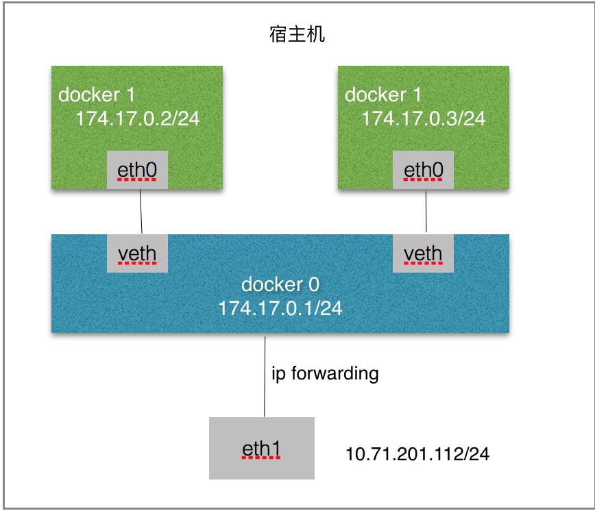
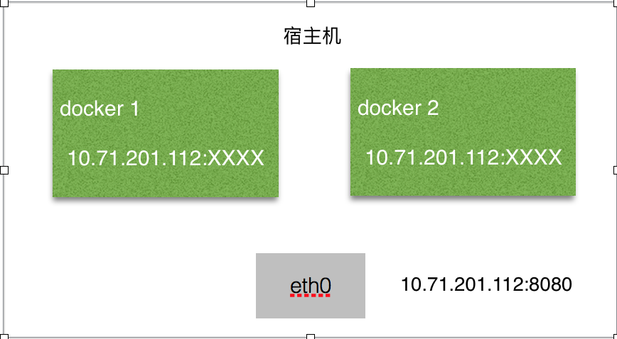
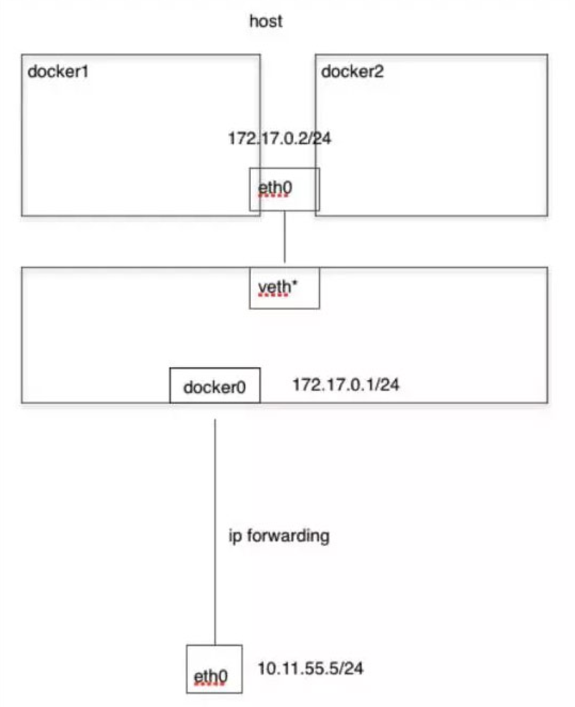

### Docker网络模式

#### 一. 简介

​	Linux Namespace，其目的是将某个特定的全局系统资源（global system resource）通过抽象方法使得namespace 中的进程看起来拥有它们自己的隔离的全局系统资源实例。Linux内核实现了六种namespace。

| **UTS namespaces**     | nodename 和 domainname， 每个容器可以有自己的 hostname 和 domainame |
| ---------------------- | ---------------------------------------- |
| **IPC namespaces**     | 特定的进程间通信资源，包括**System V IPC** 和  **POSIX message queues**， 每个容器有其自己的 System V IPC 和 POSIX 消息队列文件系统，因此，只有在同一个 IPC namespace 的进程之间才能互相通信 |
| **PID namespaces**     | 进程 ID 数字空间 （process ID number space）， 每个 PID namespace 中的进程可以有其独立的 PID； 每个容器可以有其 PID 为 1 的root 进程；也使得容器可以在不同的 host 之间迁移，因为 namespace 中的进程 ID 和 host 无关了。这也使得容器中的每个进程有两个PID：容器中的 PID 和 host 上的 PID。 |
| **Network namespaces** | 网络相关的系统资源， 每个容器用有其独立的网络设备，IP 地址，IP 路由表，/proc/net 目录，端口号等等。这也使得一个 host 上多个容器内的同一个应用都绑定到各自容器的 80 端口上。 |
| **User namespaces**    | 用户和组 ID 空间， 在 user namespace 中的进程的用户和组 ID 可以和在 host 上不同； 每个 container 可以有不同的 user 和 group id；一个 host 上的非特权用户可以成为 user namespace 中的特权用户； |
| **Mount namespaces**   | 文件系统挂接点， 每个容器能看到不同的文件系统层次结构              |

#### 二. bridge模式

​	Docker默认的网络模式。当Docker进程启动时，会在宿主机上创建一个名为docker0的虚拟网桥，此主机上启动的Docker容器会连接到这个虚拟网桥上。虚拟网桥的工作方式和物理交换机类似，这样主机上的所有容器就通过交换机连在了一个二层网络中。从docker0子网中分配一个IP给容器使用，并设置docker0的IP地址为容器的默认网关。在宿主机上创建一对虚拟网卡veth pair设备，Docker将veth pair设备的一端放在新创建的容器中，并命名为eth0（容器的网卡），另一端放在主机中，以vethxxx这样类似的名字命名，并将这个网络设备加入到docker0网桥中。

​	bridge模式是docker的默认网络模式，不写–net参数，就是bridge模式。使用docker run -p时，docker实际是在iptables做了DNAT规则，实现端口转发功能。可以使用iptables -t nat -vnL查看。

```
优点：网络资源隔离、无需手工配置、可访问外网
缺点：外界无法直接访问容器IP、低性能、端口管理麻烦
```



*代码*

```shell
docker run -tid --net=bridge --name dante_bri1 busybox:latest
docker run -tid --net=bridge --name dante_bri2 busybox:latest

brctl show （宿主机Linux下）

docker exec -ti dante_bri1 /bin/sh
docker exec -ti dante_bri2 /bin/sh

ifconfig –a
route –n
```

#### 三. Host模式

​	启动容器的时候使用host模式，那么这个容器将不会获得一个独立的Network Namespace，而是和宿主机共用一个Network Namespace。容器将不会虚拟出自己的网卡，配置自己的IP等，而是使用宿主机的IP和端口。但是，容器的其他方面，如文件系统、进程列表等还是和宿主机隔离的。

```
优点：共享宿主机网络、网络性能无衰减、排查网络故障简单
缺点：网络环境无隔离、网络资源无法统计、端口不易管理
```



*代码*

```shell
docker run -tid --net=host --name dante_host1 busybox:latest
docker run -tid --net=host --name dante_host2 busybox:latest

docker exec -ti dante_host1 /bin/sh
docker exec -ti dante_host2 /bin/sh

ifconfig –a
route –n
```

#### 四. Container模式

​	这个模式指定新创建的容器和已经存在的一个容器共享一个 Network Namespace，而不是和宿主机共享。新创建的容器不会创建自己的网卡，配置自己的 IP，而是和一个指定的容器共享 IP、端口范围等。同样，两个容器除了网络方面，其他的如文件系统、进程列表等还是隔离的。两个容器的进程可以通过 lo 网卡设备通信。

```markdown
特点：与主机网络空间隔离、容器间共享网络空间、适合容器间网络通信频繁
```



*代码*

```shell
docker run -tid --name dante_bri busybox:latest
docker run -tid --net=container:dante_bri --name dante_container busybox:v3

docker exec -ti dante_bri /bin/sh
docker exec -ti dante_container /bin/sh

ifconfig –a
route -n
```

#### 五. None模式

​	使用none模式，Docker容器拥有自己的Network Namespace，但是，并不为Docker容器进行任何网络配置。也就是说，这个Docker容器没有网卡、IP、路由等信息。需要我们自己为Docker容器添加网卡、配置IP等。

*代码*

```md
docker run -tid --net=none --name dante_none busybox:latest
docker exec -ti dante_none /bin/sh

ifconfig –a
route -n
```

