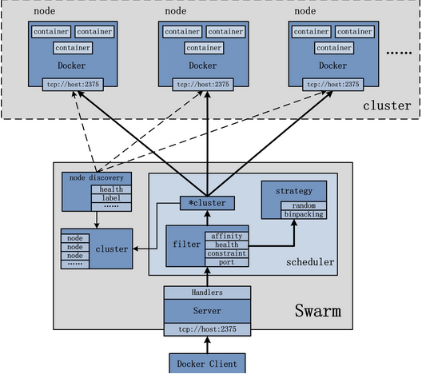
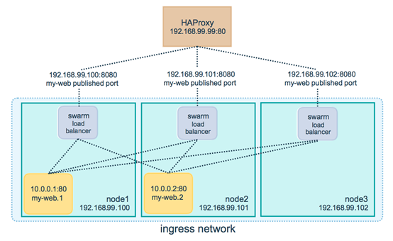

### Docker Swarm

### 一. 概述

​	Swarm，Docker公司提供的用于管理 Docker 集群的工具。它可以把多个 Docker 主机组成的系统转换为单一的虚拟 Docker 主机，使得容器可以组成跨主机的子网网络。

- **集群管理**
- **分散式设计**：运行时去处理Task，部署时不处理Node的关系（manager、worker）
- **声明式服务**：在Manager节点运行docker service。每个服务处理特定的事（前端、DB、后台）


- **动态伸缩**：docker server scale 去动态的升级、降级 Task 的数量
- **Task状态修复**：Manager一直监控集群，调节Task的正常状态。例：replicas 10 个容器， 2个宕机，Manager会创建两个新副本来替换崩溃的节点
- **Multi-host networking**：为每个Service指定一个overlay network，Manager会自动将overlay network分发到每个容器中
- **服务发现**
- **默认安全**
- **弹性升级**

架构图



#### 1. Swarm

集群的管理和编排是使用嵌入到docker引擎的SwarmKit，可以在docker初始化时启动swarm模式或者加入已存在的swarm。命令 `docker swarm --help`。

```sh
docker swarm init --listen-addr 192.168.99.100:2377 --advertise-addr 192.168.99.100

生成两个随机的Tokens，manager token 和 worker token
```

#### 2. Node

Swarm集群中的Docker Engine，分为 Manager Node 和 Worker Node 。命令 `docker node --help`

- Manager Node：定义docker service，Manager node将 Task 分发到各个 Worker Node中。
- Worker Node：接受并执行Task。Agent负责在Manager和Worker之间传递Task的状态。

```sh
docker@dante-manager1:~$ docker node ls
ID                            HOSTNAME            STATUS              AVAILABILITY        MANAGER STATUS
0o1ysr9l6ithnx5pkyssbwttl     dante-worker2       Ready               Active                           
iivbe4xikq2ahctm648hl7jjw     dante-worker1       Ready               Active              
j4vix0olr2h5rc94rujk2n9yh *   dante-manager1      Ready               Active              Leader             
z0c8iu0bhfh5foa7bnjzt6cxa     moby                Ready               Active   
```

#### 3. Service

一组Task的集合，service定义了这些task的属性。命令 `docker service --help`。

- **replicated services**：按照一定规则在各个worker node上运行指定个数的Tasks
- **global services**：每个woker node上运行一个此Task

```sh
docker service create --replicas 3 --name dante-nginx nginx //创建服务
docker service ls           //查看服务
docker service ps dante-nginx //查看task
docker service inspect dante-nginx       //查看服务/task详细信息
```

#### 4. Task

swarm中的最小原子调度单位，目前来说就是一个单一的容器（后期可能会支持pod模式，那就是一个pod了估计）。Manager节点根据指定数量的任务副本分配任务给worker节点。一旦Task被分配给了一个Node，就不能再移动到别的Node。

#### 5. Load Balancing

​	**Docker Swarm Mode**使用**Ingress load balancing**来将内部服务暴露出来到非容器网络中，比如宿主机网络，甚至是**DC**外部或公网中。**Ingress load balancing**是通过**NAT**将内部服务映射到宿主机的某一端口（这个特点和**docker**原生**bridge**网络的**NAT**，或者**k8s**的**externalIP->NodePort**类似），可以手动指定未使用端口（**-p <PUBLISHED-PORT>:<TARGET-PORT>**或者**--publish <PUBLISHED-PORT>:<TARGET-PORT>**）；或者不指定，由**docker swarm**在**30000-32767中指定一个端口。

​	**Ingress load balancing**会在每个容器中添加一块网口，用于连接到**ingress network**中（**swarm**默认创建的**overlay network**，10.255.0.0/16**），并使用**VIP**（**IPVS**技术）分发**ingress traffic**到每个容器实例中。具体技术参看下面的网络部分**。

​	Swarm mode有个内置的DNS模块，可以给每个service分配一个DNS条目，每个DNS条目对应着service的多个task实例。同一容器网络中可以通过该DNS条目来统一访问对应的service，从而达到负载均衡的效果。



### 二. 搭建Swarm集群

前提条件，开启如下端口

- **TCP port 2377** for cluster management communications
- **TCP** and **UDP port 7946** for communication among nodes
- **UDP port 4789** for overlay network traffic

```sh
-- 创建swarm manager
docker swarm init --listen-addr 192.168.99.100:2377 --advertise-addr 192.168.99.100

docker swarm join token manager
To add a manager to this swarm, run the following command:
    docker swarm join --token SWMTKN-1-08blp0qxvoik754yz94vh2o6q1j74uij6vxm6mhwh1z1sttjs3-84uib4ddnvqn6fpbugv885ukf 192.168.99.100:2377
    
docker swarm join-token worker
To add a worker to this swarm, run the following command:
    docker swarm join --token SWMTKN-1-08blp0qxvoik754yz94vh2o6q1j74uij6vxm6mhwh1z1sttjs3-am10hp85q0ynkaldhzyvf79g2 192.168.99.100:2377

-- 添加新的 manager
docker swarm join --token SWMTKN-1-08blp0qxvoik754yz94vh2o6q1j74uij6vxm6mhwh1z1sttjs3-84uib4ddnvqn6fpbugv885ukf 192.168.99.100:2377

-- 添加 worker
docker swarm join --token SWMTKN-1-08blp0qxvoik754yz94vh2o6q1j74uij6vxm6mhwh1z1sttjs3-am10hp85q0ynkaldhzyvf79g2 192.168.99.100:2377

-- 在 manager 节点
-- 建立跨主机网络
docker network create --driver overlay swarm_test

docker network ls
NETWORK ID          NAME                DRIVER              SCOPE
7976b029e180        bridge              bridge              local
2060c9721044        docker_gwbridge     bridge              local
2b0309c12f7d        host                host                local
cih14h9xdwp4        ingress             overlay             swarm
2422838dba3c        none                null                local
2bw69yaxrndr        swarm_test          overlay             swarm

-- 创建 service
docker service create --replicas 2 --name dante-nginx -p 8000:80 --network=swarm_test nginx:latest

-- 添加节点
docker service scale dante-nginx=3

```

### 三. Portainer安装

```sh
docker portainer/portainer

docker run -d -p 9000:9000 -v /var/run/docker.sock:/var/run/docker.sock portainer/portainer

## 密码  1qaz,2wsx
```


### 四. 参考资料

- https://docs.docker.com/engine/swarm
- http://www.jianshu.com/p/9eb9995884a5
- http://www.chinacloud.cn/show.aspx?id=25332&cid=22
- http://www.cnblogs.com/fundebug/p/6823897.html
- https://my.oschina.net/JasonZhang/blog/731386
- https://portainer.io