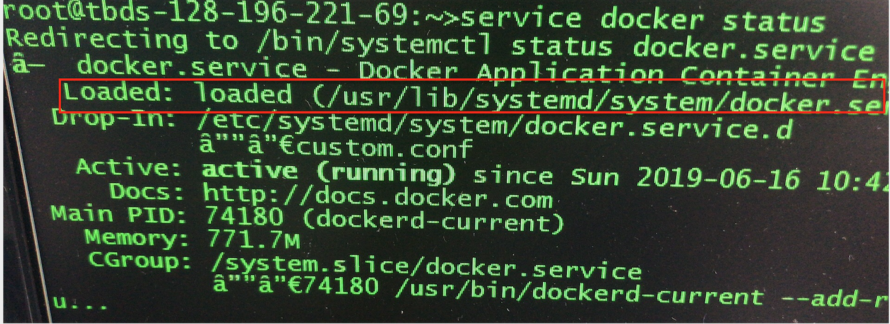

### Docker运维

### 一. 更改Docker存储目录

1. 查看 Docker 当前目录

   `docker info | grep "Root Dir"`

   ==> Docker Root Dir: /var/lib/docker

2. 停止Docker，将 /var/lib/docker 的文件迁移到要更改的目录

   `systemctl stop docker`

   `mv /var/lib/docker/* /data/docker/`

3. 修改 docker 配置

- 查找 docker 启动文件

  `service docker status`

  

- 修改目录

  ```shell
  ## 查看帮助
  dockerd-current -h 
  ## 修改启动服务
  vi /usr/lib/systemd/system/docker.service
  ```

  添加 ` --graph /data/docker `，即 ExecStart=/usr/bin/dockerd-current --graph /data/docker \

- 加载配置、重启docker

  ```shell
  systemctl daemon-reload
  systemctl restart docker.service
  ```

- 检查

  ```shell
  docker info | grep "Root Dir"
  journalctl -xefu docker 
  ```