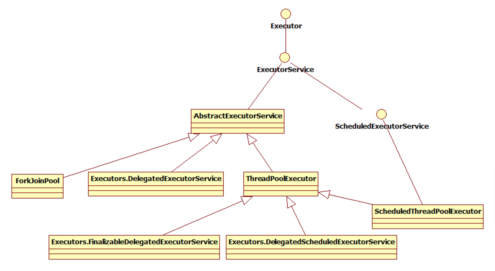
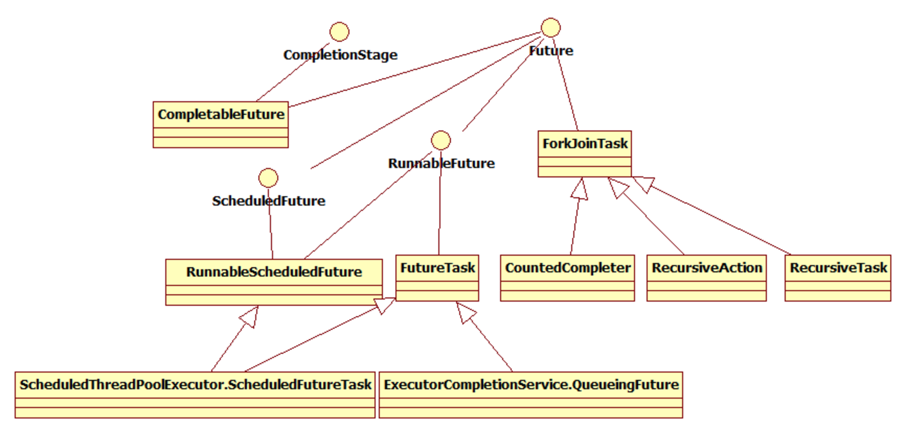
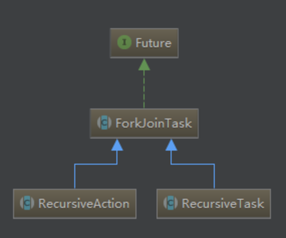
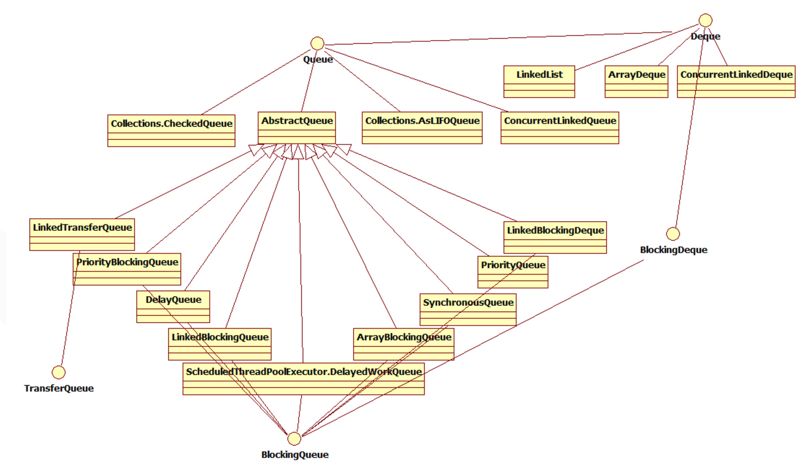

## JDK 并发框架

### Executor 相关类





#### Executor

一个抽象层面的核心接口，替换直接创建 Thread 实例。将任务本身和执行任务分离。

1. 线程池
2. 用 Task 替换 Thread
3. 将 Task 作为参数传入线程池

```java
// 只能接受 Runnable 接口参数
public interface Executor {
  	void execute(Runnable command);
}
```

示例

```java
Runnable task = () -> System.out.println("I am a task");
// 传统线程
Thread thread = new Thread(task);
thread.start();

// 并发框架
Executor executor = Executors.newSingleThreadExecutor();
executor.execute(task);
```

#### Executors

线程池工具类

#### Runnable

线程接口，使用 run() 方法。无返回值、无法捕捉异常。

```java
public interface Runnable {
    public abstract void run();
}
```

#### Callable

线程接口，使用 call() 方法。有返回值、可抛异常

```java
public interface Callable<V> {
  	V call() throws Exception;
}
```

#### Future

Future模式在请求发生时，会先产生一个Future凭证给发出请求的客户，它的作用就像是Proxy物件，同时，由一个新的执行线程持续进行目标物件的生成（Thread-Per-Message），真正的目标物件生成之后，将之设定至Future之中，而当客户端真正需要目标物件时，目标物件也已经准备好，可以让客户提取使用。

即，运行线程后，你可以把线程的返回值赋给Future并返回一个Future对象。如果你要get这个Future中的线程结果，就会被阻塞直到线程结束。

```java
public interface Future<V> {
  	// 取消正在执行的线程
    boolean cancel(boolean mayInterruptIfRunning);
    boolean isCancelled();
    boolean isDone();
  	// 阻塞方法，直到线程执行完成
  	V get() throws InterruptedException, ExecutionException;
  	V get(long timeout, TimeUnit unit) throws InterruptedException, ExecutionException, TimeoutException;
}
```

示例

```java
// 定义一个 Callable 
Callable<String> callTask = () -> {
    Thread.sleep(300L);
    return "I am a callable task, " + Thread.currentThread().getName();
};
ExecutorService executorService = Executors.newFixedThreadPool(3);
try {
    for (int i = 0; i < 10; i++) {
      Future<String> future = executorService2.submit(callTask);
      System.out.println("result is:");
      System.out.println(future.get(350, TimeUnit.MILLISECONDS));
    }
} finally {
  	executorService.shutdown();
}
```

#### RunnableFuture

```java
public interface RunnableFuture<V> extends Runnable, Future<V> {
    void run();
}
```

#### FutureTask

状态转换过程

* NEW -> COMPLETING -> NORMAL
* NEW -> COMPLETING -> EXCEPTIONAL
* NEW -> CANCELLED
* NEW -> INTERRUPTING -> INTERRUPTED

执行过程

```md
创建一个futureTask对象task
提交task到调度器executor等待调度或者在另外一个线程中执行task

等待调度中...

如果此时currentThread调取执行结果task.get(),会有几种情况
if task 还没有被executor调度或正在执行中
    阻塞当前线程，并加入到一个阻塞链表中waitNode
else if task被其它Thread取消，并取消成功 或task处于中断状态
    throw exception
else if task执行完毕，返回执行结果，或执行存在异常，返回异常信息
    
        
如果此时有另外一个线程调用task.get()
    
执行过程同上
```

示例

```java
ExecutorService executorService3 = Executors.newSingleThreadExecutor();
Callable<String> callTask = () -> {
    Thread.sleep(300L);
    return "I am a callable task, " + Thread.currentThread().getName();
};
FutureTask<String> ft = new FutureTask<String>(callTask);
try {
  executorService3.submit(ft);
  System.out.println(ft.get());
} finally {
  executorService3.shutdown();
}
```

#### ExecutorService

Executor接口的扩展类

```java
public interface ExecutorService extends Executor {
    // 异步方法。不会接受新的task，正在执行的task执行完成后按顺序被shutdown
    void shutdown();
  	// 阻止等待任务启动并试图停止当前正在执行的任务
    List<Runnable> shutdownNow();
    boolean isShutdown();
    boolean isTerminated();
    boolean awaitTermination(long timeout, TimeUnit unit) throws InterruptedException;
    <T> Future<T> submit(Callable<T> task);
    <T> Future<T> submit(Runnable task, T result);
    Future<?> submit(Runnable task);
  	// 批量执行任务，阻塞的方法
    <T> List<Future<T>> invokeAll(Collection<? extends Callable<T>> tasks) throws InterruptedException;
  	<T> List<Future<T>> invokeAll(Collection<? extends Callable<T>> tasks,
                                  long timeout, TimeUnit unit) throws InterruptedException;
    <T> T invokeAny(Collection<? extends Callable<T>> tasks) throws InterruptedException, ExecutionException;
    <T> T invokeAny(Collection<? extends Callable<T>> tasks,
                    long timeout, TimeUnit unit)
        throws InterruptedException, ExecutionException, TimeoutException;
}
```

#### ThreadPoolExecutor

以内部线程池的形式对外提供管理任务执行，线程调度，线程池管理等等服务；

```java
public ThreadPoolExecutor(int corePoolSize,
                          int maximumPoolSize,
                          long keepAliveTime,
                          TimeUnit unit,
                          BlockingQueue<Runnable> workQueue) {
  this(corePoolSize, maximumPoolSize, keepAliveTime, unit, workQueue,
       Executors.defaultThreadFactory(), defaultHandler);
}
```

- 1. 当线程池小于corePoolSize时，新提交任务将创建一个新线程执行任务，即使此时线程池中存在空闲线程。 

- 2. 当线程池达到corePoolSize时，新提交任务将被放入workQueue中，等待线程池中任务调度执行。

- 3. 当workQueue已满，且maximumPoolSize>corePoolSize时，新提交任务会创建新线程执行任务。

- 4. 当提交任务数超过maximumPoolSize时，新提交任务由RejectedExecutionHandler处理。

- 5. 当线程池中超过corePoolSize线程，空闲时间达到keepAliveTime时，关闭空闲线程。

- 6. 当设置allowCoreThreadTimeOut(true)时，线程池中corePoolSize线程空闲时间达到keepAliveTime也将关闭。

- 7. **最大线程数一般设为2N+1最好，N是CPU核数**。

- 8. 线程饱和策略（defaultHandler）

  - AbortPolicy：直接抛异常，默认。
  - CallerRunsPolicy：用调用者的线程来运行任务
  - DiscardOldestPolicy：丢弃线程队列里最近的一个任务，执行新提交的任务
  - DiscardPolicy：直接将新任务丢弃

#### ForkJoinPool

 **Work-Stealing**：线程池中每个线程都有一个互不影响的任务队列（双端队列），线程每次都从自己的任务队列的队头中取出一个任务来运行；如果某个线程对应的队列已空并且处于空闲状态，而其他线程的队列中还有任务需要处理但是该线程处于工作状态，那么空闲的线程可以从其他线程的队列的队尾取一个任务来帮忙运行。

即，空闲的线程去 “偷” 其他忙碌线程Queue中的任务来执行。

**适用场景**：

不同的任务的耗时相差比较大，即某些任务需要运行较长时间，而某些任务会很快的运行完成，这种情况下用 Work-Stealing 很合适。

**不使用场景**：

任务的耗时很平均时，不适合使用 Work-Stealing。因为窃取任务时也是需要抢占锁的，这会造成额外的时间消耗，而且每个线程维护双端队列也会造成更大的内存消耗。所以 `ForkJoinPool` 并不是 `ThreadPoolExecutor` 的替代品，而是作为对 `ThreadPoolExecutor` 的补充。

`ForkJoinPool` 和 `ThreadPoolExecutor` 都是 `ExecutorService`（线程池），但`ForkJoinPool` 的独特点在于：

1. `ThreadPoolExecutor` 只能执行 `Runnable` 和 `Callable` 任务，而 `ForkJoinPool` 不仅可以执行 `Runnable` 和 `Callable` 任务，还可以执行 Fork/Join 型任务 —— `ForkJoinTask` —— 从而满足并行地实现分治算法的需要；
2. `ThreadPoolExecutor` 中任务的执行顺序是按照其在共享队列中的顺序来执行的，所以后面的任务需要等待前面任务执行完毕后才能执行，而 `ForkJoinPool` 每个线程有自己的任务队列，并在此基础上实现了 Work-Stealing 的功能，使得在某些情况下 `ForkJoinPool` 能更大程度的提高并发效率。

**分治算法**（**Divide-and-Conquer**）：

*Fork* 在英文中有 **分叉** 的意思，而 *Join* 有 **合并** 的意思。`ForkJoinPool` 的功能也是如此：**Fork** 将大任务分叉为多个小任务，然后让小任务执行，**Join** 是获得小任务的结果，然后进行合并，将合并的结果作为大任务的结果 —— 并且这会是一个递归的过程 —— 因为任务如果足够大，可以将任务多级分叉直到任务足够小。

**ForkJoinTask 任务**



- `ForkJoinTask<V>` 用来专门定义 Fork/Join 型任务 —— 完成将大任务分割为小任务以及合并结果的工作。

一般我们不需要直接继承 `ForkJoinTask<V>`，而是继承它的子类 `RecursiveAction` 和 `RecursiveTask` 并实现对应的抽象方法 —— `compute`。

- `RecursiveAction` 是不带返回值的 Fork/Join 型任务，所以使用此类任务并不产生结果，也就不涉及到结果的合并。
- `RecursiveTask` 是带返回值的 Fork/Join 型任务，使用此类任务需要我们进行结果的合并。
  - 通过 `fork` 方法，我们可以产生子任务并执行；
  - 通过 `join` 方法，我们可以获得子任务的结果。

```java
/**
 * 计算 π = 4 * (1 - 1/3 + 1/5 - 1/7 + 1/9 - ……)
 * 
 * @author dante
 */
class PiEstimateTask extends RecursiveTask<Double> {
  	private static final long serialVersionUID = 8233700631993393170L;
	private final long begin;
	private final long end;
	private final long threshold; // 分割任务的临界值
  
  	public PiEstimateTask(long begin, long end, long threshold) {
		super();
		this.begin = begin;
		this.end = end;
		this.threshold = threshold;
	}
  
  	@Override
	protected Double compute() {
		if (end - begin <= threshold) {
			int sign = 1; // 符号，取 1 或者 -1
			double result = 0.0;
			for (long i = begin; i < end; i++) {
				result += sign / (i * 2.0 + 1);
				sign = -sign;
			}
			return result * 4;
		}

		// 分割任务
		long middle = (begin + end) / 2;
		System.out.println(Thread.currentThread().getName() + " -> " + middle);
		PiEstimateTask leftTask = new PiEstimateTask(begin, middle, threshold);
		PiEstimateTask rightTask = new PiEstimateTask(middle, end, threshold);

		leftTask.fork(); // 异步执行 leftTask
		rightTask.fork(); // 异步执行 rightTask

		double leftResult = leftTask.join(); // 阻塞，直到 leftTask 执行完毕返回结果
		double rightResult = rightTask.join(); // 阻塞，直到 rightTask 执行完毕返回结果

		return leftResult + rightResult; // 合并结果
	}
}

public class ForkJoinTest {
  	ForkJoinPool forkJoinPool = new ForkJoinPool(4);
  	// 计算 10 亿项，分割任务的临界值为 1 千万
    PiEstimateTask task = new PiEstimateTask(0, 1_000_000_000, 10_000_000);
  	// 阻塞，直到任务执行完毕返回结果
  	double pi = forkJoinPool.invoke(task); 
  	// 向线程池发送关闭的指令
  	forkJoinPool.shutdown(); 
  	System.out.println("π 的值：" + pi);
}

// 执行结果
ForkJoinPool-1-worker-1 -> 50
ForkJoinPool-1-worker-3 -> 75
ForkJoinPool-1-worker-2 -> 25
ForkJoinPool-1-worker-0 -> 62
ForkJoinPool-1-worker-0 -> 56
ForkJoinPool-1-worker-1 -> 12
ForkJoinPool-1-worker-1 -> 6
ForkJoinPool-1-worker-1 -> 18
ForkJoinPool-1-worker-0 -> 68
ForkJoinPool-1-worker-4 -> 37
ForkJoinPool-1-worker-4 -> 31
ForkJoinPool-1-worker-4 -> 43
ForkJoinPool-1-worker-0 -> 87
ForkJoinPool-1-worker-1 -> 81
ForkJoinPool-1-worker-2 -> 93
π 的值：3.298221951053789
```

### Queue相关



--