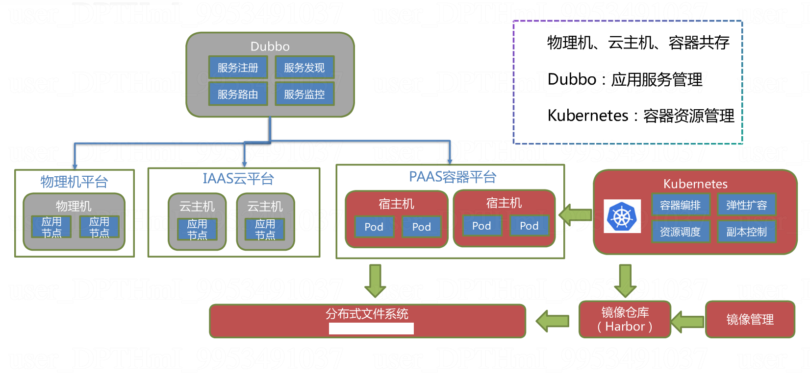
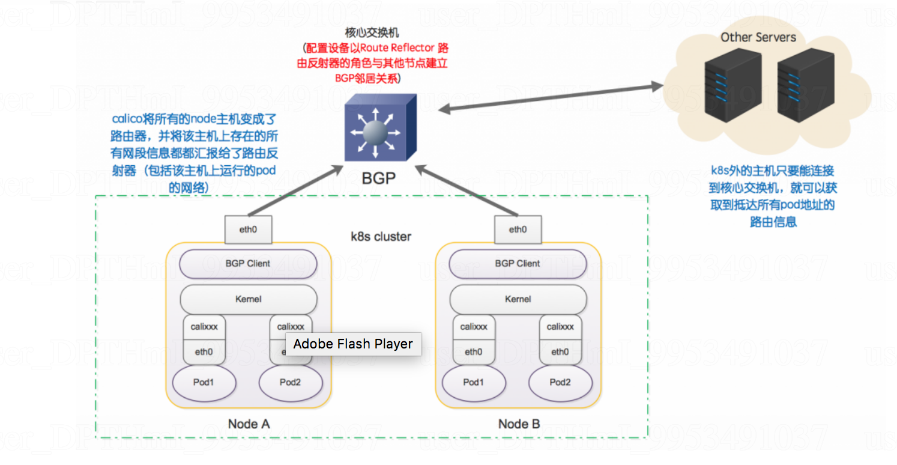

## Dubbo 积累

### 一. 概述

Apache Dubbo (incubating) |ˈdʌbəʊ| 是一款高性能、轻量级的开源Java RPC框架，它提供了三大核心能力：面向接口的远程方法调用，智能容错和负载均衡，以及服务自动注册和发现。


### 五. 容器化



**问题**

1. Pod IP 只在k8s集群内可见，导致无法与集群外的 dubbo 服务交互
2. dubbo 服务路由是基于IP的，但 Pod IP是会经常变的

**解决**

- **集群内外 IP 互通**
  - 方式一，k8s - ovs
  - 方式二，使用 Calico网络

  

  - 方式三，OKD externalIP

- **Provider IP白名单**

  1. Provider 和 Consumer 部署都在容器上，并且集群内网络已打通。

     该场景下，Provider 获取到的 Consumer 的 IP 是Consumer 所在 Pod 的 Pod IP，因为 k8s 中，Pod 重新部署后会将之前的 Pod Kill，重新启动一个新的 Pod，并为这个 Pod 重新分配IP，所以 Provider 会拿到一个新的IP，IP 变化的规律无法人工控制，故无法使用IP白名单的方式进行访问控制。

  2. Provider部署在容器中，Consumer 部署在容器外。

     该场景下，Consumer 的请求都通过容器的负载均衡服务器传递到具体的 Provider Service，在 Provider Service 对应的 Pod 中，使用 RpcContext.getContext().getRemoteHost() 获取到的IP都是 Provider Pod 的网关IP。Provider 无法对集群外的 Consumer 做IP 控制。

  3. Provider 和 Consumer 部署都在容器上，并集群内网络未打通。

     该场景下，Consumer 通过 Provider 暴露的外部 Socket 进行通信，Consumer 的请求过程同第二种情况，Provider 通过 RpcContext.getContext().getRemoteHost() 获取到的IP都是 Provider Pod 的网关IP。Provider 无法对集群内不同租户的 Consumer 做IP 控制。

  4. Provider 部署在集群外，Consumer 部署在容器上

     该场景下，Provider 通过 RpcContext.getContext().getRemoteHost() 获取的 Consumer IP 是 Consumer Pod 所在 Node 上的 IP。Provider无法对容器平台的Consumer做IP控制。

  **解决方案：**

  - 步骤一：容器云平台替换网络插件，使用Calico。

    对于场景2，Provider 可以获取到容器集群外 Consumer 的真实 IP，从而实现 IP 白名单功能。

  - 步骤二：对 Provider 新增一种访问授权方式，例如 OAuth2、OpenID等。

    对于场景1、3、4，OAuth2（或OpenID） 的授权方式都可以满足需求。

### 八. 参考资料

- http://dubbo.apache.org/books/dubbo-user-book/
- http://dubbo.apache.org/books/dubbo-admin-book/
- http://dubbo.apache.org/books/dubbo-dev-book/
- https://github.com/dubbo/dubbo-samples
- https://gitee.com/zhuyuehua/springboot2_dubbo
- https://github.com/apache/incubator-dubbo-spring-boot-project
- https://www.cnblogs.com/hzhuxin/category/1081811.html

### 九. 工作经验

1. Provider 需要在一个容器中运行（启动后不能退出），否则会触发 dubboShutdownHook。
2. 使用 dubbo-spring-boot-starter，设置 DUBBO_IP_TO_REGISTRY 和 DUBBO_PORT_TO_REGISTRY 后，Consumer 会找不到 Provider 提供的服务。

### 十. 源码导读

#### 1. Service Export

com.alibaba.dubbo.config.ServiceConfig

export()，是dubbo服务暴露的入口方法，被触发的时机有两个：

1. spring容器初始化完成所有的bean实例后，通过事件机制触发

2. 实现InitializingBean的方法中进行触发

**export()**

```java
public synchronized void export() {
    if (provider != null) {
        if (export == null) {
            export = provider.getExport();
        }
        if (delay == null) {
            delay = provider.getDelay();
        }
    }
    if (export != null && !export) {
        return;
    }

    if (delay != null && delay > 0) {
        // 如果要进行延迟暴露，则开启一个子线程，在子线程中进行服务暴露的工作
        delayExportExecutor.schedule(new Runnable() {
            @Override
            public void run() {
                doExport();
            }
        }, delay, TimeUnit.MILLISECONDS);
    } else {
        doExport();
    }
}
```

**doExport()**

```java
 protected synchronized void doExport() {
     // 如果是已经解除暴露的接口则抛出异常
     if (unexported) {
         throw new IllegalStateException("Already unexported!");
     }
     // 如果已经暴露则不需要重复暴露 
     if (exported) {
         return;
     }
     exported = true;
     // ... 检查provider，application，module，registries，monitor这些参数是否为空
     // ref是接口实现类引用，GenericService是泛接口,这个方式主要用于服务器端没有API接口及模型类元的情况，参数及返回值中的所有POJO均用Map表示，通常用于框架集成，比如：实现一个通用的远程服务Mock框架，可通过实现GenericService接口处理所有服务请求。
     if (ref instanceof GenericService) {
         interfaceClass = GenericService.class;
         if (StringUtils.isEmpty(generic)) {
             generic = Boolean.TRUE.toString();
         }
     } else {
         try {
             interfaceClass = Class.forName(interfaceName, true, Thread.currentThread()
                                            .getContextClassLoader());
         } catch (ClassNotFoundException e) {
             throw new IllegalStateException(e.getMessage(), e);
         }
         checkInterfaceAndMethods(interfaceClass, methods);
         checkRef();
         generic = Boolean.FALSE.toString();
     }
     
     // stub设为true，表示使用缺省代理类名，即：接口名 + Local后缀，服务接口客户端本地代理类名，用于在客户端执行本地逻辑，如本地缓存等，该本地代理类的构造函数必须允许传入远程代理对象，构造函数如：public XxxServiceLocal(XxxService xxxService)
     if (stub != null) {
         if ("true".equals(stub)) {
             stub = interfaceName + "Stub";
         }
         Class<?> stubClass;
         try {
             stubClass = ClassHelper.forNameWithThreadContextClassLoader(stub);
         } catch (ClassNotFoundException e) {
             throw new IllegalStateException(e.getMessage(), e);
         }
         if (!interfaceClass.isAssignableFrom(stubClass)) {
             throw new IllegalStateException("The stub implementation class " + stubClass.getName() + " not implement interface " + interfaceName);
         }
     }
     ...
     // 暴露服务地址
     doExportUrls();
 }
```

**doExportUrls()**

```java
private void doExportUrls() {
    List<URL> registryURLs = loadRegistries(true);	// 获取注册中心的配置
    for (ProtocolConfig protocolConfig : protocols) {	// 获取配置的服务暴露协议
        // 真正的暴露，通过协议和注册中心去完成暴露
        doExportUrlsFor1Protocol(protocolConfig, registryURLs); 
    }
}

// doExportUrlsFor1Protocol 解读，注册中心为 Zookeeper 
String name = protocolConfig.getName();
if (name == null || name.length() == 0) {
    name = "dubbo";	// 默认使用 dubbo 协议
}
// 服务注册的地址
String host = this.findConfigedHosts(protocolConfig, registryURLs, map);
...
/**
	Register & bind IP address for service provider, can be configured separately.
    配置优先级: 
    环境变量 -> 
    java system properties -> 
    host property in config file ->
    /etc/hosts -> 
    default network address -> 
    first available network address
**/
private String findConfigedHosts(ProtocolConfig protocolConfig, List<URL> registryURLs, Map<String, String> map) {
    boolean anyhost = false;
    // 通过 DUBBO_IP_TO_BIND 配置协议 IP
    String hostToBind = getValueFromConfig(protocolConfig, Constants.DUBBO_IP_TO_BIND);
    if (hostToBind != null && hostToBind.length() > 0 && isInvalidLocalHost(hostToBind)) {
        throw new IllegalArgumentException("Specified invalid bind ip from property:" + Constants.DUBBO_IP_TO_BIND + ", value:" + hostToBind);
    }

    // if bind ip is not found in environment, keep looking up
    if (hostToBind == null || hostToBind.length() == 0) {
        hostToBind = protocolConfig.getHost();
        if (provider != null && (hostToBind == null || hostToBind.length() == 0)) {
            hostToBind = provider.getHost();
        }
        if (isInvalidLocalHost(hostToBind)) {
            anyhost = true;
            try {
                // 获取本地主机的IP地址
                hostToBind = InetAddress.getLocalHost().getHostAddress();
            } catch (UnknownHostException e) {
                logger.warn(e.getMessage(), e);
            }
            if (isInvalidLocalHost(hostToBind)) {
                if (registryURLs != null && !registryURLs.isEmpty()) {
                    for (URL registryURL : registryURLs) {
                        try {
                            Socket socket = new Socket();
                            try {
                                SocketAddress addr = new InetSocketAddress(registryURL.getHost(), registryURL.getPort());
                                socket.connect(addr, 1000);
                                hostToBind = socket.getLocalAddress().getHostAddress();
                                break;
                            } finally {
                                try {
                                    socket.close();
                                } catch (Throwable e) {
                                }
                            }
                        } catch (Exception e) {
                            logger.warn(e.getMessage(), e);
                        }
                    }
                }
                if (isInvalidLocalHost(hostToBind)) {
                    hostToBind = getLocalHost();
                }
            }
        }
    }

    map.put(Constants.BIND_IP_KEY, hostToBind);

    // 通过 DUBBO_IP_TO_REGISTRY 配置注册 IP
    String hostToRegistry = getValueFromConfig(protocolConfig, Constants.DUBBO_IP_TO_REGISTRY);
    if (hostToRegistry != null && hostToRegistry.length() > 0 && isInvalidLocalHost(hostToRegistry)) {
        throw new IllegalArgumentException("Specified invalid registry ip from property:" + Constants.DUBBO_IP_TO_REGISTRY + ", value:" + hostToRegistry);
    } else if (hostToRegistry == null || hostToRegistry.length() == 0) {
        // bind ip 可做为 registry ip 的默认值
        hostToRegistry = hostToBind;
    }

    map.put(Constants.ANYHOST_KEY, String.valueOf(anyhost));

    return hostToRegistry;
}
```

**ZookeeperRegistry**

```java
// 注册到 Zookeeper，com.alibaba.dubbo.registry.zookeeper.ZookeeperRegistry
// url:  dubbo://10.71.225.87:20880/o.d.s...o.a.s.IAnnotateService?anyhost=true...
@Override
protected void doRegister(URL url) {
    try {
        zkClient.create(toUrlPath(url), url.getParameter(Constants.DYNAMIC_KEY, true));
    } catch (Throwable e) {
        throw new RpcException("Failed to register " + url + " to zookeeper " + getUrl() + ", cause: " + e.getMessage(), e);
    }
}
```

