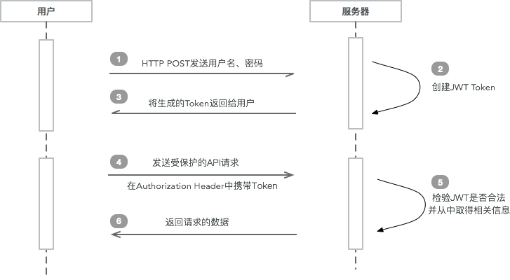

## JWT 说明

### 一. 概念

JSON Web Token (JWT), 是为了在网络应用环境间传递声明而执行的一种基于JSON的开放标准（[(RFC 7519](https://tools.ietf.org/html/rfc7519)).该token被设计为紧凑且安全的，特别适用于分布式站点的单点登录（SSO）场景。JWT的声明一般被用来在身份提供者和服务提供者间传递被认证的用户身份信息，以便于从资源服务器获取资源，也可以增加一些额外的其它业务逻辑所必须的声明信息，该token也可直接被用于认证，也可被加密。（**Secret** 或者 a public/private key pair using **RSA**）。

- 紧凑性 (Compact)：内容小，JWT 可以通过 **URL**、**POST 参数**、**HTTP header** 等进行传输。
- 独立性 (Self-contained)：Payload 中包含了所有必需的信息，可以避免去多次查询DB。

#### 1. 使用场景

- 认证

  - Session 认证：服务器存储用户登录信息，客户端浏览器保存到 cookie 中。

    - 服务器无法无限制存储用户登录信息，Session 通常都保存在内存。
    - 分布式部署困难，因为每台服务器都存有状态性信息，限制了负载均衡能力。
    - **CSRF**，cookie如果被截获，用户就会很容易受到跨站请求伪造的攻击。

  - [OAuth 认证](OAuth2 说明.md)：比较复杂，若要实现一套开放平台，可采用此方式。

  - JWT 认证

    

- 信息交换：使用 public/private key pairs 签名（sign）保证安全性，将信息通过 payload 进行交换。

#### 2. 结构

JWT 由三部分组成，**Header**、**Payload**、**Signature**，他们通过符号 **==.==** 进行分隔。即：`header.payload.signature` 。

- **Header**：两部分组成，类型 **typ**（type） 和 算法 **alg**（algorithm）。

  ```json
  {
    "alg": "HS256",
    "typ": "JWT"
  }
  ```

- **Payload**：包含数据声明（Claim），可放多个。**（不能放敏感信息）**

  ```json
  {
      "sub":"wang",			// 用户名 subject
      "created":1489079981393, // 创建时间
      "exp":1489684781		// 过期时间
  }
  ```

  **标准声明：**

  ```properties
  iss: jwt签发者
  sub: jwt所面向的用户
  aud: 接收jwt的一方
  exp: jwt的过期时间，这个过期时间必须要大于签发时间
  nbf: 定义在什么时间之前，该jwt都是不可用的.
  iat: jwt的签发时间
  jti: jwt的唯一身份标识，主要用来作为一次性token,从而回避重放攻击。
  ```

- **Signature**：签名，根据 秘钥、Header 中的算法，将 编码（Base64）后的Header、Payload 进行签名

  ```javascript
  HMACSHA256(
    base64UrlEncode(header) + "." +
    base64UrlEncode(payload),
    secret)
  ```


#### 3. 使用方法

一般是在请求头里加入`Authorization`，并加上`Bearer`标注：

```sh
Post 'api/user/1'
headers: {
    'Authorization': 'Bearer ' + token
}
```

### 二. 跨域请求

​	跨域，指的是浏览器不能执行其他网站的脚本。它是由浏览器的同源策略造成的，是浏览器对[JavaScript](http://lib.csdn.net/base/javascript)施加的安全限制。（**同源是指，域名，协议，端口均相同**）

**解决方法：**

- **JSONP**：首先在客户端注册一个callback (如:'jsoncallback'), 然后把callback的名字(如:jsonp1236827957501)传给服务器。注意：服务端得到callback的数值后，要用jsonp1236827957501(......)把将要输出的json内容包括起来，此时，服务器生成 json 数据才能被客户端正确接收。只支持 GET 请求

```javascript
$.ajax({
   async:false,
   url: http://跨域的dns/document!searchJSONResult.action,
   type: "GET",
   dataType: 'jsonp',
   jsonp: 'jsoncallback',
   data: qsData,
   timeout: 5000,
   beforeSend: function(){
   		//jsonp 方式此方法不被触发.原因可能是dataType如果指定为jsonp的话,就已经不是ajax事件了
   },
   success: function (json) {//客户端jquery预先定义好的callback函数,成功获取跨域服务器上的json数据后,会动态执行这个callback函数
   if(json.actionErrors.length!=0){
           alert(json.actionErrors);
     }
       genDynamicContent(qsData,type,json);
   },
   complete: function(XMLHttpRequest, textStatus){
   	   $.unblockUI({ fadeOut: 10 }); 
   },
   error: function(xhr){
    //jsonp 方式此方法不被触发.原因可能是dataType如果指定为jsonp的话,就已经不是ajax事件了
    //请求出错处理
    alert("请求出错(请检查相关度网络状况.)");
   }
});
```

- **跨域资源共享 （ CORS ）**

  ​	将跨域的访问控制权交给服务器，是一种网络浏览器的技术规范，它为Web服务器定义了一种方式，允许网页从不同的域访问其资源。而这种访问是被**同源策略**所禁止的。CORS系统定义了一种浏览器和服务器交互的方式来确定是否允许跨域请求。

  ```properties
  ## 允许跨域的请求源，* 表示任何网站都可以访问该资源
  Access-Control-Allow-Origin: *
  ```

  **Spring Boot**

  - 方式1

  ```java
  @Configuration
  public class CorsConfig {
      @Bean
      public FilterRegistrationBean corsFilter() {
          UrlBasedCorsConfigurationSource source = new UrlBasedCorsConfigurationSource();
          CorsConfiguration config = new CorsConfiguration();
          config.setAllowCredentials(true);
          // 设置你要允许的网站域名，如果全允许则设为 *
          config.addAllowedOrigin("http://localhost:4200");
          // 如果要限制 HEADER 或 METHOD 请自行更改
          config.addAllowedHeader("*");
          config.addAllowedMethod("*");
          source.registerCorsConfiguration("/**", config);
          FilterRegistrationBean bean = new FilterRegistrationBean(new CorsFilter(source));
          // 这个顺序很重要哦，为避免麻烦请设置在最前
          bean.setOrder(0);
          return bean;
      }
  }
  ```

  - 方式2

  ```java
  @Configuration
  public class MVCConfig extends WebMvcConfigurerAdapter {
  	@Override
  	public void addCorsMappings(CorsRegistry registry) {
  		registry.addMapping("/**");	// 表示全路径跨域
  	}	
  }
  ```

  - 方式3

    局部控制，在类或方法上添加注解 @CrossOrigin。

  ```java
  /**
   * origins 默认是 *
   */
  @CrossOrigin(origins = "http://localhost:8080")
  @GetMapping("/query_all")
  public List<TeacherPO> queryTeachers() {
      return teacherMapper.queryTeachers();
  }
  ```

### 三. Java 客户端

1. 添加依赖

   ```xml
   <dependency>
       <groupId>io.jsonwebtoken</groupId>
       <artifactId>jjwt</artifactId>
       <version>0.7.0</version>
   </dependency>
   ```

2. 生成 Token

   ```java
   // key - RSA private_key
   public static String generateToken(Key key) {
       Date IssuedA = Date.from(Instant.now());
       Date expDate = new Date(IssuedA.getTime() + 120000L);
       Map<String, Object> map = new HashMap<>();
       map.put("email", "dantefreedom@gmail.com");
       map.put("infos", Arrays.asList("AAA", "BBB"));
       Claims claim = new DefaultClaims(map);
       claim.setId("123456");
       claim.setSubject("dante");
       claim.setIssuedAt(IssuedA);
       claim.setExpiration(expDate);

       String compactJws = Jwts.builder()
         .setHeaderParam("typ", "jwt")
         .setSubject("Joe")
         .setClaims(claim)
         .signWith(SignatureAlgorithm.RS256, key).compact();
     
       System.out.println(compactJws);
       return compactJws;
   }
   ```

3. 解析 Token

   ```java
   // key - RSA private_key
   public static void parseToken(Key key, String token) {
       try {
         Jws<Claims> parseClaimsJws = Jwts.parser().setSigningKey(key).parseClaimsJws(token);
         //OK, we can trust this JWT
         JwsHeader<?> header = parseClaimsJws.getHeader();
         Claims body = parseClaimsJws.getBody();
         String sign = parseClaimsJws.getSignature();

         System.out.println(header.getType() + ' ' + header.getAlgorithm());
         System.out.println(body);
         System.out.println(sign);
       } catch (SignatureException | MalformedJwtException e) {
         // don't trust the JWT!
         // jwt 解析错误
       } catch (ExpiredJwtException e) {
         // jwt 已经过期，在设置jwt的时候如果设置了过期时间，这里会自动判断jwt是否已经过期，如果过期则会抛出这个异常，我们可以抓住这个异常并作相关处理。
         System.out.println(e.getMessage());
       }

   ```

### 八. 参考资料

- https://jwt.io/introduction/
- http://www.jianshu.com/p/576dbf44b2ae
- https://github.com/jwtk/jjwt
- https://www.jianshu.com/p/6307c89fe3fa?utm_campaign=maleskine&utm_content=note&utm_medium=seo_notes&utm_source=recommendation
- https://stackoverflow.com/questions/33921375/zuul-api-gateway-authentication?rq=1
- https://stackoverflow.com/questions/33921375/zuul-api-gateway-authentication
- http://www.ruanyifeng.com/blog/2016/04/cors.html
- http://blog.csdn.net/dalangzhonghangxing/article/details/52911230 （处理PreflightRequest）