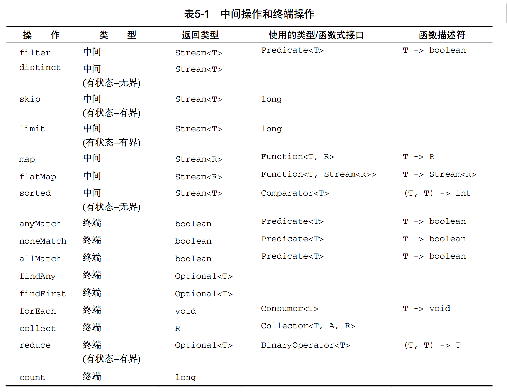
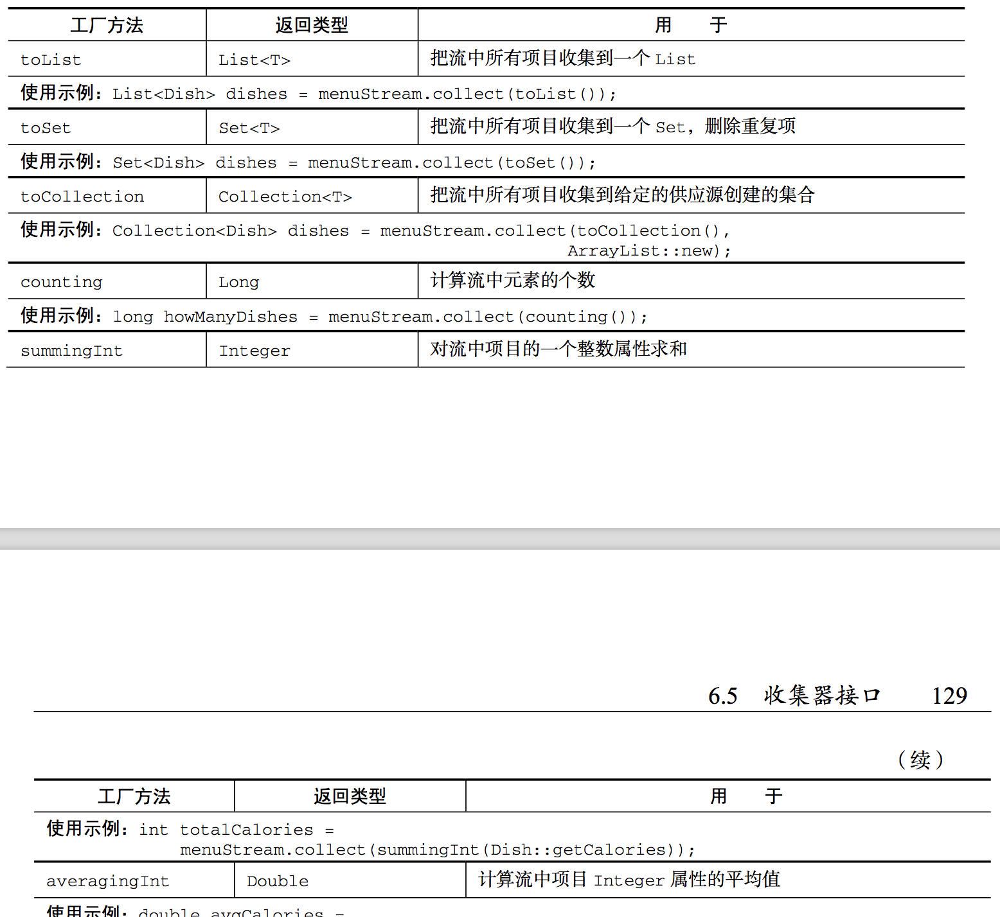
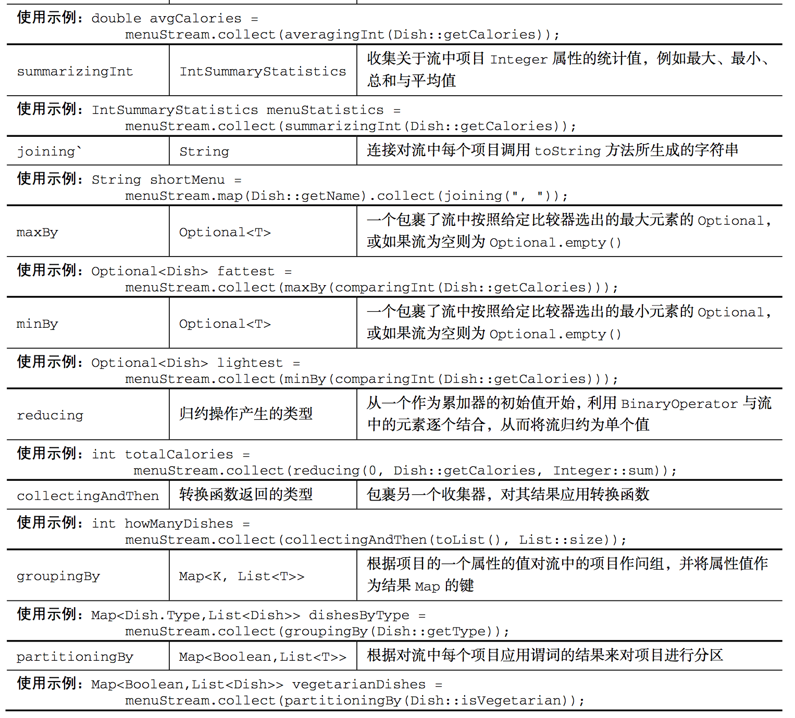
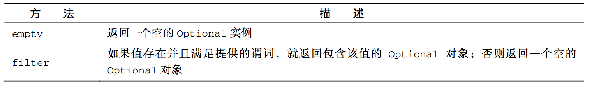
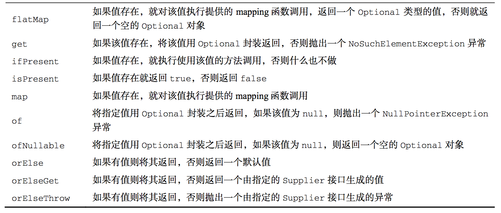

## Java 积累

### 1. 尾-调优化

（Java不支持）尾递归，进入下一个函数不再需要上一个函数的环境了，得出结果以后直接返回。即，操作的**最后一步**是调用自身的递归。

**调用帧**（call frame）：函数调用会在内存形成一个"调用记录"，又称"调用帧"（call frame），保存调用位置和内部变量等信息。如果在函数A的内部调用函数B，那么在A的调用记录上方，还会形成一个B的调用记录。等到B运行结束，将结果返回到A，B的调用记录才会消失。如果函数B内部还调用函数C，那就还有一个C的调用记录栈，以此类推。

**优点**：进入最后一步后不再需要参考外层函数（caller）的信息，因此没必要保存外层函数的stack，递归需要用的stack只有目前这层函数的，因此避免了栈溢出风险。

参考：http://www.ruanyifeng.com/blog/2015/04/tail-call.html

```java
static long factorialTailRecursive(long n) {
    return factorialHelper(1, n);
}
static long factorialHelper(long acc, long n) {
    return n == 1 ? 1 : factorialHelper(acc * n, n - 1);
}
```

### 2. 函数式接口

只定义一个抽象方法（函数描述符）的接口。Lambda表达式适用于此类接口，例如：Runnable、Callable<V>、Predicate<T>等。@FunctionalInterface 用于表明定义了一个函数式接口，编译检查，不是必须的。

```java
Runnable r1 = () -> System.out.println("Hello Lambda");
Predicate<Apple> = (p1, p2) -> p2.getWeight().compareTo(p1.getWeight());
```

- Predicate<T>

  test(T t)，接受一个泛型参数，并返回一个boolean。

- Consumer<T>

  accept(T t)，接受并**改变**某个对象的内部值。

- Function<T,R>

  R apply(T t)，接受输入的参数并将对输入参数处理过后的结果返回的功能封装到一个方法内。

  ```java
  static String modify(Integer i, Function<Integer, String> func) {
    return func.apply(i);
  }

  System.out.println(modify(10, i -> "你好，" + i*i));
  ```

-  Supplier<T> 创建对象。

  ```java
  Supplier<Apple> sa = Apple::new;
  Apple apple = sa.get();
  ```

### 3. Lambda表达式

1. Lambda仅有一个类型需要推断的参数时，参数名称两边的括号也可以省略。

2. Lambda可以没有限制地捕获(也就是在其主体中引用)实例变量和静态变量，但局部变量必须显式声明为final。

3. Lambda的目标类型必须是函数式接口。

4. 方法引用

   ​	如果一个Lambda代表的只是“直接调用这个方法”，那最好还是用名称来调用它，而不是去描述如何调用它。方法引用是单一方法的Lambda的语法糖。

   语法：`目标引用::方法名`，即 `Apple:getWeight` ==> `(Apple a) -> a.getWeight()`。

   |                  Lambda                  |             等效的方法引用              |
   | :--------------------------------------: | :------------------------------: |
   |        (Apple a) -> a.getWeight()        |          Apple::weight           |
   | () -> Thread.currentThread().dumpStack() | Thread.currentTread()::dumpStack |
   |       (str, i) -> str.substring(i)       |        String::substring         |
   |   (String s) -> System.out.println(s)    |       System.out::println        |

   -  静态方法引用

      `Integer::parseInt`

   -  任意类型实例方法

      `String::length`，即引用一个对象的方法，而这个对象本身是 Lambda 的一个参数，Lambda表达式如

      `(String s) -> s.length()`。

   -  现有对象实例方法的方法引用

      ```java
      Apple apple = new Apple();
      apple::getWeight;
      ```

   -  构造函数

      1）默认构造函数

      ```java
      Supplier<Apple> c1 = Apple::new; // () -> new Apple();
      Apple p1 = c1.get();
      ```

      2）带参构造函数

      ```java
      Function<Integer, Apple> c1 = Apple::new; // (weight) -> new Apple(weight);
      Apple p1 = c1.apply(100);
      
      // (weight, color) -> new Apple(weight, color);
      BiFunction<Integer, String, Apple> c2 = Apple::new; 
      Apple p2 = c2.apply(150, "blue");
      ```

   5. 组合Lambda表达式

   - 逆序

   ```java
   Comparator<Apple> c = Comparator.comparing(Apple::getWeight);
   inventory.sort(comparing(Apple::getWeight).reversed());
   ```

   - 比较器链

   ```java
   // 先按重量排序，一样重时按照颜色排序
   inventory.sort(Comparator.comparing(Apple::getWeight).thenComparing(Apple::getColor));
   
   // 红苹果并且大于150斤或者绿苹果
   Predicate<Apple> redAndHeavyAppleOrGreen =
   	redApple.and(a -> a.getWeight() > 150)
   		    .or(a -> "green".equals(a.getColor()));
   ```

   - 函数复合

   Function接口提供两个默认方法 andThen 和 compose。

   ```java
   Function<Integer, Integer> f = x -> x + 1;
   Function<Integer, Integer> g = x -> x * 2;
   
   // andThen, 即 g(f(x))
   Function<Integer, Integer> h = g.andThen(g);
   int result = h.apply(1); // 返回 4
   
   // compose, 即 f(g(x))
   Function<Integer, Integer> h = f.compose(g);
   int result = h.apply(1); // 返回 3
   
   ```

### 4.* Stream API

流，从支持数据处理操作的源生成的一系列元素，即**源数据 -> 数据处理 -> 获取结果**。时间中分布的一组数据，只能**遍历一次**。

流操作有两类

- 中间操作(**Intermediate**)

  一个流可以后面跟随零个或多个 intermediate 操作。其目的主要是打开流，做出某种程度的数据映射/过滤，然后返回一个新的流，交给下一个操作使用。这类操作都是惰性化的（lazy），就是说，仅仅调用到这类方法，并没有真正开始流的遍历。

  ```spreadsheet
  map (mapToInt, flatMap 等)、 filter、 distinct、 sorted、 peek、 limit、 skip、 parallel、 sequential、 unordered
  ```

- 终端操作(**Terminal**)

  一个流只能有一个 terminal 操作，当这个操作执行后，流就被使用“光”了，无法再被操作。所以这必定是流的最后一个操作。Terminal 操作的执行，才会真正开始流的遍历，并且会生成一个结果，或者一个 side effect。

  ```spreadsheet
  forEach、 forEachOrdered、 toArray、 reduce、 collect、 min、 max、 count、 anyMatch、 allMatch、 noneMatch、 findFirst、 findAny、 iterator
  ```

- 短路操作(**Short-Circuiting**)

  - 对于一个 intermediate 操作，如果它接受的是一个无限大（infinite/unbounded）的 Stream，但返回一个有限的新 Stream。
  - 对于一个 terminal 操作，如果它接受的是一个无限大的 Stream，但能在有限的时间计算出结果。

  ```spreadsheet
  anyMatch、 allMatch、 noneMatch、 findFirst、 findAny、 limit
  ```

**使用详解**

#### 流的构造

```java
// 字符串
Stream stream = Stream.of("a", "b", "c");

// 数组
String[] arrayOfWords = {"Goodbye", "World"};
Stream<String> streamOfwords = Arrays.stream(arrayOfWords);

```

#### 映射

- **map**，map 生成的是个 1:1 映射，每个输入元素，都按照规则转换成为另外一个元素。

`Arrays.asList(1, 2, 3, 4).stream().map(n -> n * 2).collect(Collectors.toList());`

- **flatMap**，将Input Stream中的层级结构扁平化。把一个流中的每个值都换成另一个流，然后把所有的流**连接起来成为一个流**。

```java
// 提取单词中唯一的字母
List<String> words = Arrays.asList("hello","world");
List<String> singleWords = words.stream()
  .map(w -> w.split(""))
  .flatMap(Arrays::stream)
  .distinct()
  .collect(Collectors.toList());

// 返回总和能被3整除的数对
List<Integer> numbers1 = Arrays.asList(1, 2, 3);
List<Integer> numbers2 = Arrays.asList(3, 4);
List<int[]> pairs =
  numbers1.stream()
  .flatMap(i -> numbers2.stream()
           .filter(j -> (i + j) % 3 == 0)
           .map(j -> new int[]{i, j})
).collect(Collectors.toList());	
```

#### 归约

- **reduce**，主要作用是把 Stream 元素组合起来。它提供一个起始值（种子），然后依照运算规则（BinaryOperator），和前面 Stream 的第一个、第二个、第 n 个元素组合。从这个意义上说，字符串拼接、数值的 sum、min、max、average 都是特殊的 reduce。

```java
// 字符串连接，concat = "ABCD"
String concat = Stream.of("A", "B", "C", "D").reduce("", String::concat); 
// 求最小值，minValue = -3.0
double minValue = Stream.of(-1.5, 1.0, -3.0, -2.0).reduce(Double.MAX_VALUE, Double::min); 
// 求和，sumValue = 10, 有起始值
int sumValue = Stream.of(1, 2, 3, 4).reduce(0, Integer::sum);
// 求和，sumValue = 10, 无起始值
sumValue = Stream.of(1, 2, 3, 4).reduce(Integer::sum).get();
// 过滤，字符串连接，concat = "ace"
concat = Stream.of("a", "B", "c", "D", "e", "F").
 filter(x -> x.compareTo("Z") > 0).
 reduce("", String::concat);
```

- **Collectors.maxBy**

```java
// 找到重量最大的苹果
Optional<Apple> maxApple = invertory.stream()
  .collect(Collectors.maxBy(Comparator.comparing(Apple::getWeight)));
```

#### 匹配

**Match**

Stream 有三个 match 方法，从语义上说：

- allMatch：Stream 中全部元素符合传入的 predicate，返回 true
- anyMatch：Stream 中只要有一个元素符合传入的 predicate，返回 true
- noneMatch：Stream 中没有一个元素符合传入的 predicate，返回 true

```java
List<Person> persons = new ArrayList();
persons.add(new Person(1, "name" + 1, 10));
persons.add(new Person(2, "name" + 2, 21));
persons.add(new Person(3, "name" + 3, 34));
persons.add(new Person(4, "name" + 4, 6));
persons.add(new Person(5, "name" + 5, 55));
boolean isAllAdult = persons.stream().
 allMatch(p -> p.getAge() > 18);
System.out.println("All are adult? " + isAllAdult);
boolean isThereAnyChild = persons.stream().
 anyMatch(p -> p.getAge() < 12);
System.out.println("Any child? " + isThereAnyChild);
```



#### 原始类型流

**IntStream**、**LongStream**、**DoubleStream**，因为 boxing 和 unboxing 会很耗时，所以特别提供了对应的Stream。

```java
// 一个从1到 100的偶数流
IntStream evenNumbers = IntStream.rangeClosed(1, 100).filter(n -> n % 2 == 0);
System.out.println(evenNumbers.count());
```

#### 无限流

没有固定大小的流称为无限流。

- Stream.iterate

  ​	iterate方法接受一个初始值(在这里是0)，还有一个依次应用在每个产生的新值上的Lambda(UnaryOperator<T>类型)。

  ```java
  // 等差数列
  Stream.iterate(0, n -> n + 3).limit(10). forEach(x -> System.out.print(x + " "));
  ```

- Stream.generate

  ​	通过实现 Supplier 接口，可以生成流。这种情形通常用于随机数、常量的 Stream，或者需要前后元素间维持着某种状态信息的 Stream。

  ```java
  Stream.generate(new PersonSupplier())
    .limit(10)
    .forEach(p -> System.out.println(p.getName() + ", " + p.getAge()));
  private class PersonSupplier implements Supplier<Person> {
     private int index = 0;
     private Random random = new Random();
     @Override
     public Person get() {
   	   return new Person(index++, "StormTestUser" + index, random.nextInt(100));
     }
  }
  ```

#### 汇总

```java
// 所有苹果的总重量
Integer sumWeight = invertory.stream().collect(Collectors.summingInt(Apple::getWeight));
System.out.println("所有苹果的总重量：" + sumWeight);

int totalWeight = invertory.stream().mapToInt(Apple::getWeight).sum();
System.out.println("所有苹果的总重量：" + totalWeight);

int reducingSum = invertory.stream().collect(Collectors.reducing(0, Apple::getWeight, Integer::sum));
System.out.println("所有苹果的总重量：" + reducingSum);

// 统计信息：IntSummaryStatistics{count=4, sum=720, min=180, average=180.000000, max=180}
IntSummaryStatistics intSummary = invertory.stream().collect(Collectors.summarizingInt(Apple::getWeight));
System.out.println("统计信息：" + intSummary);
```

#### 分组、分区

- 分组

```java
// 把热量不到400卡路里的菜划分为“低热量”(diet)，热量400到700 卡路里的菜划为“普通”(normal)，高于700卡路里的划为“高热量”(fat)
public enum CaloricLevel { DIET, NORMAL, FAT }

Map<CaloricLevel, List<Dish>> dishesByCaloricLevel = menu.stream().collect(Collectors.groupingBy(d -> {
    if(d.getCalories() <= 400) {
        return CaloricLevel.DIET;
    } else if (dish.getCalories() <= 700) {
        return CaloricLevel.NORMAL;
    } else {
        return CaloricLevel.FAT;
    }
}));

// 多级分组
Map<Dish.Type, Map<CaloricLevel, List<Dish>>> dishesByTypeCaloricLevel = menu.stream().collect(
  groupingBy(Dish::getType,
   groupingBy(dish -> {
     if (dish.getCalories() <= 400) return CaloricLevel.DIET;
     	else if (dish.getCalories() <= 700) return CaloricLevel.NORMAL;
     else return CaloricLevel.FAT;
   })
 )
);
```

- 分区

  ​	分区是分组的特殊情况，由一个谓词**（返回一个布尔值的函数）**作为分类函数，它称分区函数。因为分区函数返回一个布尔值，这意味着得到的分组Map的键类型是Boolean，于是它最多可以分为两组——true是一组，false是一组。	

```java
// 按照素食分区，并按照菜肴类型分组
Map<Boolean, Map<Dish.Type, List<Dish>>> vegetarianDishesByType = menu.stream().collect(
	partitioningBy(Dish::isVegetarian, groupingBy(Dish::getType)));
```





#### 5. Optional

​	使用任何像 Optional 的类型作为字段或方法参数都是不可取的。Optional 只应设计为类库方法的, 可明确表示可能无值情况下的返回类型。 Optional 类型不可被序列化, 用作字段类型会出问题的，但应该提供一个访问方法，例如：

```java
public class Person {
    private Car car;
    public Optional<Car> getCarAsOptional() {
        return Optional.ofNullable(car);
    } 
}

// 推荐构造，Optional.ofNullable(obj)。当明确参数不为空时，可使用 Optional.of(obj)。
// 源码实现如下
public static <T> Optional<T> ofNullable(T value) {
    return value == null ? empty() : of(value);
}

// 取值，存在即返回, 无则提供默认值
return user.orElse(null); 
return user.orElse(UNKNOWN_USER);

// 存在即返回, 无则由函数来产生
return user.orElseGet(() -> findFromDatabase()); 

// map 新旧比较，例：获得用户名的大写形式
return user.map(u -> u.getUsername())
           .map(name -> name.toUpperCase())
           .orElse(null);
// Java8之前
User user = .....
if(user != null) {
  String name = user.getUsername();
  if(name != null) {
      return name.toUpperCase();
  } else {
      return null;
  }
} else {
    return null;
}
```





### 8. 参考

- https://github.com/java8/Java8InAction


- https://www.ibm.com/developerworks/cn/java/j-lo-java8streamapi/
- http://www.importnew.com/22060.html
- http://www.jdon.com/dl/best/java-1-8-optional-jpa-and-hibernate.html
- http://www.importnew.com/22060.html
- https://juejin.im/post/6844903791909666823（JVM GC 日志详解）


