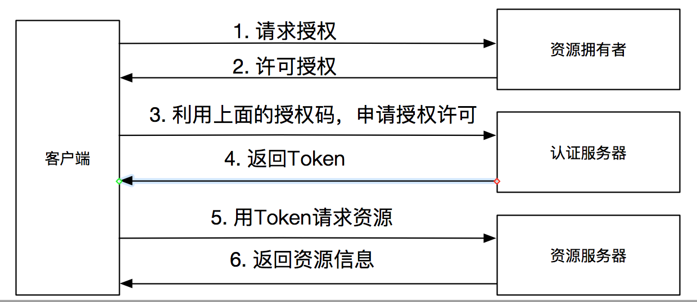
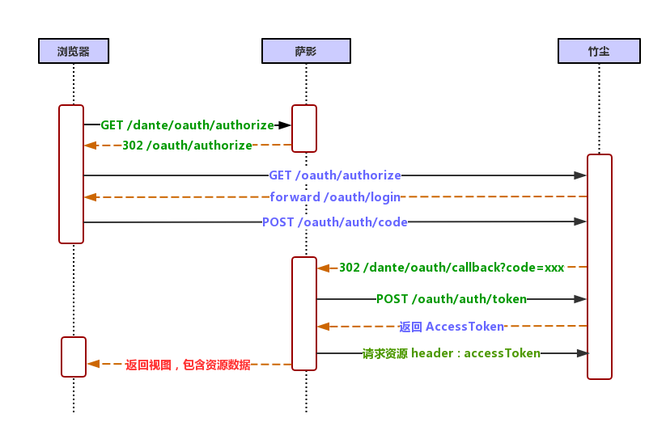

## OAuth2 说明

### 一. 概念

​	OAuth2是一种授权的协议，授权方和被授权方需要按照该协议去提供服务。

​	例如 Dockerhub 要使用你 Github中的资源进行镜像构建，那么Dockerhub 如何才能获取你 Github 中的资源？

1. 将你 Github 的帐号、密码告知 DockerHub，DockerHub用来登录 Github 获取授权，然后访问Github 中的资源。此种方式非常不安全，一旦 DockerHub 泄密，你的Github 的信息也将泄漏。

2. DockerHub 不需要知道用户密码就可以获取用户 Github 上的信息，即 OAuth2 的授权方式。 

### 二. 原理



#### 1. **OAuth2 的角色**

- **资源拥有者（Resource Owner）**

  DockerHub 的用户，对自己 Github 上的资源有授权能力。

- **客户端（Client）**

  DockerHub 平台，获得 Resource Owner 授权后，访问 Github 资源。

- **认证服务器（Authorization Server）**

  认证 Resource Owner 的身份并颁发授权令牌（Access Token），和 Resource Server 可以是一个服务器。

- **资源服务器（Resource Server）**

  Github 服务器，处理对资源的请求。

#### 2. OAuth流程

- **竹尘**：资源服务器和认证服务器

  - **授权码接口**

  ```http
  GET /oauth/authorize
  ```

  | 参数          | 说明                                                 |
  | ------------- | ---------------------------------------------------- |
  | client_id     | * 客户端 AppId（在 **==竹尘==** 注册提供）           |
  | redirect_uri  | * 客户端 Callback URL（**==竹尘==** 授权成功后回调） |
  | scope         | 客户端访问权限码（**==竹尘==** 端需要进行校验）      |
  | state         | 随机串，防止 CSRF                                    |
  | response_type | 授权类型，固定值  code，表示授权码模式               |

  - **访问令牌接口**

  ```http
  POST /oauth/auth/token
  ```

  | 参数          | 说明                                                         |
  | ------------- | ------------------------------------------------------------ |
  | client_id     | * 客户端 AppId（在 **==竹尘==** 注册提供）                   |
  | client_secret | * 客户端 App密钥（在 **==竹尘==** 注册提供）<br>**传递时使用竹尘提供的公钥进行加密，再进行Base64编码** |
  | code          | * 授权码接口生成的授权码 code                                |
  | redirect_uri  | 和授权码接口中的 redirect_uri 保持一致                       |
  | state         | 和授权码接口中的 state 保持一致                              |
  | **返回**      | **说明**                                                     |
  | access_token  | * 访问令牌                                                   |
  | token_type    | * 令牌类型                                                   |
  | expire_in     | 过期时间，单位：秒                                           |
  | refresh_token | 刷新令牌，可获取新的访问令牌                                 |

  - **API 接口**

  ```properties
  GET / POST / PUT / DELETE
  header 中参数
  Authorization: <token_type> <access_token>
  ```

- **萨影**：第三方应用客户端

  - **请求授权码**

  ```http
  GET /dante/oauth/authorize
  
  竹尘处理流程
  1. 重定向到竹尘认证URL
  redirect:<竹尘 ServerURL>/oauth/authorize
  2. 竹尘认证重定向到认证表单页面
  redirect:<竹尘 ServerURL>/oauth/login
  3. 认证表单action是授权码接口
  Submit <竹尘 ServerURL>/oauth/authorize
  4. 授权成功后，重定向到客户端CallbackUrl，即 redirect_uri
  redirect:redirect_uri<授权码+其他参数>
  ```

  - **回调URL中请求AccessToken**

  ```http
  GET /dante/oauth/callback
  
  使用竹尘返回的授权码去请求竹尘访问令牌接口，获取 AccessToken 后，按业务进行存储处理，之后再请求竹尘的资源接口时，带上AccessToken（一般加到 Header，例 Authorization=bearer AccessToken）
  ```

- **Client - Server 时序图**

  

### 三. Java 实现

参考：https://github.com/dante7qx/springboot-oauth.git

### 四. SpringSecurity OAuth2


### 五. OpenID

OAuth关注的是Authorization，即授权，用户能干什么？

OpenID侧重的是 Authentication，即认证，用户是谁？

### 八. 参考资料

- http://www.ruanyifeng.com/blog/2014/05/oauth_2_0.html

- http://jinnianshilongnian.iteye.com/blog/2038646
- https://www.cnblogs.com/flashsun/p/7424071.html