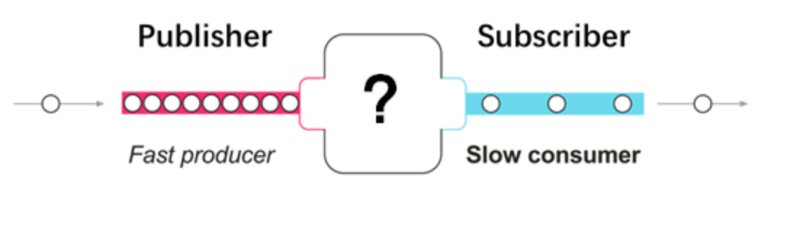
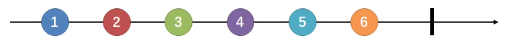
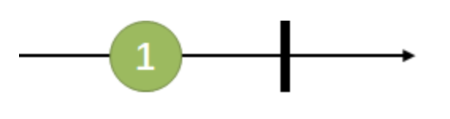
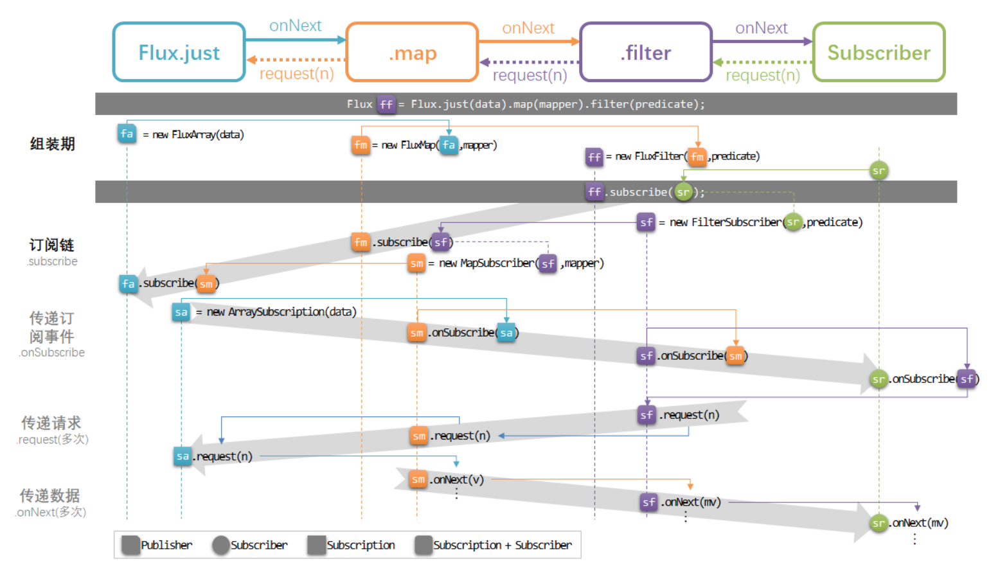

## Reactor 指南

### 一. 前言

#### 1. 响应式编程

​	响应式编程相当于 ==数据流（data stream） +   变化传递（propagation of change） +    流式编程（Reactor）==。

- “变化传递” 就相当于果汁流水线的管道；在入口放进橙子，出来的就是橙汁；放西瓜，出来的就是西瓜。
- 橙子和西瓜、以及机器中的果肉果汁以及残渣等，都是流动的“数据流”；
- 管道的图纸是用“声明式”的语言表示的。

#### 2. 引入目的

​	在如今互联网时代的大背景下，Web应用通常要面对高并发、海量数据的挑战，性能从来都是必须要考量的核心因素。Web 应用具有 I/O 密集的特点，I/O阻塞会带来比较大的性能损失或资源浪费。

```markdown
## 阻塞和非阻塞 - 调用者的状态
  - 当调用者调用了服务提供者的方法后，如果一直在等待结果返回，否则无法执行后续的操作，那就是阻塞状态。
  - 如果调用之后直接返回，从而可以继续执行后续的操作，那可以理解为非阻塞的。
## 同步和异步 - 服务提供者的能力
  - 当调用者调用了服务提供者的方法后，如果服务提供者能够立马返回，并在处理完成后通过某种方式通知到调用者，那可以理解为异步的。
  - 只是在处理完成后才返回，或者需要调用者再去主动查询处理是否完成，就可以理解为是同步的。
```

​	如何解决这些问题？

- 并行化：使用更多的线程和硬件资源。

  ​	增加处理线程，线程中同样是阻塞的代码。但是这种使用资源的方式会迅速面临 资源竞争和并发问题。并且带来了复杂性，而且容易造成浪费。例如：数据库连接池中的连接所在线程需要进入 idle 状态等待数据，从而浪费资源。 

- 提高执行效率（异步）

  ​	编写 **异步非阻塞** 代码。Java 的异步编程 Callback、Future 不具有可读写和可编程性，并且 Java Stream是一种同步的API。

  ​	因此，需要一种**异步非阻塞**的响应式库，即 **Reactor**，它提供了 **具备“异步非阻塞”特性和“流量控制”能力的数据流，即响应式流（Reactive Stream）。**

### 二. Reactor

#### 1. 工作原理


#### 2. 术语

**Publisher**：数据发布者

**Subscriber**：数据订阅者

**Back pressure**：回压机制

- **正常流**



​	当**Publisher**发出数据的速度超过**Subscriber**的消费速度时，数据就会积压在==管道==或==消费者==中。这样数据可能会被丢弃掉了或者OOM。

- **控制流**


​	数据流并不一生产出来就直接 push 到 Subscriber。而是由 Subscriber 向上游反馈流量请求，需要多少Publisher 就推送多少。通过 request 来制定具体的数量。

- **策略**

  - 缓存策略

    Subscriber 不能及时的处理向 Publisher 请求的数据。此策略下，Publisher 会将未处理的数据缓存起来。适用于数据准确性高的场景，持久介质可以是缓存、数据库。

  - 实时策略

    Publisher 不需要缓存来不及处理的数据，直接丢弃，Subscriber 而是到 Publisher 拿到最近的一个数据。适用于实效性强的场景，例如监控系统。

#### 3. 核心库

##### 3.1 Flux 和 Mono

​	Flux 和 Mono 用来定义 Publisher。Flux 代表一个包含 0~N 个元素的响应式序列，Mono 代表一个包含 0 / 1 个元素。Flux 和 Mono 都可以发出三种信号 “Data Signal”、“Error Signal”、“Complete Signal”。完成信号用于告知下游订阅者该数据流正常结束，错误信号终止数据流的同时将错误传递给下游订阅者。

- Flux：黑色箭头是时间轴。它连续发出“1” - “6”共6个元素值，以及一个完成信号。



- Mono：发出一个元素值后，又发出一个完成信号。



##### 3.2 常用操作

1. 数据流

   空数据流：没有发出任何元素，直接发出 Complete / Error Signal。

   无限数据流：没有发出 Error Signal 和 Complete Signal。

2. Subscribe

   在调用 `.subscribe()` 前，数据流不会进行任何处理。Reactor 中提供的 subscribe 方法。

```java
// 订阅并触发数据流
subscribe(); 
// 订阅并指定对正常数据元素如何处理
subscribe(Consumer<? super T> consumer); 
// 订阅并定义对正常数据元素和错误信号的处理
subscribe(Consumer<? super T> consumer,
          Consumer<? super Throwable> errorConsumer); 
// 订阅并定义对正常数据元素、错误信号和完成信号的处理
subscribe(Consumer<? super T> consumer,
          Consumer<? super Throwable> errorConsumer,
          Runnable completeConsumer); 
// 订阅并定义对正常数据元素、错误信号和完成信号的处理，以及订阅发生时的处理逻辑
subscribe(Consumer<? super T> consumer,
          Consumer<? super Throwable> errorConsumer,
          Runnable completeConsumer,
          Consumer<? super Subscription> subscriptionConsumer); 
```

3. 操作符

   map：将数据元素进行转换/映射，得到一个新元素。

   ```java
   public final <V> Flux<V> map(Function<? super T,? extends V> mapper)
   public final <R> Mono<R> map(Function<? super T, ? extends R> mapper) 
   ```

   flatmap：将每个数据元素转换/映射为一个流，然后将这些流合并为一个大的数据流。流的合并是异步的。

   ```java
   public final <R> Flux<R> flatMap(Function<? super T, ? extends Publisher<? extends R>> mapper)
   public final <R> Mono<R> flatMap(Function<? super T, ? extends Mono<? extends R>> transformer) 
   ```

   filter：对数据元素进行筛选。

   ```java
   public final Flux<T> filter(Predicate<? super T> tester)
   public final Mono<T> filter(Predicate<? super T> tester) 
   ```

   zip：多个流==**一对一**==的合并起来。

   ```java
   // 对两个Flux/Mono流每次各取一个元素，合并为一个二元组（Tuple2）
   // 在异步条件下，数据流的流速不同，使用zip能够一对一地将两个或多个数据流的元素对齐发出。
   public static <T1,T2> Flux<Tuple2<T1,T2>> zip(Publisher<? extends T1> source1,
                                             Publisher<? extends T2> source2)
   public static <T1, T2> Mono<Tuple2<T1, T2>> zip(Mono<? extends T1> p1, Mono<? extends T2> p2) 
   ```

   log：log() 记录日志。

   retry：重新对数据源进行订阅，重试是一个新的数据源，之前的数据序列已经在遇到 error signal 时终止了。

   ```java
   Flux.range(1, 6)
       .map(i -> 10 / (3 - i))
       .retry(1)
       .subscribe(System.out::println, System.err::println);
   Thread.sleep(200);
   ```

- 用于编程方式自定义生成数据流的`create`和`generate`等及其变体方法；
- 用于“无副作用的peek”场景的`doOnNext`、`doOnError`、`doOncomplete`、`doOnSubscribe`、`doOnCancel`等及其变体方法；
- 用于数据流转换的`when`、`and/or`、`merge`、`concat`、`collect`、`count`、`repeat`等及其变体方法；
- 用于过滤/拣选的`take`、`first`、`last`、`sample`、`skip`、`limitRequest`等及其变体方法；
- 用于错误处理的`timeout`、`onErrorReturn`、`onErrorResume`、`doFinally`、`retryWhen`等及其变体方法；
- 用于分批的`window`、`buffer`、`group`等及其变体方法；
- 用于线程调度的`publishOn`和`subscribeOn`方法。

##### 3.3 调度器与线程模型  

| Executors                   |                     Reactor  Schedulers                      |
| :-------------------------- | :----------------------------------------------------------: |
| **newCachedThreadPool**     | 弹性线程池， 它根据需要创建一个线程池，重用空闲线程。线程池如果空闲时间过长 （默认为 60s）就会被废弃。<br>**Schedulers.elastic() 和  Schedulers.newElastic()** |
| **newSingleThreadExecutor** | 对所有调用者都提供同一个线程来使用， 直到该调度器被废弃。如果你想使用独占的线程，请使用`Schedulers.newSingle()`。 <br>**Schedulers.single() 和 Schedulers.newSingle()** |
| **newFixedThreadPool**      | 固定大小线程池， 所创建线程池的大小与CPU个数等同 <br>**Schedulers.parallel() 和 Schedulers.newParallel()** |
| **newScheduledThreadPool**  |              以上三种都支持定时任务和周期性执行              |

   

```java
Flux.range(1, 1000)
    .map(...)
    .publishOn(Schedulers.elastic()).filter(...)
    .publishOn(Schedulers.parallel()).flatMap(...)
    .subscribeOn(Schedulers.single())
```

##### 3.4 回压

流量控制 ，subscribe(Subscriber subscriber)。

```java
Flux.range(1, 6)
    .doOnRequest(n -> System.out.println("请求的个数 " + n))
    .subscribe(new BaseSubscriber<Integer>() {
        // 在订阅的时候执行的操作
        @Override
        protected void hookOnSubscribe(Subscription subscription) {
            System.out.println("Subscribed and make a request...");
            // 订阅时首先向上游请求1个元素
            request(1);
        }

        // 每次在收到一个元素的时候的操作
        @Override
        protected void hookOnNext(Integer value) {
            try {
                // sleep 1秒钟来模拟慢的Subscriber
                TimeUnit.SECONDS.sleep(5);
            } catch (InterruptedException e) {
                e.printStackTrace();
            }
            // 每次收到的元素
            System.out.println("Get value [" + value + "]"); 
            // 每次处理完1个元素后再请求1个
            request(1); // 9
        }
    });
```

##### 3.5 响应式流规范

###### 1）特点

- 具有处理无限数量的元素的能力
- 按序处理
- 异步地传递元素
- 非阻塞回压（backpressure）

###### 2）接口

```java
// 1. Publisher 接口，元素的发布者，注册订阅者
public interface Publisher<T> {
    public void subscribe(Subscriber<? super T> s);
}

// 2. Subscriber 接口，接受元素并作出响应的订阅者
public interface Subscriber<T> {
    public void onSubscribe(Subscription s);
    public void onNext(T t);
    public void onError(Throwable t);
    public void onComplete();
}

// 3. Subscription 接口，Publisher和Subscriber的“中间人”，只限订阅者可以调用。
public interface Subscription {
    public void request(long n);
    public void cancel();
}

// 4. 定义一个中间处理的处理流
public static interface Processor<T,R> extends Subscriber<T>, Publisher<R> {}
```

###### 3）工作流程

```sequence
Publisher->Subscriber: 调用 subscribe(Subscriber s)
Note left of Publisher: 注册一个 Subscriber，并触发 onSubscribe 方法
Subscriber->Publisher: 调用 Subscription request(n)
Note right of Subscriber: 通过 Subscription 向 Publisher 发送请求
Publisher->Subscriber: 调用 Subscriber onNext(T t) 发送元素
Note left of Publisher: 持续调用 onNext 发送数据
Publisher->Subscriber: 数据发送完毕，调用onComplete通知Subscriber
```



###### 4） 数据流


##### 3.6 实际案例

... ...

### 三. Spring WebFlux


### 四. 参考资料

- https://htmlpreview.github.io/?https://github.com/get-set/reactor-core/blob/master-zh/src/docs/index.html#intro-reactive
- http://chillyc.info/2017/jdk9/Java9-Flow-feature/
- http://blog.51cto.com/liukang/2090163
- https://blog.csdn.net/column/details/20300.html
- https://docs.spring.io/spring/docs/current/spring-framework-reference/web-reactive.html