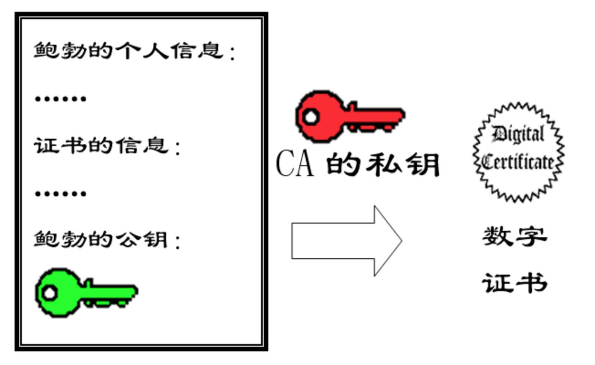
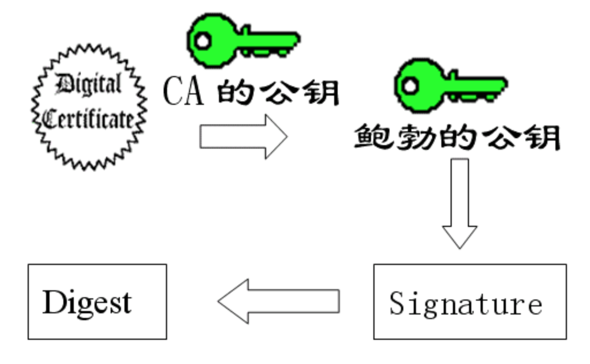

## 公钥与私钥

### 一. 工作原理

1. Server 为每个 Client 生成密钥对，即公钥和私钥。将公钥发送到每一个Client，自己保留私钥。

```java
public static Map<String, Object> initKey() throws Exception {
    // 获得对象 KeyPairGenerator 参数 RSA 2048个字节
    KeyPairGenerator keyPairGen = KeyPairGenerator.getInstance(KEY_ALGORITHM);
    keyPairGen.initialize(2048);
    // 通过对象 KeyPairGenerator 获取对象KeyPair
    KeyPair keyPair = keyPairGen.generateKeyPair();

    // 通过对象 KeyPair 获取RSA公私钥对象RSAPublicKey RSAPrivateKey
    RSAPublicKey publicKey = (RSAPublicKey) keyPair.getPublic();
    RSAPrivateKey privateKey = (RSAPrivateKey) keyPair.getPrivate();
    // 公私钥对象存入map中
    Map<String, Object> keyMap = new HashMap<String, Object>(2);
    keyMap.put(PUBLIC_KEY, publicKey);
    keyMap.put(PRIVATE_KEY, privateKey);

    // 把公私钥保存到硬盘上
    saveKey(publicKey, KEY_PATH + File.separator + "public_key");
    saveKey(privateKey, KEY_PATH + File.separator + "private_key");
    return keyMap;
}
```

2. Client - Server 通信

   **a.** Client 使用公钥对信息进行加密，然后发送给 Server。

   **b.** Server 接收到 Client 的密文后，使用私钥进行解密。

   **c.** Server 回复信息

   - 对回复信息进行 Hash，生成摘要 digest。
   - Server 使用私钥对 digest 进行加密，生成数字签名 Signature。
   - Server 将回复信息和 Signature 一同发送给 Client。

   

   

   **d.** Client 使用公钥对签名进行解密，得到 Server 发送的摘要 digest 信息。Client 对 Server 的回复信息进行 Hash，与 Server 发送的摘要 digest 信息进行比较。一致，则Server回复信息未被修改。

### 二. CA 公钥认证

​	Client 如何保证使用的公钥就是 Server 提供给他的？需要 CA（Certificate Authority）为 Server 的公钥做认证。

1. CA 使用 CA中心的私钥对 Server 的公钥 和 Server的一些基本身份信息进行加密，生成 CA 数字证书，即 **Digital Certificate**。



2. Server 将自己的回复信息、Signature、CA 数字证书一同发给 Client。

   

   3. Client 使用 CA 的公钥对 Server 信息进行解密，获取 Server 的公钥（可信的 Server 公钥）。

   4. Client 使用 Server 公钥对签名进行解密，得到 Server 发送的摘要 digest 信息。Client 对 Server 的回复信息进行 Hash，与 Server 发送的摘要 digest 信息进行比较。一致，则Server回复信息未被修改。

      

### 三. Https

https = http + ssl（Secure Sockets Layer，安全套接层）。具体的流程如下

1. Client 向 Server 发送解密请求，https://xx.xx.com。
2. Server 将私钥加密网页，CA证书一同发送给 Client。
3. Client （本地证书管理器）确认 Server 的证书是否有效。随机生成 Client 的**RSA**公私钥、**session密钥**，然后使用 Server 的公钥加密【Client 公钥、session密钥】，发送给 Server。
4. Server 使用私钥进行解密，并随机生成 session密钥，并使用 Client 公钥进行加密，然后发送给 Client。
5. Client 使用私钥进行解密，存储 Server  session密钥，通过Client **session密钥**加密 Http 数据，发送给 Server。
6. Server 使用 Server session密钥加密 Http 数据。（Server 和 Client session 密钥每次随机，并且对称加密）。

### 四. 实战

### 五. 参考资料

- http://www.cnblogs.com/shijingjing07/p/5965792.html
- https://www.cnblogs.com/xinzhao/p/4949344.html
- https://ningyu1.github.io/site/post/51-ssl-cert/ （OpenSSL）