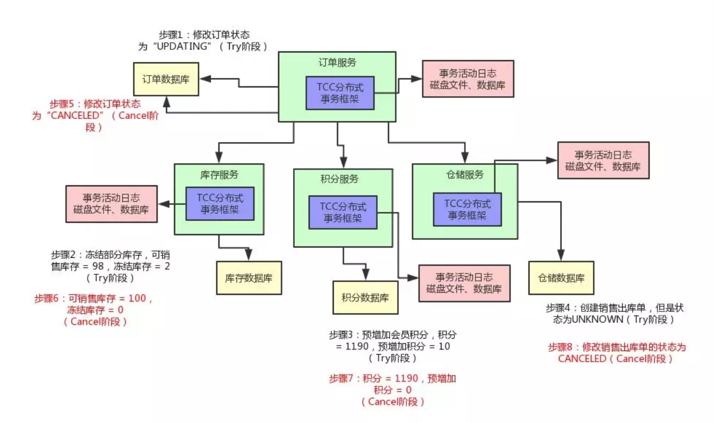
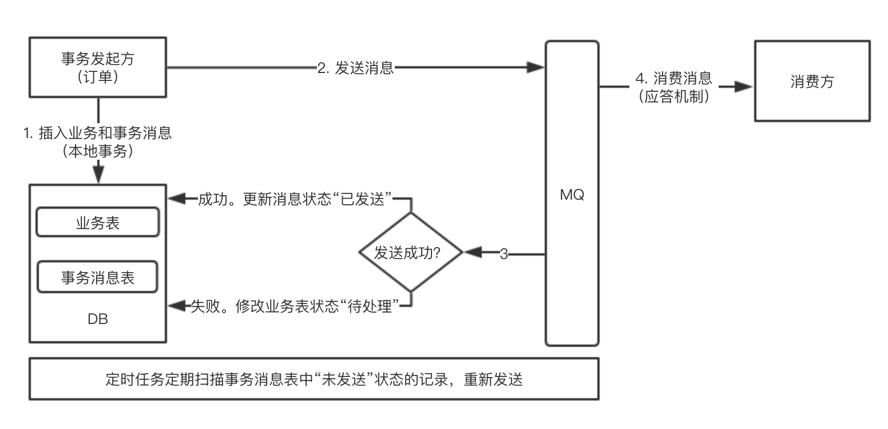

## 分布式事务

[TOC]

### 一. 简介

一个业务操作，包含若干个子业务服务，每个子业务服务都涉及到数据库的修改。整个业务操作是原子性的，要么所有的子业务服务都成功，提交事务。其中只要有一个子业务服务失败，整个业务操作都回滚。

**本地事务**：子业务服务包含在一个应用中，单个独立的数据库。数据一致性由数据库事务保证。

**分布式事务**：这些子业务服务部署在独立的服务器中，连接的数据库也部署在独立的服务器中。这种情况下，保证数据库一致性的能力。

### 二. 术语

#### 1. Local事务的特性

事务有4大特性，即 ACID。统一举例，张三向李四转账100元，银行记录流水。

**A：原子性(Atomicity)：**一个事务的操作，要么全部成功，要么全部失败，不存在中间状态。

即，张三账户扣100元，银行流水记录100元，李四账户加100元；若银行流水记录失败，张三不会扣钱，李四也不会加钱。

**C：一致性（Consistency）：**一个事务执行之前和执行之后数据库都必须处于一致性的状态。

即，首先保证原子性，张三扣100元，银行记录100元，李四加100元，这就是一致性。若张三扣100元，银行记录100元，李四只加了60元，这就不一致，事务需要回滚。

**I：隔离性（Isolation）：**并发环境中，不同事务同时操作相同的数据时，每个事务都有各自的完整数据空间，互不影响。

即，由并发事务所做的修改必须与任何其他并发事务所做的修改隔离。事务查看数据更新时，数据所处的状态要么是另一事务修改它之前的状态，要么是另一事务修改它之后的状态，事务不会查看到中间状态的数据。事务是有先后顺序的，被同时操作的资源需要锁。

**D：持久化（Durability）：**一个事务成功后，所有数据库的操作必须永久保存。

#### 2. InnoDB事务


- 事务的隔离性是通过数据库锁的机制实现的。

- 持久性通过 Redo Log（重做日志）来实现。Redo Log 记录新数据的备份，在事务提交前，只要将 Redo Log 持久化即可，不需要将数据持久化。

- 原子性和一致性通过 Undo Log 来实现。在操作任何数据之前，首先将数据备份到 Undo Log 中，然后进行数据的修改。若出现了错误或者用户执行了 Rollback 语句，系统可以利用 Undo Log 中的备份将数据恢复到事务开始之前的状态。 

#### 3. CAP

对于分布式系统，有三个指标，即 CAP。CAP三者无法同时满足，这就 CAP 定理。


**C（一致性）**

Client 写操作后，通过读操作，必须返回写后的值。Client 读取不同节点时，都要返回写后的值，为了保证一致性（强一致性），不同节点之间需要具有数据同步的能力。

**A（可用性）**

Client 只要发起请求，服务器就必须给出响应，每个服务节点都必须给出响应。其中，这个回应必须是在合理的时间内给出合理的响应。

- 合理的时间：请求不能无限被阻塞。
- 合理的响应：系统应该明确返回正确的结果。

**P（分区容错性）**

大多分布式系统都分布在多个子网络，每个子网络就叫一个区，不同区之间由于网络问题无法通信，系统设计时，需要考虑这种情况。网络问题是不可避免的，但是发生概率很低。

例如：重试连接，若仍不能建立连接，就将失联节点驱除。等待一段时间（可配置）后，再尝试连接被驱逐节点，若节点重新建立的连接，就重新加入集群，并同步最新的数据。

**CA**

C 和 A 无法同时满足条件，因为可能通信失败（或网络延时），即出现分区容错。

例如：Client 向节点1进行写操作，为了保证强一致性，节点2的读操作和写操作都要被锁定，等到数据同步后才能开放节点2的读写操作。锁定的时段内，节点2不可用性，无法保障可用性。所以，CA中的一致性不能实现强一致，一般都采用最终一致性。

**CP**

放弃可用性，追求一致性和分区容错性。A 并不是不保证，因为 P 的概率很小。例如：Zookeeper 就是 CP。

**AP**

保证分区容错性和可用性，放弃强一致性，这是很多分布式系统设计时的选择。其中 BASE 就是 AP 的一个扩展。例如：Eureka 就是 AP。

**BASE**

BASE 即 Basically Available(基本可用)、Soft state(软状态)和 Eventually consistent (最终一致性) 的缩写。是大规模互联网分布式实践的总结，CAP理论中一致性和可用性平衡的结果。

- 基本可用

  分布式系统在遇到不可预知的故障时，允许损失部分的可用性，确保系统仍能提供服务。

  - 响应时间的损失：原本1ms响应，由于故障，1～2s才响应。
  - 系统功能的损失：流量高峰时，将部分流量导向降级页面，确保系统的稳定性。

- 软状态

  允许系统中的数据存在中间状态，此状态不会影响整体系统的可用性，即允许系统在不同节点之间进行数据同步存在延时。（延时时间内，节点间数据不一致）

- 最终一致性

  需要系统保证最终数据能够达到一致，而不需要实时保证系统数据的强一致性。

### 三. 解决方案

#### 1. 2PC

基于 XA 协议的两阶段提交，其中 XA 协议主要包含**事务管理器（事务协调者）**、**资源管理器（数据库）**、**XA接口（双向）**，资源管理器需要实现 XA 接口。其中，事务协调者统一掌控所有资源管理器的操作结果，并指示它们是否要把操作结果进行真正的提交（commit）或者回滚（rollback）。

- 阶段一（准备阶段）

  事务协调者给每个参与者发送Prepare消息，每个参与者返回响应消息（就绪、失败等），等待事务协调者的第二次通知，来确定是提交事务还是回滚事务。这个等待过程，持有资源都被锁定，节点处于阻塞状态。

  例如：A通知B、C、D，B、C回复，D没有回复，B、C需要等待D回复后才能进行第二阶段。

- 阶段二（提交阶段）

  事务协调者收到各个参与者的消息后，再向参与者发出通知，根据反馈情况决定各参与者是否要提交还是回滚。

**缺点**

1. **单点问题**：事务管理器如果宕机，比如在第一阶段已经完成，在第二阶段正准备提交的时候事务管理器宕机，资源管理器就会一直阻塞，导致数据库无法使用。
2. **性能问题**：在准备就绪之后，资源管理器中的资源一直处于阻塞，直到提交完成，才能释放资源。
3. **数据不一致**：当协调者出错，同时参与者也出错时，两阶段无法保证事务执行的完整性。

#### 2. [TCC](http://www.bytesoft.org/tcc-intro/)

TCC 属于补偿型分布式事务。Try、Confirm、Cancel 3个方法均由业务编码实现，整个业务逻辑分为 Try 和 Confirm/Cancel 两个阶段执行。即

```wiki
[传统事务机制]的业务逻辑 = [TCC事务机制]的初步操作（Try） + [TCC事务机制]的确认逻辑（Confirm）。
```

- **Try**

  中心操作，其保障性是最好的，即使失败，仍然有取消操作（Cancel）可以将其不良影响进行回撤。

  例：在业务表中添加冻结字段 frozen，对资源进行冻结，或设置一个中间字段。**（确保隔离性）**

- **Confirm**

  对 Try 操作的补充，当TCC事务管理器决定commit全局事务时，就会逐个执行 Try 对应的 Confirm 操作，将Try 未完成的事项最终完成。

- **Cancel**

  对 Try 操作的一个回撤，当TCC事务管理器决定rollback全局事务时，就会逐个执行 Try 对应的 cancel 操作，将 Try 已完成的事项全部回撤。

- 框架事务日志

  记录分布式事务的活动日志的，保存下来分布式事务运行的各个阶段和状态。通过日志进行重试操作。



**缺点**

1. 对应用的侵占性高。
2. 实现难度大，需要按照网络状态、系统故障等不同的失败原因实现不同的回滚策略。

#### 3. 基于消息的最终一致性

BASE 方案的一种，分布式事务的提交或回滚只取决于事务发起方的业务需求，其他数据源的数据变更跟随发起方进行。



**异常情况**

1. 发起方插入业务和事务消息失败

   发起方本地事务回滚，解决发起方问题

2. 发起方插入业务和事务消息成功，发送消息失败

   后台定时任务扫描，重新发送

3. 消费方业务未处理成功

   后台定时任务扫描，重新处理

4. 消费方未收到消息

   重试接受消息

5. 消费方确实无法处理

   人工处理，因为发生概率小，全局回滚难度大，成本高

**Demo**

- https://gitee.com/gencytp/coolmq/tree/master

#### 4. Saga

一种最终一致性（补偿型）的解决方案。Saga 由一系列的**短事务Ti**组成，并且这些短事务按序依次执行，这样就避免了使用长期持有锁的长事务。每个短事务都有一个对应的**补偿操作Ci**。和 TCC 相比，Saga 没有 Try 的阶段，可以理解为 cc，因此不具备隔离性。

**补偿:  **我们将一个事务分成一个本地执行的正常操作事务和一个逻辑上对之前的操作进行补偿的事务。

1. Saga的执行顺序

   **子事务 T1 -> T2 -> T3 -> ... Ti，补偿操作 Ci -> ... -> C3 -> C2 -> C1**

2. Saga的恢复策略

- 向后恢复，一个子事务发生错误后，依次向先补偿撤销所有成功的子事务，使得整个Saga执行结果撤销。

- 先前恢复，适用于必须要成功的场景，一个子事务出错后，不断的重试这个子事务，直到成功为止。这个策略不需要补偿操作。

3. 协调

   用来控制 Saga 逻辑，即事务的顺序执行和补偿的逆序执行。

- **事件编排（Choreography）**

  通过事件控制 Saga 的决策和排序。即，每个 Saga 参与者订阅彼此的事件并决定是否应采取行动。


**示例说明**

1. 订单服务保存新订单，将订单状态设为 Pending，并发布事件 ORDER_CREATED_EVENT。
2. 支付服务监听 ORDER_CREATED_EVENT，进行支付校验、支付费用，并发布事件 BILLED_ORDER_EVENT。
3. 库存服务监听 BILLED_ORDER_EVENT，进行库存检查、扣减库存，并发布事件 ORDER_PREPARED_EVENT。
4. 货运服务监听 ORDER_PREPARED_EVENT，进行商品发货，并发布事件 ORDER_DELIVERED_EVENT。
5. 订单服务监听 ORDER_DELIVERED_EVENT，将订单状态修改为 FINISHED。

**错误处理**

 	订单服务监听所有服务异常时发布的 EVENT，每一个服务监听下流服务发布的异常 EVENT。当监听到异常 EVENT 后，各个服务执行自己的补偿操作。

**优点**

1. 实现简单：服务在创建，更新或删除业务时发布事件对象。
2. 松耦合：参与者之间没有直接的耦合。

**缺点**

1. 业务逻辑修改，添加了更多的步骤，可能会出现事件的循环依赖。

2. 业务和事件的紧密耦合，每个业务都必须要订阅与它相关的所有事件，具有风险。
3. 测试困难，单个功能测试也必须要启动所有相关服务。

- **中心编控（Orchestration）**

  设计一个中心控制器，控制器设计在事务发起方，控制 Saga 参与者工作流程。使用命令/异步交互与参与者进行通信。中心协调器必须事先知道整个业务流程，负责通过向每个参与者发送命令来撤销之前的操作来协调分布式的回滚。默认是正向操作，回滚时执行反向流程。中心协调器类似一个状态机。


**示例说明**

1. 订单服务首先创建一个订单和一个创建订单控制器。
2. 订单控制器向支付服务发送 Payment CMD，支付服务回复 Payment Executed 消息。
3. 订单控制器向库存服务发送 Prepare Order CMD，库存服务回复 Order Prepared 消息。
4. 订单控制器向货运服务发送 Deliver Order CMD，货运服务回复 Order Delivered 消息。
5. 订单控制器向订单服务发送订单完成CMD，流程结束。

**优点**

1. 避免服务之间的循环依赖，由中心控制器调用各个服务，各个服务不会调用中心控制器。
2. 低耦合，各个服务实现中心控制器调用的API，不需要监听其他服务的事件。
3. 添加新步骤时，事务复杂性保持线性，回滚更容易管理。

**缺点**

1. 中心控制器涉及太多逻辑，不符合微服务的风险。
2. 单点风险。

**Saga 实现**

1. 为每个事务创建一个唯一的ID。有助于参与者以标准方式向对方请求数据。
2. 在Command中添加回复地址，而不是让各个参与者硬编码固定地址，这样可以让参与者回复多个中心控制器。
3. Ti 和 Ci 要设计成符合幂等性的。
4. 避免采用同步通信，即消息中的数据要完整。很多人错误地使用消息系统，先使用消息系统发送一个提醒通知，然后再让消息接受者通过服务接口过来取数据，这等同于没有使用消息系统，因为同步操作会堵塞，而消息系统是非堵塞的，大数据读取时同步经常会堵塞，这是无法通过事前评估数据量大小来主观以为这么小数据量不会造成堵塞的。
5. 记录 Saga log，因为 Saga 本身也有宕机风险。

### 七. 现行框架

- https://github.com/yu199195/hmily
- https://github.com/QNJR-GROUP/EasyTransaction
- https://github.com/changmingxie/tcc-transaction
- https://www.txlcn.org
- https://github.com/liuyangming/bytetcc
- https://github.com/eventuate-tram/eventuate-tram-sagas

### 八. 参考资料

- https://github.com/chanjarster/transactions

- https://segmentfault.com/a/1190000012762869

- https://www.jianshu.com/p/16b1baf015e8

- https://www.cnblogs.com/DKSL/p/fescar.html

- https://www.cnblogs.com/jiangyu666/p/8522547.html

- http://www.ruanyifeng.com/blog/2018/07/cap.html

- https://www.cnblogs.com/szlbm/p/5588543.html

- https://www.cnblogs.com/exceptioneye/p/5452601.html

- https://blog.csdn.net/liaomin416100569/article/details/78908196

- https://www.cnblogs.com/jajian/p/10014145.html (*)

- https://github.com/alibaba/fescar

  **Saga**

- https://docs.servicecomb.io/saga/zh_CN/index.html

- https://www.jianshu.com/p/e4b662407c66

- https://www.jdon.com/49338 

- http://servicecomb.apache.org/cn/docs/distributed-transaction-of-services-1/