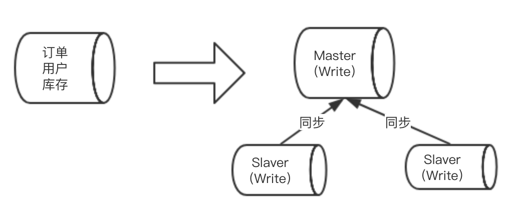
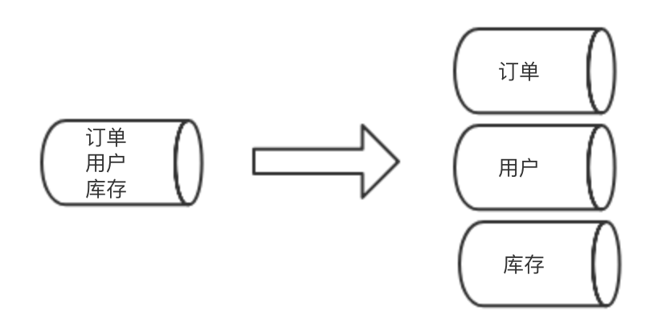
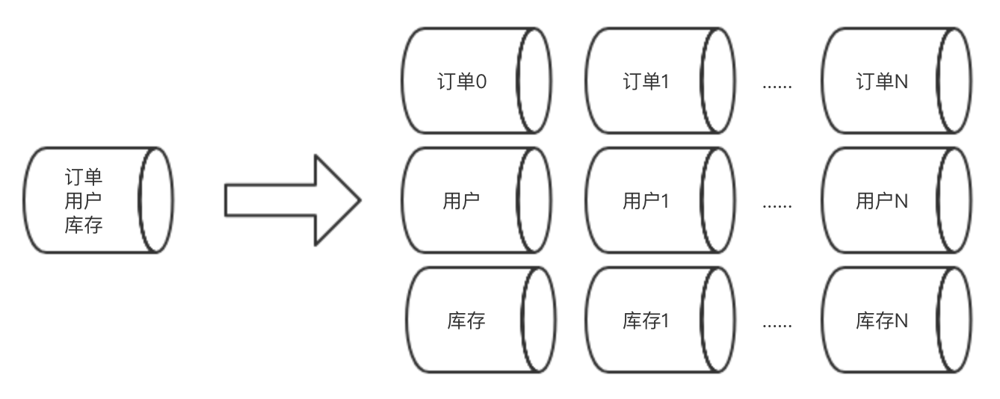

## 微服务 — 数据库

### 1. 跨库查询

1. 依赖字段少 - 冗余字段

   某业务，A库的**T1表**需要关联B库的**T2表**的**F**字段。那我们就把**F字段**冗余到A库的T1表中，查询时就不需要Join了。

   场景：

   - 依赖字段不能太多
   - 保证数据一致性，F字段变更，必须同步到A库的**T1表**中。

2. 依赖字段多 - 冗余表

   通过 ETL 等工具进行跨库的表的同步，同步频率不易太频繁，适用于实时性不高的查询需求。

3. 静态字段依赖 - 数据字典表

   在各个库中都建立数据字典表。如果静态数据表中的某些字段数据需要修改，可以采用一套脚本统一更新。

4. 代码进行数据封装

   通过各种服务查询到一个数据集，通过代码进行二次组装，然后生成我们需要返回给前端的对象。在实践过程中，对于处理过的查询集，我们可以将它们缓存在我们的分布式缓存中，减少服务间的RPC调用次数和数据库的查询压力。同时，注意设置好过期时间，把控好数据一致性和有效性。

### 2. 分库分表

#### 1. 为什么要分？

一个系统最初采用单体架构，所有的业务表都包含在一个数据库中，当请求越来越多的时候，单个数据库出现 I/O 瓶颈，无法满足请求量。为了解决这个问题，

（1）我们需要将请求流量进行分流，由多个数据库共同负载这些流量。

（2）所有的业务表都在一个数据库中，各个表之间进行I/O竞争，不合理，需要按照业务功能进行拆分，将高内聚业务的表放在一个数据库中。

（3）每个服务器的资源都是有限的，当服务器扛不住数据库的压力时，需要添加数据库进行分流。

#### 2. 分的方式

- 垂直拆分

  符合微服务的理念，将相同领域的业务设计在一起，独立自治，互不影响。

- 水平拆分

  垂直拆分后，一定程度上解决了数据库的I/O瓶颈，但随着业务的发展，数据量越来越大，单个表的数据量达到千万或亿级，所以单库单表又会出现瓶颈。那就需要将单个表的数据切分到多个服务器上去，每个服务器具有相同的库和表，只是表中的数据集合不同。一般的分库分表方案如下：

  - RANGE：从0到10000一个表，10001到20000一个表。
  - **HASH取模**：按分片键进行取模，例如：用户Id，订单Id
  - 时间：按照时间切分，就是将6个月前，甚至一年前的数据切出去放到另外的一张表，因为随着时间流逝，这些表的数据被查询的概率变小，所以没必要和“热数据”放在一起，这个也是“冷热数据分离”。
  - 地理区域：按照业务所在区域进行拆分。

#### 3. 问题和挑战

1. 事务问题
2. 跨库跨表的Join问题
3. 额外的数据管理负担和数据运算压力

#### 4. 业界方案

- **ShardingSphere** *
- Vitess
- MyCat
- Hibernate Shards
- TDDL

#### 5. 参考资料

- https://juejin.im/entry/5b5eb7f2e51d4519700f7d3c
- https://blog.csdn.net/xlgen157387/article/details/53976153
- https://blog.csdn.net/KingCat666/article/details/78324678