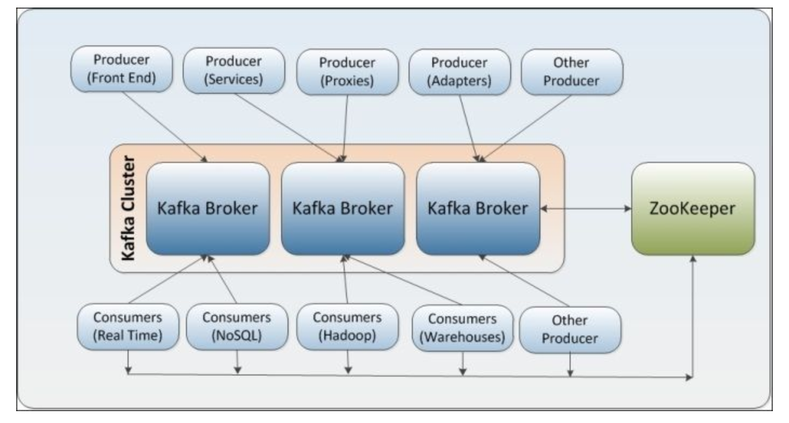

## Kafka 指南

### 一. 概念

​	Kafka是由Linkedin使用Scala编写的分布式消息系统。支持分区（partition）、多副本（replica），通过Zookeeper 进行动态扩容。

主要知识点：

 - **Broker**：Kafka节点，一个Kafka Node就是一个broker，多个broker组成Kafka集群。

   **设计思想**：

   ​	Kafka  broker集群受Zookeeper的管理。所有的Kafka Broker节点一起去Zookeeper上注册一个临时节点，因为只有一个Kafka Broker会注册成功，其他的都会失败，所以这个成功在Zookeeper上注册临时节点的这个Kafka Broker会成为Kafka Broker Controller，其他的Kafka broker叫Kafka Broker follower。（这个过程叫Controller在ZooKeeper注册Watch）。这个Controller会监听其他的Kafka Broker的所有信息，如果这个kafka broker controller宕机了，在zookeeper上面的那个临时节点就会消失，此时所有的kafka broker又会一起去Zookeeper上注册一个临时节点，因为只有一个Kafka Broker会注册成功，其他的都会失败，所以这个成功在Zookeeper上注册临时节点的这个Kafka Broker会成为Kafka Broker Controller，其他的Kafka broker叫Kafka Broker follower。

   **特性：**

   - Broker没有副本机制，一旦broker宕机，该broker的消息将都不可用。
   - Broker不保存Consumer的状态，由Consumer自己保存。
   - 无状态导致消息的删除成为难题（可能删除的消息正在被订阅），kafka采用基于时间的SLA(服务水平保证)，消息保存一定时间（通常为7天）后会被删除。
   - Consumer可以回退到任意offset重新进行消费，当Consumer故障时，可以选择最小的offset进行重新读取消费消息。
   - Producer端可以通过GZIP或Snappy格式对消息集合进行压缩。Producer端进行压缩之后，在Consumer端需进行解压。压缩的好处就是减少传输的数据量，减轻对网络传输的压力，在对大数据处理上，瓶颈往往体现在网络上而不是CPU。

 - **Topic**：发布订阅的主题，一类消息，消息存放的目录即主题。物理上存储在 patition 上。

- **Patition**：Topic物理上的分组，一个Topic可以分为多个Patition，每个Patition都是有序且顺序不可变的记录集，并且不断地追加到结构化的commit log文件中。Kafka 集群保留所有发布的记录—无论他们是否已被消费—并通过一个可配置的参数——保留期限来控制。通常partition的数量通常是Broker Server数量的整数倍。

  - leader 和 follower：leader时主patition，producer写消息到kafka时先写到patition leader，再由patition leader push 给其他的 patition follower。partition leader与follower的信息受Zookeeper控制，一旦partition leader所在的broker节点宕机，zookeeper会冲其他的broker的partition follower上选择follower变为parition leader。
  - ISR：in-sync replica，同步状态的副本的集合。在这个集合中的节点都是和leader保持高度一致的，任何一条消息必须被这个集合中的每个节点读取并追加到日志中了，才回通知外部这个消息已经被提交了。因此这个集合中的任何一个节点随时都可以被选为leader.ISR在ZooKeeper中维护。

- **offset**：分区中的每一个记录都会分配一个id号来表示顺序。用来唯一的标识分区中每一条记录。

  

  

- **Patition Replica**：每个Patition可以在其他的kafka broker节点上存副本，用于确保Kafka的高可用。replica按照 broker 顺序存储。replica <= patition。

- **Segment**：patititon物理上由多个segment组成，每个segment存着message信息。

- **Producer**：生成message发送到Topic。

- **Consumer**：订阅Topic消费message，每个consumer作为一个线程来消费。在每一个Consumer中唯一保存的元数据是offset（偏移量），即消费在log中的位置.偏移量由消费者所控制:通常在读取记录后，消费者会以线性的方式增加偏移量，但是实际上，由于这个位置由消费者控制，所以消费者可以采用任何顺序来消费记录。例如，一个消费者可以重置到一个旧的偏移量，从而重新处理过去的数据；也可以跳过最近的记录，从"现在"开始消费。

- **Consumer Group**：一组consumer。对于同一个 topic，每个group都可以拿到相同的message，但message进入group后只能被其中的一个consumer消费。而kafka为了保证吞吐量，只允许一个consumer线程去访问一个partition。

  - 1）consumer group下可以有一个或多个consumer instance，consumer instance可以是一个进程，也可以是一个线程

  - 2）group.id是一个字符串，唯一标识一个consumer group

  - 3）consumer group下订阅的topic下的每个分区只能分配给某个group下的一个consumer(当然该分区还可以被分配给其他group)

  - 线上应用

    线上的分布式多个service服务，每个service里面的kafka consumer数量都小于对应的topic的partition数量，但是所有服务的consumer数量之和等于patition数量。这是因为分布式service服务的所有consumer都来自一个consumer group，如果来自不同的consumer group就会处理重复的message了（同一个consumer group下的consumer不能处理同一个partition，不同的consumer group可以处理同一个topic，那么都是顺序处理message，一定会处理重复的。一般这种情况都是两个不同的业务逻辑，才会启动两个consumer group来处理一个topic）。

  - 当 producer 的流量增大时，横向扩展：**增加topic下的partition，同时增加这个consumer group下的consumer**。

#### 1. 存储

​	在Kafka文件存储中，同一个topic下有多个不同partition，每个partition为一个目录，partiton命名规则为**topic名称-有序序号**，第一个partiton序号从0开始，序号最大值为partitions数量减1。

​	每个partion(目录)相当于一个巨型文件被平均分配到多个大小相等segment(段)数据文件中。但每个段segment file消息数量不一定相等，这种特性方便old segment file快速被删除。

​	每个partiton只需要支持顺序读写就行了，segment文件生命周期由服务端配置参数决定。

​	producer发message到某个topic，message会被均匀的分布到多个partition上（随机或根据用户指定的回调函数进行分布），kafka broker收到message往对应partition的最后一个segment上添加该消息，当某个segment上的消息条数达到配置值或消息发布时间超过阈值时，segment上的消息会被flush到磁盘，只有flush到磁盘上的消息consumer才能消费，segment达到一定的大小后将不会再往该segment写数据，broker会创建新的segment。

- segment file组成：由2大部分组成，分别为index file和data file，此2个文件一一对应，成对出现，后缀".index"和“.log”分别表示为segment索引文件、数据文件.

- segment文件命名规则：partion全局的第一个segment从0开始，后续每个segment文件名为上一个全局partion的最大offset(偏移message数)。数值最大为64位long大小，19位数字字符长度，没有数字用0填充。

  

  

 **存储特点：**

- Kafka把topic中一个parition大文件分成多个小文件段，通过多个小文件段，就容易定期清除或删除已经消费完文件，减少磁盘占用。
- 通过索引信息可以快速定位message和确定response的最大大小。
- 通过index元数据全部映射到memory，可以避免segment file的IO磁盘操作。
- 通过索引文件稀疏存储，可以大幅降低index文件元数据占用空间大小。

#### 2. 消息的可靠性

一个消息发送成功且仅发送了一次，exactly-once。

- **Producer端**：当一个消息被发送后，Producer会等待broker成功接收到消息的反馈（可通过参数控制等待时间），如果消息在途中丢失或是其中一个broker挂掉，Producer会重新发送（我们知道Kafka有备份机制，可以通过参数控制是否等待所有备份节点都收到消息）。
- **Client端：**broker端记录了partition中的一个offset值，这个值指向Consumer下一个即将消费message。当Consumer收到了消息，但却在处理过程中挂掉，此时Consumer可以通过这个offset值重新找到上一个消息再进行处理。Consumer还有权限控制这个offset值，对持久化到broker端的消息做任意处理。

#### 3. 生产者

- 负载均衡

  Producers直接发送消息到broker上的leader partition，不需要经过任何中介或其他路由转发。为了实现这个特性，kafka集群中的每个broker都可以响应producer的请求，并返回topic的一些元信息，这些元信息包括哪些机器是存活的，topic的leader partition都在哪，现阶段哪些leader partition是可以直接被访问的。

  **Producer客户端自己控制着消息被推送到哪些partition。**实现的方式可以是随机分配、实现一类随机负载均衡算法，或者指定一些分区算法。Kafka提供了接口供用户实现自定义的partition，用户可以为每个消息指定一个partitionKey，通过这个key来实现一些hash分区算法。比如，把userid作为partitionkey的话，相同userid的消息将会被推送到同一个partition。

- 异步发送

  通常producer在发送完消息之后会得到一个future响应，返回的是offset值或者发送过程中遇到的错误。这其中有个非常重要的参数“acks”,这个参数决定了producer要求leader partition 收到确认的副本个数。

  - acks=0：表示producer不会等待broker的响应，所以，producer无法知道消息是否发送成功，这样有可能会导致数据丢失，但同时，acks值为0会得到最大的系统吞吐量。
  - acks=1：表示producer会在leader partition收到消息时得到broker的一个确认，这样会有更好的可靠性，因为客户端会等待直到broker确认收到消息。
  - acks=-1：producer会在所有备份的partition收到消息时得到broker的确认，这个设置可以得到最高的可靠性保证。

#### 4. 消费者

Kafka提供了两套consumer api，分为high-level api和sample-api。

- sample-api：一个底层的API，它维持了一个和单一broker的连接，并且这个API是完全无状态的，每次请求都需要指定offset值，因此，这套API也是最灵活的。
- high-level api：封装了对集群中一系列broker的访问，可以透明的消费一个topic。它自己维持了已消费消息的状态，即每次消费的都是下一个消息。

### 二. 安装

### 三. 配置

### 四. Springboot

#### 1. producer/consumer步骤

1. 生产者客户端应用程序产生消息：
   - 客户端连接对象将消息包装到请求中发送到服务端
   - 服务端的入口也有一个连接对象负责接收请求，并将消息以文件的形式存储起来
   - 服务端返回响应结果给生产者客户端

2. 消费者客户端应用程序消费消息：
   - 客户端连接对象将消费信息也包装到请求中发送给服务端
   - 服务端从文件存储系统中取出消息
   - 服务端返回响应结果给消费者客户端
   - 客户端将响应结果还原成消息并开始处理消息

#### 2. 代码实现

### 五. 应用场景

- 日志收集中心

  应用可以将操作日志"批量""异步"的发送到kafka集群中,而不是保存在本地或者DB中;kafka可以批量提交消息/压缩消息等,这对producer端而言,几乎感觉不到性能的开支.此时consumer端可以使hadoop等其他系统化的存储和分析系统。

- 消息系统

  Kafka作为一款优秀的消息系统，具有高吞吐量、内置的分区、备份冗余分布式等特点，为大规模消息处理提供了一种很好的解决方案

- 应用监控

  利用Kafka采集应用程序和服务器健康相关的指标，如CPU占用率、IO、内存、连接数、TPS、QPS等，然后将指标信息进行处理，从而构建一个具有监控仪表盘、曲线图等可视化监控系统。例如，很多公司采用Kafka与ELK（ElasticSearch、Logstash和Kibana）整合构建应用服务监控系统。

- 网站用户行为追踪

  为了更好地了解用户行为、操作习惯，改善用户体验，进而对产品升级改进，将用户操作轨迹、内容等信息发送到Kafka集群上，通过Hadoop、Spark或Strom等进行数据分析处理，生成相应的统计报告，为推荐系统推荐对象建模提供数据源，进而为每个用户进行个性化推荐。

- 流处理

  需要将已收集的流数据提供给其他流式计算框架进行处理，用Kafka收集流数据是一个不错的选择，而且当前版本的Kafka提供了Kafka Streams支持对流数据的处理。

### 八. 参考资料

- Docker：

  - https://hub.docker.com/r/wurstmeister/kafka
  - https://github.com/wurstmeister/kafka-docker/wiki/Connectivity
  - https://www.jianshu.com/p/a37e1b2705e3
- Config：

  - https://www.cnblogs.com/lujinhong2/p/4686483.html
- Blog

  - https://www.cnblogs.com/cyfonly/p/5954614.html
  - https://mp.weixin.qq.com/s?__biz=MjM5MjE4MjU5OA==&mid=2650796139&idx=1&sn=bbc8284d425db41acb3c0b9456e31544&chksm=bea1684289d6e154e7a3ac7a19a3a50b1287b0f3b6fbff25bdbc9e8fa859f2017f58357addb7&mpshare=1&scene=1&srcid=0401zKG1t3dZoKk7eCJ1xnXM&key=353b6d2bc732602727dd8220e5364eac42293f63a3058f2695e8aed794412b8bdf5b9529b691c0b124a74c9a701207ee0b0e3ea8e0db9c72c3b22dbde234f4d76074220900a0615e8795b734854e3223&ascene=0&uin=MTY1MzQxMzYxNg%3D%3D&devicetype=iMac+MacBookPro12%2C1+OSX+OSX+10.13.3+build(17D102)&version=12020010&nettype=WIFI&lang=zh_CN&fontScale=100&pass_ticket=oDY8cPoDPIBn5m5bD4PHuNRzTAamexYMURxxLRpmiswgnamyGPmqI4OvHpmAOPSX

- Issue
  - https://stackoverflow.com/questions/38260091/kafka-0-10-java-client-timeoutexception-batch-containing-1-records-expired
  - http://orchome.com/447

  ​

