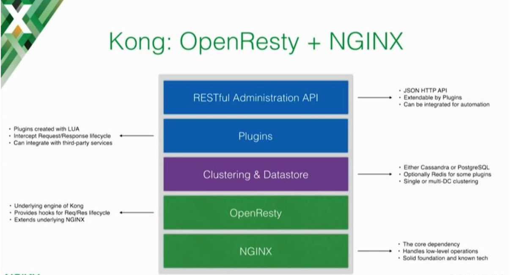
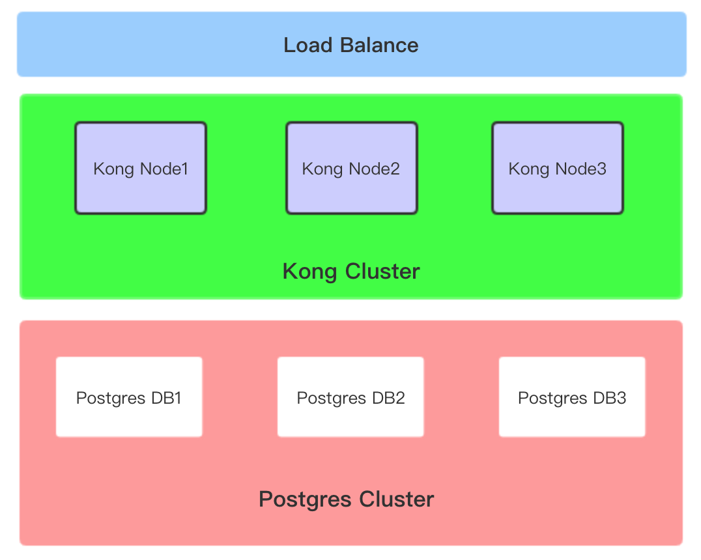
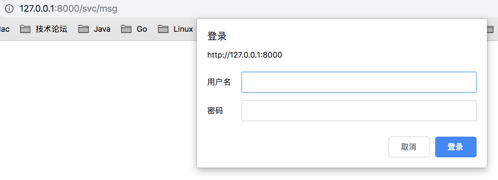

## Kong 

### 一. 概念

kong 是一个基于 Nginx / OpenResty / Lua 封装的开源 API 网关产品。L7 层代理 Http 流量，不能代理基于 TCP 的RPC请求。可以通过 Kong 的插件实现认证授权、IP限制、限流等公用功能。从技术的角度讲，Kong 可以认为是一个 OpenResty 应用程序。 OpenResty 运行在 Nginx 之上，使用 Lua 扩展了 Nginx。 Lua 是一种非常容易使用的脚本语言，可以让你在 Nginx 中编写一些逻辑操作。



### 二. 安装

#### 1. postgres

使用 docker 安装 postgres，初始化 kong / kong / kong。

```sh
docker pull postgres:10
docker run -d --name dante-postgres -p 5432:5432 \
		   -v <本地目录>:/var/lib/postgresql/data \
		   -e POSTGRES_PASSWORD=****** \
		   -e POSTGRES_USER: kong \
      	   -e POSTGRES_DB: kong \
		   postgres:10
```

```sql
-- 非 docker 安装，要初始化用户、密码
create user kong;
create database kong owner kong;
alter user kong with password '*****';
```

#### 2. 安装kong

- MAC

```shell
## 使用 Homebrew
brew tap kong/kong
brew install kong

## 初始化 DB
kong migrations up

## 启动，通过 kong help 查看
kong start
kong restart
kong stop
kong reload
```

**遇到的问题**

1. Error: /usr/local/share/lua/5.1/pgmoon-mashape/init.lua:239: missing password, required for connect

   **需要配置 postgres 的密码，vi /usr/local/share/lua/5.1/kong/templates/kong_defaults.lua**

2. /usr/bin/env: ‘resty’: No such file or directory

   **ln -s ../Cellar/openresty/1.13.6.2/bin/resty /usr/local/bin/resty**

3. 开放 admin api 访问权限

   vi /usr/local/opt/kong/.kong_env，修改 

   **admin_listen = 127.0.0.1:8001,127.0.0.1:8444 ssl => admin_listen = 0.0.0.0:8001,0.0.0.0:8444 ssl**

#### 3. Kong UI

安装 konga，使用 docker 

```shell
## 参考 https://hub.docker.com/r/pantsel/konga
docker pull pantsel/konga
docker run -d -p 1337:1337  --name dante-kong-ui -e "NODE_ENV=development" -e "TOKEN_SECRET={{123456}}" pantsel/konga

## 访问 http://localhost:1337
```

#### 4. 集群

	Kong node 共享配置，连接同一个数据库（或集群），各节点通过负载均衡器实现流量分配。但要注意，只能够在一个 Node 上执行 Kong 的数据初始化操作，即 `kong migrations up` 。



	考虑到性能问题，Kong 在代理请求时，只在第一次访问数据库，之后都会从内存中获取需要的对象内容（Service、Route、Consumer、Plugin、Upstream、Target等）。那么，当一个Node上通过 Admin API 进行修改时，要如何将这些修改传播到其他的 Node？

- db_update_frequency（默认 5 秒）

  所有 Node 在后台会周期性（db_update_frequency）的轮询 DB，找出修改内容并更新自己 Node 的内存。例如：Node A 删除了一个 Service，那么 Node B 在下次轮询 DB前，这个 Service 一直存在在 Node B。即，Kong 采用的是最终一致性。

- db_update_propagation（默认 0 秒）

  对于最终一致性的数据库（Cassandra），需要设置此配置，确保 DB Cluster 各节点的数据同步。所以，当设置了此配置，则 **Kong Node 更新缓存时间 = db_update_frequency + db_update_propagation**。

- db_cache_ttl（默认 0 秒） 

  缓存的持久（过期）时间，当到期时，从缓存中清除数据，直接从 DB 中获取。默认是 0，表示缓存没有过期时间（一致有效）。

##### 1) docker 集群

- 自定义网络

```shell
docker network create kong-net
```

- postgres

```shell
docker run -d --name kong-db \
              --network=kong-net \
              -p 5432:5432 \
              -e "POSTGRES_PASSWORD=kong123" \
              -e "POSTGRES_USER=kong" \
              -e "POSTGRES_DB=kong" \
              postgres:10
```

- kong

```shell
## 初始化 kong db（只能在唯一一个 Node 上执行一次）
docker run --rm \    
    --network=kong-net \
    -e "KONG_DATABASE=postgres" \
    -e "KONG_PG_HOST=kong-db" \
    -e "KONG_PG_PORT=5432" \
    -e "KONG_PG_PASSWORD=kong123" \
    kong:0.14.1-centos kong migrations up

## 启动 Kong Server
docker run -d --name kong \
    --network=kong-net \
    -e "KONG_DATABASE=postgres" \
    -e "KONG_PG_HOST=kong-db" \
    -e "KONG_PG_PORT=5432" \
    -e "KONG_PG_PASSWORD=kong123" \
    -e "KONG_PROXY_ACCESS_LOG=/dev/stdout" \
    -e "KONG_ADMIN_ACCESS_LOG=/dev/stdout" \
    -e "KONG_PROXY_ERROR_LOG=/dev/stderr" \
    -e "KONG_ADMIN_ERROR_LOG=/dev/stderr" \
    -e "KONG_ADMIN_LISTEN=0.0.0.0:8001, 0.0.0.0:8444 ssl" \
    -p 8000:8000 \
    -p 8443:8443 \
    -p 8001:8001 \
    -p 8444:8444 \
    kong:0.14.1-centos
```

##### 2) caas 集群

1. 先安装 Postgres
2. 在CaaS外初始化 kong db
3. 启动 kong server

##### 3) k8s ingress

参考：

- https://github.com/Kong/kubernetes-ingress-controller
- https://raw.githubusercontent.com/Kong/kubernetes-ingress-controller/master/deploy/single/all-in-one-postgres.yaml

##### 4) Openshift

参考：

- https://github.com/Kong/kubernetes-ingress-controller/blob/master/docs/deployment/openshift.md

### 三. 术语

#### 1. Service

upstream service 上游服务的抽象，和 route 路由（可以是多个）进行关联，Client 的请求若匹配到具体的路由，kong 会将请求代理到与之关联的 Service。

https://docs.konghq.com/0.14.x/admin-api/#service-object

创建一个 Service，POST	/services/

| 参数            | 说明                                                         |
| :-------------- | :----------------------------------------------------------- |
| name            | 必填。全局惟一                                               |
| protocol        | upstream service 的访问协议，http（默认）或者 https          |
| host            | upstream service 的 host                                     |
| port            | upstream service 的 port                                     |
| path            | 可选。upstream service 的访问路径，默认null。可以指定具体的upstream service的访问地址，例如：只将upstream service 的 /api 由网关代理 |
| url             | protocol、host、port、path 的快捷方式，不可读，只可写。即，无法通过 API 查询 |
| retries         | 可选。代理失败时的重试次数                                   |
| connect_timeout | 可选。和 upstream service 确立连接的超时时间，默认60000毫秒 = 1分钟 |
| write_timeout   | 可选。和 upstream service 的写超时时间，默认60000毫秒 = 1分钟 |
| read_timeout    | 可选。和 upstream service 的读超时时间，默认60000毫秒 = 1分钟 |

#### 2. Route

用来匹配 Client 的请求，匹配到的的请求被代理到与 Route 关联的 Service 进行处理。Service + Route 可以代理各种各样的 upstream service。

https://docs.konghq.com/0.14.x/admin-api/#route-object

创建一个Route，POST	    /routes/  （methods、hosts、paths 至少有一个不为空）

| 参数          | 说明                                                         |
| ------------- | ------------------------------------------------------------ |
| protocols     | route 允许的通信协议，默认 ["http","https"]                  |
| methods       | route 匹配的 HttpMethod，["GET", "POST"] 或 "GET"            |
| hosts         | route 匹配的 Host，["x.com", "y.com"] 或 "x.com"             |
| paths         | route 匹配的 Path，["/svc", "/caas"] 或 "/svc"               |
| strip_path    | 当route通过 paths 匹配到时，被代理的 upstream service 是否忽略 PrefixPath，即paths中的path。默认为 True |
| preserve_host | 当route通过 hosts 匹配到时，被代理的 upstream service 是否携带 Host header，默认是 False，不携带。upstream service 的 Host header 是 Service 的 host:port（Socket）。 |
| service       | route 关联的 service id。传递方式 `"service":{"id":"<service_id>"}`. |

#### 3. Consumer

Kong Service 的消费者，也就是个人开发者、客户端。这些 Consumer 可以存储在 Kong 中，也可以和你现有的用户体系关联。

https://docs.konghq.com/0.14.x/admin-api/#consumer-object

创建一个 Consumer， POST     /consumers/ （username 和 custom_id 至少有一个不为空）

| 参数      | 说明                                              |
| --------- | ------------------------------------------------- |
| username  | 消费者的惟一标示                                  |
| custom_id | 已存在 DB 中的用户标示，用来关联非 Kong 体系的 DB |

#### 4. Plugin

Kong 插件，可以在 HTTP 请求/响应的生命周期中进行工作，Plugin 应用于 Service 和 Consumer 之上，可以提供一些公共的功能。例如：认证授权、访问速率限制（外部的每人每秒只能发送200个请求，但内部app没有任何的限制）。

- Plugin的执行优先级（对应的匹配对象越多，优先级越高），下例配置优先级由高到低
  - Plugin 对应 Service、Route、Consumer（必须对 Consumer 进行认证）
  - Plugin 对应 Route、Consumer（必须对 Consumer 进行认证）
  - Plugin 对应 Service、Consumer（必须对 Consumer 进行认证）
  - Plugin 对应 Service、Route
  - Plugin 对应 Consumer（必须对 Consumer 进行认证）
  - Plugin 对应 Route
  - Plugin 对应 Service
  - 全局 Plugin

https://docs.konghq.com/0.14.x/admin-api/#plugin-object

创建一个 Plugin，POST      /plugins/

| 参数              | 说明                                             |
| ----------------- | ------------------------------------------------ |
| name              | Plugin的名字，首先 Kong 要安装这个Plugin         |
| consumer_id       | 可选。Kong db 中 Consumer 的主键Id               |
| config.{property} | 参照具体 Plugin。https://docs.konghq.com/plugins |
| enabled           | 是否启用。默认是 true                            |

**Demo — 指定 route 的 plugin（Basic Authentication）**

https://docs.konghq.com/plugins/basic-authentication

1）创建指定 route 的 plugin

POST        `http://localhost:8001/routes/{route_id}/plugins`

```json
http://localhost:8001/routes/b127b5aa-2481-4cf3-a4a8-889dc52bb5bb/plugins
{
    "name": "basic-auth",
    "config": {
        "hide_credentials": false
    }
}
```

2）创建 Credential 

POST        `http://localhost:8001/consumers/{consumer}/basic-auth`（consumer：id 或 username）

```json
http://localhost:8001/consumers/dante/basic-auth
{
    "username": "dante",
    "password": "123456"
}
```

3）访问

Authorization header 必须进行 base64 编码，例如：dante:123456 ==> ZGFudGU6MTIzNDU2。

```json
## 访问方式一（终端）
curl -X GET --url http://localhost:8000/svc/msg -H 'Authorization: Basic ZGFudGU6MTIzNDU2'

## 访问方式二（浏览器）
http://localhost:8000/svc/msg
```



4）说明

Client 认证成功后，Plugin 会向 upstream service 添加 header，例如 `X-Consumer-ID`。可以在 upstream service 中获取 header 中的 `X-Consumer-ID`，进行后续的业务逻辑处理。

#### 5. Upstream

代表一个 virtual hostname（nginx 的负载均衡 upstream），用来将请求负载到多个 service（或 targets）实例。通过 health checker 确保将请求流量打入到健康的 targets。要禁用**主动或被动**健康检查，将各个阀值设为0即可。

https://docs.konghq.com/0.14.x/admin-api/#upstream-objects

创建一个 upstream，POST        /upstreams/

| 参数                                         | 说明                                                         |
| -------------------------------------------- | ------------------------------------------------------------ |
| name                                         | hostname，**必须**和 Service 中的 host 保持一致              |
| slots                                        | 可选。负载算法中的 slot，范围 10 ～ 65536，默认1000          |
| hash_on                                      | 可选。对哪些输入 input （none、consumer、ip、header、cookie）进行 hash。默认采用加权轮询算法，hash_on 是 none |
| hash_fallback                                | 可选。当指定的 hash_on 对象（consumer、ip、header、cookie）非法时，例如：未传递header、consumer。指定一个容错的 hash_on，一般默认是 none。 |
| hash_on_header                               | 可选。要进行 hash 的 header 的 name                          |
| hash_fallback_header                         | 可选。hash_fallback 是 header 时，header 的 name             |
| hash_on_cookie                               |                                                              |
| hash_on_cookie_path                          |                                                              |
| **主动检查，目标中的特定HTTP端点定期被请**   | **求，目标的健康是根据其响应确定的。**                       |
| healthchecks.active.timeout                  | 可选。监控检查超时时间，单位：秒，默认 1 秒                  |
| healthchecks.active.concurrency              | 可选。并发进行 health check 的 Target 数量                   |
| healthchecks.active.http_path                | 可选。health check 的 endpoint，默认 "/"                     |
| healthchecks.active.healthy.interval         | 可选。执行health check 的间隔时间，单位：秒。0 表示不执行检查 |
| healthchecks.active.healthy.http_statuses    | 可选。数组，断定访问 health check endpoint 成功，返回的状态码 |
| healthchecks.active.healthy.successes        | 可选。Target 中成功的数量，通过上面的状态码判断，达到 successes 数量时，才认为 Target 健康 |
| healthchecks.active.unhealthy.interval       | 可选。对不健康的 Target 执行 health check 的间隔时间，单位：秒。0 表示不执行检查 |
| healthchecks.active.unhealthy.http_statuses  | 可选。数组，失败返回的状态码                                 |
| healthchecks.active.unhealthy.tcp_failures   | 可选。达到TCP 故障（connect error）的数量，确认 Target 不健康 |
| healthchecks.active.unhealthy.timeouts       | 可选。达到超时的数量，确认 Target 不健康                     |
| healthchecks.active.unhealthy.http_failures  | 可选。达到HTTP 故障的数量，确认 Target 不健康                |
| **被动检查（断路器），Kong分析正在访**       | **问的流量，并根据它们响应请求确定目标的健康状况**           |
| healthchecks.passive.healthy.http_statuses   | 可选。数组，代理流量请求响应状态码。                         |
| healthchecks.passive.healthy.successes       | 可选。达到成功的数量，确认 Target 健康                       |
| healthchecks.passive.unhealthy.tcp_failures  | 可选。达到TCP 故障（connect error）的数量，确认 Target 不健康 |
| healthchecks.passive.unhealthy.timeouts      | 可选。达到超时的数量，确认 Target 不健康                     |
| healthchecks.passive.unhealthy.http_failures | 可选。达到HTTP 故障的数量，确认 Target 不健康                |

Kong 的 upstream 的默认值

```json
{
   "healthchecks": {
      "active": {
         "unhealthy": {
            "http_statuses": [
               429,404,
               500,501,502,503,504,505
            ],
            "tcp_failures": 0,
            "timeouts": 0,
            "http_failures": 0,
            "interval": 0
         },
         "http_path": "/",
         "healthy": {
            "http_statuses": [
               200,
               302
            ],
            "interval": 0,
            "successes": 0
         },
         "timeout": 1,
         "concurrency": 10
      },
      "passive": {
         "unhealthy": {
            "http_failures": 0,
            "http_statuses": [
               429,
               500,
               503
            ],
            "tcp_failures": 0,
            "timeouts": 0
         },
         "healthy": {
            "successes": 0,
            "http_statuses": [
               200,201,202,203,204,205,206,207,208,226,
               300,301,302,303,304,305,306,307,308
            ]
         }
      }
   },
   "created_at": 1537002276611,
   "hash_on": "none",
   "id": "7ebd273b-a8b7-431e-8b4e-73833d68e728",
   "hash_on_cookie_path": "/",
   "name": "lb-service",
   "hash_fallback": "none",
   "slots": 10000
}
```

#### 6. Target

Target 是后端服务的实例标示，格式为 Socket，即` ip:port` 或 `hostname:port`，每个 Target 都要设置一个 **weight**，表示该目标的权重，weight=0 表示禁用该 Target。一个 upstream 对象会关联多个 target 对象，进行负载。

https://docs.konghq.com/0.14.x/admin-api/#target-object

创建两个 Target，关联 upstream （lb-service）

POST        /upstreams/{name or id}/targets

| 参数   | 说明                                                 |
| ------ | ---------------------------------------------------- |
| name   | upstream 的 name（service 的 host）                  |
| id     | upstream 存储在DB中的主键 id                         |
| target | 后端服务实例的 Socket。` ip:port` 或 `hostname:port` |
| weight | 权重，范围 0 ~ 1000，默认100                         |

**说明：因为 upstream 要保存 target 的修改历史，所以已有的 target 不能被物理删除或者更新。**

- **删除**：**将已有 target 的 weight 设置为 0**
- **更新：先删除已有（weight=0），再创建一个新的 target（更改 weight）**

#### 7. Certificate

表示SSL证书的密钥对。Kong 使用它处理 SSL 加密的请求。可以关联 SNI 匹配一个或多个域名。

https://docs.konghq.com/0.14.x/admin-api/#certificate-object

创建一个 Certificate，POST        /certificates

| 参数 | 说明                       |
| ---- | -------------------------- |
| cert | PEM-encoded 的 public key  |
| key  | PEM-encoded 的 private key |
| snis | 可选。数组 ["example.com"] |

#### 8. SNI

表示主机名与证书的多对一映射。Kong 收到 SSL 请求后，通过 SNI 去查找证书。

https://docs.konghq.com/0.14.x/admin-api/#sni-objects

创建一个 SNI，POST        /snis

| 参数           | 说明                                                      |
| -------------- | --------------------------------------------------------- |
| name           | hostname                                                  |
| certificate.id | 证书对象的主键Id。"certificate":{"id":"<certificate_id>"} |

### 四. 实例

#### 1. 负载均衡

本地启动两个服务 localhost:8101，localhost:8102，通过Kong 配置负载

- 创建 Service

```json
POST http://localhost:8001/services
{
    "name":"klb-service",
    "host":"klb"
}
或者
curl -X POST http://localhost:8001/services --data "name=klb-service" --data "host=klb" 
```

- 创建 Route

```json
POST http://localhost:8001/routes
{
    "paths": ["/klb"],
    "service": {
        "id": "695a70c2-7e62-4b79-b2d5-1156991afccd" 
    }
}
或者
curl -X POST http://localhost:8001/routes --data "paths[]=/klb" --data "service.id=695a70c2-7e62-4b79-b2d5-1156991afccd"
```

- 创建 Upstream

```json
POST http://localhost:8001/upstreams
{
    "name":"klb"
}
或者
curl -X POST http://localhost:8001/upstreams --data "name=klb"  
```

- 添加 Target

```json
POST http://localhost:8001/upstreams/klb/targets
{
    "target": "127.0.0.1:8101",
    "weight": 70
}
{
    "target": "127.0.0.1:8102",
    "weight": 30
}
或者
curl -X POST http://localhost:8001/upstreams/klb/targets --data "target=127.0.0.1:8101" --data "weight=70"
curl -X POST http://localhost:8001/upstreams/klb/targets --data "target=127.0.0.1:8102" --data "weight=30"
```

- 访问测试  http://localhost:8000/klb/docker

#### 2. 蓝绿部署

不停止老版本（绿版本），再部署一套新版本（蓝版本）。当新版本测试没有问题，通过负载（或者反向代理或者路由）将流量全部打到蓝版本，绿版本可以保存版本，然后再升级成蓝版本，接受新流量。适用于增量升级，对于涉及数据表结构变更等等不可逆转的升级，并不完全合适用蓝绿发布来实现，需要结合一些业务的逻辑以及数据迁移与回滚的策略才可以完全满足需求。

优点

- 对线上环境无任何影响，就算切换出现故障，也可以在很短的时间内进行处理。
- 线上始终只有一套版本，无需停机，风险小。

缺点

- 当切换到蓝色环境时，需要妥当处理未完成的业务和新的业务。如果数据库后端无法处理，会是一个比较麻烦的问题。
- 要考虑好DB和应用的同步迁移。
- 蓝绿部署需要在隔离的基础架构上进行操作。
- 资源冗余。

使用 Kong 进行蓝绿部署（基于实例1负载均衡的信息）

1. 创建绿版本 Upstream

```json
POST http://localhost:8001/upstreams
{
    "name":"klb2"
}
POST http://localhost:8001/upstreams/klb2/targets
{
    "target": "127.0.0.1:8103",
    "weight": 100
}
```

2. 将 Service 关联的 Upstream 指向 klb2

```json
PATCH http://localhost:8001/services/klb-service
{
    "host": "klb2"
}
```

#### 3. A/B 测试

A/B 测试，为了同一个目标制定两个方案（例如两个页面），让一部分用户使用 A 方案，另一部分用户使用 B 方案，通过用户的访问记录等数据确定更优的方案，接受更多的用户。A/B 测试主要是产品设计和运营的一种手段，核心思想是

- 多个方案并行测试
- 每个方案的不同点要明确、突出
- 要有明确的方案决策标准

对于技术上来说，需要做的工作有

- 开发两个（或多个）版本并部署
- 收集数据，推荐在前端进行分流，这样获取到用户的行为数据更细致、精确
- 数据分析（大数据、AI）

对于 Kong，使用 Service + Upstream + Target 进行 Weight Load balance 就可以实现。

#### 4. 灰度发布（金丝雀）

也叫做**金丝雀发布**。是指在黑与白之间，能够平滑过渡的一种发布方式。整个发布过程包含 A/B 测试。灰度发布可以保证整体系统的稳定，在初始灰度的时候就可以发现、调整问题，以保证其影响度。灰度期：灰度发布开始到结束期间的这一段时间，称为灰度期。技术上一般通过设置路由权重，动态调整不同的权重来实现。

适用场景

- 不停止老版本，额外搞一套新版本，不同版本应用共存
- 灰度发布中，常常按照用户设置路由权重，例如: 90%的用户维持使用老版本，10%的用户尝鲜新版本
- 与A/B测试一起使用，要确定更优的产品方案
- 切换灰度发布（也叫刚性灰度发布），即在灰度发布的时候，没有过渡过程，流量直接从旧版本切换到新版本

人人都是产品经理：http://www.woshipm.com/pmd/573429.html

BAT公司的灰度发布：https://www.zhihu.com/question/28296375

#### 5. 滚动发布

Rolling update，k8s pod 的升级就是滚动更新的。一般是取出一个或者多个服务实例停止服务，执行更新，并重新将其投入使用。周而复始，直到集群中所有的实例都更新成新版本。这种发布的方式可以节省资源，都是自动化进行的，节省人力。

缺点

- 没有一个确定OK的环境
- 修改了现有的环境
- 回滚十分艰难，很可能需要人工介入，花费很多的时间解决问题
- 会出现短暂的新老版本不一致的情况（可使用 k8s readiness 和 liveness 解决）
- 和自动扩容/缩容同时进行时，不好掌控

#### 6. 限流控制

。。。

#### 7. Zipkin

- 启动 zipkin server

```shell s
docker run -d --name dante-zipkin -p 9411:9411 openzipkin/zipkin
```

- 配置全局 Plugin — https://docs.konghq.com/plugins/zipkin

```json
POST	http://localhost:8001/plugins/
{
    "name": "zipkin",
    "config": {
        "http_endpoint": "http://localhost:9411/api/v2/spans",
        "sample_ratio": 0.1
    }
}
```

| 参数                 | 说明                                                         |
| -------------------- | ------------------------------------------------------------ |
| name                 | 插件名称，这里必须是 zipkin                                  |
| config.http_endpoint | zipkin server 收集 Endpoint（/api/v2/spans）。                                                       参考 https://zipkin.io/zipkin-api/ |
| config.sample_ratio  | 采样率。0 表示不采集，1 表示全部采集。默认0.001。            |
| enabled              | 是否启用词插件。默认 true                                    |
| service_id           | Kong service 主键                                            |
| route_id             | Kong route 主键                                              |
| consumer_id          | Kong consumer 主键                                           |

#### 8. IP 限制

。。。

#### 9. 文件日志

将请求/响应数据添加到文件中，不适用于 PROD 环境。因为此插件使用的是阻塞IO，会损害性能。

https://docs.konghq.com/plugins/file-log

- 配置针对 route 的 plugin

```json
POST http://localhost:8001/routes/b127b5aa-2481-4cf3-a4a8-889dc52bb5bb/plugins/
{
    "name": "file-log",
    "config": {
        "path": "/Users/dante/Desktop/file-log.log"
    }
}
```

### 五. 自定义插件

。。。

### 六. 参考资料

- https://docs.konghq.com
- https://hub.docker.com/_/postgres/

- https://blog.csdn.net/jiangyu1013/article/details/80091441
- https://juejin.im/entry/5b4b7ca9f265da0f9a2cd91b
- https://github.com/pantsel/konga
- https://www.jianshu.com/p/79aba394a561
- https://www.cnblogs.com/zhoujie/p/kong4.html
- http://www.itdaan.com/blog/2018/04/08/82ed0c2c2c360e9b4deee4cfec61dc60.html
- https://github.com/liyuntao/kong-init

