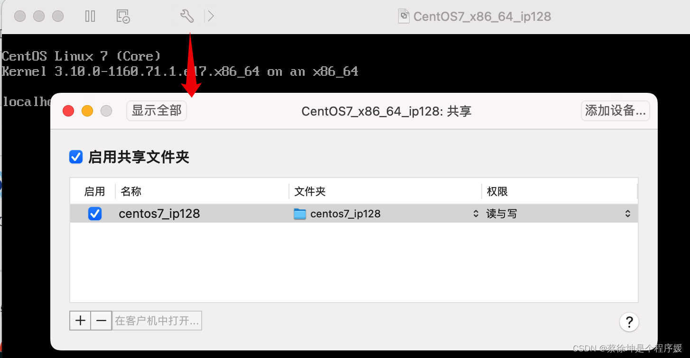
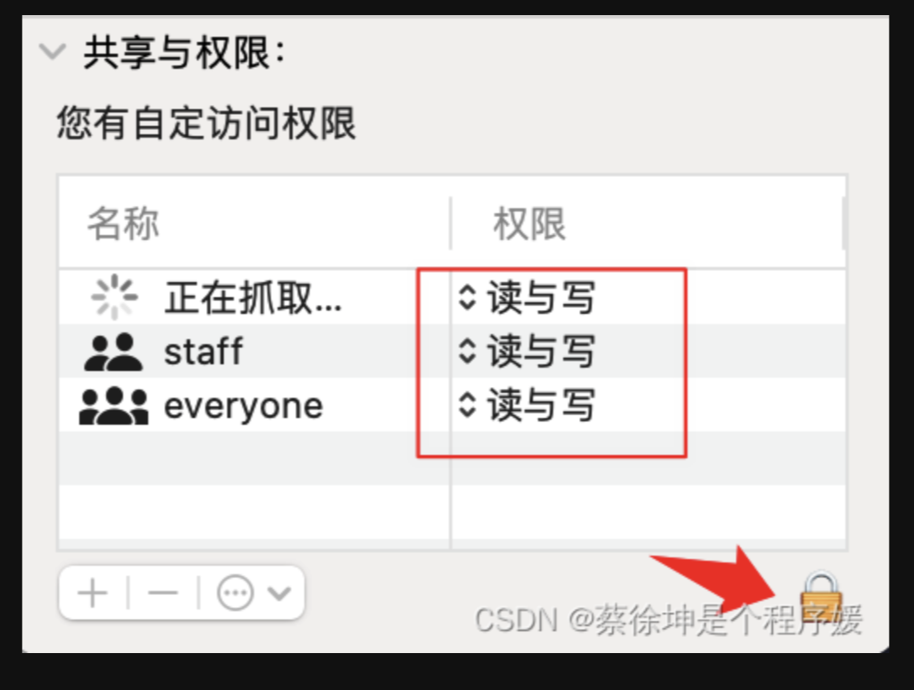

## Mac 上 VMvareTool 共享目录

### 一. centos 与 主机文件夹共享

> 参考资料：https://blog.csdn.net/qq_41490274/article/details/125600034?spm=1001.2014.3001.5502

1、启动 centos。

2、点开设置-共享，在主机创建一个文件夹与 centos 共享。



3、 在 finder 修改实体机映射的文件夹权限。【可选】



4、左下角会提示安装 vm-tools，安装 vm-tools，如果已经安装了，显示重新安装。

5、因为centos 没有 GUI，需要进入命令行安装。进入 centos 终端。

6、root 帐号，依次执行命令

```bash
yum -y install perl gcc make kernel-headers kernel-devel
yum install kernel-devel-$(uname -r)

mkdir /mnt/cdrom
mount -t iso9660 /dev/cdrom /mnt/cdrom
cp /mnt/cdrom/VMwareTools-* /root/vm.tar.gz
cd /root
tar -xzf vm.tar.gz
./vmware-tools-distrib/vmware-install.pl        # 一直按回车

```

7、映射目录在 `/mnt/hgfs`，将其软连接到 `/root/hostshare`。

```sh
ln -s /mnt/hgfs/centos7_ip128 ~/hostshare
```

### 二. ubuntu 与 主机文件夹共享

> 参考资料：https://www.cnblogs.com/MaRcOGO/p/16463460.html

