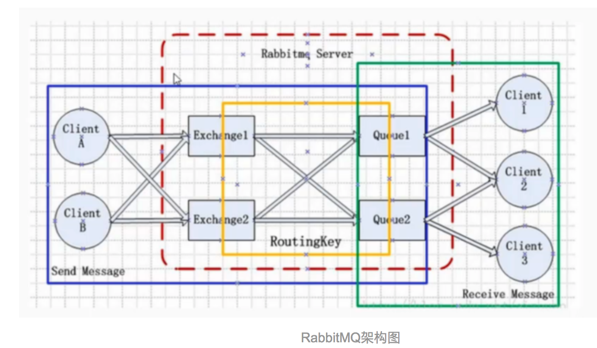
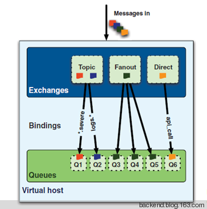

## RabbitMQ 说明

### 一. 概念

​	MQ，即Message Queue，一种应用程序对应用程序的通信方法。JMS（Java Message Service）Java消息中间件服务的标准和API定义，比较脆弱。AMQP（Advanced Message Queuing Protocol）高级消息队列协议。**RabbitMQ**是一个在 AMQP 基础上使用 Erlang 语言完成的，可复用的企业消息系统。

### 二. 安装

以下以 Centos7 为例

#### 1. 单例

- 安装Erlang（http://erlang.org/download/）

  - 下载：http://erlang.org/download/otp_src_20.2.tar.gz

  - 安装

    ```shell
    cd otp_src_20.2
    
    ./configure --prefix=/usr/local/erlang --with-ssl --enable-threads --enable-smmp-support --enable-kernel-poll --enable-hipe --without-javac
    
    ## 参数说明
    # --prefix 指定安装目录
    # --with-ssl  支持加密通信ssl
    # --enable-threads  启用异步线程支持
    # --enable-smmp-support 启用对称多处理支持（Symmetric Multi-Processing对称多处理结构的简称）
    # --enable-kernel-poll   启用Linux内核poll
    # --enable-hipe   启用高性能Erlang
    # --without-javac
    
    ## 编译、安装
    make && make install
    
    ## 添加环境变量
    vim /etc/profile
    ERLANG_HOME=/usr/local/erlang
    PATH=$ERLANG_HOME/bin:$PATH
    export ERLANG_HOME
    export PATH
    
    source /etc/profile
    ## 测试
    erl
    ```

- 安装 RabbitMQ Server（https://github.com/rabbitmq/rabbitmq-server/releases）

  - 下载：https://www.rabbitmq.com/releases/rabbitmq-server/v3.6.14/rabbitmq-server-generic-unix-3.6.14.tar.xz

  - 安装

    ```shell
    tar -xvf rabbitmq-server-generic-unix-3.6.14.tar.xz 
    cd rabbitmq_server-3.6.14/
    
    ## 添加环境变量
    vim /etc/profile
    RABBITMQ_HOME=/opt/rabbitmq_server-3.6.14
    PATH=$RABBITMQ_HOME/sbin:$PATH
    export PATH
    
    ## Web管理插件
    rabbitmq-plugins enable rabbitmq_management
    ## 启动
    rabbitmq-server -detached
    ## 关闭
    rabbitmqctl stop
    
    ## 管理用户
    rabbitmqctl delete_user guest
    rabbitmqctl add_user admin admin123
    rabbitmqctl set_user_tags  admin administrator 
    ## 访问 http://localhost:15672   admin/admin123
    
    ## 开启防火墙端口 5672、15672
    firewall-cmd --zone=public --add-port=5672/tcp --permanent
    firewall-cmd --zone=public --add-port=15672/tcp --permanent
    firewall-cmd --reload
    ```

#### 2. 普通集群

​	参考：https://www.rabbitmq.com/clustering.html。

​	对于Queue来说，消息实体只存在于其中一个节点，A、B两个节点仅有相同的元数据，即队列结构。当消息进入A节点的Queue中后，consumer从B节点拉取时，RabbitMQ会临时在A、B间进行消息传输，把A中的消息实体取出并经过B发送给consumer。

​	所以consumer应尽量连接每一个节点，从中取消息。即对于同一个逻辑队列，要在多个节点建立物理Queue。否则无论consumer连A或B，出口总在A，会产生瓶颈。

​	该模式存在一个问题就是当A节点故障后，B节点无法取到A节点中还未消费的消息实体。

​	如果做了消息持久化，那么得等A节点恢复，然后才可被消费；如果没有持久化会丢失消息。

1. 配置 https://www.rabbitmq.com/configure.html

   默认在 `$RABBITMQ_HOME/etc/` 下，修改 `$RABBITMQ_HOME/sbin/rabbitmq-defaults`

   ```ini
   SYS_PREFIX=${RABBITMQ_HOME}
   ## 修改为，则配置文件在 /etc/rabbitmq/ 目录下
   SYS_PREFIX=
   ```

   - rabbitmq-env.conf 环境变量

     ​	在外部环境变量的，并且是以`RABBITMQ_`开头的环境变量名，在这个文件里就对应为去掉这个前缀的环境变量名。例如，在命令行里，如果有个外部环境变量，名为`RABBITMQ_NODENAME=xxx`，就对应这个文件的变量名`NODENAME=xxx`。优先级高于 rabbitmq.config 。

   - rabbitmq.config 属性配置文件，Erlang类型的配置文件，例：

     ```erlang
     [
     {rabbit, [{tcp_listeners, [5673]}]},
     {rabbitmq_management, [{listener, [{port, 15673}]}]}
     ].
     ```


   -  默认端口

     Node Port：5672

     Dist Port：Node Port + 20000

     UI Port：15672

2. 设置Erlang Cookie

   ​	RabbitMQ的Node之间是通过Erlang Cookie（具有相同的cookie）来互相通信的。Erlang VM在RabbitMQ服务启动后会自动创建，位于 **$HOME/.erlang.cookie**。

3. 创建集群

   - 配置式 https://www.rabbitmq.com/configure.html

     - rabbit1

     ```erlang
     [
     	{rabbit, [
             {cluster_nodes, {['rabbit1@localhost','rabbit2@localhost', 'rabbit3@localhost'], disc}},  
             {tcp_listeners,[{"0.0.0.0",5673}]},
             {default_vhost,       <<"/">>},
             {default_user,        <<"admin">>},
             {default_pass,        <<"admin123">>},
             {loopback_users, ["linuxeye"]},
             {default_permissions, [<<".*">>, <<".*">>, <<".*">>]}
         ]},
     	{rabbitmq_management, [{listener, [{port, 15673}]}]}
     ].
     ```

     - rabbit2

     ```erlang
     [
     	{rabbit, [
             {cluster_nodes, {['rabbit1@localhost','rabbit2@localhost', 'rabbit3@localhost'], disc}},  
             {tcp_listeners,[{"0.0.0.0",5674}]},
         ]},
     	{rabbitmq_management, [{listener, [{port, 15674}]}]}
     ].
     ```

     - rabbit3

     ```erlang
     [
     	{rabbit, [
             {cluster_nodes, {['rabbit1@localhost','rabbit2@localhost', 'rabbit3@localhost'], disc}},  
             {tcp_listeners,[{"0.0.0.0",5675}]},
         ]},
     	{rabbitmq_management, [{listener, [{port, 15675}]}]}
     ].
     ```

   - 命令行 rabbitmqctl

   ```shell
   ## 启动三个节点
   ./rabbitmq1/sbin/rabbitmq-server -detached
   ./rabbitmq2/sbin/rabbitmq-server -detached
   ./rabbitmq3/sbin/rabbitmq-server -detached
   
   ## 通过 cluster_status 验证
   ./rabbitmq1/sbin/rabbitmqctl cluster_status
   ./rabbitmq2/sbin/rabbitmqctl cluster_status
   ./rabbitmq3/sbin/rabbitmqctl cluster_status
   
   ## 创建集群
   ## 停止rabbit2@localhost应用，加入rabbit1@localhost集群，重启rabbit2 application
   ./rabbitmq2/sbin/rabbitmqctl stop_app
   ## ==> Stopping rabbit application on node rabbit2@localhost
   ./rabbitmq2/sbin/rabbitmqctl join_cluster rabbit1@localhost
   ## ==> Clustering node rabbit2@localhost with rabbit1@localhost
   ./rabbitmq2/sbin/rabbitmqctl start_app
   ## ==> Starting node rabbit2@localhost
   
   ## 将rabbit3@localhost，加入rabbit2@localhost集群
   ./rabbitmq3/sbin/rabbitmqctl stop_app
   ./rabbitmq3/sbin/rabbitmqctl join_cluster rabbit2@localhost
   ./rabbitmq3/sbin/rabbitmqctl start_app
   
   ## 查看rabbit1的集群状态
   ./rabbitmq1/sbin/rabbitmqctl cluster_status
   ## ==> Cluster status of node rabbit1@localhost
   ## ==> [{nodes,[{disc,[rabbit1@localhost,rabbit2@localhost,rabbit3@localhost]}]},
   ## ==>  {running_nodes,[rabbit3@localhost,rabbit2@localhost,rabbit1@localhost]},
   ## ==>  {cluster_name,<<"rabbit1@localhost">>},
   ## ==>  {partitions,[]},
   ## ==>  {alarms,[{rabbit3@localhost,[]},
   ## ==>           {rabbit2@localhost,[]},
   ## ==>           {rabbit1@localhost,[]}]}]
   ```

   **集群运维**

   ​	移除一个集群节点，例如 rabbit3

   ```shell
   ./rabbitmq3/sbin/rabbitmqctl stop_app
   ./rabbitmq3/sbin/rabbitmqctl reset
   ```

   **配置Nginx负载**

   ​	负载到Web管理控制台 15673、15674、15675，参照Nginx说明。

#### 3. 镜像模式

​	在RabbitMQ集群上，消息实体会主动在镜像节点间同步，而不是在consumer取数据时临时拉取。该模式带来的副作用也很明显，除了降低系统性能外，如果镜像队列数量过多，加之大量的消息进入，集群内部的网络带宽将会被这种同步通讯大大消耗掉。

​	通过配置策略（policy模块）来实现HA镜像模式，不推荐将所有的Node都配置为镜像，性能巨大损失且无实际必要。有三种policy，即：ha-mode -> all、exactly、nodes。

​	Queue同步方式

       	1. ha-sync-mode: manual  -> 默认的方式。新的queue mirror不会收到已存在的消息，只会收到新的消息。
     	2. ha-sync-mode: automatic -> 当一个新的镜像加入，所有的queue会自动同步。

```shell
## 匹配以ha开头的queue，集群内所有的node都会镜像
rabbitmqctl set_policy ha-all "^ha\." '{"ha-mode":"all"}'

## 匹配以two开头的queue，集群内2个node会镜像
rabbitmqctl set_policy ha-two "^two\." '{"ha-mode":"exactly","ha-params":2,"ha-sync-mode":"automatic"}'

## 匹配以nodes开头的queue，将会在 nodeA 和 nodeB 间同步
rabbitmqctl set_policy ha-nodes "^nodes\." '{"ha-mode":"nodes","ha-params":["rabbit@nodeA", "rabbit@nodeB"]}'
```

### 三. 工作原理



1. 生产者和消费者和RabbitMq Server建立信道 Channel 连接。
2. 消息生产者将消息发布(Public)到 Exchange 中。
3. Exchange 根据队列的绑定关系将消息分发到不同的 Queue 中。
4. AMQP broker 根据订阅规则将消息发送给消费者 或 消费者自行根据需要从消息队列中获取消息。

#### 开发步骤

##### 生产者

```properties
1、连接到RabbitMQ
2、获取channel（信道）
3、声明exchange（交换器）
4、创建消息
5、发布消息
6、关闭channel（信道）
7、关闭连接
```

##### 消费者

```properties
1、连接到RabbitMQ
2、获取channel（信道）
3、声明exchange（交换器）
4、声明queue（队列）
5、绑定交换器和队列
6、消费消息
7、关闭channel（信道）
8、关闭连接
```

```java
// Connection是socket connection的封装
ConnectionFactory factory = new ConnectionFactory();
factory.setHost("localhost");
// 1. 连接到 RabbitMQ
Connection connection = factory.newConnection();
// 2. 获取信道 channel
Channel channel = connection.createChannel();

........

// 关闭信道
channel.close();
// 关闭连接
connection.close();
```

#### 信道 channel

​	生产者和消费者与Rabbit Broker之间建立的连接通道，所有的动作（指令、Queue）都是通过信道进行传递的。**一个共享同一个 TCP 连接的轻量级的连接**。

#### 交换器 Exchange

​	服务器发送消息不会直接发送到队列中（Queue），而是直接发送给交换机（Exchange），然后根据路由键（Routing key），队列通过路由键绑定到交换机上。**如果没有显示地绑定 Exchnge, 那么创建的每个 queue 都会自动绑定到这个默认的 exchagne 中, 并且此时这个 queue 的 route key 就是这个queue 的名字**。

​	

Exchange主要有四种

 -  **Direct Exchange**

    将消息中的`Routing key`与该`Exchange`关联的所有`Binding`中的`Routing key`进行比较，如果相等，则发送到该`Binding`对应的`Queue`中。适合用于消息的单播发送。

```java
// 发布者
// 声明 exchange
channel.exchangeDeclare("test.direct.exchange", BuiltinExchangeType.DIRECT.getType());
// 发布消息
channel.basicPublish("test.direct.exchange", "test.routing.key", null, message.getBytes("UTF-8"));

// 接收者
// 声明 exchange
channel.exchangeDeclare("test.direct.exchange", BuiltinExchangeType.DIRECT.getType());
// 声明queue，mq自动生成
String queueName = channel.queueDeclare().getQueue();
// 绑定交换器和队列
channel.queueBind(queueName, "test.direct.exchange", "test.routing.key");
// 消费消息
Consumer consumer = new DefaultConsumer(channel) {
    @Override
    public void handleDelivery(String consumerTag, Envelope envelope, AMQP.BasicProperties properties,byte[] body) throws IOException {
        String message = new String(body, "UTF-8");
        System.out.println(" 收到消息 '" + envelope.getRoutingKey() + "':'" + message + "'");
    }
};
channel.basicConsume(queueName, true, consumer);
```

- **Fanout Exchange**

  直接将消息转发到所有`binding`的对应`queue`中，这种`exchange`在路由转发的时候，忽略`Routing key`。适用于消息的广播。

  ```java
  // 发布者
  // 声明 exchange
  channel.exchangeDeclare("fanout_logs", BuiltinExchangeType.FANOUT.getType());
  // 发布消息，无需设置 routing key
  channel.basicPublish(EXCHANGE_NAME, "", null, message.getBytes("UTF-8"));

  // 消费者
  // 声明一个交换器，指定交换器的类型
  channel.exchangeDeclare("fanout_logs", BuiltinExchangeType.FANOUT.getType());
  // 获取一个空队列，将队列绑定到交换器上，忽略Routing key
  String queueName = channel.queueDeclare().getQueue();
  channel.queueBind(queueName, "fanout_logs", "");
  // 消费消息
  Consumer consumer = new DefaultConsumer(channel) {
      @Override
      public void handleDelivery(String consumerTag, Envelope envelope, AMQP.BasicProperties properties,byte[] body) throws IOException {
          String message = new String(body, "UTF-8");
          System.out.println(" 收到消息 '" + envelope.getRoutingKey() + "':'" + message + "'");
      }
  };
  channel.basicConsume(queueName, true, consumer);
  ```

- **Topic Exchange**

  将消息中的`Routing key`与该`Exchange`关联的所有`Binding`中的`Routing key`进行对比，如果匹配上了，则发送到该`Binding`对应的`Queue`中。如果`Routing key`没有设置通配符，则与 Direct Exchange 一样。常用于实现 **publish/subscribe** 模型, 即消息的多播模型。

  匹配规则

   * `*` 匹配一个单词
  * `#` 匹配0个或多个字符
  * *，# 只能写在.号左右，且不能挨着字符
  * 单词和单词之间需要用.隔开

  例如：

         	1. user.log.# 可以匹配 user.log、 user.log.info、user.log.info.login
       	2. user.log.* 只能匹配 user.log.info

  ```java
  // 发布者
  // 声明 exchange
  channel.exchangeDeclare("topic_logs", BuiltinExchangeType.TOPIC.getType());
  channel.basicPublish("topic_logs", "x.black.y", null, message.getBytes("UTF-8"));

  // 消费者
  // 声明 exchange
  channel.exchangeDeclare("topic_logs", BuiltinExchangeType.TOPIC.getType());
  // 绑定
  String queueName = channel.queueDeclare().getQueue();
  for (String bindingKey : new String[] {"x.black.*", "y.black.#", "#.black.#"}) {
    	channel.queueBind(queueName, EXCHANGE_NAME, bindingKey);
  }
  // 消费消息
  Consumer consumer = new DefaultConsumer(channel) {
      @Override
      public void handleDelivery(String consumerTag, Envelope envelope, AMQP.BasicProperties properties, byte[] body) throws IOException {
          String message = new String(body, "UTF-8");
    	}
  };
  channel.basicConsume(queueName, true, consumer);
  ```

- **Headers Exchange**

  ​	将消息中的`headers`与该`Exchange`相关联的所有`Binging`中的参数进行匹配，如果匹配上了，则发送到该`Binding`对应的`Queue`中。不常用。

#### 队列 Queue

​	在使用一个队列时，需要先进行声明。如果我们声明的队列不存在，那么 broker 就会自动创建它。 不过如果此队列已经存在时，我们就需要注意了，若我们声明的队列的属性和已存在的队列的属性一致, 则不会有任何的问题，但是如果先后两次声明的队列的属性不一致，则会有 PRECONDITION_FAILED 错误(错误码为406)。

- Name - 名字。
- Durable - 是否是持久的. 当为True时, 即使 broker 重启时, 此 queue 也不会被删除。
- Exclusive - 是否是独占的, 当为真时, 表示此 queue 只能有一个消费者, 并且当此消费者的连接断开时, 此 queue 会被删除。
- Auto-delete - 当为真时, 此 队列会在最后一个消费者取消订阅时被删除。

#### 绑定 Binding

​	队列的绑定关系是 exchagne 用于消息路由的规则，即一个 exchange 能够将消息路由到某个队列的前提是此队列已经绑定到这个 exchange 中了。 当队列绑定到一个 exchange 中时, 我们还可以设置一个额外的参数，即 route key，这个 key 会被 direct exchange 和 topic exchange 作为额外的路由信息而使用。 即，route key 扮演着过滤器的角色。
​	当一个消息没有被路由到任意的队列时(例如此 exchange 没有任何的 queue 绑定着)，那么此时会根据消息的属性来决定是将此消息丢弃还是返回给生产者。

#### 消息应答 Message Acknowledgment

​	参考：https://www.rabbitmq.com/confirms.html。

​	默认情况下，只要有消费者，消息进去队列后，消息就会被全部分配好到相应的消费者进行处理，对应的消息也会在队列中去除。如果某个消费者处理过程中突然挂了，那么这些消息就没有被处理，所以我们可以设置消息为应答模式，也就是在消费者处理完一条消息后，就告诉mq此消息已被处理完，那么未作出应答的消息就会被转发到其它的消费者进行处理。

- 自动 ACK 模式

  ​	在自动 ACK 模式下, 当 broker 发送消息成功后，会立即将此消息从消息队列中删除，而不会等待消费者的 ACK 回复。

- 手动 ACK 模式

  ​	在手动 ACK 模式下，当 broker 发送消息给消费者时，不会立即将此消息删除，而是需要等待消费者的 ACK 回复后才会删除消息。因此在手动 ACK 模式下，当消费者收到消息并处理完成后，需要向 broker 显示地发送 ACK 指令。

  ​	在手动 ACK 模式下，如果消费者因为意外的 crash 而没有发送 ACK 给 broker，那么此时 broker 会将此消息转发给其他的消费者(如果此时没有消费者了，那么 broker 会缓存此消息，直到有新的消费者注册)。

### 四. Springboot集成

#### 1. 核心概念

##### 1.连接

​	使用ConnectionFactory接口（实现CachingConnectionFactory）来创建Connection，每个Connection默认会缓存25个Channel。连接Rabbit集群模式，要设置 `spring.rabbitmq.cache.connection.mode=connection` 。checkout-timeout，当此属性大于零时，channelCacheSize将成为可在连接上创建的通道数的限制。 如果达到限制，调用线程将阻塞，直到有一个Channel可用或达到超时，在这种情况下会引发AmqpTimeoutException。

#### 2. 具体实现

##### 1. 添加依赖

```xml
<dependency>
  <groupId>org.springframework.boot</groupId>
  <artifactId>spring-boot-starter-amqp</artifactId>
</dependency>
```

##### 2. 配置文件

```yaml
spring:
  rabbitmq:
    host: localhost
    port: 5672
    username: dante
    password: 123456
    publisher-confirms: true  ## 消息确认 Acknowledgements
    cache:
      connection:
        mode: channel
      channel:
        size: 25
        checkout-timeout: 10000
    virtual-host: /springboot-config
```

##### 3. 配置类

```java
package org.dante.springboot.rabbitmq.config;

/**
 * Exchange、Queue在做绑定时，所有的配置必须一致 (durable、auto-delete、exclusive)
 * 
 * @author dante
 */
@EnableRabbit
@Configuration
public class RabbitMQConfig {

	@Autowired
	private ConnectionFactory connectionFactory;
	@Autowired
	private SpiritRabbitProperties spiritRabbitProperties;

	@Bean
	@Scope(ConfigurableBeanFactory.SCOPE_PROTOTYPE)
	public RabbitTemplate rabbitTemplate() {
		RabbitTemplate template = new RabbitTemplate(connectionFactory);
		template.setMessageConverter(new Jackson2JsonMessageConverter());
		return template;
	}
	
	/**
	 * 默认使用 direct 交换器，使用 Queue 的名字做为 Routingkey
	 * 
	 * @return
	 */
	@Bean
	public Queue defaultQueue() {
		return QueueBuilder.nonDurable(spiritRabbitProperties.getDefaultQueue()).build();
	}

	/****************************************************************************/
	// direct exchange，按照routingkey分发到指定队列，用于point - point
	@Bean
	public DirectExchange directExchange() {
		return (DirectExchange) ExchangeBuilder.directExchange(spiritRabbitProperties.getDirectExchange()).durable(true).build();
	}

	@Bean
	public Queue directQueue() {
		// 匿名 Queue
		return QueueBuilder.nonDurable().autoDelete().build();
	}

	@Bean
	public Binding directBinding() {
		return BindingBuilder.bind(directQueue()).to(directExchange()).with(spiritRabbitProperties.getDirectRoutingKey());
	}
	/****************************************************************************/
	
	/****************************************************************************/
	// fanout exchange, 广播消息，无routingKey的概念，消息会分发到所有绑定fanout交换器的队列上
	@Bean
	public FanoutExchange fanoutExchange() {
		return (FanoutExchange) ExchangeBuilder.fanoutExchange(spiritRabbitProperties.getFanoutExchange()).durable(true).build();
	}
	/****************************************************************************/
	
	/****************************************************************************/
	// topic exchange, 发布/订阅
	@Bean
	public TopicExchange topicExchange() {
		return (TopicExchange) ExchangeBuilder.topicExchange(spiritRabbitProperties.getTopicExchange()).durable(true).build();
	}
	
}
```

##### 4. 发布者

```java
@Component
public class SpiritRabbitPubilsher {

	@Autowired
	private RabbitTemplate rabbitTemplate;
	
	/**
	 * 默认交换器 Direct Exchange
	 * 
	 * @param routingKey
	 * @param Message
	 */
	public void sendMessage(String routingKey, Object message) {
		rabbitTemplate.convertAndSend(routingKey, message);
	}
 
	/**
	 * 指定交换器、路由键发布消息
	 * 
	 * @param exchange
	 * @param routingKey
	 * @param message
	 */
	public void sendMessage(String exchange, String routingKey, Object message) {
		rabbitTemplate.convertAndSend(exchange, routingKey, message, new CorrelationData(UUID.randomUUID().toString()));
	}
}
```

##### 5. 接收者

- 配置文件

```yaml
spring:
  rabbitmq:
    host: localhost
    port: 5672
    username: dante
    password: 123456
    virtual-host: /springboot-config
spirit:
  rabbitmq:
    default-queue: sbr.default.queue
    direct-exchange: sbr.direct.exchange
    fanout-exchange: sbr.fanout.exchange
    topic-exchange: sbr.topic.exchange
    direct-routing-key: sbr.direct.routing.key
    topic-routing-key: sbr.topic.routing.key
```

- 配置类

```java
@EnableRabbit
@Configuration
public class RabbitMQConfig {
	@Autowired
	private ConnectionFactory connectionFactory;
	
  	/**
    * 对于消费端，我们可以只创建 SimpleRabbitListenerContainerFactory，
    * 它能够帮我们生成 RabbitListenerContainer，然后我们再使用
    * @RabbitListener 指定接收者收到信息时处理的方法。
    */
	@Bean
    public SimpleRabbitListenerContainerFactory rabbitListenerContainerFactory() {
        SimpleRabbitListenerContainerFactory factory = new SimpleRabbitListenerContainerFactory();
        factory.setConnectionFactory(connectionFactory);
        factory.setMessageConverter(new Jackson2JsonMessageConverter());
        factory.setConcurrentConsumers(3);
        factory.setMaxConcurrentConsumers(10);
        return factory;
    }
}
```

- 接收类

```java
@Slf4j
@Component
public class DirectExchangeListener {

	@RabbitListener(queues = "${spirit.rabbitmq.default-queue}")
	public void receiveMessage1(PubMsg msg) {
		log.info("DirectExchangeListener 收到消息1 {}", msg);
	}
	
	@RabbitListener(bindings = @QueueBinding(value = @Queue(ignoreDeclarationExceptions="true"),
			exchange=@Exchange(value="${spirit.rabbitmq.direct-exchange}", durable="true", type=ExchangeTypes.DIRECT),
			key="${spirit.rabbitmq.direct-routing-key}"))
	public void receiveMessage2(PubMsg msg) {
		log.info("DirectExchangeListener 收到消息2 {}", msg);
	}
}

@Slf4j
@Component
public class FanoutExchangeListener {
	@RabbitListener(bindings=@QueueBinding(value=@Queue(autoDelete="true") ,exchange=@Exchange(value="${spirit.rabbitmq.fanout-exchange}",durable="true",type=ExchangeTypes.FANOUT)))
	public void receive1(Object msg) {
		log.info("听众1收到消息 {}.", msg);
	}
	
	@RabbitListener(bindings=@QueueBinding(value=@Queue(autoDelete="true") ,exchange=@Exchange(value="${spirit.rabbitmq.fanout-exchange}",durable="true",type=ExchangeTypes.FANOUT)))
	public void receive2(PubMsg msg) {
		log.info("听众2收到消息 {}.", msg);
	}
	
	@RabbitListener(bindings=@QueueBinding(value=@Queue(value="fanout.receive3", autoDelete="true") ,exchange=@Exchange(value="${spirit.rabbitmq.fanout-exchange}",durable="true",type=ExchangeTypes.FANOUT)))
	public void receive3(PubMsg msg) {
		log.info("听众3收到消息 {}.", msg);
	}
}

@Slf4j
@Component
public class TopicExchangeListener {
@RabbitListener(bindings=@QueueBinding(value=@Queue(autoDelete="true",ignoreDeclarationExceptions="true") ,exchange=@Exchange(value="${spirit.rabbitmq.topic-exchange}",durable="true",type=ExchangeTypes.TOPIC), key = "*.sbr.topic.routing.key.#"))
	public void receiveTopicMsg1(Object msg) {
		log.info("订阅者1收到消息 {}.", msg);
	}
	
	@RabbitListener(bindings=@QueueBinding(value=@Queue(autoDelete="true") ,exchange=@Exchange(value="${spirit.rabbitmq.topic-exchange}",durable="true",type=ExchangeTypes.TOPIC), key = "#.sbr.topic.routing.key.#"))
	public void receiveTopicMsg2(PubMsg msg) {
		log.info("订阅者2收到消息 {}.", msg);
	}
}
```

### 八. 参考资料

- https://segmentfault.com/a/1190000007123977
- http://www.jianshu.com/p/79ca08116d57
- https://www.jianshu.com/p/c0bfe198739e
- http://www.codeweblog.com/rabbitmq-%E5%AE%89%E8%A3%85%E5%90%8E%E7%9A%84%E9%80%9A%E7%94%A8%E9%85%8D%E7%BD%AE%E4%B8%8E%E6%93%8D%E4%BD%9C/
- http://blog.csdn.net/liaokailin/article/details/49559571
- https://www.jianshu.com/p/4f3281cd97ab
- http://www.cnblogs.com/piaolingzxh/p/5448927.html
- http://www.cnblogs.com/wangdaijun/p/7920716.html
- https://docs.spring.io/spring-amqp/docs/1.7.5.RELEASE/reference/html/_reference.html
- https://docs.spring.io/spring-boot/docs/1.5.9.RELEASE/reference/htmlsingle/#boot-features-amqp
