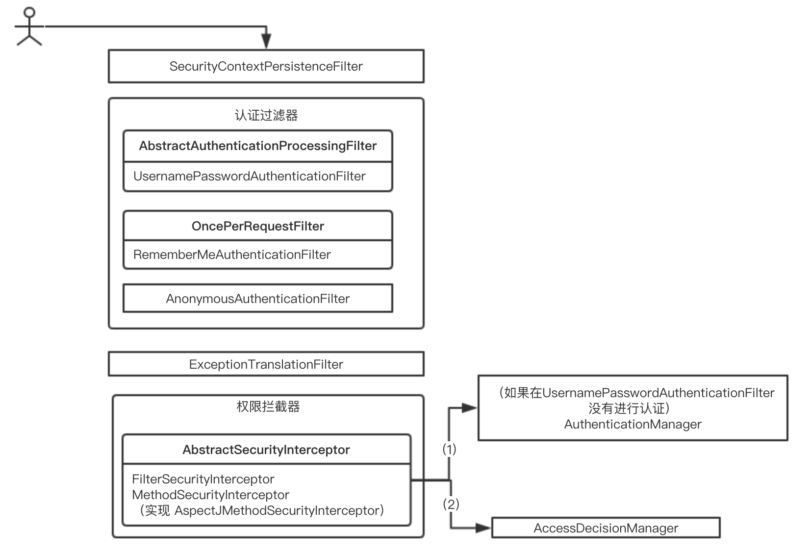
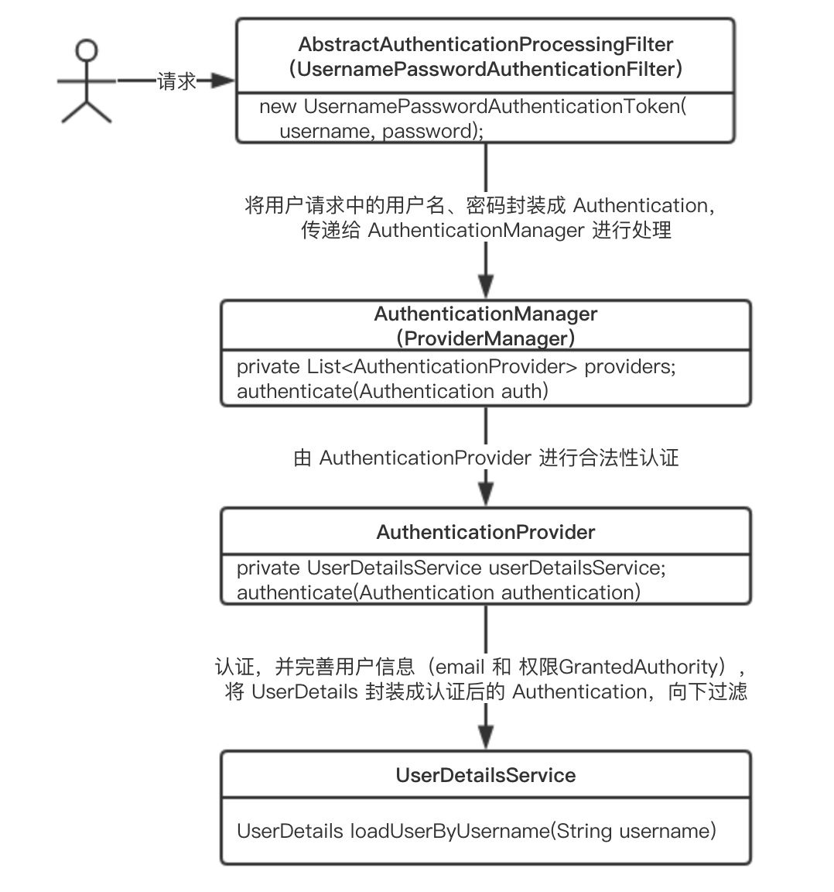
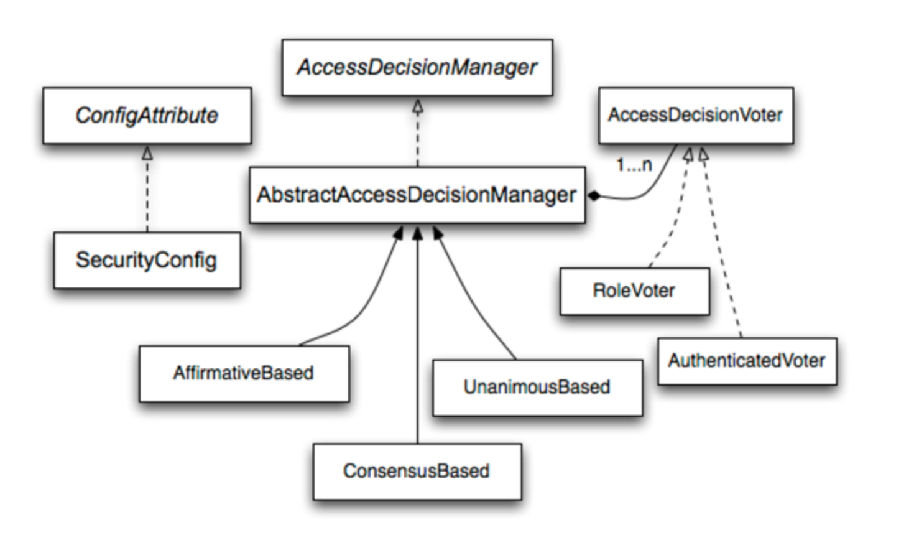
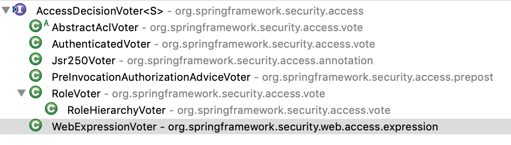
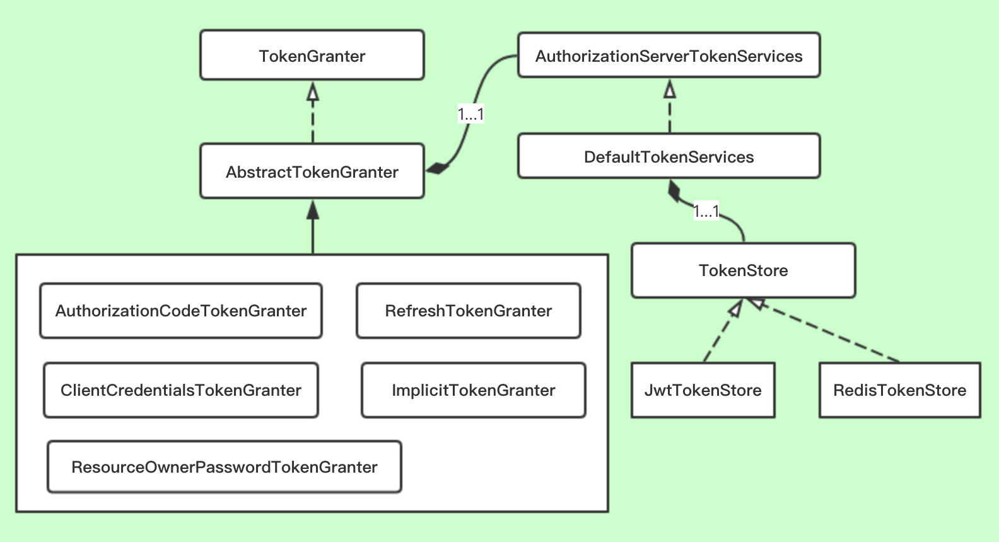
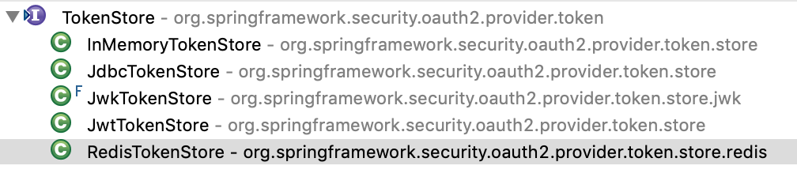

## Spring Security

### 一. 介绍

Spring Security 是基于 Spring 的一套安全框架，提供了一整套 Web 应用安全性的解决方案。对于 Web 应用的安全性，一般包括认证（Authentication）和 授权（Authorization）。

**认证（Authentication）**

你是谁？验证用户是否系统的合法公民，一般需要用户提供用户名、密码。Spring Security 提供的支持有 HTTP Basic、Form 、OAuth2、OpenID、Ldap 等。

**授权（Authorization）**

你能干什么？验证用户是否具有权限执行某个操作。Spring Security 提供了**基于角色的访问控制RBAC**和**访问控制列表（ACL）**。

### 二. 工作原理

#### 1. 初始化

通过 AbstractSecurityWebApplicationInitializer 对 SpringSecurityFilterChain 进行注册。Spring Security 通过 SpringSecurityFilterChain 对 web 进行安全控制，并且这个 Filter 必须在其他拦截器之前。例如

```java
public class DelegatingFilterProxy extends GenericFilterBean {
   // 实现 doFilter(ServletRequest request, ServletResponse response, FilterChain chain) 
}
public abstract class GenericFilterBean implements Filter, BeanNameAware, EnvironmentAware,
		EnvironmentCapable, ServletContextAware, InitializingBean, DisposableBean {
}
```
```xml
<!-- web.xml -->
<filter>
    <filter-name>springSecurityFilterChain</filter-name>
    <filter-class>org.springframework.web.filter.DelegatingFilterProxy</filter-class>
</filter>
<filter-mapping>
    <filter-name>springSecurityFilterChain</filter-name>
    <url-pattern>/*</url-pattern>
</filter-mapping>
```

```java
/** Java Config 初始化方式 **/
@EnableWebSecurity
public class WebSecurityConfig extends WebSecurityConfigurerAdapter {
}
```

安全细节，需要重写 WebSecurityConfigurerAdapter 的一个或多个方法

| 方法                                    | 描述                                    |
| --------------------------------------- | --------------------------------------- |
| configure(WebSecurity)                  | 通过重写，配置Spring Security的Filter链 |
| configure(HttpSecurity)                 | 通过重写，配置如何通过拦截器保护请求    |
| configure(AuthenticationManagerBuilder) | 通过重写，配置user-detail服务           |

#### 2. 认证鉴权流程

Spring Security 通过一系列 Filter 对应用进行认证和授权，这些 Filter 都包含在 SpringSecurityFilterChain。



##### SecurityContextPersistenceFilter

持久化 SecurityContext 到 SecurityContextHolder 中，后面的 Filter 从中获取 SecurityContext。对于已经认证的 Authentication 可以从 SecurityContextRepository（例如 Session 中获取）。

```java
/** SecurityContext 中放置的都是 Authentication **/
public interface SecurityContext extends Serializable {
    Authentication getAuthentication();
    void setAuthentication(Authentication authentication);
}
```

##### AbstractAuthenticatioProcessingFilter

默认实现是 UsernamePasswordAuthenticationFilter，处理来自表单的认证。认证成功或失败由 AuthenticationSuccessHandler 和 AuthenticationFailureHandler 进行处理。

可在UsernamePasswordAuthenticationFilter**前**，自定义 Filter，根据业务进行认证。

```java
http.addFilterBefore(自定义Filter, UsernamePasswordAuthenticationFilter.class)
```

##### ExceptionTranslationFilter

处理认证、授权过程中的异常情况 AuthenticationException 和 AccessDeniedException，其他异常会继续抛出。

- AuthenticationException

  会使用其对应的 AuthenticationEntryPoint 的commence()处理。在处理之前，ExceptionTranslationFilter先使用 RequestCache 将当前的HttpServerletRequest的信息保存起来，以至于用户成功登录后可以跳转到之前的界面。

- AccessDeniedException

  匿名或已登陆用户使用关联的 AccessDeniedHandler 的 `void handle(HttpServletRequest request, HttpServletResponse response, AccessDeniedException accessDeniedException)` 进行处理。

- RequestCache

  默认实现 HttpSessionRequestCache，会将 HttpServletRequest 相关信息封装为一个SavedRequest 并保存到 HttpSession中。

##### AbstractSecurityInterceptor

用于拦截请求，进行权限控制的，具有两个具体的子类。拦截器中主要方法有

**beforeInvocation（Invoke前拦截）**、afterInvocation（Invoke后拦截）

```java
/** beforeInvocation **/
protected InterceptorStatusToken beforeInvocation(Object object) {
    ...
    // 获取请求对象配置的权限标识 DefaultFilterInvocationSecurityMetadataSource
    Collection<ConfigAttribute> attributes = this.obtainSecurityMetadataSource()
				.getAttributes(object);
    if (attributes == null || attributes.isEmpty()) {
        if (rejectPublicInvocations) {
            throw new IllegalArgumentException(
                "Secure object invocation "
                + object
                + " was denied as public invocations are not allowed via this interceptor. "
                + "This indicates a configuration error because the "
                + "rejectPublicInvocations property is set to 'true'");
        }

        publishEvent(new PublicInvocationEvent(object));

        return null; // no further work post-invocation
    }
    ...
    // 未认证的需要先进行认证
    if (SecurityContextHolder.getContext().getAuthentication() == null) {
        credentialsNotFound(messages.getMessage(
            "AbstractSecurityInterceptor.authenticationNotFound",
            "An Authentication object was not found in the SecurityContext"),
                            object, attributes);
    }
	// AuthenticationManager 进行认证
    Authentication authenticated = authenticateIfRequired(); 
    // AccessDecisionManager 进行授权
    try {
			this.accessDecisionManager.decide(authenticated, object, attributes);
		} catch (AccessDeniedException accessDeniedException) {
			publishEvent(new AuthorizationFailureEvent(object, attributes, authenticated, accessDeniedException));
			throw accessDeniedException;
		}
}
```

- FilterSecurityInterceptor

  处理 Http 请求的拦截，需要一个AccessDecisionManager和一个AuthenticationManager 的引用，会从 SecurityContextHolder 获取 Authentication，然后通过 SecurityMetadataSource 可以得知当前请求是否在请求受保护的资源。对与认证不成功的，需要用 AuthenticationManager 再认证一次，通过后在用 AccessDecisionManager 进行权限的检查。

- MethodSecurityInterceptor

  基于 AOP 原理对方法的调用进行拦截。拦截原理同 FilterSecurityInterceptor，只是这里需要通过 MethodSecurityMetadataSource 来得知被调用的方法是否为被保护的资源。一般可以通过注解的方式指定，例如：  `@PreAuthorize("hasAuthority('sysmgr.user.delete')")`

- SecurityMetadataSource - FilterInvocationSecurityMetadataSource

  ```java
  // 缺省实现
  public class DefaultFilterInvocationSecurityMetadataSource implements
  		FilterInvocationSecurityMetadataSource {
      private final Map<RequestMatcher, Collection<ConfigAttribute>> requestMap;
      ...
      public Collection<ConfigAttribute> getAttributes(Object object) {
  		final HttpServletRequest request = ((FilterInvocation)object).getRequest();
  		for (Map.Entry<RequestMatcher, Collection<ConfigAttribute>> entry : requestMap.entrySet()) {
  			if (entry.getKey().matches(request)) {
  				return entry.getValue();
  			}
  		}
  		return null;
  	}
      ...
  }
  ```

#### 3. 认证 



##### Authentication

被认证用户的抽象接口。在用户登录认证之前相关信息会封装为一个Authentication具体实现类的对象，在登录认证成功之后又会生成一个信息更全面，包含用户权限等信息的Authentication对象，然后把它保存在SecurityContextHolder所持有的SecurityContext中，供后续的程序进行调用，如访问权限的鉴定等。

```java
public interface Authentication extends Principal, Serializable { 
    // 可将认证用户的权限获取并返回
    Collection<? extends GrantedAuthority> getAuthorities();
}
```

##### SecurityContextHolder

 SecurityContextHolder是用来保存SecurityContext的。SecurityContext中含有当前正在访问系统的用户的详细信息。默认情况下，SecurityContextHolder将使用ThreadLocal来保存SecurityContext，这也就意味着在处于同一线程中的方法中我们可以从ThreadLocal中获取到当前的SecurityContext。因为线程池的原因，如果我们每次在请求完成后都将ThreadLocal进行清除的话，那么我们把SecurityContext存放在ThreadLocal中还是比较安全的。这些工作Spring Security已经自动为我们做了，即在每一次request结束后都将清除当前线程的ThreadLocal。

```java
public static SpiritLoginUser loginUser() {
    SpiritLoginUser loginUser = null;
    Object principal = SecurityContextHolder.getContext().getAuthentication().getPrincipal();
    if(principal != null && principal instanceof SpiritPrincipal) {
        SpiritPrincipal spiritPrincipal = (SpiritPrincipal) principal;
        loginUser = spiritPrincipal.getSpiritLoginUser();
    }
    return loginUser;
}
```

##### AuthenticationManager

处理认证的接口，并且该用户在 Spring Security 被抽象成 Authentication。AuthenticationManager 的默认实现是 ProviderManager，而 ProviderManager 将具体的认证的工作委托给一系列的 AuthenticationProvider 来进行处理。

```java
public interface AuthenticationManager {
    Authentication authenticate(Authentication authentication) 
        throws AuthenticationException;
	}
}
public class ProviderManager implements AuthenticationManager, MessageSourceAware,
		InitializingBean {
    public ProviderManager(List<AuthenticationProvider> providers) {
		this(providers, null);
	}
    。。。。
    // 认证逻辑
    public Authentication authenticate(Authentication authentication)
			throws AuthenticationException {        
        for (AuthenticationProvider provider : getProviders()) {
			。。。
			try {
				result = provider.authenticate(authentication);
				if (result != null) {
					copyDetails(authentication, result);
					break;
				}
			}
			。。。
		}
    }        
}
```

##### AuthenticationProvider

各个具体认证者的抽象接口。认证的具体实现有 DaoAuthenticationProvider（默认实现）、RemoteAuthenticationProvider、LdapAuthenticationProvider、CustomAuthenticationProvider等。

```java
Authentication authenticate(Authentication authentication)
			throws AuthenticationException;
```

```java
public abstract class AbstractUserDetailsAuthenticationProvider implements
		AuthenticationProvider, InitializingBean, MessageSourceAware {
	...
    public Authentication authenticate(Authentication authentication)
			throws AuthenticationException {
        ...
        String username = (authentication.getPrincipal() == null) ? "NONE_PROVIDED"
				: authentication.getName();
		boolean cacheWasUsed = true;
		UserDetails user = this.userCache.getUserFromCache(username);
		if (user == null) {
			cacheWasUsed = false;
			try {
                // 各个具体的 Provider 自行实现
				user = retrieveUser(username,
						(UsernamePasswordAuthenticationToken) authentication);
			}
			catch (UsernameNotFoundException notFound) {
				logger.debug("User '" + username + "' not found");

				if (hideUserNotFoundExceptions) {
					throw new BadCredentialsException(messages.getMessage(
							"AbstractUserDetailsAuthenticationProvider.badCredentials",
							"Bad credentials"));
				}
				else {
					throw notFound;
				}
			}
            ...
    }
        
    // 将 UserDetails 转化成 Authentication
    protected Authentication createSuccessAuthentication(Object principal,
			Authentication authentication, UserDetails user) {
		UsernamePasswordAuthenticationToken result = new UsernamePasswordAuthenticationToken(
				principal, authentication.getCredentials(),
				authoritiesMapper.mapAuthorities(user.getAuthorities()));
		result.setDetails(authentication.getDetails());

		return result;
	}
    ...
}
```

##### DaoAuthenticationProvider

```java
public class DaoAuthenticationProvider extends AbstractUserDetailsAuthenticationProvider {
	// 指定加密器
    private PasswordEncoder passwordEncoder;
    // 用户认证的抽象处理接口，按业务自定义开发
    private UserDetailsService userDetailsService;
    // 用户修改密码的抽象处理接口
    private UserDetailsPasswordService userDetailsPasswordService;
    
    /**
    	实际的获取认证用户详情的处理方法
    **/
    protected final UserDetails retrieveUser(String username,
			UsernamePasswordAuthenticationToken authentication)
			throws AuthenticationException {
		prepareTimingAttackProtection();
		try {
            // 主要的业务自定义处理逻辑
			UserDetails loadedUser = this.getUserDetailsService().loadUserByUsername(username);
			if (loadedUser == null) {
				throw new InternalAuthenticationServiceException(
						"UserDetailsService returned null, which is an interface contract violation");
			}
			return loadedUser;
		}
		catch (UsernameNotFoundException ex) {
			mitigateAgainstTimingAttack(authentication);
			throw ex;
		}
		catch (InternalAuthenticationServiceException ex) {
			throw ex;
		}
		catch (Exception ex) {
			throw new InternalAuthenticationServiceException(ex.getMessage(), ex);
		}
	}
}
```

##### UserDetailsService

用户认证业务处理接口，开发人员可以实现这个接口，从实际的用户资源库中获取用户，例如：编写DAO 从MySQL 中获取用户详情。

```java
UserDetails loadUserByUsername(String username) throws UsernameNotFoundException;
```

##### UserDetails

认证后的用户抽象接口，开发可实现这个接口进行业务扩展。Spring Security 默认的实现是 User。

```java
public interface UserDetails extends Serializable {
    // 用户权限 SimpleGrantedAuthority
    Collection<? extends GrantedAuthority> getAuthorities();
    String getPassword();
    String getUsername();
    boolean isAccountNonExpired();
    boolean isAccountNonLocked();
    boolean isCredentialsNonExpired();
    boolean isEnabled();
}
```

#### 4. 授权



##### AccessDecisionManager

鉴权管理器。检查已认证（或匿名）用户是否有访问受保护资源的权限，基于投票的机制来进行访问控制。

```java
public interface AccessDecisionManager {
    /**
    	object: 被访问的受保护对象
    	configAttributes: 被访问的受保护对象具有的权限标识（例如：权限码）
    **/
    void decide(Authentication authentication, Object object,
			Collection<ConfigAttribute> configAttributes) throws AccessDeniedException,
			InsufficientAuthenticationException;
    /** 
    	AccessDecisionManager 是否支持使用 decide 中的 
    	configAttributes 进行权限控制处理  
    **/
    boolean supports(ConfigAttribute attribute);
    
    /** AccessDecisionManager 是否支持对应的受保护对象类型 **/
    boolean supports(Class<?> clazz);
}
```

##### AbstractAccessDecisionManager

鉴权管理的抽象实现，规定了具体 AccessDecision 的引用对象。

```java
public abstract class AbstractAccessDecisionManager implements AccessDecisionManager,
		InitializingBean, MessageSourceAware {
    // 鉴权投票者 AccessDecisionVoter
    private List<AccessDecisionVoter<? extends Object>> decisionVoters;
    // 鉴权未通过时的提示信息，支持国际化
    protected MessageSourceAccessor msgs = SpringSecurityMessageSource.getAccessor();
    // 所有 Voter 都弃权时，是否通过鉴权。True：通过，False 不通过   
	private boolean allowIfAllAbstainDecisions = false;
}
```

##### 具体鉴权管理器

###### AffirmativeBased

默认的实现，即一票通过制。

1. 只要有一个 Voter 通过，就认为通过。
2. 没有一个 Voter 通过时，有一个 Voter 投反对，就认为不通过。
3. 全部弃权，指定父类的 allowIfAllAbstainDecisions 决定是否通过。

```java
// AffirmativeBased
public void decide(Authentication authentication, Object object,
			Collection<ConfigAttribute> configAttributes) 
    throws AccessDeniedException {
		int deny = 0;	// 否定票数

		for (AccessDecisionVoter voter : getDecisionVoters()) {
			int result = voter.vote(authentication, object, configAttributes);
			switch (result) {
			case AccessDecisionVoter.ACCESS_GRANTED:
				return;
			case AccessDecisionVoter.ACCESS_DENIED:
				deny++;
				break;
			default:
				break;
			}
		}
		if (deny > 0) {
			throw new AccessDeniedException(messages.getMessage(
					"AbstractAccessDecisionManager.accessDenied", "Access is denied"));
		}

		// 全部弃权，指定父类的 allowIfAllAbstainDecisions 决定是否投票通过
		checkAllowIfAllAbstainDecisions();
	}
```

###### ConsensusBased

少数服从多数制。

1. 通过票大于否定票时，认定鉴权通过。
2. 否定票大于通过票时，认定鉴权失败。
3. 通过票和否定票相同时，只要有一票通过，就认为鉴权通过。

```java

// 默认认定，全部 Voter 弃权时，投票通过
private boolean allowIfEqualGrantedDeniedDecisions = true;

public void decide(Authentication authentication, Object object,
			Collection<ConfigAttribute> configAttributes) throws AccessDeniedException {
		int grant = 0; // 通过票数
		int deny = 0;  // 否定票数

		for (AccessDecisionVoter voter : getDecisionVoters()) {
			int result = voter.vote(authentication, object, configAttributes);

			switch (result) {
			case AccessDecisionVoter.ACCESS_GRANTED:
				grant++;
				break;
			case AccessDecisionVoter.ACCESS_DENIED:
				deny++;
				break;
			default:
				break;
			}
		}
    	// 通过票大于否定票时，认定鉴权通过
		if (grant > deny) {
			return;
		}
    	// 否定票大于通过票时，认定鉴权失败
		if (deny > grant) {
			throw new AccessDeniedException(messages.getMessage(
					"AbstractAccessDecisionManager.accessDenied", "Access is denied"));
		}
    	// 通过票和否定票相同时，只要有一票通过，就认为鉴权通过
		if ((grant == deny) && (grant != 0)) {
			if (this.allowIfEqualGrantedDeniedDecisions) {
				return;
			} else {
				throw new AccessDeniedException(messages.getMessage(
						"AbstractAccessDecisionManager.accessDenied", "Access is denied"));
			}
		}
		// 全部弃权，指定父类的 allowIfAllAbstainDecisions 决定是否投票通过
		checkAllowIfAllAbstainDecisions();
	}
```

###### UnanimousBased

一票否定制。

1. 每个投票者只对一个受保护对象的权限标示做验证。
2. 只要有一次获得否定票，就认为投票失败，抛出异常。
3. 没有反对票，只有通过票时（不是全部通过，还有弃权票），认为鉴权成功。

```java
public void decide(Authentication authentication, Object object,
			Collection<ConfigAttribute> attributes) throws AccessDeniedException {
		int grant = 0;	// 通过票数
		List<ConfigAttribute> singleAttributeList = new ArrayList<>(1);
		singleAttributeList.add(null);

		for (ConfigAttribute attribute : attributes) {
            // 每个投票者只对一个受保护对象的权限标示做验证
			singleAttributeList.set(0, attribute);

			for (AccessDecisionVoter voter : getDecisionVoters()) {
				int result = voter.vote(authentication, object, singleAttributeList);
				switch (result) {
				case AccessDecisionVoter.ACCESS_GRANTED:
					grant++;
					break;
				// 只要有一次获得否定票，就认为投票失败，抛出异常
				case AccessDecisionVoter.ACCESS_DENIED:
					throw new AccessDeniedException(messages.getMessage(
							"AbstractAccessDecisionManager.accessDenied",
							"Access is denied"));
				default:
					break;
				}
			}
		}
		// 没有反对票，只有通过票时，认为鉴权成功
		if (grant > 0) {
			return;
		}

		// 全部弃权，指定父类的 allowIfAllAbstainDecisions 决定是否投票通过
		checkAllowIfAllAbstainDecisions();
	}
```

##### AccessDecisionVoter

投票器，具体的决策者。



```java
public interface AccessDecisionVoter<S> {
    int ACCESS_GRANTED = 1;		// 通过加1票
	int ACCESS_ABSTAIN = 0;		// 弃权0票
	int ACCESS_DENIED = -1;		// 否定减1票
    
    // 同 AccessDecisionManager decide() 的参数
    int vote(Authentication authentication, S object,
			Collection<ConfigAttribute> attributes);
    // 支持的权限
    boolean supports(ConfigAttribute attribute);
    // 支持的类型
    boolean supports(Class<?> clazz);
}
```

###### RoleVoter

将受保护资源权限看成一个角色（实际是权限码），并只对具有 ROLE_ （可配置）前缀的角色进行投票。

1. 若受保护的资源权限没有以 ROLE_ 作为前缀，则投弃权票。
2. 已认证用户权限和若受保护的资源权限有一个或多个匹配，则投赞成票。
3. 已认证用户权限和若受保护的资源权限没有一个匹配的，则投否定票。

```java
public class RoleVoter implements AccessDecisionVoter<Object> {
    private String rolePrefix = "ROLE_";
    
    // 只支持对具有 rolePrefix（_ROLE）的 ConfigAttribute 进行投票
    public boolean supports(ConfigAttribute attribute) {
		if ((attribute.getAttribute() != null)
				&& attribute.getAttribute().startsWith(rolePrefix)) {
			return true;
		}
		else {
			return false;
		}
	}
    
    public int vote(Authentication authentication, Object object,
			Collection<ConfigAttribute> attributes) {
		if (authentication == null) {
			return ACCESS_DENIED;
		}
		int result = ACCESS_ABSTAIN;
        // 提取出已认证用户的权限
		Collection<? extends GrantedAuthority> authorities = extractAuthorities(authentication);
		for (ConfigAttribute attribute : attributes) {
			if (this.supports(attribute)) {
				result = ACCESS_DENIED;
				// 用户权限匹配资源权限，则投通过票
				for (GrantedAuthority authority : authorities) {
					if (attribute.getAttribute().equals(authority.getAuthority())) {
						return ACCESS_GRANTED;
					}
				}
			}
		}
		return result;
	}
}
```

###### AuthenticatedVoter

主要用来区分匿名用户、通过Remember-Me认证的用户和完全认证的用户。AuthenticatedVoter可以处理的资源权限有IS_AUTHENTICATED_FULLY、IS_AUTHENTICATED_REMEMBERED 和IS_AUTHENTICATED_ANONYMOUSLY。如果ConfigAttribute不在这三者范围之内，则AuthenticatedVoter将弃权。

```java
public int vote(Authentication authentication, Object object,
			Collection<ConfigAttribute> attributes) {
    int result = ACCESS_ABSTAIN;

    for (ConfigAttribute attribute : attributes) {
        if (this.supports(attribute)) {
            result = ACCESS_DENIED;
			// 用户通过登录认证的，投通过票
            if (IS_AUTHENTICATED_FULLY.equals(attribute.getAttribute())) {
                if (isFullyAuthenticated(authentication)) {
                    return ACCESS_GRANTED;
                }
            }
			// 用户是Remember-Me自动登录和完全认证的都将投赞成票；
            if (IS_AUTHENTICATED_REMEMBERED.equals(attribute.getAttribute())) {
                if (authenticationTrustResolver.isRememberMe(authentication)
                    || isFullyAuthenticated(authentication)) {
                    return ACCESS_GRANTED;
                }
            }
			// 用户是匿名的、完全认证的、Remember-Me自动登录的都将投赞成票；
            if (IS_AUTHENTICATED_ANONYMOUSLY.equals(attribute.getAttribute())) {
                if (authenticationTrustResolver.isAnonymous(authentication)
                    || isFullyAuthenticated(authentication)
                    || authenticationTrustResolver.isRememberMe(authentication)) {
                    return ACCESS_GRANTED;
                }
            }
        }
    }
    return result;
}

// 非匿名、RememberMe 用户，即完全认证用户
private boolean isFullyAuthenticated(Authentication authentication) {
    return (!authenticationTrustResolver.isAnonymous(authentication) && !authenticationTrustResolver.isRememberMe(authentication));
}
```

###### PreInvocationAuthorizationAdviceVoter

处理使用了注解 @PreFilter（不常用） 和 **@PreAuthorize（常用）** 的情况。

- @PreAuthorize

```java
public class PreInvocationAuthorizationAdviceVoter implements
		AccessDecisionVoter<MethodInvocation> {
    // 前置调用鉴权通知
    private final PreInvocationAuthorizationAdvice preAdvice;
    
    public boolean supports(ConfigAttribute attribute) {
		return attribute instanceof PreInvocationAttribute;
	}

	public boolean supports(Class<?> clazz) {
		return MethodInvocation.class.isAssignableFrom(clazz);
	}
    
    public int vote(Authentication authentication, MethodInvocation method,
			Collection<ConfigAttribute> attributes) {
		// 获取被调用方法上的权限信息（一般是权限码）
		PreInvocationAttribute preAttr = findPreInvocationAttribute(attributes);
		// 没有注解的方法，直接弃权
		if (preAttr == null) {
			return ACCESS_ABSTAIN;
		}

		boolean allowed = preAdvice.before(authentication, method, preAttr);

		return allowed ? ACCESS_GRANTED : ACCESS_DENIED;
	}
}
```

```java
public class ExpressionBasedPreInvocationAdvice implements
		PreInvocationAuthorizationAdvice {
    private MethodSecurityExpressionHandler expressionHandler = new DefaultMethodSecurityExpressionHandler();
    
    public boolean before(Authentication authentication, MethodInvocation mi,
			PreInvocationAttribute attr) {
		// 被调用方法上的权限信息（一般是权限码）
		PreInvocationExpressionAttribute preAttr = (PreInvocationExpressionAttribute) attr;
		EvaluationContext ctx = expressionHandler.createEvaluationContext(authentication, mi);
		Expression preFilter = preAttr.getFilterExpression();
		Expression preAuthorize = preAttr.getAuthorizeExpression();

		if (preFilter != null) {
			Object filterTarget = findFilterTarget(preAttr.getFilterTarget(), ctx, mi);
			expressionHandler.filter(filterTarget, preFilter, ctx);
		}
		// 没有注解的认定可通过访问
		if (preAuthorize == null) {
			return true;
		}

		return ExpressionUtils.evaluateAsBoolean(preAuthorize, ctx);
	}
}
```

### 三. OAuth2

#### 1. 授权服务器

对客户端进行认证并授权，主要职责是**1. 颁发授权码; 2. 颁发访问 Token**。对于 Spring Security OAuth2 来说，获取令牌的请求都会在 Spring MVC Controller Endpoint 中进行处理。 主要关注这两个类 AuthorizationEndpoint、TokenEndpoint。

**支持的授权类型 grant_type** 

- authorization_code：授权码类型。（最安全完善）
- implicit：隐式授权类型。
- password：资源所有者（即用户）密码类型。
- client_credentials：客户端凭据（客户端ID以及Key）类型。
- refresh_token：通过以上授权获得的刷新令牌来获取新的令牌。

##### AuthorizationEndpoint

```java
@FrameworkEndpoint
@SessionAttributes({AuthorizationEndpoint.AUTHORIZATION_REQUEST_ATTR_NAME, AuthorizationEndpoint.ORIGINAL_AUTHORIZATION_REQUEST_ATTR_NAME})
public class AuthorizationEndpoint extends AbstractEndpoint {
	static final String AUTHORIZATION_REQUEST_ATTR_NAME = "authorizationRequest";
	static final String ORIGINAL_AUTHORIZATION_REQUEST_ATTR_NAME = "org.springframework.security.oauth2.provider.endpoint.AuthorizationEndpoint.ORIGINAL_AUTHORIZATION_REQUEST";
	// 授权码
	private AuthorizationCodeServices authorizationCodeServices = new InMemoryAuthorizationCodeServices();
	// 用于构造重定向 URI
	private RedirectResolver redirectResolver = new DefaultRedirectResolver();
	// 处理用户是否允许授权
	private UserApprovalHandler userApprovalHandler = new DefaultUserApprovalHandler();
	private SessionAttributeStore sessionAttributeStore = new DefaultSessionAttributeStore();
	// 对客户端的请求进行参数验证
	private OAuth2RequestValidator oauth2RequestValidator = new DefaultOAuth2RequestValidator();
	// 用户允许授权页面
	private String userApprovalPage = "forward:/oauth/confirm_access";
	// 用户授权失败页面
	private String errorPage = "forward:/oauth/error";
	private Object implicitLock = new Object();
    
    /**
     * 获取授权码 Endpoint
     **/
    @RequestMapping(value = "/oauth/authorize")
	public ModelAndView authorize(Map<String, Object> model, @RequestParam Map<String, String> parameters, SessionStatus sessionStatus, Principal principal) {

		/**
         * 将客户端的请求封装成不变的 AuthorizationRequest
         * 这一步获取客户详情 ClientDetailsService.loadClientByClientId
         **/
		AuthorizationRequest authorizationRequest = getOAuth2RequestFactory().createAuthorizationRequest(parameters);
		// 请求的授权类型必须是授权码，即 authorization_code
		Set<String> responseTypes = authorizationRequest.getResponseTypes();
		if (!responseTypes.contains("token") && !responseTypes.contains("code")) {
			throw new UnsupportedResponseTypeException("Unsupported response types: " + responseTypes);
		}
		try {
            // 资源拥有者（用户）必须先进行认证
			if (!(principal instanceof Authentication) || !((Authentication) principal).isAuthenticated()) {
				throw new InsufficientAuthenticationException(
						"User must be authenticated with Spring Security before authorization can be completed.");
			}
			ClientDetails client = getClientDetailsService().loadClientByClientId(authorizationRequest.getClientId());
			// 构造客户端 redirect_uri（客户端必传），并且必须存储在 AuthorizationRequest 中
			String redirectUriParameter = authorizationRequest.getRequestParameters().get(OAuth2Utils.REDIRECT_URI);
			String resolvedRedirect = redirectResolver.resolveRedirect(redirectUriParameter, client);
			if (!StringUtils.hasText(resolvedRedirect)) {
				throw new RedirectMismatchException(
						"A redirectUri must be either supplied or preconfigured in the ClientDetails");
			}
			authorizationRequest.setRedirectUri(resolvedRedirect);

			/**
             * 对客户端的访问范围 scope 进行验证
             * 1、注册客户端可以不指定 scope。即，client 中可为空
             * 2、请求授权码时，必须指定要访问的范围。即，authorizationRequest 必须传递。
             **/
			oauth2RequestValidator.validateScope(authorizationRequest, client);
		
			// 用户同意授权，重定向到客户端 redirect_uri
			if (authorizationRequest.isApproved()) {
				if (responseTypes.contains("token")) {
					return getImplicitGrantResponse(authorizationRequest);
				}
				if (responseTypes.contains("code")) {
					return new ModelAndView(getAuthorizationCodeResponse(authorizationRequest,
							(Authentication) principal));
				}
			}

			// 若用户尚未授权，要先到 userApprovalPage 页面进行授权
			model.put(AUTHORIZATION_REQUEST_ATTR_NAME, authorizationRequest);
			model.put(ORIGINAL_AUTHORIZATION_REQUEST_ATTR_NAME, unmodifiableMap(authorizationRequest));
			return getUserApprovalPageResponse(model, authorizationRequest, (Authentication) principal);

		}
		catch (RuntimeException e) {
			sessionStatus.setComplete();
			throw e;
		}
	}
    
}
```
##### TokenEndpoint

```java
@FrameworkEndpoint
public class TokenEndpoint extends AbstractEndpoint {
	// 对获取 Token 的请求参数进行认证
	private OAuth2RequestValidator oAuth2RequestValidator = new DefaultOAuth2RequestValidator();
	
    @RequestMapping(value = "/oauth/token", method=RequestMethod.POST)
	public ResponseEntity<OAuth2AccessToken> postAccessToken(Principal principal, @RequestParam
	Map<String, String> parameters) throws HttpRequestMethodNotSupportedException {
		// 客户端必须先进行认证
		if (!(principal instanceof Authentication)) {
			throw new InsufficientAuthenticationException("客户端必须先进行认证...");
		}
		// 对客户端Id进行合法性校验
		...
		
        // 请求 Token 时，不需要传递 scope（在 /oauth/code 步骤进行）
		if (isAuthCodeRequest(parameters)) {	
			if (!tokenRequest.getScope().isEmpty()) {
				tokenRequest.setScope(Collections.<String> emptySet());
			}
		}
		// 请求刷新 Token 时，使用新的请求 scope
		if (isRefreshTokenRequest(parameters)) {
	tokenRequest.setScope(OAuth2Utils.parseParameterList(parameters.get("scope")));
		}

        // 生成 Token
		OAuth2AccessToken token = getTokenGranter().grant(tokenRequest.getGrantType(), tokenRequest);
		if (token == null) {
			throw new UnsupportedGrantTypeException("Unsupported grant type: " + tokenRequest.getGrantType());
		}
		return getResponse(token);
	} 
}
```

##### Token服务类



1. TokenGranter 定义了获取 Token 的方法， 不同实现分别对应了不同的授权类型。

2. AuthorizationServerTokenServices 实现类负责具体的获取 Token 逻辑。对于 JWT 格式的 Token，需要指定 TokenEnhancer，默认实现 **JwtAccessTokenConverter**。

```java
public class DefaultTokenServices implements AuthorizationServerTokenServices, ResourceServerTokenServices, ConsumerTokenServices, InitializingBean {
    // Refresh Token 默认30天过期
    private int refreshTokenValiditySeconds = 60 * 60 * 24 * 30; 
	// Access Token 默认12小时过期
	private int accessTokenValiditySeconds = 60 * 60 * 12; 
    
    @Transactional
    public OAuth2AccessToken createAccessToken(OAuth2Authentication authentication) throws AuthenticationException {
        /*
        	从指定的 TokenStore 中获取 Token，JWT Token 无需存储
        	1. AccessToken 已失效，需要将 RefreshToken 也清除
        	2. 如果认证信息变更，需要重新获取 AccessToken
        */
		OAuth2AccessToken existingAccessToken = tokenStore.getAccessToken(authentication);
		OAuth2RefreshToken refreshToken = null;
		if (existingAccessToken != null) {
			if (existingAccessToken.isExpired()) {
				if (existingAccessToken.getRefreshToken() != null) {
					refreshToken = existingAccessToken.getRefreshToken();
					tokenStore.removeRefreshToken(refreshToken);
				}
				tokenStore.removeAccessToken(existingAccessToken);
			}
			else {
				tokenStore.storeAccessToken(existingAccessToken, authentication);
				return existingAccessToken;
			}
		}

		/**
		   1. 如果没有 RefreshToken，就创建一个和已过期的 AccessToken 关联 
		   2. 如果 RefreshToken 失效，就重新创建一个
		**/
		if (refreshToken == null) {
			refreshToken = createRefreshToken(authentication);
		} else if (refreshToken instanceof ExpiringOAuth2RefreshToken) {
			ExpiringOAuth2RefreshToken expiring = (ExpiringOAuth2RefreshToken) refreshToken;
			if (System.currentTimeMillis() > expiring.getExpiration().getTime()) {
				refreshToken = createRefreshToken(authentication);
			}
		}

        // 创建 AccessToken
		OAuth2AccessToken accessToken = createAccessToken(authentication, refreshToken);
		tokenStore.storeAccessToken(accessToken, authentication);
		refreshToken = accessToken.getRefreshToken();
		if (refreshToken != null) {
			tokenStore.storeRefreshToken(refreshToken, authentication);
		}
		return accessToken;

	}
}

/**
  1. 默认的 Token 是一个随机的 UUID
  2. 可通过 TokenEnhancer 对 Token 进行增强处理
**/
private OAuth2AccessToken createAccessToken(OAuth2Authentication authentication, OAuth2RefreshToken refreshToken) {
		DefaultOAuth2AccessToken token = new DefaultOAuth2AccessToken(UUID.randomUUID().toString());
		int validitySeconds = getAccessTokenValiditySeconds(authentication.getOAuth2Request());
		if (validitySeconds > 0) {
			token.setExpiration(new Date(System.currentTimeMillis() + (validitySeconds * 1000L)));
		}
		token.setRefreshToken(refreshToken);
		token.setScope(authentication.getOAuth2Request().getScope());

		return accessTokenEnhancer != null ? accessTokenEnhancer.enhance(token, authentication) : token;
	}
```

2. TokenStore 负责 Token 的 CURD。



Spring Security 框架提供了5种 Token Store 的实现，InMemoryTokenStore 是默认的实现。

- **JwtTokenStore**

  把令牌相关的数据进行编码（因此对于后端服务来说，它不需要进行存储，这将是一个重大优势），但是它有缺点。

  - 撤销一个已经授权令牌将会非常困难，所以它通常用来处理一个生命周期较短的令牌以及撤销刷新令牌（refresh_token）。
  - 令牌占用的空间会比较大，如果你加入了比较多用户凭证信息。

- **RedisTokenStore**

  将令牌通过 redis 进行持久化操作。

#### 2. 资源服务器

提供一些受 Token 保护的资源。通过 OAuth2AuthenticationProcessingFilter 来作为认证 Token 的一个过滤器，只有当 Filter 通过后，请求者才能获得受保护的资源。

#### 3. 客户端


### 六. 参考资料

- https://docs.spring.io/spring-security/site/docs/5.1.2.RELEASE/reference/htmlsingle
- http://springcloud.cn/view/13
- OAuth2
  - http://www.cnblogs.com/xingxueliao/p/5911292.html 
  - https://docs.spring.io/spring-security-oauth2-boot/docs/current/reference/htmlsingle/#boot-features-security-oauth2-authorization-server

