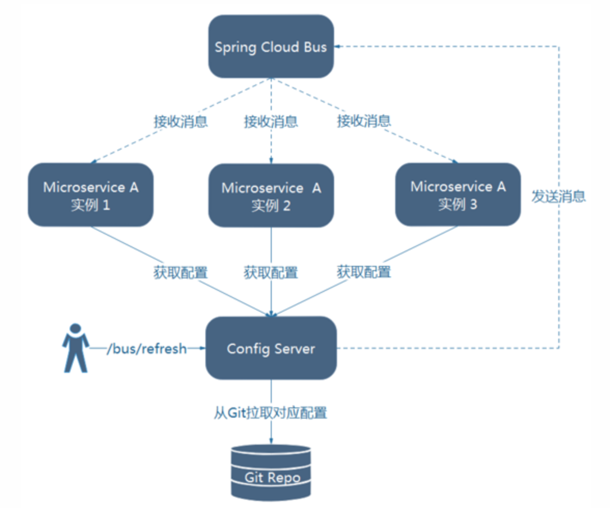

## Config Server 说明

### 一. 简介

```markdown
1. 统一管理配置
2. 不同环境不同配置
3. 运行期间动态调整配置
4. 自动刷新 
5. pivotal - 扩展公司
```

**业界的组件 百度disconf、携程apollo**

Spring Cloud 应用通过一个 "bootstrap" 上下文进行启动，该上下文可以共享环境变量。Bootstrap 的配置具有最高优先级，故应该把那些不变的配置信息都放在 ***bootstrap.yml*** 中，例：spring.application.name。通过设置下面的配置，可以禁用 bootstrap  `spring.cloud.bootstrap.enabled=false`。

​	Spring应用上下文工作流程

	1. 启动 bootstrap context
	2. 子上下文从父上下文中继承配置信息 和 Profiles，并且子上下文的配置会覆盖父上下文的配置。

Spring Cloud Config 为分布式系统外部化配置提供了服务端和客户端的支持，它包括 Config Server 和 Config Client。两端都实现了对`Environment` and `PropertySource `抽象的映射。因此，非常适用于Spring应用程序，并且与语言无关。

默认，Server端是用 git 进行后段存储配置的，故可以方便的进行版本控制。

Config Client用于操作存储在 Config Server 中的配置属性。

### 二. Config Server

- 在pom.xml中添加依赖

```xml
<dependency>
  	<groupId>org.springframework.cloud</groupId>
  	<artifactId>spring-cloud-config-server</artifactId>
</dependency>
```

- 在启动类添加注解

```java
@SpringBootApplication
@EnableConfigServer
@EnableEurekaClient
public class ConfigServerApplication {
	public static void main(String[] args) {
		SpringApplication.run(ConfigServerApplication.class, args);
	}
}
```

- 添加配置

```yaml
spring:
  cloud:
    config:
      server:
        git:
          uri: https://git.oschina.net/dante7qx/oschina-config-repo
```

- Config Server通过Restful API获取配置

```json
/{application}/{profile}[/{label}]
/{application}-{profile}.yml
/{label}/{application}-{profile}.yml
/{application}-{profile}.properties
/{label}/{application}-{profile}.properties
                         
# application 是 spring.config.name。与Eureka联用时，是 spring.application.name
# profile 是 active profile
# label 是 git 的分支，默认是 "master"                        
```

### 三. Config Client

- 在pom.xml添加依赖

```xml
<dependency>
  	<groupId>org.springframework.cloud</groupId>
  	<artifactId>spring-cloud-starter-config</artifactId>
</dependency>
```

- 添加配置 ***bootstrap.yml*** 中

```yaml
spring:
  cloud:
    config:
      uri: http://localhost:8888  # Config Server的URL
```

结合Eureka使用

```yaml
spring:
  cloud:
     config:
       profile: ${config.profile:dev}
       label: ${config.profile:dev}
       discovery:
         enabled: true
         service-id: MICRO-CONFIG # Config Server 配置的 spring.application.name，大写
```

### 四. Git

每个微服务应用一个Git仓库。也可以添加 {profile} 和 {label}

```yaml
spring:
  cloud:
    config:
      server:
        git:
          uri: https://github.com/myorg/{application}
          searchPaths: config-repo
```

本地 git 配置

```yaml
spring:
  cloud:
    config:
      server:
        git:
          uri: file://Users/dante/Documents/Project/spring/microservice/config-repo
```

### 五. 加密、解密

先决条件：要使用加密和解密功能，您需要在JVM中安装完整的JCE（默认情况下不存在）。下载[Java 8 JCE](http://www.oracle.com/technetwork/java/javase/downloads/jce8-download-2133166.html)，替换Java目录下 JRE lib / security下的2个策略文件

```markdown
local_policy.jar
US_export_policy.jar
```

#### 1. 对称加密

Config Server 暴漏两个端口进行加密`/encrypt`和解密 `/decrypt` ，通过POST的方式进行。

```sh
# curl <config server的url>/encrypt -d <你要加密的内容>
curl localhost:8888/encrypt -d '秘密'
fe4db1e44d251daebd13320abaf8054bf6b89260a3b8a2ee04e5b1bd98890549

# curl <config server的url>/decrypt -d <你的密文>
curl localhost:8888/decrypt -d fe4db1e44d251daebd13320abaf8054bf6b89260a3b8a2ee04e5b1bd98890549
秘密
```

==注意：对于特殊字符，要使用 ***--data-urlencode*** 替代 ***-d***，或设置 ***Content-Type: text/plain***。推荐使用 RestFul 客户端==。

**Config Server**

```yaml
encrypt: 
  key: db.password
```

**Config Client**

```yaml
# 配置密文，若使用 .properties，则不应该加 ''，即
# db.password={cipher}fe4db1e44d251daebd13320abaf8054bf6b89260a3b8a2ee04e5b1bd98890549
db: 
  password: '{cipher}fe4db1e44d251daebd13320abaf8054bf6b89260a3b8a2ee04e5b1bd98890549'
```

#### 2. 非对称加密

非对称加密算法需要两个密钥：公开密钥（publickey）和私有密钥（privatekey），公钥和私钥是一对。 

- 如果用公钥进行加密，则只有用对应的私钥才能解密。
- 如果用私钥进行加密，则只有用对应的公钥才能解密。
- 过程
  - A生成一对密钥并把其中的一把公开给第三方（公钥）
  - 第三方利用公钥进行加密，并把密文发给A
  - A用自己保存的一把（私钥）对密文进行解密

Config Server使用 RSA 密钥对进行非对称加密、解密

##### 1. 使用JDK生成keystore

```sh
keytool -genkeypair -alias SpiritKey -keyalg RSA -keysize 2048 \
  -dname "CN=MicroserviceSpirit,OU=HNA,O=eking,L=BeiJing,S=Beijing,C=CN" \
  -keypass 12,qw,as -keystore server.jks -storepass 1234@@qwer
```

```markdown
CN(Common Name名字与姓氏) 
OU(Organization Unit组织单位名称) 
O(Organization组织名称) 
L(Locality城市或区域名称) 
ST(State州或省份名称) 
C(Country国家名称）

-dname "CN=xx,OU=xx,O=xx,L=xx,ST=xx,C=xx"  dn名为"CN=..." 
-alias scent                别名为scent的一个证书 
-keyalg 
     DSA RSA                    DSA或RSA算法(当使用-genkeypair参数) 
     DES DESede AES       DES或DESede或AES算法(当使用-genseckey参数) 
-keysize 
     512 ~ 1024             密钥的长度为512至1024之间(64的倍数)(当使用-genkeypair和-keyalg DSA参数) 
     > 512                       密钥的长度大于512 (当使用-genkeypair和-keyalg RSA参数) 
     56                            密钥的长度为56 (当使用-genseckey和-keyalg DES 参数) 
     112 168                   密钥长度为112或168(当使用-genseckey和-keyalg DESede 参数) 
     128 192 256             密钥长度为128或192或256 (当使用-genseckey和-keyalg AES 参数) 
-keypass  123456              这个证书的私钥密码为123456 
-keystore prospectlib         证书库的名称为prospectlib 
-storepass 123456             证书库的访问密码为123456 
-validity  900             证书有效期为900天 
-file  scent.cer           从scent.cer文件导入证书，或者导出证书到scent.cer文件 
-v                               显示详细信息 
-rfc                            以Base64的编码格式打印证书 
-storetype JCEKS          密钥库的类型为JCEKS。常用的有JKS(默认),JCEKS(推荐),PKCS12,BKS,UBER。每个密钥库只可以是其中一种类型
```

##### 2. Config Server 配置

```yaml
encrypt:
  keyStore:
    location: classpath:/server.jks	# 密钥的位置，即server.jks的位置
    password: 1234@@qwer		   # 证书的访问密码
    alias: SpiritKey			   # 证书的别名
    secret: 12,qw,as                # 证书私钥密码
```

解密过程同对称加密，POST请求Config Server的 /encrypt

### 六. 配置刷新

添加依赖

```xml
<dependency>
  <groupId>org.springframework.boot</groupId>
  <artifactId>spring-boot-starter-actuator</artifactId>
</dependency>
```

- POST to `/env` to update the `Environment` and rebind `@ConfigurationProperties` and log levels
- `/refresh` for re-loading the boot strap context and refreshing the `@RefreshScope` beans
- `/restart` for closing the `ApplicationContext` and restarting it (disabled by default)
- `/pause` and `/resume` for calling the `Lifecycle` methods (`stop()` and `start()` on the `ApplicationContext`)

#### 1. RefreshScope（手动）

​	Spring的@Bean添加 @RefreshScope注解。RefreshScope是上下文中的一个bean，它有一个公共方法refreshAll（）通过清除目标缓存来刷新作用域中的所有bean。还有一个刷新（String）方法来按名称刷新单个的bean。

#### 2. Spring Cloud Bus（自动）

​	Spring Cloud Bus将分布式应用和MQ连接，可以背看作一个分布式的 actuator，通过AMQP传输信息。然后在actuator端点前添加  /bus，即 /bus/refresh。这样消息会通知所有添加 spring-cloud-starter-bus-* 的微服务，这些微服务相当调用了自己的 /refresh 端点。

- 添加依赖

  ```xml
  <dependency>
    <groupId>org.springframework.cloud</groupId>
    <artifactId>spring-cloud-starter-bus-amqp</artifactId>
  </dependency>
  <!-- 获取添加 spring-cloud-starter-bus-kafka -->
  ```

- 配置RabbitMQ

  ```yaml
  spring:
    rabbitmq:
      host: mybroker.com
      port: 5672
      username: user
      password: secret
  ```

- 刷新

    destination = ${spring.application.name}:${spring.application.index:${server.port}}

- 所有节点 ，POST请求 

    localhost:8888/bus/refresh?destination=configclient:**

- 单个微服务实例，POST请求

    localhost:8888/bus/refresh?destination=configclient:7999

- ==为每个应用配置 spring.application.index=${random.long}==

- 跟踪，在Config Server配置 `spring.cloud.bus.trace.enable: true` ，然后访问

  http://localhost:8888/trace

  

### 八. 参考资料

- http://cloud.spring.io/spring-cloud-static/Camden.SR7/#_spring_cloud_config


- http://baike.baidu.com/link?url=zWBvX8st-03jVTL4wLTOt6XkD-py836ELVXrUaD3WypZnBUsB7z_8l900tmihhjm_EyILhD7tgs6YWo13SPcU0szzD9RfadiVqTJdSIeZoCyPwwpx_tM_ELCm34xUPxLYALQb_ErxytsxvCZZoUgjJiuPJBFxAervuKqbkATDq3
- https://my.oschina.net/frankies/blog/344914