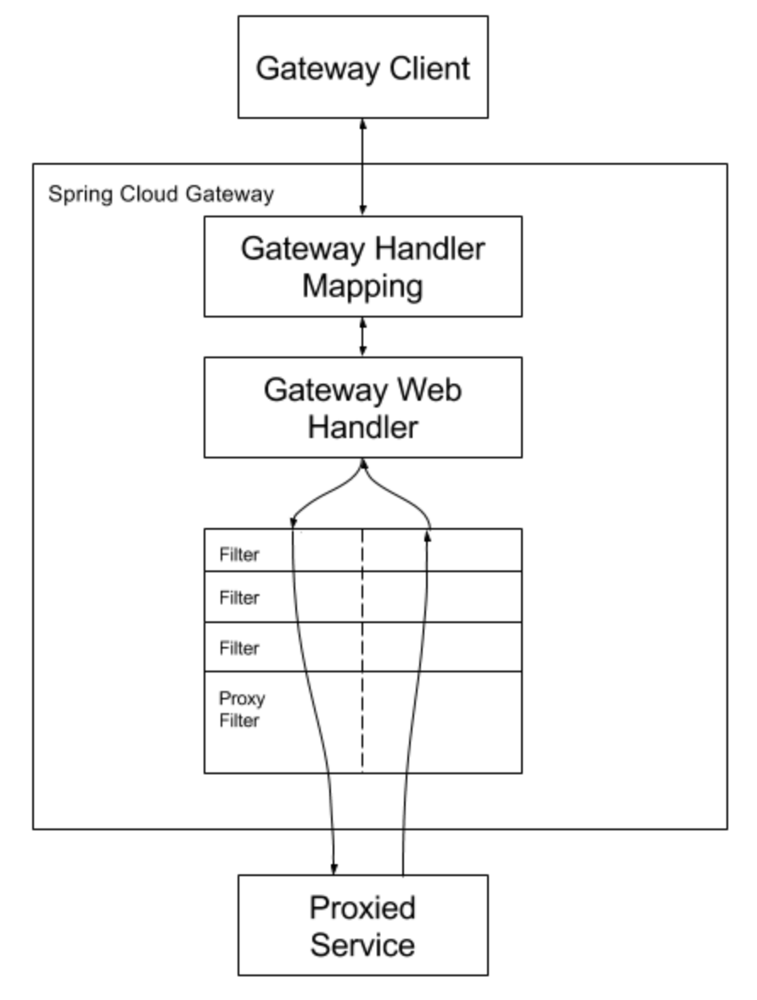
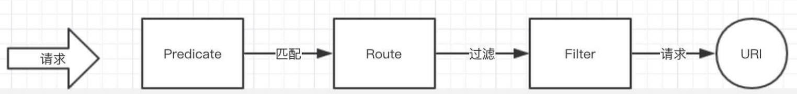
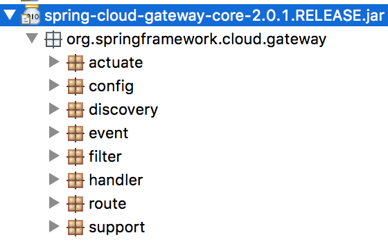

## SpringCloud Gateway

### 一. 概念

Finchley 版本开始引入，设计技术栈 Spring5、SpringBoot2、Project Reactor，只能运行在 Netty Server 上。

### 二. 工作原理



1. Client 发送请求到 Gateway，确定请求与路由的对应关系，将请求发送给具体的 Handler。
2. Handler 将请求发送到 Filter Chain，由特定的过滤器进行处理。
3. 经过 Pre 、Proxy、Post 对请求进行处理。

### 三. 术语

#### 1. Route

Gateway 的基本组件。由 id（路由标示，全局唯一）、uri（目标Url）、predicate（断言，路由匹配条件）、filter（请求/响应的过滤器）。



#### 2. Predicate

Java8 的断言机制。参数是 ServerWebExchange，可以对 Request、Response、Principal 进行断言。

```java
public interface ServerWebExchange {
	ServerHttpRequest getRequest();
	ServerHttpResponse getResponse();
	Map<String, Object> getAttributes();
    
	@SuppressWarnings("unchecked")
	@Nullable
	default <T> T getAttribute(String name) {
		return (T) getAttributes().get(name);
	}

	@SuppressWarnings("unchecked")
	default <T> T getRequiredAttribute(String name) {
		T value = getAttribute(name);
		Assert.notNull(value, "Required attribute '" + name + "' is missing.");
		return value;
	}

	@SuppressWarnings("unchecked")
	default <T> T getAttributeOrDefault(String name, T defaultValue) {
		return (T) getAttributes().getOrDefault(name, defaultValue);
	}

	Mono<WebSession> getSession();
	<T extends Principal> Mono<T> getPrincipal();
	Mono<MultiValueMap<String, String>> getFormData();
	Mono<MultiValueMap<String, Part>> getMultipartData();
	LocaleContext getLocaleContext();
	@Nullable
	ApplicationContext getApplicationContext();
	boolean isNotModified();
	boolean checkNotModified(Instant lastModified);
	boolean checkNotModified(String etag);
	boolean checkNotModified(@Nullable String etag, Instant lastModified);
	String transformUrl(String url);
	void addUrlTransformer(Function<String, String> transformer);
    
	default Builder mutate() {
		return new DefaultServerWebExchangeBuilder(this);
	}
    
	interface Builder {
		Builder request(Consumer<ServerHttpRequest.Builder> requestBuilderConsumer);
		Builder request(ServerHttpRequest request);
		Builder response(ServerHttpResponse response);
		Builder principal(Mono<Principal> principalMono);
		ServerWebExchange build();
	}
}
```

#### 3. Filter

通过 GatewayFilter 的示例对请求和响应进行修改。

```java
public interface GatewayFilter extends ShortcutConfigurable {
	String NAME_KEY = "name";
	String VALUE_KEY = "value";

	Mono<Void> filter(ServerWebExchange exchange, GatewayFilterChain chain);
}
```

#### 4. Order

路由的执行顺序，优先级由小到大，Integer.MIN_VALUE ～ Integer.MAX_VALUE，默认是 0。

### 四. 源码分析

[Spring Cloud Gateway 源码](./Gateway/Spring Cloud Gateway 源码.md)



### 五. 实战

#### 1. HTTP API

org.springframework.cloud.gateway.actuate.GatewayControllerEndpoint

- 添加 actuator 依赖

```xml
<dependency>
    <groupId>org.springframework.boot</groupId>
    <artifactId>spring-boot-actuator</artifactId>
</dependency>
```

- 配置开启 Endpoint

```yaml
management:
  endpoint:
    gateway:
      enabled: true
  endpoints:
    web:
      exposure:
        include:
        - info
        - health
        - metrics
        - gateway	## 开启 Gateway HTTP API
```

#### 2. YML 配置

- 基本配置

```yaml
spring:
  cloud:
    gateway:
      default-filters:
      - AddRequestHeader=X-DANTE-REQ, Cry
      - AddResponseHeader=X-DANTE-RESP, Devil
      - AddRequestParameter=X-NAME, coder
      
      ## 根据客户端IP
      routes:
      - id: remoteaddr_route
        uri: http://localhost:8101
        predicates:
        - RemoteAddr=10.71.225.163
        order: -1
      
      ## 根据 Req 的 Header
      - id: header_route
        uri: https://docs.okd.io
        predicates:
        - Header=c-n, okd
        order: 1
     
      ## 根据路径 Path
      - id: path_route
        uri: https://kubernetes.io/
        predicates:
        - Path=/k8s/**
        order: 2   
        
      ## 根据Cookie
      - id: cookie_route
        uri: https://translate.google.cn
        predicates:
        - Cookie=i-l, dante
        order: 3
      
      ## 根据请求参数
      - id: query_route
        uri: http://www.iocoder.cn
        predicates:
        - Query=name,coder
        order: 4
        
      ## 根据时间
      - id: between_route
        uri: https://spring.io
        predicates:
        - Between=2018-08-31T22:50:00.000+08:00[Asia/Shanghai], 2018-09-01T22:50:00.000+08:00[Asia/Shanghai]         
        order: 100
        
      - id: before_route
        uri: https://cn.vuejs.org
        predicates:
        - Before=2018-09-02T22:50:00.000+08:00[Asia/Shanghai]
        order: 101
       
      - id: after_route
        uri: https://istio.io
        predicates:
        - After=2018-09-01T22:50:00.000+08:00[Asia/Shanghai]
        order: 102
```

- 分组权重（A/B、灰度升级）

```yml
spring:
  cloud:
    gateway:
      routes:
      - id: svc_1
        uri: http://localhost:8101/docker
        predicates:
        - Path=/svc
        - Weight=docker-svc, 85
      
      - id: svc_2
        uri: http://localhost:8102/docker
        predicates:
        - Path=/svc
        - Weight=docker-svc, 15
```

- 限流（结合 redis），可通过 redis 的 MONITOR 命令监视

  - 引入 redis-reactive

  ```xml
  <dependency>
      <groupId>org.springframework.boot</groupId>
      <artifactId>spring-boot-starter-data-redis-reactive</artifactId>
  </dependency>
  ```

  - 配置

  ```yaml
  spring:
    cloud:
      gateway:
        routes:
        - id: ratelimit_route
          uri: http://localhost:8101
          predicates:
          - Path=/**
          filters:
          - name: RequestRateLimiter
            args:
              redis-rate-limiter.replenishRate: 5  # 用户每秒执行多少请求
              redis-rate-limiter.burstCapacity: 10  # 用户在一秒钟内允许执行的最大请求数
              key-resolver: "#{@currentUserKeyResolver}" 
          order: -1
  ```

  ```java
  @Configuration
  public class RequestRateLimiterConfig {
  	
  	/**
  	 * 基于请求IP限流
  	 * @return
  	 */
  	@Bean
  	KeyResolver remoteAddrKeyResolver() {
  	    return exchange -> Mono.just(exchange.getRequest().getRemoteAddress().getHostName());
  	}
  }
  ```

- 熔断 Hystrix

  - 引入Netflix Hystrix

  ```xml
  <dependency>
      <groupId>org.springframework.cloud</groupId>
      <artifactId>spring-cloud-starter-netflix-hystrix</artifactId>
  </dependency>
  ```

  - 配置

  ```yaml
  spring:
    cloud:
      gateway:
        routes:
        - id: hystrix_route
          uri: http://localhost:8101
          predicates:
          - Path=/**
          filters:
          - name: Hystrix
            args:
              name: dockerfallbackcmd
              fallbackUri: forward:/fallback  ## 目前只支持 forward
          order: -1
  
  ## hystrix 超时触发时间
  hystrix.command.dockerfallbackcmd.execution.isolation.thread.timeoutInMilliseconds: 2000    
  ```

  ```java
  @RestController
  public class HystrixController {	
  	@GetMapping("/fallback")
  	public String fallback() {
  		return "熔断回调方法！";
  	}	
  }
  ```

- Strip 过滤器

  ```yaml
  spring:
    cloud:
      gateway:
        routes:
        - id: strip_route
          uri: http://localhost:8101
          predicates:
          - Path=/x/**
          filters:
          - StripPrefix=1
            
  # Path=/x/y/**, StripPrefix=2 --> http://localhost:8210/x/y/docker
  # Path=/x/**  , StripPrefix=1 --> http://localhost:8210/x/docker
  ```

#### 3. 结合Eureka

```yaml
spring:
  cloud:
    gateway:
      discovery:
        locator:
          enabled: true
      routes:
      - id: provider-user
        uri: lb://MICRO-PROVIDER-USER	## 被路由微服务 name 最好大写
        predicates:
        - Path=/provider/**
        filters:
        - StripPrefix=1
```

```http
<!-- 方式一 http://网关地址/服务名称（大写）/** -->
http://localhost:8210/MICRO-PROVIDER-USER/user/3

<!-- 方式二 -->
http://localhost:8210/provider/user/6

<!-- 方式三 spring.cloud.gateway.discovery.locator.lowerCaseServiceId=true -->
http://localhost:8210/micro-provider-user/user/6

<!-- spring.cloud.gateway.discovery.locator.route-id-prefix: SPIRIT_ -->
可以通过 http://网关地址/actuator/gateway/routes 观察
```

#### 4. Java配置

```java
@Configuration
public class SpiritRouteLocatorConfig {

	private static final String TARGET_URI = "http://localhost:8101";
	private static final String TARGET_URI2 = "http://localhost:8102";

	@Bean
	public RouteLocator customRouteLocator(RouteLocatorBuilder builder) {		
		return builder.routes()	
				.route("path_route", r -> r.order(-1).path("/x/**").filters(f -> f.stripPrefix(1)).uri(TARGET_URI))
				
				.route(r -> r.order(0).query("k", "k").filters(f -> f.addResponseHeader("v", "v-k")).uri("https://baidu.com"))
				
				.route(r -> r.order(1).path("/svc").and().weight("svc_docker", 85).uri(TARGET_URI))
				.route(r -> r.order(1).path("/svc").and().weight("svc_docker", 15).uri(TARGET_URI2))
				
			.build();
	}
}
```

#### 5. 动态路由

等待新版本...

### 六. 参考资料

- https://cloud.spring.io/spring-cloud-static/Finchley.SR1/multi/multi__spring_cloud_gateway.html
- http://www.iocoder.cn/Spring-Cloud-Gateway/init
- http://www.springcloud.cn/view/368
- https://blog.csdn.net/u010889990/article/details/81865970
- https://my.oschina.net/tongyufu/blog/1844573


