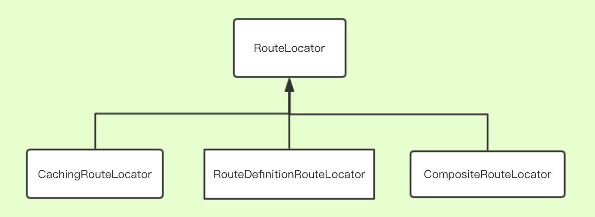
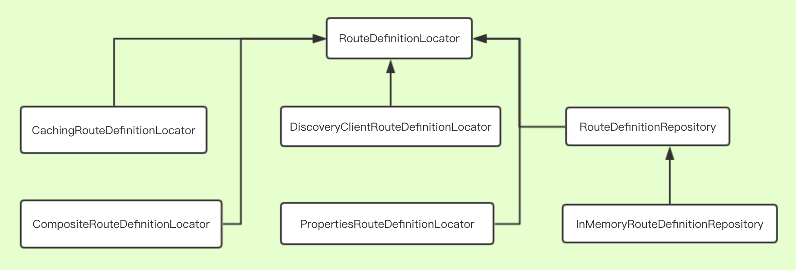
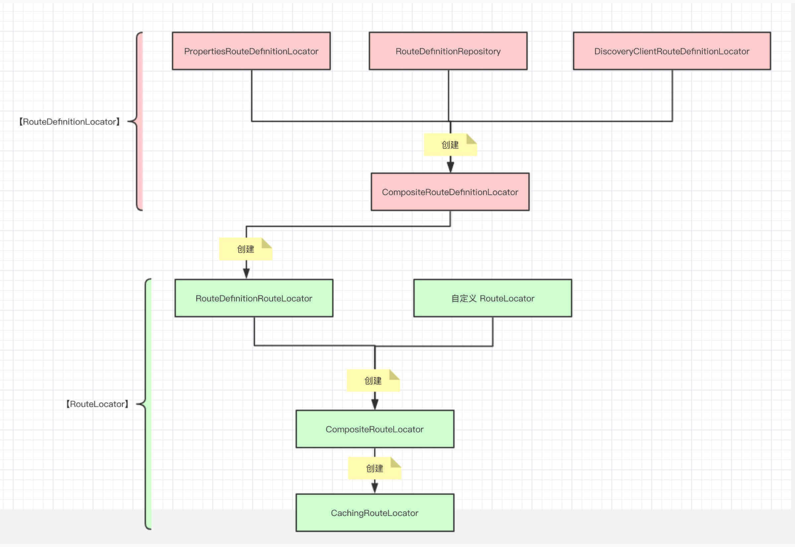
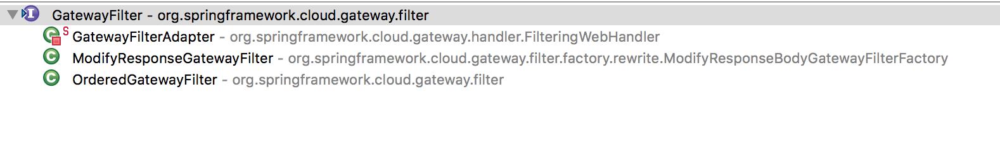
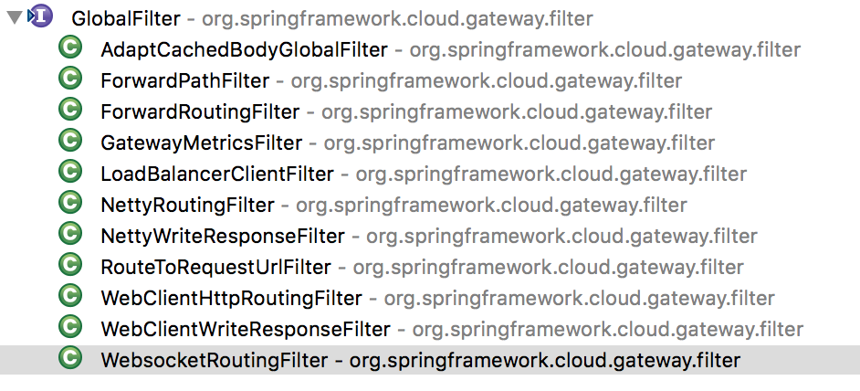
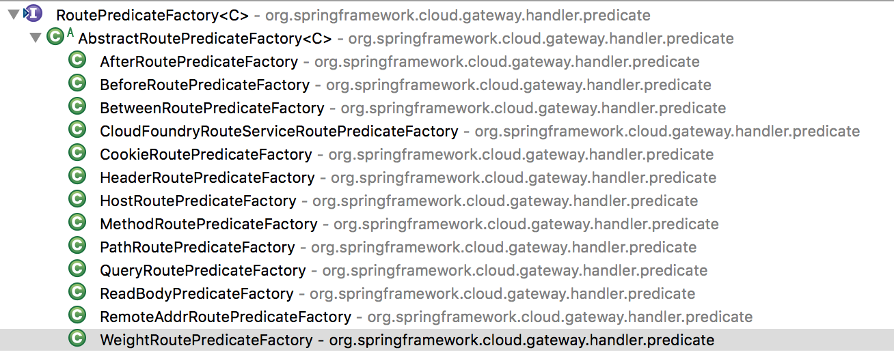

## Spring Cloud Gateway 源码







- RouteLocator 可以自定义路由（Route），也可以通过 RouteDefinitionRouteLocator 获取 RouteDefinition，并转化为 Route。
- RoutePredicateHandlerMapping 使用 RouteLocator 获得 Route 信息。
- RouteDefinitionLocator 负责读取路由配置
  - PropertiesRouteDefinitionLocator，从配置文件读取路由配置。（默认）
  - RouteDefinitionRepository，从存储器中读取路由配置，SpringCloud提供了 InMemoryRouteDefinitionRepository。
  - DiscoveryClientRouteDefinitionLocator，从注册中心（Eureka、Consul）读取。
  - CompositeRouteDefinitionLocator，将多种 RouteDefinitionLocator 进行组合。

**Route**

```java
public class Route implements Ordered {
	// 路由的Id
	private final String id;
	// 目标uri
	private final URI uri;
	// 路由匹配顺序，由小到大，默认为0
	private final int order;
	// 断言器
	private final AsyncPredicate<ServerWebExchange> predicate;
	// 过滤器组
	private final List<GatewayFilter> gatewayFilters;
    
    public static Builder builder() {
		return new Builder();
	}
	
    // 可以通过 RouteDefinition 构造 Route 构造器
	public static Builder builder(RouteDefinition routeDefinition) {
		return new Builder()
				.id(routeDefinition.getId())
				.uri(routeDefinition.getUri())
				.order(routeDefinition.getOrder());
	}
    
    // 通过 Route 构造器设置 Predicate
    public static class Builder extends AbstractBuilder<Builder> {
		protected Predicate<ServerWebExchange> predicate;

		@Override
		protected Builder getThis() {
			return this;
		}

		@Override
		public AsyncPredicate<ServerWebExchange> getPredicate() {
			return ServerWebExchangeUtils.toAsyncPredicate(this.predicate);
		}

		public Builder and(Predicate<ServerWebExchange> predicate) {
			Assert.notNull(this.predicate, "can not call and() on null predicate");
			this.predicate = this.predicate.and(predicate);
			return this;
		}

		public Builder or(Predicate<ServerWebExchange> predicate) {
			Assert.notNull(this.predicate, "can not call or() on null predicate");
			this.predicate = this.predicate.or(predicate);
			return this;
		}

		public Builder negate() {
			Assert.notNull(this.predicate, "can not call negate() on null predicate");
			this.predicate = this.predicate.negate();
			return this;
		}

	}
}
```

**RouteDefinition**

```java
@Validated
public class RouteDefinition {
	@NotEmpty
	private String id = UUID.randomUUID().toString();
	@NotEmpty
	@Valid
	private List<PredicateDefinition> predicates = new ArrayList<>();
	@Valid
	private List<FilterDefinition> filters = new ArrayList<>();
	@NotNull
	private URI uri;
	private int order = 0;
    
    /**
    可以通过 text 构造RouteDefinition
    
        格式： ${id}=${uri},${predicates[0]},${predicates[1]}...${predicates[n]}
        例如： route001=http://127.0.0.1,Host=**.addrequestparameter.org,Path=/get
    **/
    public RouteDefinition(String text) {
		int eqIdx = text.indexOf("=");
		if (eqIdx <= 0) {
			throw new ValidationException("Unable to parse RouteDefinition text '" + text + "'" + ", must be of the form name=value");
		}
		setId(text.substring(0, eqIdx));
		String[] args = tokenizeToStringArray(text.substring(eqIdx+1), ",");
		setUri(URI.create(args[0]));
		for (int i=1; i < args.length; i++) {
			this.predicates.add(new PredicateDefinition(args[i]));
		}
	}
}
```

**RouteLocator 和 RouteDefinitionLocator** 

```java
//TODO: rename to Routes?
public interface RouteLocator {
	Flux<Route> getRoutes();
}

public interface RouteDefinitionLocator {
	Flux<RouteDefinition> getRouteDefinitions();
}
```

**PropertiesRouteDefinitionLocator**

```java
public class PropertiesRouteDefinitionLocator implements RouteDefinitionLocator {
	private final GatewayProperties properties;

	public PropertiesRouteDefinitionLocator(GatewayProperties properties) {
		this.properties = properties;
	}

	@Override
	public Flux<RouteDefinition> getRouteDefinitions() {
		return Flux.fromIterable(this.properties.getRoutes());
	}
}
```

**DiscoveryClientRouteDefinitionLocator**

```java
public class DiscoveryClientRouteDefinitionLocator implements RouteDefinitionLocator {

	private final DiscoveryClient discoveryClient;
	private final DiscoveryLocatorProperties properties;
	private final String routeIdPrefix;

	public DiscoveryClientRouteDefinitionLocator(DiscoveryClient discoveryClient, DiscoveryLocatorProperties properties) {
		this.discoveryClient = discoveryClient;
		this.properties = properties;
		if (StringUtils.hasText(properties.getRouteIdPrefix())) {
			this.routeIdPrefix = properties.getRouteIdPrefix();
		} else {
			this.routeIdPrefix = this.discoveryClient.getClass().getSimpleName() + "_";
		}
	}
    
    @Override
	public Flux<RouteDefinition> getRouteDefinitions() {
		SimpleEvaluationContext evalCtxt = SimpleEvaluationContext
				.forReadOnlyDataBinding()
				.withInstanceMethods()
				.build();

		SpelExpressionParser parser = new SpelExpressionParser();
		Expression includeExpr = parser.parseExpression(properties.getIncludeExpression());
		Expression urlExpr = parser.parseExpression(properties.getUrlExpression());

		return Flux.fromIterable(discoveryClient.getServices())
				.map(discoveryClient::getInstances)
				.filter(instances -> !instances.isEmpty())
				.map(instances -> instances.get(0))
				.filter(instance -> {
					Boolean include = includeExpr.getValue(evalCtxt, instance, Boolean.class);
					if (include == null) {
						return false;
					}
					return include;
				})
				.map(instance -> {
					String serviceId = instance.getServiceId();

                    RouteDefinition routeDefinition = new RouteDefinition();
                    routeDefinition.setId(this.routeIdPrefix + serviceId);
					String uri = urlExpr.getValue(evalCtxt, instance, String.class);
					routeDefinition.setUri(URI.create(uri));

					final ServiceInstance instanceForEval = new DelegatingServiceInstance(instance, properties);

					for (PredicateDefinition original : this.properties.getPredicates()) {
						PredicateDefinition predicate = new PredicateDefinition();
						predicate.setName(original.getName());
						for (Map.Entry<String, String> entry : original.getArgs().entrySet()) {
							String value = getValueFromExpr(evalCtxt, parser, instanceForEval, entry);
							predicate.addArg(entry.getKey(), value);
						}
						routeDefinition.getPredicates().add(predicate);
					}

                    for (FilterDefinition original : this.properties.getFilters()) {
                    	FilterDefinition filter = new FilterDefinition();
                    	filter.setName(original.getName());
						for (Map.Entry<String, String> entry : original.getArgs().entrySet()) {
							String value = getValueFromExpr(evalCtxt, parser, instanceForEval, entry);
							filter.addArg(entry.getKey(), value);
						}
						routeDefinition.getFilters().add(filter);
					}

                    return routeDefinition;
				});
	}
    
}
```

**RoutePredicateHandlerMapping**

路由匹配，通过 RouteLocator 将具体的 Route 交由指定的 Handler 进行处理

1. `org.springframework.web.reactive.DispatcherHandler` ：接收到请求，匹配 HandlerMapping ，此处会匹配到 RoutePredicateHandlerMapping 。
2. `org.springframework.cloud.gateway.handler.RoutePredicateHandlerMapping` ：接收到请求，匹配 Route 。
3. `org.springframework.cloud.gateway.handler.FilteringWebHandler` ：获得 Route 的 GatewayFilter 数组，创建 GatewayFilterChain 处理请求。

```java
public class RoutePredicateHandlerMapping extends AbstractHandlerMapping {

	private final FilteringWebHandler webHandler;
	private final RouteLocator routeLocator;

	public RoutePredicateHandlerMapping(FilteringWebHandler webHandler, RouteLocator routeLocator, GlobalCorsProperties globalCorsProperties) {
		this.webHandler = webHandler;
		this.routeLocator = routeLocator;

		setOrder(1);		
		setCorsConfigurations(globalCorsProperties.getCorsConfigurations());
	}
    
    @Override
	protected Mono<?> getHandlerInternal(ServerWebExchange exchange) {
		exchange.getAttributes().put(GATEWAY_HANDLER_MAPPER_ATTR, getClass().getSimpleName());

		return lookupRoute(exchange)
				// .log("route-predicate-handler-mapping", Level.FINER) //name this
				.flatMap((Function<Route, Mono<?>>) r -> {
					exchange.getAttributes().remove(GATEWAY_PREDICATE_ROUTE_ATTR);
					if (logger.isDebugEnabled()) {
						logger.debug("Mapping [" + getExchangeDesc(exchange) + "] to " + r);
					}

					exchange.getAttributes().put(GATEWAY_ROUTE_ATTR, r);
					return Mono.just(webHandler);
				}).switchIfEmpty(Mono.empty().then(Mono.fromRunnable(() -> {
					exchange.getAttributes().remove(GATEWAY_PREDICATE_ROUTE_ATTR);
					if (logger.isTraceEnabled()) {
						logger.trace("No RouteDefinition found for [" + getExchangeDesc(exchange) + "]");
					}
				})));
	}
}
```

**GatewayFilter** 和 **GlobalFilter**





**Predicate 断言器**

**PredicateDefinition** 

```java
@Validated
public class PredicateDefinition {
	@NotNull
	private String name;
	private Map<String, String> args = new LinkedHashMap<>();

	public PredicateDefinition() {}

	public PredicateDefinition(String text) {
		int eqIdx = text.indexOf("=");
		if (eqIdx <= 0) {
			throw new ValidationException("Unable to parse PredicateDefinition text '" + text + "'" + ", must be of the form name=value");
		}
		setName(text.substring(0, eqIdx));

		String[] args = tokenizeToStringArray(text.substring(eqIdx+1), ",");

		for (int i=0; i < args.length; i++) {
			this.args.put(NameUtils.generateName(i), args[i]);
		}
	}
}
```

**RoutePredicateFactory**

Spring Cloud Gateway 创建 Route 对象时，使用 RoutePredicateFactory 创建 Predicate 对象。Predicate 对象可以赋值给 [`Route.predicate`](https://github.com/YunaiV/spring-cloud-gateway/blob/6bb8d6f93c289fd3a84c802ada60dd2bb57e1fb7/spring-cloud-gateway-core/src/main/java/org/springframework/cloud/gateway/route/Route.java#L51) 属性，用于匹配**请求**对应的 Route 。



```java
@FunctionalInterface
public interface RoutePredicateFactory<C> extends ShortcutConfigurable, Configurable<C> {
	String PATTERN_KEY = "pattern";

	// useful for javadsl
	default Predicate<ServerWebExchange> apply(Consumer<C> consumer) {
		C config = newConfig();
		consumer.accept(config);
		beforeApply(config);
		return apply(config);
	}

	default AsyncPredicate<ServerWebExchange> applyAsync(Consumer<C> consumer) {
		C config = newConfig();
		consumer.accept(config);
		beforeApply(config);
		return applyAsync(config);
	}

	default Class<C> getConfigClass() {
		throw new UnsupportedOperationException("getConfigClass() not implemented");
	}

	@Override
	default C newConfig() {
		throw new UnsupportedOperationException("newConfig() not implemented");
	}

	default void beforeApply(C config) {}
	
    // 接口方法，用于生产 Predicate
	Predicate<ServerWebExchange> apply(C config);

	default AsyncPredicate<ServerWebExchange> applyAsync(C config) {
		return toAsyncPredicate(apply(config));
	}

	default String name() {
		return NameUtils.normalizeRoutePredicateName(getClass());
	}
}
```

**RemoteAddrRoutePredicateFactory**

```java
public class RemoteAddrRoutePredicateFactory extends AbstractRoutePredicateFactory<RemoteAddrRoutePredicateFactory.Config> {

	private static final Log log = LogFactory.getLog(RemoteAddrRoutePredicateFactory.class);

	public RemoteAddrRoutePredicateFactory() {
		super(Config.class);
	}

	@Override
	public ShortcutType shortcutType() {
		return GATHER_LIST;
	}

	@Override
	public List<String> shortcutFieldOrder() {
		return Collections.singletonList("sources");
	}

	@NotNull
	private List<IpSubnetFilterRule> convert(List<String> values) {
		List<IpSubnetFilterRule> sources = new ArrayList<>();
        for (String arg : values) {
            addSource(sources, arg);
        }
		return sources;
	}

	@Override
	public Predicate<ServerWebExchange> apply(Config config) {
        List<IpSubnetFilterRule> sources = convert(config.sources);

		return exchange -> {
			InetSocketAddress remoteAddress = config.remoteAddressResolver.resolve(exchange);
			if (remoteAddress != null) {
				String hostAddress = remoteAddress.getAddress().getHostAddress();
				String host = exchange.getRequest().getURI().getHost();

				if (log.isDebugEnabled() && !hostAddress.equals(host)) {
					log.debug("Remote addresses didn't match " + hostAddress + " != " + host);
				}

				for (IpSubnetFilterRule source : sources) {
					if (source.matches(remoteAddress)) {
						return true;
					}
				}
			}

			return false;
		};
	}

	private void addSource(List<IpSubnetFilterRule> sources, String source) {
		if (!source.contains("/")) { // no netmask, add default
			source = source + "/32";
		}

		String[] ipAddressCidrPrefix = source.split("/",2);
		String ipAddress = ipAddressCidrPrefix[0];
		int cidrPrefix = Integer.parseInt(ipAddressCidrPrefix[1]);

		sources.add(new IpSubnetFilterRule(ipAddress, cidrPrefix, IpFilterRuleType.ACCEPT));
	}

	@Validated
	public static class Config {
		@NotEmpty
		private List<String> sources = new ArrayList<>();

		@NotNull
		private RemoteAddressResolver remoteAddressResolver = new RemoteAddressResolver(){};

		public List<String> getSources() {
			return sources;
		}

		public Config setSources(List<String> sources) {
			this.sources = sources;
			return this;
		}

		public Config setSources(String... sources) {
			this.sources = Arrays.asList(sources);
			return this;
		}


		public Config setRemoteAddressResolver(RemoteAddressResolver remoteAddressResolver) {
			this.remoteAddressResolver = remoteAddressResolver;
			return this;
		}
	}
}
```

**GatewayControllerEndpoint**

```java
RestControllerEndpoint(id = "gateway")
public class GatewayControllerEndpoint implements ApplicationEventPublisherAware {

	private static final Log log = LogFactory.getLog(GatewayControllerEndpoint.class);

	private RouteDefinitionLocator routeDefinitionLocator;
	private List<GlobalFilter> globalFilters;
	private List<GatewayFilterFactory> GatewayFilters;
	private RouteDefinitionWriter routeDefinitionWriter;
	private RouteLocator routeLocator;
	private ApplicationEventPublisher publisher;

	public GatewayControllerEndpoint(RouteDefinitionLocator routeDefinitionLocator, List<GlobalFilter> globalFilters,
									 List<GatewayFilterFactory> GatewayFilters, RouteDefinitionWriter routeDefinitionWriter,
									 RouteLocator routeLocator) {
		this.routeDefinitionLocator = routeDefinitionLocator;
		this.globalFilters = globalFilters;
		this.GatewayFilters = GatewayFilters;
		this.routeDefinitionWriter = routeDefinitionWriter;
		this.routeLocator = routeLocator;
	}

	@Override
	public void setApplicationEventPublisher(ApplicationEventPublisher publisher) {
		this.publisher = publisher;
	}

	// TODO: Add uncommited or new but not active routes endpoint

	@PostMapping("/refresh")
	public Mono<Void> refresh() {
	    this.publisher.publishEvent(new RefreshRoutesEvent(this));
		return Mono.empty();
	}

	@GetMapping("/globalfilters")
	public Mono<HashMap<String, Object>> globalfilters() {
		return getNamesToOrders(this.globalFilters);
	}

	@GetMapping("/routefilters")
	public Mono<HashMap<String, Object>> routefilers() {
		return getNamesToOrders(this.GatewayFilters);
	}

	private <T> Mono<HashMap<String, Object>> getNamesToOrders(List<T> list) {
		return Flux.fromIterable(list).reduce(new HashMap<>(), this::putItem);
	}

	private HashMap<String, Object> putItem(HashMap<String, Object> map, Object o) {
		Integer order = null;
		if (o instanceof Ordered) {
			order = ((Ordered)o).getOrder();
		}
		//filters.put(o.getClass().getName(), order);
		map.put(o.toString(), order);
		return map;
	}

	// TODO: Flush out routes without a definition
	@GetMapping("/routes")
	public Mono<List<Map<String, Object>>> routes() {
		Mono<Map<String, RouteDefinition>> routeDefs = this.routeDefinitionLocator.getRouteDefinitions()
				.collectMap(RouteDefinition::getId);
		Mono<List<Route>> routes = this.routeLocator.getRoutes().collectList();
		return Mono.zip(routeDefs, routes).map(tuple -> {
			Map<String, RouteDefinition> defs = tuple.getT1();
			List<Route> routeList = tuple.getT2();
			List<Map<String, Object>> allRoutes = new ArrayList<>();

			routeList.forEach(route -> {
				HashMap<String, Object> r = new HashMap<>();
				r.put("route_id", route.getId());
				r.put("order", route.getOrder());

				if (defs.containsKey(route.getId())) {
					r.put("route_definition", defs.get(route.getId()));
				} else {
					HashMap<String, Object> obj = new HashMap<>();

					obj.put("predicate", route.getPredicate().toString());

					if (!route.getFilters().isEmpty()) {
						ArrayList<String> filters = new ArrayList<>();
						for (GatewayFilter filter : route.getFilters()) {
							filters.add(filter.toString());
						}

						obj.put("filters", filters);
					}

					if (!obj.isEmpty()) {
						r.put("route_object", obj);
					}
				}
				allRoutes.add(r);
			});

			return allRoutes;
		});
	}

/*
http POST :8080/admin/gateway/routes/apiaddreqhead uri=http://httpbin.org:80 predicates:='["Host=**.apiaddrequestheader.org", "Path=/headers"]' filters:='["AddRequestHeader=X-Request-ApiFoo, ApiBar"]'
*/
	@PostMapping("/routes/{id}")
	@SuppressWarnings("unchecked")
	public Mono<ResponseEntity<Void>> save(@PathVariable String id, @RequestBody Mono<RouteDefinition> route) {
		return this.routeDefinitionWriter.save(route.map(r ->  {
			r.setId(id);
			log.debug("Saving route: " + route);
			return r;
		})).then(Mono.defer(() ->
			Mono.just(ResponseEntity.created(URI.create("/routes/"+id)).build())
		));
	}

	@DeleteMapping("/routes/{id}")
	public Mono<ResponseEntity<Object>> delete(@PathVariable String id) {
		return this.routeDefinitionWriter.delete(Mono.just(id))
				.then(Mono.defer(() -> Mono.just(ResponseEntity.ok().build())))
				.onErrorResume(t -> t instanceof NotFoundException, t -> Mono.just(ResponseEntity.notFound().build()));
	}

	@GetMapping("/routes/{id}")
	public Mono<ResponseEntity<RouteDefinition>> route(@PathVariable String id) {
		//TODO: missing RouteLocator
		return this.routeDefinitionLocator.getRouteDefinitions()
				.filter(route -> route.getId().equals(id))
				.singleOrEmpty()
				.map(route -> ResponseEntity.ok(route))
				.switchIfEmpty(Mono.just(ResponseEntity.notFound().build()));
	}

	@GetMapping("/routes/{id}/combinedfilters")
	public Mono<HashMap<String, Object>> combinedfilters(@PathVariable String id) {
		//TODO: missing global filters
		return this.routeLocator.getRoutes()
				.filter(route -> route.getId().equals(id))
				.reduce(new HashMap<>(), this::putItem);
	}
}
```

