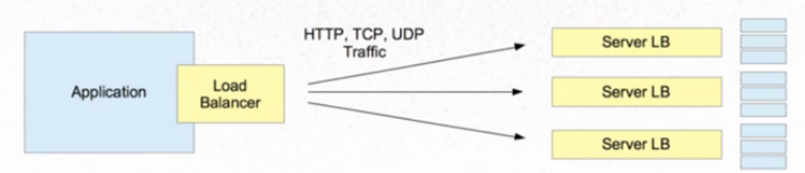
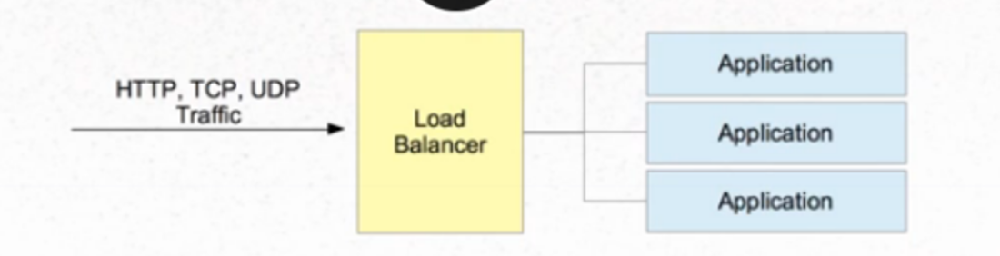
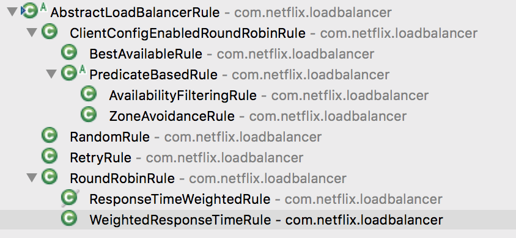

## Ribbon 说明

### 一. 概念

	Ribbon是一个客户端负载均衡控制组件，由Netflix公司开发。

#### **客户端负载均衡**

	负载均衡器作为客户端软件的一部分,客户端得到可用的服务器列表然后按照特定的负载均衡策略,分发请求到不同的服务器端。

1. 对客户端不透明的：客户端需要知道服务器端的服务列表，需要自行决定请求要发送的目标地址
2. 客户端维护负载均衡服务器，控制负载均衡策略和算法



#### **服务器端负载均衡**

	在服务器端架设负载均衡服务器，用户请求到中间层的负载均衡服务器,由负载均衡服务器分发控制到真实提供服务的应用服务器。

1. 对客户端透明的：客户端不知道服务器端的服务列表，甚至不知道自己发送请求的目标地址存在负载均衡器

2. 服务器端维护负载均衡服务器，控制负载均衡策略和算法

   

- 软件
  - Ngnix
  - HA Proxy
  - Apache
  - LVS
- 硬件
  - F5
  - NSX
  - BigIP

### 二. 如何使用

1. 在pom.xml中添加依赖（若已经引用spring-cloud-starter-eureka，则无需引用ribbon依赖）

   ```xml
   <dependency>
     	<groupId>org.springframework.cloud</groupId>
   	<artifactId>spring-cloud-starter-ribbon</artifactId>
   </dependency>
   ```

2. 配置Bean -  *RestTemplate*

   ```java
   @Primary
   @Bean
   RestTemplate restTemplate() {
       return new RestTemplate();
   }
   
   @Bean
   @LoadBalanced
   public RestTemplate loadBalanced() {
     return new RestTemplate();
   }
   
   // 使用
   @Autowired
   private RestTemplate restTemplate;
   
   @Autowired
   @LoadBalanced
   private RestTemplate loadBalanced;
   ```

### 三.  工作原理

#### **1. 功能**

1. 提供一个服务的DNS或IP给要通信的客户端。优先选择在同一个Zone且负载较少的Eureka Server。
2. 根据指定的策略在注册服务中选择一个地址。（策略：轮询round bobin、随机 random、根据相应时间加权等）

#### 2. 特性

1. 持有服务信息的统计，避免出现高延迟、频繁失败。
2. 持有Zone的统计，避免负载到可能中断的Zone。

#### 3. 负载均衡组件

- Rule - 策略组件（轮询round bobin、随机 random、根据相应时间加权等）

  

- Ping - 服务状态检测组件，后台运行

- ServerList -  服务注册表，可静态（硬编码）、动态（Eureka 服务发现）

- 自定义配置

  语法：`<clientName>.<nameSpace>.*` （Ribbon原生配置）

  	   `<client>.ribbon.*` （SpringCloud中配置）

  说明：

  - 若不指定clientName，即 `ribbon.*`，则配置应用到所有的Client。
  - SpringCloud中，配置文件的优先级高于代码自定义@RibbonClient

  ```yaml
  MICRO-PROVIDER-:
    ribbon:
    	NFLoadBalancerClassName: # should implement ILoadBalancer
      NFLoadBalancerRuleClassName: com.netflix.loadbalancer.ZoneAvoidanceRule # should implement IRule
      NFLoadBalancerPingClassName: com.netflix.loadbalancer.NoOpPing # should implement IPing
      NIWSServerListClassName: # should implement ServerList
      NIWSServerListFilterClassName: # should implement ServerListFilter
      listOfServers: http://peer1:7001,http://peer2.7002	# without Eureka
      ServerListRefreshInterval: 2000 # 刷新ServerList的间隔时间
      ConnectTimeout: 3000 # 请求连接的超时时间
      ReadTimeout: 3000 # 请求处理的超时时间
      MaxAutoRetries: 1 # 对当前Server实例的重试次数 (不包括第一次连接请求)
      OkToRetryOnAllOperations: true # 对指定微服务所有请求都进行重试
      MaxAutoRetriesNextServer: 1 # 切换Server实例的重试次数 (不包括第一次连接请求)
  ```

   **Hystrix timeout 时间要大于Ribbon timeout，例如：Ribbon connection timeout 是1秒，并且重试次数为3次，则Hystrix timeout需要设置大于3秒，设置如下**

  **`hystrix.command.default.execution.isolation.thread.timeoutInMilliseconds: 5`**

  - 自定义@RibbonClient，不应该被启动类@ComponentScan，否则所有Ribbon都会被应用。需要被@ComponentScan排除

    ```java
    @Configuration
    @BootStartExclude
    public class UserRibbonConfig {}

    // SpringBoot不扫描的注解
    public @interface BootStartExclude {}

    @ComponentScan(excludeFilters = {@ComponentScan.Filter(type = FilterType.ANNOTATION, value = BootStartExclude.class)})
    public class MicroConsumerUserApplication {}
    ```

### 四. 参考资料

- https://github.com/Netflix/ribbon/wiki