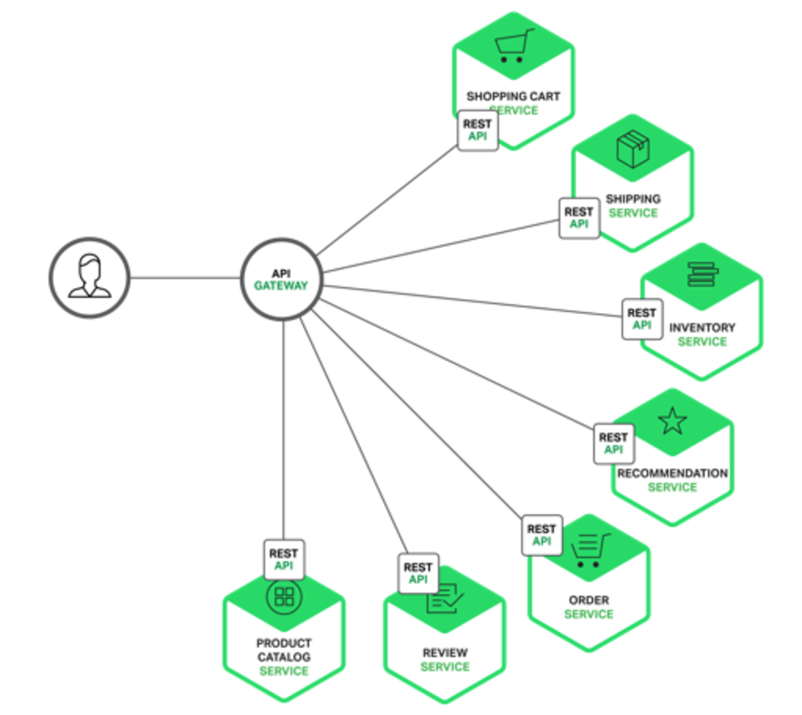
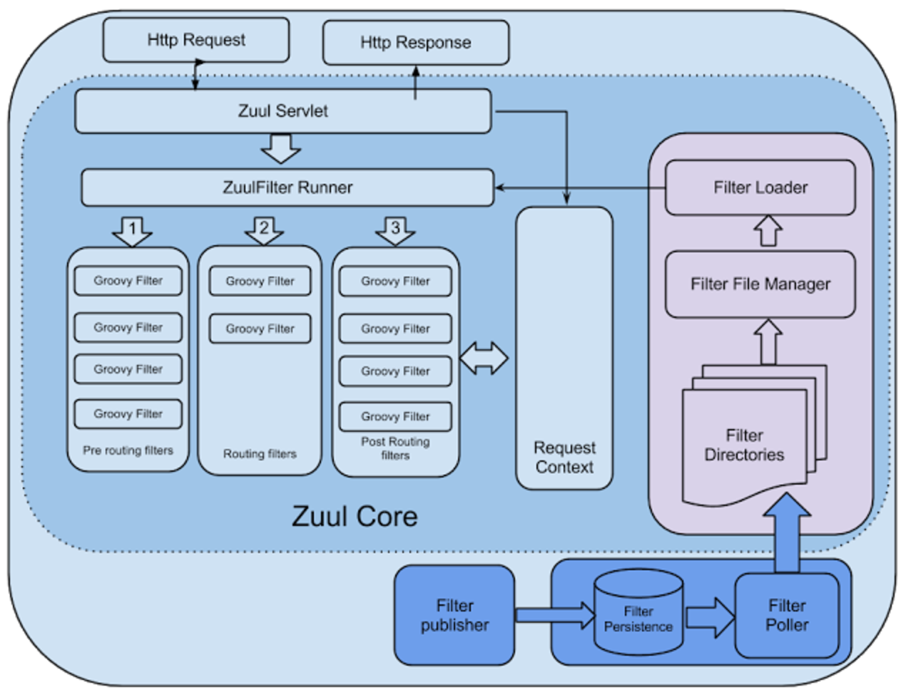
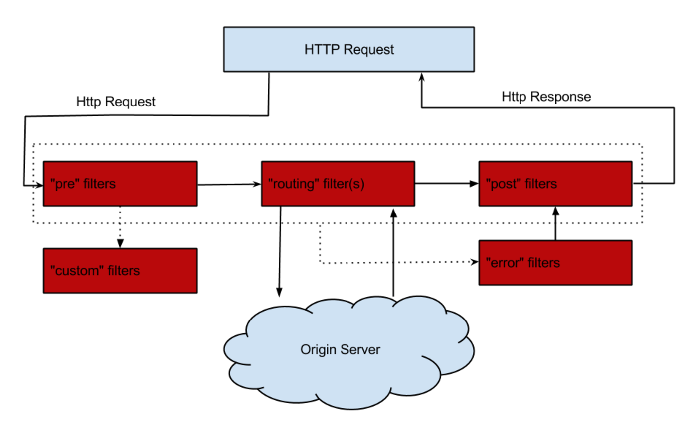

## Zuul 说明

### 一. 概念

​	Zuul，服务网关。是微服务不可缺少的组成部分，通过服务网关统一向外系统提供REST API。主要提供动态路由、监控、权限控制、负载均衡、压力测试、静态资源响应处理、弹性伸缩等。

- 验证与安全保障: 识别面向各类资源的验证要求并拒绝那些与要求不符的请求。
- 审查与监控: 在边缘位置追踪有意义数据及统计结果，从而为我们带来准确的生产状态结论。
- 动态路由: 以动态方式根据需要将请求路由至不同后端集群处。
- 压力测试: 逐渐增加指向集群的负载流量，从而计算性能水平。
- 负载分配: 为每一种负载类型分配对应容量，并弃用超出限定值的请求。
- 静态响应处理: 在边缘位置直接建立部分响应，从而避免其流入内部集群。
- 多区域弹性: 跨越AWS区域进行请求路由，旨在实现ELB使用多样化并保证边缘位置与使用者尽可能接近。



### 二. 工作原理

**架构图**



​	Zuul提供了一个框架，可以对过滤器进行动态的加载，编译，运行。过滤器之间没有直接的相互通信。他们是通过一个**RequestContext**的静态类来进行数据传递的。RequestContext类中有ThreadLocal变量来记录每个Request所需要传递的数据。

- **Type**：定义过滤流程的各个阶段
    - PRE：这种过滤器在请求到达Origin Server之前调用。比如身份验证，在集群中选择请求的Origin Server，记log等。
    - ROUTING：在这种过滤器中把用户请求发送给Origin Server。发送给Origin Server的用户请求在这类过滤器中build。并使用Apache HttpClient或者Netfilx Ribbon发送给Origin Server。
    - POST：这种过滤器在用户请求从Origin Server返回以后执行。比如在返回的response上面加response header，做各种统计等。并在该过滤器中把response返回给客户。
    - ERROR：在其他阶段发生错误时执行该过滤器。
    - 客户定制：比如我们可以定制一种STATIC类型的过滤器，用来模拟生成返回给客户的response。
- **Execution Order**：根据Type，定义在多个Filter中的执行顺序
- **Criteria**：Filter执行的条件
- **Action**：满足条件Criteria后，触发的动作

**Zuul Filter 生命周期**



### 三. 如何使用

#### 1. 在pom.xml添加依赖

```xml
<dependency>
  	<groupId>org.springframework.cloud</groupId>
  	<artifactId>spring-cloud-starter-zuul</artifactId>
</dependency>
```

#### 2. 在启动类添加注解

```java
@SpringBootApplication
@EnableZuulProxy
public class ZuulApplication {
	public static void main(String[] args) {
		SpringApplication.run(ZuulApplication.class, args);
	}
}
```

#### 3. 说明

```md
1. zuul-starter不包含 eureka-starter，所以需要添加 spring-cloud-starter-eureka。
2. @EnableZuulProxy是一个组合注解，组合 @EnableCircuitBreaker 和 @EnableDiscoveryClient，即 Zuul集成了服务发现和Hystrix。ZuulProxy使用Ribbon进行负载，所有的请求都执行在 HystrixCommand上。因此，一旦Circuit Breaker打开，Proxy就不会尝试请求被代理的Service。
```

### 四. 配置详解

#### 1. 连接、隔离策略

```properties
# zuul.max.host.connections 该配置已经被两个新配置替换
# 默认200，zuul proxy 持有的后段总连接数
zuul.host.max-total-connections: 200 
# 默认20，一个单独的路由可使用的最大连接数
zuul.host.max-per-route-connections: 20
# zuul默认的Hystrix 隔离策略是 SEMAPHORE，Feign默认的是 THREAD，可使用下面配置替换
zuul.ribbon-isolation-strategy: SEMAPHORE
```

**以下只针对于 Edgware 版本**

当 `zuul.ribbonIsolationStrategy=THREAD`时，Hystrix的线程隔离策略将会作用于所有路由。

此时，`HystrixThreadPoolKey` 默认为“RibbonCommand”。这意味着，所有路由的HystrixCommand都会在相同的Hystrix线程池中执行。

每个路由使用独立的线程池，配置如下

```yaml
zuul:
  threadPool:
    useSeparateThreadPools: true
    threadPoolKeyPrefix: zuulgw  ## 默认的HystrixThreadPoolkey 将与每个路由的服务标识相同
```

#### 2. 路由微服务

```yaml
# 忽略所有的注册服务（默认代理所有注册服务）。忽略配置了routes map的服务
# 访问 /userpage/add/1, 请求转发到 micro-provider-user 服务的 /add/1
# provider-user 是 key, value 是 org.springframework.cloud.netflix.zuul.filters.ZuulProperties.ZuulRoute
zuul:
  ignoredServices: '*'	
  routes:
    provider-user: 
      path: /userpage/**
      service-id: micro-provider-user
      sensitive-headers: null # 不想传递的敏感头信息，默认 Cookie,Set-Cookie,Authorization
# /userpage 下的所有请求中 /admin/ 不能访问，即控制具体微服务中的某些路径
zuul:
  ignoredPatterns: /**/admin/**
  routes:
    provider-user: 
      path: /userpage/**
      service-id: micro-provider-user
```

注意

1. ZuulRoute 中 serviceId（服务ID） 和 url（完整物理路径），他俩不能同时存在

2. 配置 url，zuul不会走HystrixCommand，也不能用ribbon进行负载均衡。

3. 手动配置Ribbon负载

   ```yaml
   zuul:
     routes:
       users:
         path: /myusers/**
         serviceId: users

   # 禁用 Eureka 对 Ribbon 的支持
   ribbon:
     eureka:
       enabled: false

   # 配置users的集群，多个用","分割
   users:
     ribbon:
       listOfServers: users1.com,user2.com
   ```

#### 3. 正则配置

```java
/**
 * 通过正则配置 serviceId 和 zuul 的约定 (只支持服务发现)
 * 
 * serviceId: myusers-v1
 * route: /v1/myusers/**
 *
 * 若没有版本，serviceId "myusers" -> route "/myusers/**"
 */
@Configuration
public class ZuulRegexConfig {
	@Bean
	public PatternServiceRouteMapper serviceRouteMapper() {
		return new PatternServiceRouteMapper("(?<name>^.+)-(?<version>v.+$)", "${version}/${name}");
	}
}
```

#### 4.其他配置

```yaml
# 1. 请求上下文
# 为路由添加一个前缀
zuul.prefix: hello
# 是否去处被代理微服务的context-path，默认为true
zuul.stripPrefix: false

# zuul.routes.<route>.stripPrefix 对应 zuul.routes.<route>.prefix

# 2. 中文问题, 查看 spring.http.encoding.* 
spring:
  http:
    encoding:
      force-request: true
      force-response: true
```

#### 5.查询参数编码 (Dalston版本)

​	处理传入请求时，查询参数被解码，因此可以在Zuul过滤器中进行可能的修改。 然后在路由过滤器中构建后端请求时重新编码它们。 如果使用Javascript的encodeURIComponent（）方法进行编码，结果可能与原始输入不同。 虽然这在大多数情况下不会出现任何问题，但一些Web服务器对于复杂查询字符串的编码是有问题的。

要强制查询字符串的原始编码，需要进行如下配置:

```yaml
zuul:
  forceOriginalQueryStringEncoding: true
```

#### 6. 上传附件

​	可以使用Zuul Proxy进行附件上传，但附件要足够的小。对于大文件，可以通过路径 **/zuul/**** 来绕过Spring DispatcherServlet（避免multipart processing）。

- 例如：`zuul.routes.micro-provider-user3: /zuul_file/*`，则可以使用 `/zuul/zuul_file/*` 来进行大文件上传。（**上传文件中文乱码问题也可以解决**）

- Servlet的请求路径经由 zuul.servletPath 处理。

- 当zuul使用 ribbon 做负载均衡，对于超大文件。则需要配置超时时间。

- /zuul/** 可通过 `zuul.servlet-path` 进行修改。

- Zuul Servlet 是一种 buffer requests，控制路由。也被内嵌到 DispatcherServlet 里。

  ```yaml
  hystrix.command.default.execution.isolation.thread.timeoutInMilliseconds: 60000
  ribbon: 
    ConnectTimeout: 3000
    ReadTimeout: 60000
  ```

  另外，对于大文件，需要**在request中设置 chunked encoding**（因为一些浏览器默认不会设置）

  ```shell
  $ curl -v -H "Transfer-Encoding: chunked" -F "file=@mylarge.iso" localhost:9999/zuul/simple/file
  ```

#### 7. 禁用Zuul Filter

- zuul.<SimpleClassName>.<filterType>.disable=true

  ```properties
  # 禁用 org.springframework.cloud.netflix.zuul.filters.post.SendResponseFilter zuul.SendResponseFilter.post.disable=true
  ```

#### 8. Zuul 的 Hystrix Fallback

​	定义一个类型是   `org.springframework.cloud.netflix.zuul.filters.route.ZuulFallbackProvider `的 **Spring Bean**。

```java
@Component
public class FallbackProvider implements ZuulFallbackProvider {
	// 1. 必须指定 route ID，例：micro-provider-user3
  	// 让此 FallbackProvider 对所有的 routes 都生效，则 getRoute() -> return "*";
  	@Override
	public String getRoute() {
		return "micro-provider-user3";
	}
  
  	// 2. 必须定义一个 ClientHttpResponse 的 Fallback 返回处理
	@Override
	public ClientHttpResponse fallbackResponse() {
		return new ClientHttpResponse() {
			@Override
			public InputStream getBody() throws IOException {
				return new ByteArrayInputStream(("<h3>系统错误，请联系系统管理员！</h3>".getBytes());
			}

			@Override
			public HttpHeaders getHeaders() {
				HttpHeaders headers = new HttpHeaders();
				headers.setContentType(MediaType.TEXT_HTML);
				headers.setAcceptCharset(Lists.newArrayList(Charset.forName("UTF-8")));
				return headers;
			}

			@Override
			public HttpStatus getStatusCode() throws IOException {
				return HttpStatus.BAD_REQUEST;
			}

			@Override
			public int getRawStatusCode() throws IOException {
				return HttpStatus.BAD_REQUEST.value();
			}

			@Override
			public String getStatusText() throws IOException {
				return HttpStatus.BAD_REQUEST.getReasonPhrase();
			}

			@Override
			public void close() {
			}
		};
	}
}
```

### 五. Zuul Filter

1. 编写一个自定义 Filter，继承 ZuulFilter。`（com.netflix.zuul.ZuulFilter）`

2. 在配置类中进行配置

   ```java
   @Bean
   public CustomerZuulFilter customerZuulFilter() {
   	return new CustomerZuulFilter();
   }
   ```

3. ZuulFilter 方法说明

   ```java
   // 这个 filter 是否需要被运行
   @Override
   public boolean shouldFilter() {
   	return true;
   }

   // Filter 类型，pre、routing、post、error
   @Override
   public String filterType() {
       return "pre";
   }

   // Filter执行的优先级：从小到大
   @Override
   public int filterOrder() {
   	return 1;
   }
   ```

   ​

### 六. 参考资料

- http://blog.daocloud.io/microservices-2/
- https://github.com/Netflix/zuul/wiki
- http://cloud.spring.io/spring-cloud-static/Dalston.SR1/#_router_and_filter_zuul
- http://www.jianshu.com/p/d9f5ead9ec0f
- https://github.com/spring-cloud-samples/sample-zuul-filters
- http://www.fangzhipeng.com/2017/08/11/springcloud-zuul-resources/
- http://blog.csdn.net/liuchuanhong1/article/details/62236793

