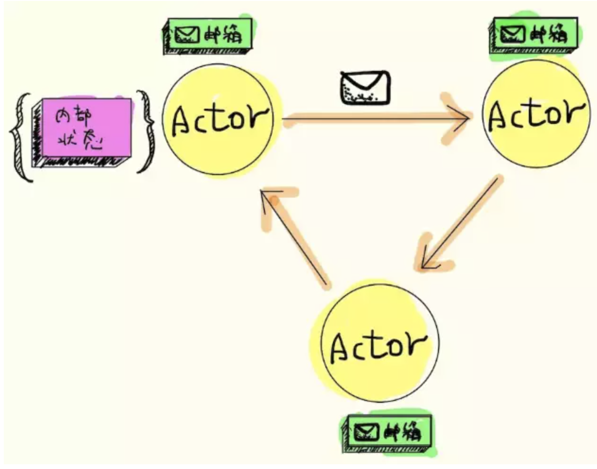

## Actor模型

### 一. 引言

现在计算机CPU的单核频率已经非常高了，CPU的速度达到了一个顶点。由于CPU的工艺制程和发热稳定性之间难以取舍，再去提高已经非常困难了。因此，当前采取的策略是增加CPU核心的数量，多核处理器应运而生，计算处理变成了团队协作，效率的提升通过多个核心的通信来实现。为了高效的利用多核CPU，应该在代码层面就考虑并发性，然而经过十几年痛苦的开发经历，事实告诉我们线程并不是获取并发性的好方法，而往往会带来难以查找的问题。

以稀缺资源的计数为例，如商品的库存数量或活动的可售门票，可能存在多个请求同时获取一个或多个商品或门票。考虑常用实现方式，每个请求对应一个线程，很可能会有多个并发运行的线程都去调整计数器。模型必须确保在同一时间只能有一个线程去递减计数器的值。这样做的原因是因为递减操作存在两个步骤：首先检查当前计数器，确保计数器的值大于或等于要减少的值。其次递减计数器。为了不违反业务规则，原生的方式是将检查和递减两步操作放到一个原子操作中，将两步操作锁定到一个操作中，就能够消除过度分配的可能性。

存在的问题，因为是一个请求对应一个线程，在高并发的场景下，很有可能出现很长的线程队列，他们都在等待递减计数器。但使用队列的方式的问题在于可能造成众多阻塞线程，也就是每个线程都在等待轮到它们去执行一个序列化的操作。所以，应用设计者一不小心，内在的复杂性就有可能将多核多线程的应用变成单线程的应用，或者导致工作线程之间存在高度竞争。

### 二. Actor说明

并发思路的一致性和隔离性。一致性是让数据保持一致，隔离性可以理解为牺牲一部分一致性需求，从而获得性能的提升。完全一致性则任务是串行的，不存在隔离性。传统的并发模式中，共享内存（共享数据）是倾向于强一致性弱隔离性的，例如悲观锁（排他锁、读锁）。

Actor模型天然是强隔离性且弱一致性，在并发中有良好的性能，而且易于控制和管理。基于消息驱动和非阻塞的模式进行设置，适用于对一致性需求不是很高且对性能需求较高的场景。

并发线程之间的通信策略有两种：共享数据和消息传递。消息传递有两种常见的类型：基于 channel 的消息传递、基于 Actor 的消息传递。

### 三. Actor理念

Actor模型是通过消息传递的策略解决并发线程的性能问题的。两个线程无法直接进行通信，每个线程只处理各自的消息（收、发）、消息箱（收件箱和发件箱）、消息箱中的消息不可改变、处理消息不需要一直监听消息箱（异步）。即，Actor模式就是进程内部要有一套消息管理系统，给每个线程一个独立的收发消息的管道，并且都是异步的，内部的状态由自身维护，也就是说Actor内部数据只能由它自己通过消息传递来进行状态修改。

**Actor的不足：**

比如当所有逻辑都跑在Actor中的时候，很难掌握Actor的粒度，稍有不慎就可能造成系统中Actor个数爆炸的情况。另外，当必须共享数据或状态时很难避免使用锁，由于Actor可能会堵塞自己但Actor不应该堵塞它运行的线程，此时也许可选择使用Redis做数据共享。

### 四. Actor模型

在 Actor模型中，万物都是Actor，参与者Actor（一个并发原语）、通过消息传递（异步）的方式与外界通信、参与者Actor都有一个消息箱（FIFO队列）、参与者Actor一次只能处理一个消息。

Actor接受到消息时，Actor可以做三件事中的一件

- 创建其他（有限个）Actor
- 向其他Actor发送消息
- 指定下一条消息到来的行为，即定义下条消息到来时的状态，也就是如何修改状态。设想有一个actor像计算器，它的初始状态是数字0。当这个actor接收到`add(1)`消息时，它并不改变它原本的状态，而是指定当它接收到下一个消息时，状态会变为1。

Actor模型的消息调度方式时主要基于事件的调度，（基于线程的调度不常用）。

Actor是由状态（state）、行为（behavior）、邮箱（mailbox）三者组成的。

- 状态（state）：状态是指actor对象的变量信息，状态由actor自身管理，避免并发环境下的锁和内存原子性等问题。
- 行为（behavior）：行为指定的是actor中计算逻辑，通过actor接收到的消息来改变actor的状态。
- 邮箱（mailbox）：邮箱是actor之间的通信桥梁，邮箱内部通过FIFO消息队列来存储发送发消息，而接收方则从邮箱中获取消息。

Actor模型描述了一组为避免并发编程的公理：

- 所有的Actor状态是本地的，外部是无法访问的

- Actor必须通过消息传递进行通信

- 一个Actor可以响应消息、退出新Actor、改变内部状态、将消息发送到一个或多个Actor

- Actor可能会堵塞自己但Actor不应该堵塞自己运行的线程

### 五. 参考资料

- https://www.jianshu.com/p/449850aa8e82
- https://www.jianshu.com/p/d803e2a7de8e