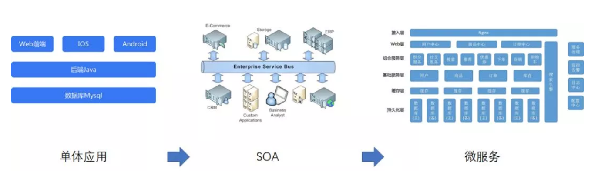

## 云原生

### 一. 云平台

- **IaaS**

  计算、网络、存储等基础资源，这些资源是可编程且不可变的，可通过 API 对外提供服务。

- **PaaS**

  在 **IaaS** 之上，将运维工作解放给平台，对开发和运行时进行全面支持。

- **SaaS**

  将应用的开发、管理、部署都交给第三方，不需要关心技术问题，用户拿来即用。

### 二. 云原生

​	云并非把原先在物理服务器上跑的东西放到虚拟机里跑，真正的云化不仅是基础设施和平台的事情，应用也要做出改变，改变传统的做法，实现云化的应用——应用的架构、应用的开发方式、应用部署和维护技术都要做出改变，真正的发挥云的弹性、动态调度、自动伸缩等一些传统IT所不具备的能力。

​	云原生不是一个产品，而是一套技术体系和一套方法论，而数字化转型是思想先行，从内到外的整体变革。更确切地说，它是一种文化，更是一种潮流，是云计算的一个必然导向。

#### ​1. 持续交付

软件开发人员如何将一个好点子，以最快的速度交付给用户的方法。整个过程包括：持续集成 + 持续交付 + 持续部署，即一整套 ”发布流水线“。

**持续集成**：**从编码到构建再到测试的反复持续过程**。“持续集成”一旦完成，则代表产品处在一个可交付状态，但并不代表这是最优状态，还需要根据外部使用者的反馈逐步优化。当然这里的使用者并不一定是真正的用户，还可能是测试人员、产品人员、用户体验工程师、安全工程师、企业领导等等。（构建的自动化）

**持续交付：** **持续集成**后，获取外部对软件的反馈，在通过**持续集成**进行优化的过程。（反馈的自动化）

**持续部署：**将可交付的产品，快速且安全的交付用户使用的一套方法和系统。（部署的自动化）

针对传统企业，分为3类

- 第一类

  节奏慢、版本发布频率不高，上线出故障影响面不广、影响度不高。

- 第二类

  节奏相对慢、版本发布频率不算高，上线出故障影响面广、影响度高。

- 第三类

  节奏快、版本发布频率高，上线出故障影响面广、影响度高。

#### 2. 微服务

应用的内聚更强、更加敏捷，让应用更好、更快的交付给客户。那问题在于：

1. 什么样的应用需要微服务？

2. 微服务需要如何进行切割？

3. 如何自动化部署？ 

#### 3. 容器化

- 统一了应用交付的标准。

- 规定了部署环境的一致性。
- 确保了运行时的隔离性。
- 实现了强大的可移植性。

#### 4. DevOps

DevOps是一个敏捷思維，是一个沟通的文化，当运维和研发有良好的沟通效率，才可以有更大的生产力。

1. 组织架构、企业文化与理念等，需要自上而下设计，用于促进开发部门、运维部门和质量保障部门之间的沟通、协作与整合，简单而言组织形式类似于系统分层设计。
2. 自动化是指所有的操作都不需要人工参与，全部依赖系统自动完成。

### 三. 如何支持

#### 1. 说服客户

面临的问题

1. 找出痛点

- 开发负责人
  - 各个团队编码风格不统一，代码维护困难。
  - 没有统一标准的沟通手段，团队协作成本高。
  - 每个系统都要从头干起，代码复用率低。
  - 系统改造无法推动，开发人员没有动力。

- 运维负责人
  - 各种应用都由运维手工部署、配置，工作繁杂无序，运维人员难以承担。
  - 各个环境的不一致性，导致运维问题排查困难。
  - 要推行容器化的运维模式，Dockerfile 需要开发编写，开发不配合。
- 产品负责人
  - 功能交付时间长，上线后问题多。
  - 每次上线都需要重新启动，客户体验差。
  - 开发和运维完全独立，无法快速定位问题所在。

2. 如何解决

- 架构方面
  - 成立专门的架构组，劝说业务开发实现 SOA或微服务改造，劝说运维实施容器化。架构组本身去研究各类中间件，例如：mysql、redis、mq等的高可用、调优技术，形成知识积累。
  - 成立中台组，将可以复用的能力和代码，交由这几个组开发出服务来，给业务组使用，这样数据模型会统一，业务开发的时候，首先先看看有哪些现成的服务可以使用，不用全部从零开发，也会提高开发效率。

- 运维方面
  - 基础设施层云化。要有良好的租户管理，从运维集中管理到租户自助使用模式的转换。
  - 虚拟网络化。每个租户可以随意配置自己的子网，路由表，和外网的连接等，不同的租户的网段可以冲突，互不影响，租户可以根据自己的需要，随意的在界面上，用软件的方式做网络规划。
  - 应用软件PaaS化。通用的应用，一般指一些复杂性比较高，但大家都在用的，例如数据库。几乎所有的应用都会用数据库，但数据库软件是标准的，虽然安装和维护比较复杂，但无论谁安装都是一样。这样的应用可以变成标准的PaaS层的应用放在云平台的界面上。当用户需要一个数据库时，一点就出来了，用户就可以直接用了。
  - 采用容器化，开发交付给运维的是容器镜像，容器内部的运行环境，应该体现在Dockerfile文件中，这个文件是应该开发写的。
  - 配置工作交由各个开发小组来维护，运维只负责维护运维平台。
- 组织架构
  - DevOps。例如：开发帮运维考虑环境交付的事情、编写Dockerfile。运维帮助研发解决微服务之间的注册发现，治理，配置等问题。
  - 架构组、中台组要和云平台组沟通密切，更正确的使用云平台。

#### 2. 持续交付流水线

- **CI — 持续集成** 

  一个应用服务（Java为例），从编码到交付部署，需要经过一系列的过程。

  - Git 服务器的搭建，负责代码版本管理。

  - Jenkins 服务器的搭建，负责串联CICD。
  - Sonar 服务器的搭建，负责代码的静态扫描，用于规范开发。
  - Gerrit 服务器的搭建，负责代码审查。

- **CD — 持续部署**

  要依靠云平台的能力，实现自动化的部署。

  - 通过云平台的API进行自动化部署。

  - 云平台原生的自动化部署。

- **流水线流程**

  

  1. Git：4个分支，dev、uat、prd、master。
  2. 环境：3个环境，dev、uat、prd。

#### 3. 云原生支持

- 沟通阶段
  1. 系统名称。
  2. 系统架构图及说明。
  3. 系统现行部署图和部署说明。
  4. 系统使用的哪种版本控制软件？
  5. 系统使用的编程语言及使用的框架？
  6. 系统使用的数据库？是否有版本要求？
  7. 系统使用的缓存数据库？是否有版本要求？缓存数据是否需要持久化？
  8. 系统使用的消息队列？是否有版本要求？消息是否需要持久化？
  9. 系统中是否有文件上传功能，上传的文件存储在文件系统还是数据库？
  10. 系统的配置文件是否进行统一管理？
  11. 系统读取配置文件中的配置，是否支持通过环境变量进行覆盖？例如：配置文件 app.properties 中有配置 spring.data.redis.host = 127.0.0.1。那么，当环境变量中配置了 spring_data_redis_host = 10.11.21.22，则环境变量的配置会覆盖配置文件 app.properties 中的配置，即系统运行时 redis 的 host 应该是 10.11.21.22。
  12. 系统是否是有状态的？例：系统在运行时，将一些数据存储在内存中（例 Java中的 Map），根据内存中的数据进行业务操作。
  13. 系统运行的 Web 服务器？是否有版本要求？
  14. 系统运行是否有操作系统的限制？如果有，请指出具体的操作系统信息（例：操作系统版本？操作系统中的必须内核组件？）。
  15. 系统的日志的处理方式。 只输出到终端？用日志文件，写入外部持久化存储？通过应用内嵌SDK，写入外部日志系统如Kafka？
  16. 是否使用一些CI工具，如 Jenkins、Sonar、Gerrit 等。若使用，请列出使用的工具。 
  17. 系统的健康检查机制，即如何判断系统已经成功启动？
  18. 系统运行时的CPU、内存要求？
  19. 系统开发到运维的过程中，涉及到负责人及负责内容？

- 改造阶段

  - 阶段一：应用容器化部署

    将应用通过容器的方式进行部署，对应用不做改动或做很少的改动。

  - 阶段二：应用拆分

    对应用进行模块化的拆分，基于 SOA 的理念。后端的数据库不做改造。

  - 阶段三：微服务化改造

    微服务化的拆分，DDD思想、应用和 数据库均进行拆分。

### 四. CaaS 平台		

#### 1. 镜像构建

-  **Dockerfile**

-  **Push**

-  **组合构建**

#### 2. 部署方式

- **平台自动化部署**
- **API 自动化部署**

#### 4.微服务的支持

#### 5. 应用监控

#### 6. 日志方案

### 八. 参考资料

- https://blog.csdn.net/cf2SudS8x8F0v/article/details/82836707
- http://www.ruanyifeng.com/blog/2017/07/iaas-paas-saas.html
- https://www.sohu.com/a/240226763_262549
- http://www.mayiwenku.com/p-2496493.html
- https://mp.weixin.qq.com/s?__biz=MzA5OTAyNzQ2OA==&mid=2649699609&idx=1&sn=6df8980ab90d7198923d76cc7a0d57a1&chksm=88930a7abfe4836c71d7688e7f70d554a50f6dbfb07cdca96e9517883bfe5f096119e3646895&mpshare=1&scene=1&srcid=1202nqe7qqQNRiweMaNMRKpk&key=b7f7523840291edcf88ab9d2697e77b5b5f578168a8d6cd7d60b531baeacf2c79b7a2d04d1b57fabb85eb84aa310a2b83a639a373c131b184318e78abe3c315b347d30829390c01ae2d986f0122786dd&ascene=0&uin=MTY1MzQxMzYxNg%3D%3D&devicetype=iMac+MacBookPro12%2C1+OSX+OSX+10.14.1+build(18B75)&version=12020010&nettype=WIFI&lang=zh_CN&fontScale=100&pass_ticket=IpTWnPIiWmIP5ItbQ2TTfulyjD9IwQot9P0C0ztQ7%2BYCF%2F8IYW8Tl2E03k3CKNkc
- https://mp.weixin.qq.com/s?__biz=MzI1NzYzODk4OQ==&mid=2247484962&idx=1&sn=af630988628021e0016c8764293ed48a&chksm=ea151100dd62981645198dc7624004008c0babf6da195e2c374e3da276604c401946851db3f0&scene=21#wechat_redirect