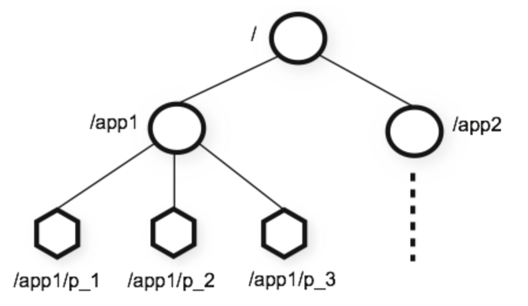
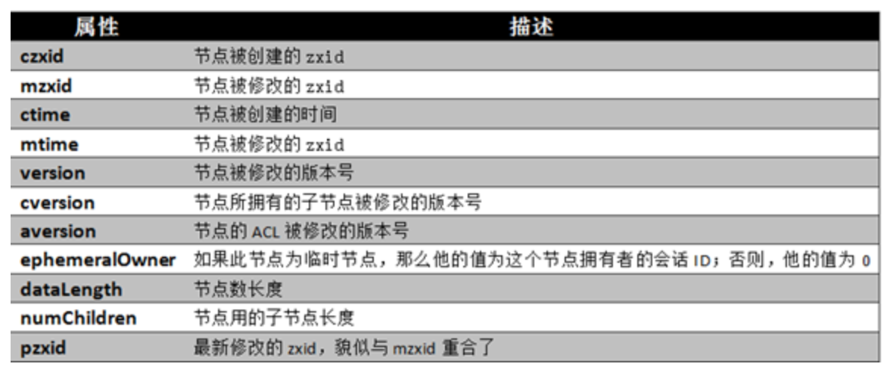
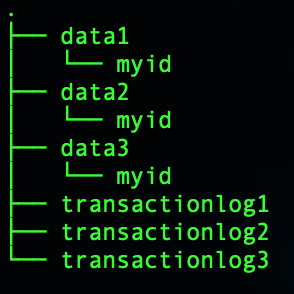
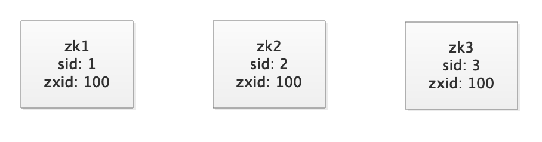

## Zookeeper 说明

### 一. 概念

#### 1. 分布式协调技术

​	分布式协调技术，主要用来解决分布式环境当中多个进程之间的同步控制，让他们有序的去访问某种临界资源，防止造成"脏数据"的后果。

​	如何有序的来访问共享资源，需要一个协调器，即锁。“进程1” 获得锁后就会对共享资源保持独占，这样其他进程就无法访问该资源，"进程1"用完该资源以后就将锁释放掉，让其他进程来获得锁，那么通过这个锁机制，我们就能保证了分布式系统中多个进程能够有序的访问该临界资源。那么我们把这个分布式环境下的这个锁叫作**分布式锁**。

#### 2. Zookeeper

​	Zookeeper是一种为分布式应用设计的高可用、高性能且一致的开源协调服务。具体提供的服务有：分布式锁服务、配置维护、组服务、统一命名服务（路径服务）、分布式消息队列、分布式通知/协调等。其中 Zookeeper 是通过**ZAB协议**来实现分布数据一致性并实现了一种主备模式的系统架构来保持各集群中各个副本之间的数据一致性。**简言之，Zookeeper 是一个具有文件系统特点、发布/订阅并解决了数据一致性问题的分布式数据库。**

### 二. 架构



Zookeeper 的命名空间和标准文件系统非常相似，都是树形结构，每个节点成为 Znode。Znode 通过路径引用，路径必须时绝对路径且全局唯一。其中 /zookeeper 用来保存管理信息（例：关键配额信息）。和文件系统不同点是，每个Znode都可以具有数据和子节点。

Znode的数据主要是**管理调度数据**（最大1M，实际使用时要远小于1M），每一个节点都拥有自己的ACL(访问控制列表)，限定了特定用户对目标节点可以执行的操作。

- **stat**：状态信息, 描述该Znode的版本, 权限（）、配置，位置信息
- **data**：与该Znode关联的数据
- **children**：该Znode下的子节点

**节点类型：**

- **临时节点**：该节点的生命周期依赖于创建它们的会话。一旦会话(Session)结束，临时节点将被自动删除，当然可以也可以手动删除。虽然每个临时的Znode都会绑定到一个客户端会话，但他们对所有的客户端还是可见的。另外，ZooKeeper的临时节点不允许拥有子节点。
- **永久节点**：该节点的生命周期不依赖于会话，并且只有在客户端显示执行删除操作的时候，他们才能被删除。

**节点属性**



**客户端Cli**

参考：https://blog.csdn.net/feixiang2039/article/details/79810102#zookeeper-cli

```bash
./zkCli.sh -server 127.0.0.1:2181
## 命令参考
ZooKeeper -server host:port cmd args
	addauth scheme auth
	close 
	config [-c] [-w] [-s]
	connect host:port
	create [-s] [-e] [-c] [-t ttl] path [data] [acl]
	delete [-v version] path
	deleteall path
	delquota [-n|-b] path
	get [-s] [-w] path
	getAcl [-s] path
	history 
	listquota path
	ls [-s] [-w] [-R] path
	ls2 path [watch]
	printwatches on|off
	quit 
	reconfig [-s] [-v version] [[-file path] | [-members serverID=host:port1:port2;port3[,...]*]] | [-add serverId=host:port1:port2;port3[,...]]* [-remove serverId[,...]*]
	redo cmdno
	removewatches path [-c|-d|-a] [-l]
	rmr path
	set [-s] [-v version] path data
	setAcl [-s] [-v version] [-R] path acl
	setquota -n|-b val path
	stat [-w] path
	sync path

```

**客户端Watch**

客户端可以在Znode上设置watch，称之为**监视器**。当节点状态发生改变时(Znode的增、删、改)将会触发watch所对应的操作。当watch被触发时，ZooKeeper将会向客户端**发送且仅发送一条通知**，因为watch只能被触发一次，这样可以减少网络流量。

### 三. 搭建

下载 https://archive.apache.org/dist/zookeeper/

#### 1. 单机单点

 - 在 conf 下新建 zoo.cfg 文件

 - 进入Zookeeper的bin目录，执行命令

   ```bash
   ## /zkServer.sh [--config <conf-dir>] {start|start-foreground|stop|restart|status|print-cmd}
   ./zkServer.sh start
   ```

#### 2. 单机集群

> **单机搭建一个三节点的集群**

- 创建目录

  data1下的myid内容是1，data2下的myid内容是2，data3下的myid内容是3.

  

- 创建三份配置文件zoo1.cfg、zoo2.cfg、zoo3.cfg

```properties
## zoo1.cfg
# 控制心跳和超时，默认情况下最小会话超时时间（毫秒）
tickTime=2000
# Zookeeper 服务器集群中连接到 Leader 的 Follower 服务器，初始化连接时最长能忍受多少个心跳时间间隔数。
# 当已经超过tickTime个心跳的时间长度后，Zookeeper服务器还没有收到客户端的返回信息，那么表明这个客户端连接失败
initLimit=10
# Leader 与 Follower 之间发送消息，请求和应答时间长度，最长不能超过多少个 tickTime 的时间长度
syncLimit=5
# 存放内存数据库快照的位置（myid文件于是配置在该目录下）
dataDir=/Users/dante/Documents/Technique/ZooKeeper/data/3.5/cluster/data1
## 事务日志输出目录。尽量给事务日志的输出配置单独的磁盘或是挂载点，这将极大的提升ZK性能
dataLogDir=/Users/dante/Documents/Technique/ZooKeeper/data/3.5/cluster/transactionlog1
# the port at which the clients will connect
clientPort=2181
# 最大客户端并发连接数
#maxClientCnxns=60
server.1=peer1:2888:3888
server.2=peer2:2889:3889
server.3=peer3:2890:3890

...
zoo2.cfg 和 zoo2.cfg中的clientPort分别改成 2182 2183
```

- 启动集群，创建zkCluster.sh

```bash
#!/bin/bash
arg=$1

if [[ X"$arg" == "X" && "$arg" != "start" && "$arg" != "stop" && "$arg" != "status" ]]; then
    echo "Usage: ./zkCluster.sh start | stop | status"
    exit -1
fi 

if [[ "$arg" == "start" ]]; then
    bash zkServer.sh start zoo1.cfg
    bash zkServer.sh start zoo2.cfg
    bash zkServer.sh start zoo3.cfg
elif [[ "$arg" == "stop" ]]; then
    bash zkServer.sh stop zoo1.cfg
    bash zkServer.sh stop zoo2.cfg
    bash zkServer.sh stop zoo3.cfg
elif [[ "$arg" == "status" ]]; then
    bash zkServer.sh status zoo1.cfg
    bash zkServer.sh status zoo2.cfg
    bash zkServer.sh status zoo3.cfg
fi
```

> **扩容到5节点**


### 四. ZAB协议

ZAB 协议是Zookeeper系统专门设计的一种支持崩溃恢复的原子广播协议。Zookeeper使用该协议来实现分布数据一致性并实现了一种主备模式的系统架构来保持各集群中各个副本之间的数据一致性。

- 数据一致性

  选出一个Leader（领导者选举机制）

  2阶段提交：leader发起提议 —> 等待follower Ack —> 执行提交

  过半机制：Leader超过一半的Ack，才去提交（奇数节点，例：Follower > 服务器 / 2的商。2>3/2, 3>5/2）

- ZAB 选主

  > 因素：（奇数节点，例：Follower > 服务器 / 2的商。2>3/2, 3>5/2）

  - 数据最新，事务Id的大小，即zxid大的，zxid自增
  - 服务器Id大，即sid大的（配置中的myid）
  - 投票箱，每个服务器都有自己的投票箱，记录（sid, zxid），即投给了谁，被投票的当前事务。

  

**三节点选Leader过程**

1. ZK1启动时，投票投给自己，投票箱 [(1,100)]
2. ZK2启动时，投票投给自己，投票箱 [(2,100)]
3. ZK2通知ZK1，ZK1获取了ZK2的投票信息，此时ZK1的投票箱 [(1,100), (2,100)]。ZK1和ZK2进行PK，因为zxid相同，ZK2的sid大，ZK1进行改票，并通知ZK2，此时ZK1的投票箱 [(2,100), (2,100)]。
4. ZK2获取ZK1的投票信息，此时ZK1的投票箱 [(2,100), (2,100)]。
5. 3个服务器节点，ZK2已经获取了2票，过半，所以ZK2成为 Leader。ZK1 和 ZK3成为 Follower。

**发生选举场景**

1. 集群启动时
2. Leader 挂了
3. Follower 数目不到一半时，重新进行Leader选举，此时不对外提供服务

**各种场景**

1. Leader 挂了

   遵循上面的选举过程，zk3的sid大，zk3成为Leader，zk1是 Follower。

2. ZK1 和 ZK3 先启动，ZK3成为Leader，zk1成为 Follower，然后加入ZK2，zk2成为 Follower。此时ZK3上提交写数据，ZK3记录事务日志，并通知ZK1和ZK2。此时，ZK1和ZK2和ZK3的网络断了，但ZK1和ZK2之间可以互相通信，那么ZK1和ZK2进行Leader选举，ZK2成为Leader。然后和ZK3的网络恢复，此时ZK3的数据会回滚。

- ZK节点挂掉后，一段时间在启动，此时，ZK节点会先进行数据恢复（先选主，再恢复），然后在加入集群。

**客户端请求**

客户端请求分为两种：事务性请求（写请求）、非事务性请求（读请求）。

1. 事务性请求（写请求）

   （1）客户端向Leader发送写请求。Leader节点先生成本地事务日志，然后向 Follower 通知进行预提交，然后等待 Follower 的 Ack。收到预提交通知的 Follower，先生成本地事务日志，然后Ack。当 Leader 等到一半的 Follower 的 Ack 时，先自己提交，再向 Follower 通知提交，Follower进行提交。

   （2）客户端向Follower发送写请求，Follower 将这个写请求转发给 Leader，然后按照（1）的步骤进行。

2. 非事务性请求，通过ZAB对数据的一致性保证，客户端的读请求获取的数据都一致。

**ZAB术语**

- **election epoch**

  由于分布式系统的特点，无法使用精准的时钟来维护事务操作的先后顺序，通过Logical Clock来界定事务顺序。也可以这么理解：投票的次数，同一轮投票过程中的逻辑时钟值是相同的。每投完一次票这个数据就会增加，然后与接收到的其它服务器返回的投票信息中的数值相比，根据不同的值做出不同的判断。

Logical Clock就是为每个消息加上一个逻辑的时间戳。

- **zxid**

  事务Id，最大数据ID，zxid全局唯一。zxid有两部分组成：高32位是epoch，低32位是epoch内的自增id，由0开始。每次选出新的Leader，epoch会递增，同时zxid的低32位清0。

- 节点状态

  **Looking**：没有Leader，进入选举Leader时，节点的状态。（默认状态）

  **Leading**：节点时 Leader 的状态。

  **Following**：节点成为Leader的Follower时的状态。

- 节点持久化数据状态

  **history**: 当前节点收到事务提交的本地事务日志

  **acceptedEpoch**：follower节点已经接受的leader更改Epoch的提议

  **currentEpoch**：节点当前所处的Epoch

  **lastZxid**：history（本地事务日志）中最新接受到的事务提交提议的zxid

### 五. 使用实践


### 八. 参考资料

- https://www.jianshu.com/p/e689e67d1f7b

- http://zookeeper.apache.org/doc/current/zookeeperOver.html

- ZAB协议

  - https://www.cnblogs.com/wuxl360/p/5817471.html 

  - https://zhuanlan.zhihu.com/p/27335748
  - https://www.cnblogs.com/ASPNET2008/p/6421571.html

- 安装搭建

  - https://www.jianshu.com/p/a5fda39f20d0
  - https://blog.csdn.net/Poppy_Evan/article/details/79487418
  - http://zookeeper.apache.org/doc/current/zookeeperAdmin.html#sc_maintenance