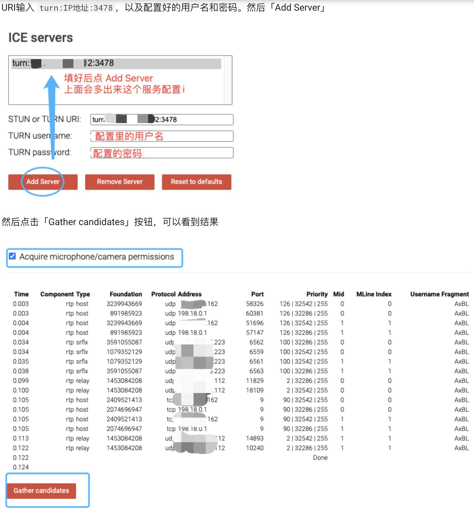

## Turn/Stun服务器搭建

### 一. 概述

WebRTC使用点对点连接来传输数据。当2个客户端（例如PC）不在同一个网络，或是被防火墙阻止时，直接连接会遇到问题。

TURN（Traversal Using Relays around NAT）用来解决节点不能直接连接的问题。

### 二. Ubuntu 服务器

> 服务器必须具有公网地址

#### 1. 安装与启动

首先安装`coturn`

```sh
sudo apt-get update -y
sudo apt-get install coturn
```

安装完毕后，先查看默认的配置。默认的TURN服务是不启动的，取消注释

```sh
cat /etc/default/coturn 
#TURNSERVER_ENABLED=1

sudo vi /etc/default/coturn 
TURNSERVER_ENABLED=1
```

启动服务

```sh
systemctl start coturn
==== AUTHENTICATING FOR org.freedesktop.systemd1.manage-units ===
启动“coturn.service”需要认证。
Authenticating as: admins,,, (admins)
Password:
==== AUTHENTICATION COMPLETE ===
```

防火墙允许这个端口

```sh
sudo ufw allow 3478
Rule added
Rule added (v6)
```

#### 2. 配置

备份默认配置

```sh
sudo cp /etc/turnserver.conf /etc/turnserver.conf.bak
```

配置

```properties
sudo vi /etc/turnserver.conf

## 主要配置
#中继服务器监听的IP地址，NAT环境下直接写私网IP地址，可以指定多个IP
listening-ip=10.250.3.51
listening-port=3478
# Further ports that are open for communication
#min-port=10000
#max-port=20000
#外部IP,NAT环境下直接写：公网IP/私网IP
external-ip=111.20.49.38/10.250.3.51
#打开fingerprint的注释，使用长期证书机制。
fingerprint
#打开密码验证，使用短期证书机制。
lt-cred-mech
#服务器名称,用于OAuth认证,默认和realm相同,直接填公网ip.部分浏览器本段不设可能会引发cors错误。
server-name=111.20.49.38
# TURN REST API的长期凭证机制范围，同样设为ip,同server-name.
realm=111.20.49.38
#移动的ICE(MICE)的规范支持。
mobility
#快捷的添加用户是使用user=XXX:XXXX的方式，可以添加多个。/var/db/turndb也工作，可以使用turnadmin来管理其中用户，可以添加多个。
user=risun:risun@turn
```

重启turnserver服务

```sh
sudo service coturn restart
```

#### 3. 验证

去 [WebRTC Samples Trickle ICE](https://webrtc.github.io/samples/src/content/peerconnection/trickle-ice/) 页面验证我们的turn服务是否可用



### 五. 参考资料

- https://www.wware.org/wide/yw/backups/turnserverconfig.html
- https://www.an.rustfisher.com/webrtc/turn/ubuntu-run-coturn
- https://gabrieltanner.org/blog/turn-server

